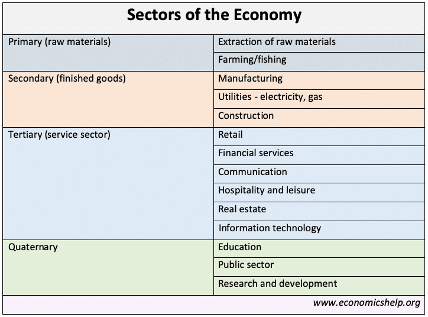

## Table of Contents

## What are economic sectors?

Economic sectors are different parts of an economy where businesses and industries operate. They help us understand how money and resources move around in a country. There are three main sectors: primary, secondary, and tertiary. The primary sector involves getting raw materials from nature, like farming, fishing, and mining. The secondary sector takes these raw materials and turns them into finished products, like manufacturing cars or building houses. The tertiary sector provides services to people and businesses, such as healthcare, education, and retail.

Sometimes, people also talk about two more sectors: quaternary and quinary. The quaternary sector focuses on knowledge and information, like research, technology, and education. The quinary sector includes top-level decision-making roles, like government leaders and executives. These sectors help us see the different kinds of work people do and how they contribute to the economy. By looking at economic sectors, we can learn about job opportunities, the health of the economy, and how different parts of the economy depend on each other.

## How many main types of economic sectors are there?

There are three main types of economic sectors. The first one is the primary sector. This sector is all about getting things from nature, like farming, fishing, and mining. These activities give us the raw materials we need.

The second type is the secondary sector. This sector takes the raw materials from the primary sector and turns them into things we can use, like making cars or building houses. It's all about manufacturing and construction.

The third type is the tertiary sector. This sector is about services. It includes things like healthcare, education, and shops. These services help people and businesses every day.

## What is the primary sector and what activities does it include?

The primary sector is the part of the economy where people get things directly from nature. It's like the starting point for all the stuff we use every day. This sector is really important because it gives us the basic things we need to live and make other things.

In the primary sector, people do things like farming, which means growing crops and raising animals for food. They also do fishing, which is catching fish from rivers, lakes, and oceans. Another activity is mining, where people dig into the earth to find minerals like coal, gold, and iron. All these activities help us get the raw materials we need for everything else.

## What is the secondary sector and what are its key industries?

The secondary sector is where people take the raw materials from the primary sector and turn them into things we can use. This is called manufacturing. It's like making stuff from the basic things we get from nature. The secondary sector also includes construction, where people build things like houses, roads, and bridges.

Some key industries in the secondary sector are car manufacturing, where they make cars from steel, plastic, and other materials. Another big industry is electronics, where they make things like phones and computers from metals and plastics. There's also the textile industry, where they turn cotton and other fibers into clothes. All these industries take raw materials and make them into products that people can use every day.

## What is the tertiary sector and what services does it cover?

The tertiary sector is all about services. It's the part of the economy where people help other people and businesses. This sector is really big and includes lots of different kinds of jobs. When you go to a store, a restaurant, or see a doctor, you're using services from the tertiary sector. It's all about making life easier and better for everyone.

Some of the main services in the tertiary sector are things like healthcare, where doctors and nurses help people stay healthy. There's also education, where teachers help kids and adults learn new things. Retail is another big part, where people work in stores to sell things to customers. And don't forget about transportation, like buses and trains that help people get around. All these services make our daily lives run smoothly and help the economy grow.

## What is the quaternary sector and why is it important?

The quaternary sector is all about knowledge and information. It's where people work on things like research, technology, and education. Imagine scientists in a lab trying to find new ways to make medicine or engineers working on new gadgets. That's the quaternary sector. It's like the brain of the economy, thinking up new ideas and solving problems.

This sector is really important because it helps us move forward. When people in the quaternary sector come up with new ideas, it can lead to better products, new jobs, and even new ways of doing things. For example, thanks to the quaternary sector, we have smartphones and the internet, which have changed how we live and work. Without the quaternary sector, we wouldn't have the cool new stuff that makes life easier and more fun.

## What is the quinary sector and what roles does it encompass?

The quinary sector is the top level of the economy where the big decisions get made. It includes people who are in charge of really important things, like government leaders, top business executives, and heads of big organizations. These people make choices that affect a lot of other people and can change how the whole economy works.

The roles in the quinary sector are really important because they guide the direction of the country or a big company. For example, a president or prime minister decides on laws and policies that everyone has to follow. A CEO of a big company makes choices about where to invest money and what new projects to start. Without these leaders, it would be hard to keep everything organized and moving in the right direction.

## How do economic sectors contribute to GDP?

Economic sectors help make up the Gross Domestic Product (GDP), which is like a big scorecard for a country's economy. GDP shows how much money a country makes from all the goods and services it produces in a year. Each sector adds to this total in different ways. The primary sector, like farming and mining, gives us the raw stuff we need, and the money made from selling these things adds to the GDP. The secondary sector, which turns raw materials into things we use, like cars and clothes, also adds to the GDP by selling these products.

The tertiary sector, which is all about services like healthcare and retail, adds to the GDP too. When people pay for services, that money counts toward the GDP. The quaternary sector, with its focus on knowledge and research, helps create new ideas and technologies that can lead to more money being made in other sectors, boosting the GDP. Finally, the quinary sector, where big decisions are made, can guide the economy in ways that affect how much money is made overall. All these sectors working together help make the GDP grow.

## What are the employment trends in different economic sectors?

Employment trends in different economic sectors show how jobs are changing over time. In the primary sector, like farming and mining, the number of jobs has been going down in many countries. This is because machines and technology are doing more of the work, and fewer people are needed. Also, some countries are moving away from these kinds of jobs and focusing more on other sectors. So, even though the primary sector is still important, it's not where most people work anymore.

In the secondary sector, which includes manufacturing and construction, the number of jobs can go up and down. In some places, jobs in manufacturing are growing because they are making more things. But in other places, jobs in this sector are shrinking because factories are moving to countries where it's cheaper to make things. Construction jobs can also change a lot, depending on how much building is happening in a country. So, the secondary sector can be a bit unpredictable when it comes to jobs.

The tertiary, quaternary, and quinary sectors are where most new jobs are being created. The tertiary sector, which is all about services like healthcare and retail, has been growing a lot. More and more people are working in these kinds of jobs because people need more services as they get richer. The quaternary sector, which focuses on knowledge and research, is also growing because new technology and ideas are important for the economy. And in the quinary sector, where big decisions are made, there are always jobs for leaders and top executives. So, these three sectors are where most people are finding work these days.

## How have technological advancements affected the various economic sectors?

Technological advancements have changed the primary sector a lot. In farming, machines like tractors and harvesters do the work that people used to do by hand. This means fewer people are needed on farms, but the farms can grow more food. In mining, new technology helps find minerals easier and safer. Drones and robots can go into dangerous places, so people don't have to. This makes mining faster and safer, but it also means fewer jobs for miners. Overall, technology helps the primary sector be more efficient, but it also means fewer people are working in these jobs.

In the secondary sector, technology has made big changes too. Factories use robots and computers to make things faster and with fewer mistakes. This is called automation, and it can make products cheaper and better. But it also means fewer jobs for people who used to work on assembly lines. In construction, new tools and machines help build things quicker and safer. But just like in manufacturing, these machines can take jobs away from people. So, while technology helps the secondary sector make more things, it also changes the kinds of jobs people have.

The tertiary, quaternary, and quinary sectors have also been affected by technology. In the tertiary sector, like retail and healthcare, technology helps make services better. Online shopping and telemedicine are examples of how technology changes how we get services. In the quaternary sector, technology helps with research and education. Computers and the internet let people learn and share information faster. And in the quinary sector, technology helps leaders make better decisions with data and communication tools. Overall, technology makes these sectors more efficient and connected, but it also means people need new skills to keep up with the changes.

## What are the challenges faced by each economic sector in modern economies?

In the primary sector, one big challenge is that fewer people want to work in jobs like farming and mining. These jobs can be hard and not always pay well. Also, machines and technology are doing more of the work, so there are fewer jobs for people. Another challenge is that the weather can mess things up. Climate change makes it harder to grow crops and can cause problems for fishing and mining too. So, the primary sector has to find ways to keep going even when things get tough.

The secondary sector faces challenges because of competition from other countries. Some places can make things cheaper, so factories might move there. This means fewer jobs in the secondary sector in some countries. Also, making things can be bad for the environment. People are trying to make factories cleaner, but it's hard and can cost a lot of money. The secondary sector needs to find ways to make things without hurting the planet and keep jobs at home.

In the tertiary, quaternary, and quinary sectors, one challenge is keeping up with technology. Things change fast, so people need to learn new skills all the time. If they don't, they might lose their jobs. Another challenge is that more people are using services, so these sectors need to grow to keep up. But growing can be hard because it needs a lot of money and people. The tertiary, quaternary, and quinary sectors need to find ways to use technology to make services better and help more people without spending too much.

## How do economic sectors interrelate and depend on each other?

The different economic sectors are like pieces of a puzzle that fit together to make the whole economy work. The primary sector gives us the raw materials we need, like food from farms and minerals from mines. These raw materials are then used by the secondary sector to make things we use every day, like cars and clothes. Without the primary sector, the secondary sector wouldn't have anything to work with. And if the secondary sector doesn't make enough stuff, then there won't be enough things for people to buy, which can hurt the economy.

The tertiary sector depends on both the primary and secondary sectors because it provides services that help people use the goods made by the other sectors. For example, retail stores sell the products made in factories, and transportation services move goods from farms and factories to stores. The quaternary sector, which focuses on knowledge and research, helps all the other sectors by coming up with new ideas and technologies. These new ideas can make farming more efficient, help factories make better products, and improve services in the tertiary sector. The quinary sector, where big decisions are made, guides all the other sectors by setting rules and policies that affect how they work. So, all these sectors need each other to keep the economy going strong.

## References & Further Reading

[1]: Bergstra, J., Bardenet, R., Bengio, Y., & Kégl, B. (2011). ["Algorithms for Hyper-Parameter Optimization."](https://dl.acm.org/doi/10.5555/2986459.2986743) Advances in Neural Information Processing Systems 24.

[2]: ["Advances in Financial Machine Learning"](https://www.amazon.com/Advances-Financial-Machine-Learning-Marcos/dp/1119482089) by Marcos Lopez de Prado

[3]: ["Evidence-Based Technical Analysis: Applying the Scientific Method and Statistical Inference to Trading Signals"](https://www.amazon.com/Evidence-Based-Technical-Analysis-Scientific-Statistical/dp/0470008741) by David Aronson

[4]: ["Machine Learning for Algorithmic Trading"](https://github.com/stefan-jansen/machine-learning-for-trading) by Stefan Jansen

[5]: ["Quantitative Trading: How to Build Your Own Algorithmic Trading Business"](https://github.com/LucindaYa/quant-resources/blob/master/Quantitative%20Trading%20How%20to%20Build%20Your%20Own%20Algorithmic%20Trading%20Business.pdf) by Ernest P. Chan