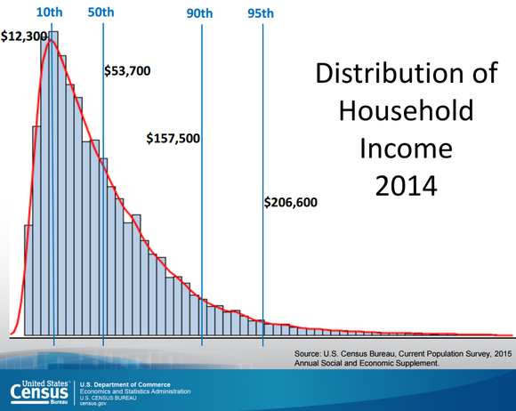

## Table of Contents

## What is economic security?

Economic security means having enough money and resources to live a stable and comfortable life. It includes being able to pay for basic needs like food, housing, and healthcare, as well as having enough savings for emergencies and future plans. When people have economic security, they feel less stress and can focus on improving their lives and the lives of their families.

Achieving economic security can be challenging, especially for those who face job loss, low wages, or unexpected expenses. Governments and organizations often help by providing social safety nets like unemployment benefits, welfare programs, and affordable healthcare. These supports can make a big difference in helping people maintain economic security, even during tough times.

## Why is economic security important in the United States?

Economic security is really important in the United States because it helps people live without worrying about money all the time. When people have enough money to pay for things like food, a place to live, and doctor visits, they feel more stable and can focus on other important things in life, like spending time with family or getting a better job. This stability is good for everyone because when people are less stressed about money, they can contribute more to their communities and the economy.

Also, economic security helps keep the country strong. When more people have jobs and can support themselves, the whole economy does better. This means more people can buy things, which helps businesses grow and create even more jobs. Plus, when people feel secure financially, they are more likely to invest in their future, like going to school or starting a business, which can lead to more innovation and growth in the country.

## What are the main components of economic security?

Economic security has a few main parts that help people feel safe and stable with their money. One big part is having a steady job that pays enough to cover basic needs like food, a home, and healthcare. When someone has a good job, they can plan for the future and not worry so much about money. Another important part is having savings. Savings act like a safety net for unexpected problems, like losing a job or needing to fix a car. Having some money saved up helps people feel more secure because they know they can handle emergencies.

Another key component is access to benefits and support from the government or other organizations. These can include things like unemployment benefits, welfare programs, and affordable healthcare. These supports help people when they're struggling and can make a big difference in keeping them financially stable. Finally, being able to plan for the future, like saving for retirement or education, is also a crucial part of economic security. When people can look ahead and prepare, they feel more in control of their financial lives and less worried about what might happen.

## How does the U.S. government measure economic security?

The U.S. government uses different ways to measure economic security. One common way is by looking at the unemployment rate. This tells them how many people are out of work and looking for a job. When the unemployment rate is low, it usually means more people have jobs and feel more secure about their money. Another way they measure economic security is by checking the poverty rate. This shows how many people don't have enough money to meet their basic needs. A lower poverty rate means more people are doing okay financially.

They also look at income levels and how much money people are [earning](/wiki/earning-announcement). If incomes are going up, it's a good sign that people are feeling more secure. The government also keeps an eye on things like access to healthcare and how much people are saving for the future. All these things together help them understand if people in the country are feeling financially stable or if they need more help.

## What are the key economic security programs in the United States?

The United States has several key programs to help people with economic security. One important program is Social Security. It helps older people, people with disabilities, and some family members of workers who have passed away. Social Security gives them money every month so they can pay for things they need. Another big program is Medicare, which helps older people and some people with disabilities pay for healthcare. These programs make a big difference for a lot of people by giving them money and healthcare when they need it most.

There are also programs that help people who don't have much money. One of these is the Supplemental Nutrition Assistance Program (SNAP), which used to be called food stamps. SNAP helps people buy food so they don't go hungry. Another program is Medicaid, which helps people with low incomes pay for healthcare. The Temporary Assistance for Needy Families (TANF) program gives money to families with children who need help. All these programs work together to help people have enough money and resources to live a stable life.

## How do social safety nets contribute to economic security?

Social safety nets are really important for helping people feel more secure with their money. These programs, like unemployment benefits, food stamps, and welfare, give people a way to get help when they're struggling. When someone loses their job, unemployment benefits can help them pay for things while they look for a new job. Food stamps help families buy food so they don't go hungry. These kinds of help can make a big difference, especially when money is tight.

By giving people support during tough times, social safety nets help them stay stable and not fall into deeper problems. When people know they have a safety net, they feel less worried about what might happen if they lose their job or face other money troubles. This helps them focus on getting back on their feet instead of just trying to survive. In the end, these programs help keep people and their families safe and secure, which is good for everyone in the country.

## What role does employment play in economic security?

Employment is really important for economic security because it gives people a steady way to earn money. When someone has a job, they can pay for things like food, a place to live, and healthcare. This helps them feel stable and not worry so much about money. A good job also means people can save some money for emergencies or for the future, like retirement or their kids' education. This makes them feel even more secure because they know they can handle unexpected problems.

Having a job also helps people feel good about themselves and their future. When people are working, they can plan ahead and think about how to improve their lives. They might decide to go back to school or learn new skills to get a better job. This not only helps them but also helps the whole economy because when more people are working, they can buy things, which helps businesses grow and create more jobs. So, employment is a big part of making sure people feel safe and secure with their money.

## How have recent economic policies affected economic security in the U.S.?

Recent economic policies in the U.S. have had a big impact on how secure people feel about their money. One big policy was the American Rescue Plan, which was passed in 2021. This plan gave money to people who were struggling because of the COVID-19 pandemic. It included things like more money for unemployment benefits, help for families with children, and support for small businesses. These actions helped a lot of people feel more secure because they had extra money to pay for what they needed during a tough time.

Another important policy was the Infrastructure Investment and Jobs Act, passed in 2021. This law is about spending money to fix roads, bridges, and other things that help the country run smoothly. By creating jobs in construction and other areas, this policy helps people find work and earn money. When more people have jobs, they feel more secure because they can pay their bills and save for the future. These policies show how the government tries to help people feel more stable and secure with their money.

## What are the demographic disparities in economic security across the U.S.?

In the United States, different groups of people have different levels of economic security. For example, people from certain racial and ethnic backgrounds, like Black and Hispanic Americans, often have less economic security than white Americans. This can be because they face more challenges in finding good jobs, getting a good education, and earning enough money. Women also tend to have less economic security than men, partly because they might earn less money for the same work or have to take time off for family reasons.

Age also plays a big role in economic security. Younger people, like those just starting their careers, might struggle more because they haven't had time to build up savings or find a stable job. On the other hand, older people might worry about having enough money for retirement. Where people live matters too. People in big cities might have more job opportunities but also face higher costs for things like housing. In rural areas, it can be harder to find good jobs, which can make it tougher to feel secure about money.

## How does economic security in the U.S. compare internationally?

When we look at how the United States stacks up against other countries in terms of economic security, it's a mixed picture. The U.S. has a strong economy with lots of jobs and high average incomes, which helps many people feel secure. Programs like Social Security and Medicare also help older people and those with disabilities. But, not everyone in the U.S. feels the same level of security. Some groups, like people from certain racial and ethnic backgrounds, face more challenges and might not feel as secure as others.

Compared to other countries, the U.S. does well in some areas but not as well in others. For example, countries like Denmark and Norway have strong social safety nets that help people feel more secure, even if they lose their jobs or face other problems. These countries often have lower poverty rates and more equal income distribution. On the other hand, the U.S. has a lot of wealth and opportunities, but also higher levels of income inequality and less comprehensive social support systems. This means that while some Americans feel very secure, others struggle more to achieve the same level of financial stability.

## What are the future challenges to maintaining economic security in the United States?

One big challenge to keeping economic security in the United States is the changing job market. With more jobs being done by machines and technology, some people might find it hard to get work. This can make it tough for them to feel secure about their money. Also, many jobs now need special skills, so people need to keep learning and training to stay employed. If they can't do this, they might struggle to find good jobs and feel less secure.

Another challenge is the growing difference between rich and poor people. This gap can make it harder for people with less money to feel secure. They might not have enough money for things like healthcare or saving for the future. Plus, things like housing and education are getting more expensive, which can make it even harder for people to feel stable. The government and other groups will need to find ways to help everyone feel more secure, no matter how much money they have.

## What innovative solutions are being proposed to enhance economic security in the U.S.?

One innovative solution to improve economic security in the U.S. is the idea of a Universal Basic Income (UBI). This means giving every person a certain amount of money every month, no matter what. The idea is to help people have enough money for their basic needs, even if they lose their job or can't work. Some places have tried this out and found that it can help people feel more secure and even start their own businesses or go back to school. It's a big idea, but it could make a real difference in how secure people feel about their money.

Another solution being talked about is improving education and job training programs. As jobs change because of technology, people need to learn new skills to stay employed. By making education and training easier to get and more focused on what jobs need, more people could find good work and feel more secure. This could mean more money for schools, better programs that teach skills for today's jobs, and even helping people go back to school later in life. These kinds of programs could help a lot of people feel more stable and confident about their future.

## References & Further Reading

[1]: [Social Security Administration. (2023). **A History of the Social Security System**.](https://www.ssa.gov/policy/docs/statcomps/supplement/2023/supplement23.pdf) 

[2]: U.S. Census Bureau. (2021). [**Income Inequality in the United States**.](https://www.census.gov/library/stories/2022/09/income-inequality-increased.html) 

[3]: Securities and Exchange Commission (SEC). (1998). [**Regulation ATS**.](https://www.sec.gov/rules-regulations/1998/12/regulation-exchanges-alternative-trading-systems) 

[4]: Marcos Lopez de Prado. [**Advances in Financial Machine Learning**](https://www.amazon.com/Advances-Financial-Machine-Learning-Marcos/dp/1119482089). Wiley.

[5]: Ernest P. Chan. [**Quantitative Trading: How to Build Your Own Algorithmic Trading Business**](https://www.amazon.com/Quantitative-Trading-Build-Algorithmic-Business/dp/0470284889). Wiley. 

[6]: Stefan Jansen. [**Machine Learning for Algorithmic Trading**](https://github.com/stefan-jansen/machine-learning-for-trading). Packt Publishing.