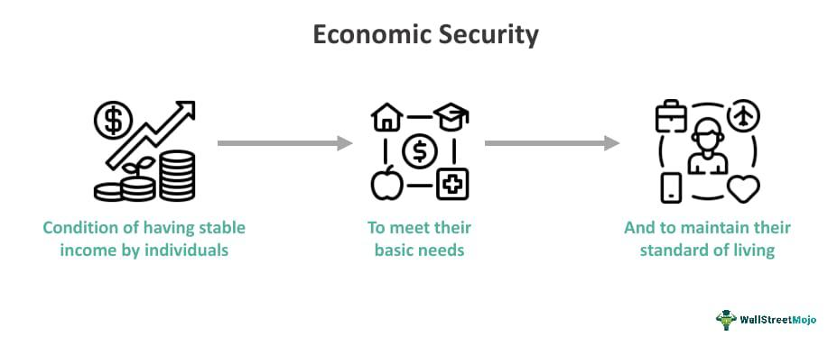

In this article, we explore the interconnected themes of economic security, U.S. history, and algorithmic trading. These elements have evolved considerably and continue to influence the dynamics of modern economic and financial practices. Economic security in the United States has been shaped by various historical milestones, public policies, and economic strategies aimed at ensuring individuals and families can meet their financial needs. From the introduction of pivotal policies such as social security to contemporary concerns about income inequality and unemployment, economic security has remained a fundamental aspect of national discourse.

Similarly, the evolution of algorithmic trading highlights a transformation in financial markets driven by technological advancements and regulatory changes. Since its emergence in the 1980s and the subsequent authorization of electronic exchanges in 1998, algorithmic trading has become central to the operation of U.S. markets, contributing to the majority of transactions. By providing insights into these developments, the article addresses common questions surrounding economic security and algorithmic trading, emphasizing their significance in today's world. This comprehensive guide aims to benefit those interested in understanding both the historical perspectives and modern advancements in these fields, revealing how they collectively impact financial markets and offer opportunities and challenges for stakeholders.



## Table of Contents

## Understanding Economic Security in the U.S.

Economic security in the United States has undergone substantial transformations since the 19th century, influenced by evolving public policies and economic conditions. This concept broadly refers to the stability with which individuals and families can meet their financial needs, encompassing income stability, access to essential services, and protection against economic hardships such as unemployment and inflation.

Historically, the roots of economic security in the U.S. can be traced back to industrialization in the 19th century. This period marked a shift from agrarian economies to industrial ones, creating a new working class and introducing economic vulnerabilities. Labor movements in the late 1800s advocated for rights and protections, leading to initial governmental interventions.

A significant milestone in the evolution of economic security was the introduction of the Social Security Act in 1935. Prompted by the Great Depression, this act established a safety net for the elderly and unemployed, reflecting a broader recognition of the government's role in ensuring economic stability. According to the Social Security Administration, this policy provided the groundwork for subsequent welfare and financial stability programs in the country (Social Security Administration, 2023).

In the decades that followed, economic security was further shaped by additional policies, including unemployment insurance, Medicare, and Medicaid. These programs aimed to mitigate economic risks associated with job loss, health issues, and aging, respectively. The post-World War II era saw economic expansion and rising living standards, contributing to a sense of security among many American families.

However, the turn of the 21st century introduced new challenges. Economic security came under pressure due to rising income inequality, significant unemployment spikes during economic recessions, and the erosion of traditional job benefits. The Gini Index, a measurement of income inequality, increased in the U.S. from roughly 0.397 in 1967 to about 0.481 in 2020, indicating growing disparity (U.S. Census Bureau, 2021).

Recent efforts to address these challenges include discussions around universal basic income, expanding healthcare access, and raising the minimum wage. Technological advancements also play a dual role; while they can drive economic progress and job creation, they can also lead to job displacement, affecting economic security for certain demographics.

In summary, economic security in the U.S. has been shaped by historical shifts, landmark policies, and ongoing economic challenges. While significant strides have been made to enhance financial stability for individuals and families, contemporary issues such as income inequality and technological disruption continue to demand attention and action from policymakers. These dynamics underscore the importance of adaptive strategies to maintain and improve economic security in a rapidly changing world.

## The History and Evolution of Algorithmic Trading

Algorithmic trading, often known simply as algo trading, has revolutionized financial markets by enhancing trading speed and efficiency. This innovation relies heavily on computer programs and algorithms to automate trading instructions, which could include variables such as timing, price, and [volume](/wiki/volume-trading-strategy). The journey of [algorithmic trading](/wiki/algorithmic-trading) is marked by significant technological advancements and regulatory changes. Here, we outline its historical evolution and its profound impact on contemporary financial markets.

**Early Developments: 1980s**

The seeds of algorithmic trading were sown in the 1980s, driven by the increasing digitization of financial markets. Early algorithmic strategies were relatively simple, often focused on basic trend-following techniques or [arbitrage](/wiki/arbitrage) opportunities. The first significant implementation of algorithmic trading can be traced back to the introduction of program trading on stock exchanges, where traders used computer programs to execute large orders more efficiently. Institutions began leveraging these technologies to divide large volumes of shares into smaller, strategically timed trades.

**Technological and Regulatory Milestones: 1990s**

The 1990s marked a turning point for algorithmic trading due to key technological advancements and regulatory shifts. The rise of electronic trading platforms enabled faster and more seamless execution of trades, laying the groundwork for more sophisticated algorithmic strategies. A pivotal moment arrived in 1998 when the U.S. Securities and Exchange Commission (SEC) authorized electronic exchanges through Regulation ATS (Alternative Trading Systems). This regulatory change facilitated the growth and adoption of algorithmic trading by allowing alternative platforms to compete with traditional exchanges.

**21st Century and High-Frequency Trading**

In the 2000s, algorithmic trading evolved with the advent of high-frequency trading ([HFT](/wiki/high-frequency-trading-strategies)), characterized by executing thousands of orders in fractions of a second. HFT strategies often involve complex algorithms designed to exploit minute price discrepancies and [liquidity](/wiki/liquidity-risk-premium) imbalances. This era saw the introduction of low-latency networks and co-location services, allowing traders to place their servers close to the exchange's data center to minimize transmission delays. Python libraries such as Quantlib and Pykalman have been used to develop these sophisticated algorithms given their flexibility and extensive analytical capabilities.

```python
# Simple example of a moving average crossover strategy using pandas
import pandas as pd

# Assume 'data' is a DataFrame with a datetime index and a 'Close' column
def moving_average_strategy(data, short_window=40, long_window=100):
    signals = pd.DataFrame(index=data.index)
    signals['signal'] = 0.0
    signals['short_mavg'] = data['Close'].rolling(window=short_window, min_periods=1, center=False).mean()
    signals['long_mavg'] = data['Close'].rolling(window=long_window, min_periods=1, center=False).mean()
    signals['signal'][short_window:] = np.where(signals['short_mavg'][short_window:] > signals['long_mavg'][short_window:], 1.0, 0.0)   
    signals['positions'] = signals['signal'].diff()
    return signals

# Sample usage
# data = pd.read_csv('historical_stock_data.csv', index_col='Date', parse_dates=True)
# signals = moving_average_strategy(data)
```

**Present Day**

Today, algorithmic trading is ubiquitous in global financial markets, accounting for the majority of trades executed on major exchanges like the New York Stock Exchange (NYSE) and NASDAQ. Algorithms cater to a diverse range of trading strategies, from simple moving average crossovers to complex [statistical arbitrage](/wiki/statistical-arbitrage) and [machine learning](/wiki/machine-learning) models. The dominance of algorithmic trading is due to its ability to process massive amounts of market data quickly, execute trades with precision, and operate continuously without human intervention. Consequently, algorithmic trading systems are now integral to the market infrastructure, influencing liquidity, pricing, and [volatility](/wiki/volatility-trading-strategies).

The continuous evolution of technology promises further advancements in algorithmic trading, with emerging fields like quantum computing and [artificial intelligence](/wiki/ai-artificial-intelligence) likely to introduce even more sophisticated strategies. As the field develops, algorithmic trading remains a critical component of modern-day financial systems, encapsulating a legacy of innovation and transformation.

## Economic Security FAQs

Economic security is defined as the state in which individuals or families have stable access to resources necessary to sustain their standard of living, thereby reducing vulnerability to economic hardships. It is paramount for both individuals and nations as it promotes societal stability, supports economic growth, and ensures well-being. For individuals, economic security means having adequate income, employment, and savings to weather periods of instability or unforeseen expenses. On a national level, economic security encompasses the resilience of the country's economic infrastructure, the reliability of its resource supply chains, and its capacity to sustain growth amidst global challenges. 

Over the decades, U.S. policies have significantly aided economic security. For instance, the Social Security Act of 1935 was a major historical milestone that introduced social insurance programs to support retirees and the unemployed, laying a foundation for economic welfare. In the latter half of the 20th century, policies under the Great Society programs expanded upon these principles by introducing Medicare and Medicaid, which addressed healthcare needs of the elderly and low-income individuals, further securing economic stability for vulnerable populations. More recently, the American Recovery and Reinvestment Act of 2009 aimed to stimulate economic growth following the financial crisis by investing in infrastructure, education, health, and energy resources.

Several contemporary factors influencing economic security have emerged, notably climate change and technological shifts. Climate change poses a direct threat to economic security by affecting agriculture, housing, and insurance industries, thereby necessitating proactive adaptation and mitigation strategies. Technological shifts, particularly automation and digitization, have introduced both positive and negative impacts on employment and income distribution. While they drive efficiency and innovation, they also pose challenges in job displacement and the skills gap in the labor market.

Economic security significantly impacts quality of life as it provides a stable foundation from which individuals can pursue personal growth, education, and career opportunities. With assured economic security, people can invest in long-term goals such as buying homes, starting businesses, or pursuing higher education, thereby fostering economic innovation. On a broader scale, nations with strong economic security are better positioned to manage crises, support robust labor markets, and engage in global trade, contributing to overall economic resilience and prosperity.

## FAQs on Algorithmic Trading

Algorithmic trading, often referred to as algo trading, utilizes computer algorithms to execute trading orders at speeds and frequencies beyond the capacity of human traders. The transformation of algorithmic trading over the years can be attributed to technological advancements and significant shifts in regulatory frameworks.

Initially emerging in the 1970s, algorithmic trading gained traction in the 1980s with the implementation of program trading strategies. The widespread adoption of electronic exchanges in the late 1990s marked a significant milestone, propelling the growth of algo trading. Its evolution has been driven by rapid advancements in computer processing power, improvements in telecommunications, and the development of sophisticated algorithms capable of analyzing vast datasets in real-time.

Regulatory changes have also played a pivotal role in shaping algorithmic trading. For instance, the authorization of electronic exchanges by regulators in 1998 allowed for greater market access and reduced transaction costs, fostering an environment conducive to the proliferation of high-frequency trading (HFT). Regulatory frameworks, such as the Markets in Financial Instruments Directive (MiFID) in Europe and the Dodd-Frank Act in the U.S., have continually evolved to address the complexities and risks associated with algo trading, focusing on transparency, fairness, and market stability.

The impact of algorithmic trading on market volatility and trading efficiency is a subject of ongoing debate among academics and market practitioners. While proponents argue that algo trading improves market efficiency by providing liquidity and tightening bid-ask spreads, critics highlight its potential to exacerbate market volatility and trigger flash crashes. High-frequency trading, a subset of algo trading, executes a large number of trades at lightning speed, which can lead to large price swings in a short time frame.

Investors seeking to optimize their trading strategies can leverage algorithmic trading in various ways. Algo trading strategies, such as statistical arbitrage, [trend following](/wiki/trend-following), and mean reversion, enable traders to exploit market inefficiencies and diverse market conditions. The use of machine learning and artificial intelligence has further enhanced the sophistication of these algorithms, allowing for adaptive strategies that evolve with changing market dynamics.

To leverage algorithmic trading effectively, investors can use Python, a popular programming language for quant finance due to its vast array of libraries and tools. For example, traders can utilize Python's `numpy` and `pandas` libraries for data manipulation, `matplotlib` for visualization, and `scikit-learn` for implementing machine learning algorithms. A basic template for a moving average crossover strategy might look like this:

```python
import pandas as pd

# Load historical data
data = pd.read_csv('historical_data.csv')

# Calculate moving averages
data['short_ma'] = data['Close'].rolling(window=20).mean()
data['long_ma'] = data['Close'].rolling(window=50).mean()

# Signal generation
data['signal'] = 0
data['signal'][20:] = np.where(data['short_ma'][20:] > data['long_ma'][20:], 1, 0)

# Generate trading orders
data['position'] = data['signal'].diff()

# Output buy/sell signals
print(data[['Date', 'symbol', 'position']].dropna())
```

In summary, algorithmic trading has fundamentally transformed the financial markets, with its continued evolution likely driven by technological advancements and regulatory developments. Investors equipped with the right tools and knowledge can harness algo trading to enhance their trading efficiency and strategies.

## Conclusion

Economic security and algorithmic trading are integral to shaping the contemporary economic landscape. Each plays a crucial role in influencing both opportunities and challenges within the financial domain. The historical trajectory of economic security in the United States demonstrates a deep intertwining with public policy, reflecting shifts in societal needs and economic philosophies. From the introduction of social security in the 20th century to current discussions on economic equity, economic security remains pivotal in ensuring individuals and families can sustainably meet their financial needs.

Algorithmic trading, on the other hand, represents a significant technological advancement in financial markets, enhancing speed and efficiency. From its origins in the 1980s, aided by technological advancements and electronic exchanges, algorithmic trading has grown to dominate U.S. market transactions. The sophistication of algorithmic strategies, including high-frequency trading, underscores this sector's potential to revolutionize market dynamics.

The convergence of historical insights and modern implications of these topics provides stakeholders with essential knowledge to navigate the increasingly complex financial environment. Understanding the evolution and current state of economic security helps policymakers craft strategies to address modern challenges, such as income inequality and employment volatility. Meanwhile, staying informed about ongoing innovations and policies in algorithmic trading is critical for optimizing trading strategies and managing market dynamics.

As economic landscapes continue to evolve, these areas remain subjects of active research and policy deliberation, underscoring their critical relevance. Continuous advancements in technology and shifts in public policy are expected to further shape the future of economic security and algorithmic trading, reinforcing their significance in the global economy.

## References & Further Reading

[1]: [Social Security Administration. (2023). **A History of the Social Security System**.](https://www.ssa.gov/policy/docs/statcomps/supplement/2023/supplement23.pdf) 

[2]: U.S. Census Bureau. (2021). [**Income Inequality in the United States**.](https://www.census.gov/library/stories/2022/09/income-inequality-increased.html) 

[3]: Securities and Exchange Commission (SEC). (1998). [**Regulation ATS**.](https://www.sec.gov/rules-regulations/1998/12/regulation-exchanges-alternative-trading-systems) 

[4]: Marcos Lopez de Prado. [**Advances in Financial Machine Learning**](https://www.amazon.com/Advances-Financial-Machine-Learning-Marcos/dp/1119482089). Wiley.

[5]: Ernest P. Chan. [**Quantitative Trading: How to Build Your Own Algorithmic Trading Business**](https://www.amazon.com/Quantitative-Trading-Build-Algorithmic-Business/dp/0470284889). Wiley. 

[6]: Stefan Jansen. [**Machine Learning for Algorithmic Trading**](https://github.com/stefan-jansen/machine-learning-for-trading). Packt Publishing.