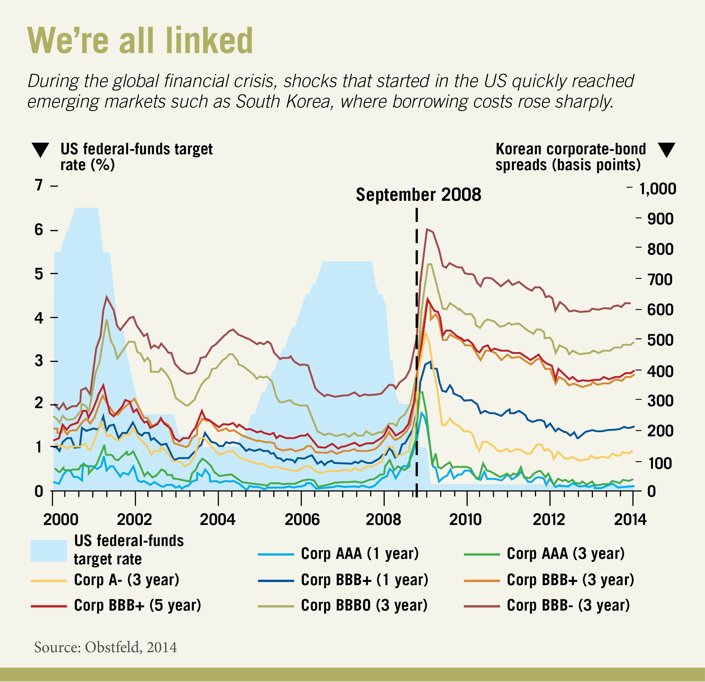

## Table of Contents

## What is an economic shock?

An economic shock is a sudden and unexpected event that affects an economy. It can be caused by many things, like a natural disaster, a big change in oil prices, or a financial crisis. These shocks can make the economy grow slower or even shrink. They can also cause prices to go up or down quickly.

When an economic shock happens, it can affect businesses and people in different ways. For example, if the price of oil goes up suddenly, it can make it more expensive for businesses to make things and for people to travel. This can lead to less spending and fewer jobs. Governments and central banks often try to help by changing interest rates or spending more money to support the economy.

## What are the different types of economic shocks?

Economic shocks can be divided into different types based on where they come from and how they affect the economy. One type is a demand shock, which happens when there is a sudden change in how much people want to buy. For example, if people suddenly stop buying cars because they are worried about losing their jobs, this is a demand shock. It can make businesses sell less and might lead to fewer jobs. Another type is a supply shock, which happens when there is a sudden change in how much businesses can produce. If a big storm destroys a lot of farms, this can make food more expensive because there is less of it to go around.

Another way to think about economic shocks is whether they are positive or negative. A positive shock can help the economy grow. For example, if a new technology makes it cheaper to produce things, this can lead to more jobs and more money for people to spend. On the other hand, a negative shock can hurt the economy. If a big bank fails and people lose their savings, they might spend less money, which can slow down the economy.

Economic shocks can also be classified as domestic or external. Domestic shocks happen inside a country, like a change in government policy or a big strike by workers. External shocks come from outside the country, like a war in another part of the world that makes oil prices go up. Both types can have big effects on the economy, but external shocks can be harder to predict and manage because they are out of the country's control.

## Can you give examples of economic shocks from history?

One big economic shock was the oil crisis in 1973. Some countries that made oil decided to stop selling it to the United States and other countries because of a war. This made the price of oil go up a lot, and it made everything more expensive. People had to pay more for gas, and businesses had to pay more to make things. This slowed down the economy and made it hard for people to find jobs.

Another example is the financial crisis in 2008. It started in the United States when a lot of people couldn't pay back their home loans. This caused big banks to lose a lot of money, and some of them failed. The problem spread to other countries, and it made the world economy slow down. Many people lost their jobs, and it took a long time for things to get better.

A more recent example is the COVID-19 pandemic that started in 2020. The virus made people sick and forced many businesses to close. People couldn't go to work, and they stopped spending money on things they didn't need. This caused a big shock to the economy, and many countries had to help their people by giving them money and support. It took a long time for the economy to start growing again.

## How do economic shocks impact employment?

Economic shocks can have a big effect on jobs. When there is a shock like a big increase in oil prices or a financial crisis, businesses might have to spend more money to make things or they might sell less. This can make them cut jobs to save money. For example, during the 2008 financial crisis, many people lost their jobs because banks failed and businesses stopped growing. When people lose their jobs, they have less money to spend, which can make the economy even slower.

On the other hand, some economic shocks can create jobs. If a new technology comes out that makes it cheaper to produce things, businesses might hire more people to make more stuff. For example, the internet created a lot of new jobs in technology and other fields. But even positive shocks can be hard for some people. If a new technology makes some jobs go away, like robots taking over factory work, it can be tough for those workers to find new jobs. So, economic shocks can change the job market in big ways, sometimes making it harder to find work and sometimes creating new opportunities.

## What effects do economic shocks have on inflation?

Economic shocks can make inflation go up or down. If there is a supply shock, like a big storm that destroys farms, it can make the price of food go up because there is less food to go around. This can make inflation go up because people have to pay more for things. On the other hand, if there is a demand shock, like people spending less money because they are worried about losing their jobs, it can make prices go down because businesses have to sell things for less to get people to buy them. This can make inflation go down.

Sometimes, economic shocks can make inflation go up a lot and stay high for a long time. For example, during the oil crisis in the 1970s, the price of oil went up a lot, and it made everything more expensive. This caused something called stagflation, where the economy was not growing, but prices were still going up. Governments and central banks have to be careful when dealing with these shocks because if they do too much or too little, it can make things worse.

## How do governments typically respond to economic shocks?

When an economic shock happens, governments often try to help the economy by changing their spending or taxes. If the economy is slowing down because people are spending less, the government might spend more money on things like building roads or helping people who lost their jobs. This can help people have more money to spend, which can make the economy grow again. Sometimes, the government might also lower taxes so people and businesses have more money to spend or invest.

Central banks, which are part of the government, also play a big role. They can change interest rates, which is the cost of borrowing money. If the economy needs a boost, the central bank might lower interest rates to make it cheaper for people and businesses to borrow money. This can help them spend more and keep the economy going. If inflation is going up too fast, the central bank might raise interest rates to make borrowing more expensive, which can slow down spending and help control prices.

Governments also use other tools like setting up special programs to help businesses and people who are struggling. For example, during the COVID-19 pandemic, many governments gave money directly to people who lost their jobs and helped businesses stay open. These actions can help reduce the bad effects of an economic shock and make the economy recover faster.

## What role do central banks play during an economic shock?

Central banks play a very important role when an economic shock happens. They can change the [interest rate](/wiki/interest-rate-trading-strategies), which is the cost of borrowing money. If the economy is slowing down, the central bank might lower the interest rate. This makes it cheaper for people and businesses to borrow money. When borrowing is cheaper, people might buy more things like houses or cars, and businesses might invest more in new projects. This can help the economy grow again.

If prices are going up too fast, which is called inflation, the central bank might raise the interest rate. This makes borrowing more expensive, so people and businesses might spend less. When people spend less, prices can go up more slowly, which helps control inflation. Central banks also use other tools, like buying or selling government bonds, to help the economy during a shock. These actions can make sure that money keeps moving and that the economy stays stable.

## How do economic shocks affect global trade?

Economic shocks can change how countries trade with each other. If a big shock happens in one country, like a financial crisis or a natural disaster, it can make that country buy and sell less with other countries. For example, if a country's currency gets weaker because of a shock, it might buy more things from other countries because those things are cheaper. But it might also sell less to other countries because its own products are more expensive for them. This can make global trade go down and can affect businesses and jobs all over the world.

Some shocks can also make countries change what they trade. If a shock like a big increase in oil prices happens, countries might look for new ways to get energy, like using more solar or wind power. This can change what they buy and sell. It can also make countries work together more to solve problems caused by the shock. For example, during the COVID-19 pandemic, many countries worked together to make sure they could still trade important things like medicine and food, even though the shock made it hard.

## What are the long-term effects of economic shocks on an economy?

Economic shocks can have big effects on an economy that last a long time. If a shock like a financial crisis happens, it can make the economy slow down for years. People might lose their jobs and businesses might close. This can make it hard for the economy to grow again because people have less money to spend. It can also make people feel less sure about the future, so they might save more money instead of spending it. This can keep the economy slow for a long time.

Some economic shocks can change the economy in other ways too. For example, if a shock like a big increase in oil prices happens, it can make people and businesses look for new ways to save energy. This can lead to new technologies and new ways of doing things. Over time, these changes can make the economy stronger and more able to deal with future shocks. But it can take a long time for these good effects to happen, and in the short term, the shock can still cause a lot of problems.

## How can economic models predict and analyze economic shocks?

Economic models help us predict and understand economic shocks by using math and data to show how the economy works. These models can look at things like how much people spend, how much businesses produce, and how prices change. By putting in different kinds of shocks, like a sudden increase in oil prices or a financial crisis, the models can show what might happen to the economy. They use past data to guess what might happen in the future, which helps governments and businesses plan for different kinds of shocks.

But economic models are not perfect. They can't predict everything because the economy is very complicated and can be affected by things that are hard to measure, like people's feelings about the future. Still, these models are useful because they can help us see patterns and understand how different parts of the economy are connected. By studying these models, we can learn how to make the economy stronger and better able to handle shocks when they happen.

## What are the differences in how developed and developing economies handle economic shocks?

Developed economies usually have more tools and money to handle economic shocks. They can use things like changing interest rates or spending more money to help their economy. For example, if there's a big shock like a financial crisis, a developed country might lower interest rates to make it cheaper for people and businesses to borrow money. They might also give money directly to people who lost their jobs. These countries often have strong systems to help them get through tough times, which can make the effects of the shock less bad.

On the other hand, developing economies might not have as many tools or as much money to deal with shocks. They might not be able to lower interest rates as much or spend more money to help their economy. When a shock happens, it can hit them harder because they don't have as many ways to protect themselves. For example, if there's a big increase in oil prices, a developing country might not be able to help its people as much, which can make the shock last longer and be more painful. But, some developing countries are getting better at handling shocks by working with other countries and using new ways to help their economies.

## How can policies be designed to mitigate the effects of future economic shocks?

Policies to mitigate the effects of future economic shocks can start with building a strong and flexible economy. This means having good rules for banks and businesses so they can handle tough times better. It also means spending money on things like education and technology to help people and businesses grow. Governments can also save money when times are good so they have it to spend when a shock happens. This way, they can help people who lose their jobs and keep the economy going.

Another important part of these policies is making sure the economy can change and adapt. This means helping businesses find new ways to make things and helping workers learn new skills. Governments can also work with other countries to share information and help each other during a shock. By planning ahead and working together, countries can make the effects of economic shocks less bad and help their economies recover faster.

## References & Further Reading

[1]: Blanchard, O., & Watson, M. (1986). ["Are Business Cycles All Alike?"](https://www.nber.org/papers/w1392) National Bureau of Economic Research Working Paper No. 1392.

[2]: Bernanke, B. S. (1983). ["Nonmonetary Effects of the Financial Crisis in the Propagation of the Great Depression."](https://www.nber.org/papers/w1054) The American Economic Review, 73(3), 257-276.

[3]: Hamilton, J. D. (1983). ["Oil and the Macroeconomy since World War II."](https://www.jstor.org/stable/1832055) Journal of Political Economy, 91(2), 228-248.

[4]: Lopez de Prado, M. (2018). ["Advances in Financial Machine Learning."](https://www.amazon.com/Advances-Financial-Machine-Learning-Marcos/dp/1119482089) John Wiley & Sons.

[5]: Jarrow, R. A. (2011). ["Risk Management Models."](https://www.semanticscholar.org/paper/Risk-Management-Models-Jarrow-Chatterjea/286f4409e921686eb92df9647534ccd23f6d6aa0) Taylor & Francis.

[6]: Stefan, J. (2020). ["Machine Learning for Algorithmic Trading."](https://github.com/stefan-jansen/machine-learning-for-trading) Packt Publishing.

[7]: Chan, E. (2009). ["Quantitative Trading: How to Build Your Own Algorithmic Trading Business."](https://github.com/ftvision/quant_trading_echan_book) John Wiley & Sons.

[8]: Samuelson, P. A. (1965). ["Proof That Properly Anticipated Prices Fluctuate Randomly."](https://www.proquest.com/docview/1302995663) Industrial Management Review, 6(2), 41-49.

[9]: Carhart, M. M. (1997). ["On Persistence in Mutual Fund Performance."](https://onlinelibrary.wiley.com/doi/full/10.1111/j.1540-6261.1997.tb03808.x) The Journal of Finance, 52(1), 57-82.