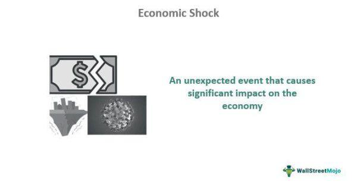

Economic shocks are unexpected events that profoundly disrupt the balance of an economy. These disruptions can emanate from various sources including financial markets, natural disasters, or sudden policy changes. When such shocks occur, they have wide-ranging impacts on key macroeconomic variables such as unemployment, inflation, and gross domestic product (GDP).

The focus of this article is to explore the diverse forms of economic shocks, their consequent economic effects, and the pivotal role of algorithmic trading in mitigating these impacts. Economic shocks can lead to volatility in financial systems and can alter demand and supply dynamics, affecting prices and production levels in unpredictable ways. For policymakers, investors, and traders, comprehending the mechanisms and effects of these shocks is essential.



Economic shocks influence supply and demand in distinct manners. Supply shocks, for instance, can cause production constraints or boons that alter the availability of goods and services. Demand shocks, on the other hand, can lead to abrupt changes in consumer and business spending. These variations in supply and demand inevitably reverberate through the economy, influencing economic stability and growth.

Algorithmic trading presents a significant technological advancement to manage these challenges. By utilizing automated systems, algorithmic trading can respond swiftly to the volatility induced by economic shocks. These systems use predetermined criteria to execute trades, allowing for rapid adjustments in portfolios to either capitalize on or shield against market movements. Through such mechanisms, algorithmic trading aids in stabilizing markets by providing liquidity and mitigating risk during periods of economic distress.

Understanding the interplay between economic shocks and market dynamics is crucial. As global economies are increasingly interconnected, the ripple effects of shocks can traverse borders, magnifying their impacts. By effectively leveraging technological tools like algorithmic trading, stakeholders can better navigate the complexities and uncertainties posed by economic shocks, thereby enhancing financial stability and promoting sustained economic growth.

## Table of Contents

## Types of Economic Shocks

Economic shocks are significant, unexpected events that disrupt the normal functioning of an economy. They can be classified into various types based on their origins and effects: supply shocks, demand shocks, financial shocks, policy shocks, and technological shocks.

**Supply Shocks** affect an economy's production capabilities. These can be triggered by natural disasters, geopolitical events, or significant technological innovations. For instance, a major earthquake or hurricane can destroy production facilities, leading to a decrease in output and potentially increasing prices if demand remains constant. Conversely, a technological breakthrough like automation can enhance production efficiency, potentially lowering costs and prices. The economic impact of supply shocks can be analyzed using the Aggregate Supply (AS) curve, where a leftward shift indicates a decrease in supply, leading to higher prices and lower output.

**Demand Shocks** are characterized by sudden changes in consumer or business spending behavior. These can result from economic downturns, fiscal policy changes, or shifts in consumer confidence. For instance, during a recession, consumers may cut back on spending, reducing aggregate demand. This can lead to lower GDP and increased unemployment. On the other hand, tax cuts can boost disposable income, increasing consumption and shifting the Aggregate Demand (AD) curve to the right. 

**Financial Shocks** are abrupt changes in financial markets that can cause widespread economic disruption. Examples include stock market crashes, banking crises, or sudden shifts in exchange rates. Such shocks can affect credit availability and investor confidence, leading to economic contractions or recessions. Analysis of financial shocks often involves examining liquidity ratios, credit spreads, and market volatility indicators.

**Policy Shocks** arise from unexpected changes in government policies, which can lead to economic disturbances. These might include sudden alterations in tax rates, monetary policy adjustments, or regulatory changes. While some policy shocks are intended to stabilize the economy, they can sometimes introduce uncertainty, affecting investment and consumption decisions.

**Technological Shocks** occur due to significant advancements or disruptions in technology that alter productivity across industries. Innovations like the internet or artificial intelligence have transformed production processes, often increasing productivity and economic output. However, these advancements can also lead to transitional unemployment as industries adapt and workers retrain for new roles. The economic effects of technological shocks can be measured by changes in productivity indices and innovation adoption rates.

Understanding these categories of economic shocks helps policymakers, investors, and businesses formulate strategies to mitigate their adverse effects and capitalize on potential opportunities. Each type of shock presents unique challenges and requires tailored responses to maintain economic stability.

## Economic Effects of Different Shocks

Economic shocks, whether originating from supply, demand, financial, policy, or technological sources, have distinct and far-reaching effects on the economy.

Supply shocks affect the aggregate supply curve and can be either positive or negative. Negative supply shocks, such as natural disasters or geopolitical tensions that disrupt production, generally lead to increased production costs and inflation. This inflationary pressure is due to a leftward shift in the short-run aggregate supply (SRAS) curve, resulting in higher prices and potentially lower output. Conversely, positive supply shocks—often driven by technological advancements or resource discoveries—can enhance productivity, leading to economic growth and stabilizing prices. This occurs through a rightward shift of the SRAS curve, typically resulting in an increase in GDP and reduced inflationary pressures.

Demand shocks impact aggregate demand, influencing consumption, investment, and economic growth rates. A positive demand shock, like a surge in consumer confidence, can boost economic activity and employment levels, but may also induce inflation if the economy operates near full capacity. Conversely, negative demand shocks, such as those from recessionary trends, reduce spending and lead to higher unemployment, decreased production, and deflationary pressures.

Financial shocks often originate from disruptions in credit markets, such as bank failures or stock market crashes. These shocks hinder the flow of credit and [liquidity](/wiki/liquidity-risk-premium), critical for investment and spending. As financial institutions become risk-averse, economies may experience contractions or even slide into recessions, marked by declining GDP, falling asset prices, and increased unemployment. The ripple effects across global markets can exacerbate these conditions, leading to prolonged economic instability.

Policy shocks arise when unexpected fiscal or monetary policy changes occur. While these are typically intended to control inflation or stimulate growth, they can lead to increased uncertainty. For instance, abrupt [interest rate](/wiki/interest-rate-trading-strategies) hikes might suppress inflation but could also deter investment due to higher borrowing costs. Similarly, sudden fiscal policy shifts, like changes in taxation or government spending, can have destabilizing effects on business confidence and economic planning.

Technological shocks, often considered a double-edged sword, can lead to significant shifts in productivity and economic output. On the one hand, rapid technological advancements enhance efficiency and output across industries, spurring economic growth. However, they may also result in transitional unemployment as labor markets adjust, with the displacement of workers in certain sectors demanding new skills and evolutionary shifts in the job market.

In summary, economic shocks play a pivotal role in shaping macroeconomic landscapes, with varied impacts depending on their nature and origin. Understanding these effects is crucial for developing strategies to mitigate their negative consequences and harness any potential positive outcomes.

## Algorithmic Trading and Economic Shocks

Algorithmic trading, commonly referred to as algo-trading, employs advanced automated systems to execute trades based on predefined criteria. These systems are designed to react instantly to economic shocks, which are characterized by sudden and unexpected events that disrupt economic stability.

A key benefit of [algorithmic trading](/wiki/algorithmic-trading) is its ability to capitalize on the market [volatility](/wiki/volatility-trading-strategies) caused by economic shocks. Strategies are often developed to exploit rapid price movements that occur in such circumstances. For instance, [momentum](/wiki/momentum)-based algorithms can identify and trade in the direction of short-term market trends resulting from shocks, potentially generating significant returns.

Risk management is a crucial aspect of algo-trading, especially in the face of economic shocks. Traders frequently employ hedging strategies to mitigate potential losses. For example, implementing inverse positions or utilizing options can serve as effective tactics to protect against adverse price movements during volatile periods. 

Algo-trading also leverages advanced data analysis techniques, including [machine learning](/wiki/machine-learning), to predict and adapt to economic changes swiftly. Machine learning models can process vast amounts of real-time financial data and detect patterns indicative of impending shocks. These models can further optimize trading strategies, enhancing the efficiency and profitability of trades during turbulent market conditions. Below is a basic example of how machine learning might be used in this context using Python:

```python
from sklearn.ensemble import RandomForestClassifier
import numpy as np

# Hypothetical historical data: features may include various economic indicators
X_train = np.array([[...], [...]])  # Training features
y_train = np.array([...])  # Corresponding trading strategy outcomes

# Initialize and train the model
model = RandomForestClassifier(n_estimators=100, max_depth=5, random_state=42)
model.fit(X_train, y_train)

# Use the trained model to predict the trading strategy during a shock
X_test = np.array([[...]])  # Features during an economic shock
predicted_strategy = model.predict(X_test)
```

In addition to strategy optimization and risk management, compliance with regulatory standards is paramount in algorithmic trading, especially during economic shocks when regulatory scrutiny tends to escalate. Regulatory bodies may introduce additional measures to ensure market stability, which necessitates that algo-trading systems are continuously updated to abide by these standards. Maintaining compliance not only avoids legal repercussions but also fosters market integrity and investor confidence.

In summary, algorithmic trading provides robust mechanisms to navigate the complexities associated with economic shocks. Through the utilization of automated strategies, risk management techniques, and regulatory compliance, algo-traders can effectively manage the risks and opportunities presented by volatile market conditions.

## Conclusion

Economic shocks are inevitable and can significantly affect global economies. These disruptions influence everything from supply and demand dynamics to the stability of financial systems. The unpredictable nature of these events underscores the necessity for robust strategies to manage the risks they pose.

Algorithmic trading has become indispensable in navigating these economic uncertainties. By leveraging sophisticated automated systems, traders can manage risks effectively and exploit opportunities in volatile markets. These systems react swiftly to market changes initiated by economic shocks, enabling traders to maintain an edge. Algorithms designed to adapt to rapidly changing conditions capitalize on price movements, effectively turning challenges into opportunities.

Understanding the various types of economic shocks and their potential impacts is vital for traders, investors, and policymakers. This knowledge forms the foundation for developing strategies that minimize economic disruptions. Awareness and preparedness allow for more informed decision-making, reducing the adverse effects of shocks on the economy.

The integration of advanced analytical techniques with real-time data is crucial for stakeholders looking to enhance their ability to respond to economic shocks. Access to real-time information facilitates prompt and accurate responses, allowing for strategic adjustments that ensure stability and growth. By employing data-driven insights and technological advancements, market participants can address the complexities of economic shocks more efficiently and effectively, securing advantageous outcomes even in the midst of turmoil.

## References & Further Reading

[1]: Blanchard, O., & Watson, M. (1986). ["Are Business Cycles All Alike?"](https://www.nber.org/papers/w1392) National Bureau of Economic Research Working Paper No. 1392.

[2]: Bernanke, B. S. (1983). ["Nonmonetary Effects of the Financial Crisis in the Propagation of the Great Depression."](https://www.nber.org/papers/w1054) The American Economic Review, 73(3), 257-276.

[3]: Hamilton, J. D. (1983). ["Oil and the Macroeconomy since World War II."](https://www.jstor.org/stable/1832055) Journal of Political Economy, 91(2), 228-248.

[4]: Lopez de Prado, M. (2018). ["Advances in Financial Machine Learning."](https://www.amazon.com/Advances-Financial-Machine-Learning-Marcos/dp/1119482089) John Wiley & Sons.

[5]: Jarrow, R. A. (2011). ["Risk Management Models."](https://www.semanticscholar.org/paper/Risk-Management-Models-Jarrow-Chatterjea/286f4409e921686eb92df9647534ccd23f6d6aa0) Taylor & Francis.

[6]: Stefan, J. (2020). ["Machine Learning for Algorithmic Trading."](https://github.com/stefan-jansen/machine-learning-for-trading) Packt Publishing.

[7]: Chan, E. (2009). ["Quantitative Trading: How to Build Your Own Algorithmic Trading Business."](https://github.com/ftvision/quant_trading_echan_book) John Wiley & Sons.

[8]: Samuelson, P. A. (1965). ["Proof That Properly Anticipated Prices Fluctuate Randomly."](https://www.proquest.com/docview/1302995663) Industrial Management Review, 6(2), 41-49.

[9]: Carhart, M. M. (1997). ["On Persistence in Mutual Fund Performance."](https://onlinelibrary.wiley.com/doi/full/10.1111/j.1540-6261.1997.tb03808.x) The Journal of Finance, 52(1), 57-82.