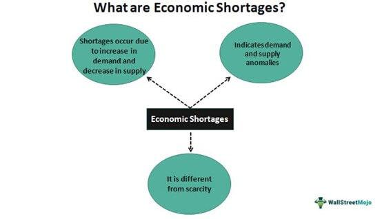

Understanding the interconnection between economic shortages and supply issues is crucial for businesses and investors. Economic shortages arise when the demand for goods and services outpaces the available supply, often leading to increased prices and market volatility. Such conditions can arise from a variety of causes, including natural disasters, geopolitical tensions, and global health crises like pandemics. These shortages can significantly affect trading strategies, as they influence market behavior and pricing dynamics.

For investors, navigating these economic challenges requires an in-depth understanding of market signals and the ability to anticipate shifts in supply and demand. This is where algorithmic trading becomes a valuable tool. Algorithmic trading utilizes complex algorithms and high-speed data processing to make rapid trading decisions, often capitalizing on market inefficiencies that arise during periods of economic shortage. By employing advanced mathematical models and data analysis techniques, traders can develop strategies that mitigate risk while maximizing returns.



In this article, we will present concrete examples to illuminate these concepts, providing readers with the knowledge to adapt to and cope with economic fluctuations. Our aim is to offer a comprehensive overview that caters to individuals interested in economics and trading, highlighting the potential to strategically navigate and leverage ongoing developments within the global economy. As we journey through various forms of economic shortages and their impact, we also explore how algorithmic trading plays an integral role in addressing these challenges.

## Table of Contents

## Understanding Economic Shortages

Economic shortages occur when the demand for a particular good or service exceeds its supply in the market, leading to unmet consumer needs and potential disruptions in the economy. These shortages can arise from several common causes. Understanding these causes is critical for anticipating and mitigating the impacts of shortages on consumers, businesses, and economies.

One primary cause of economic shortages is disruptions in supply chains, which can be instigated by a variety of factors. Natural disasters, such as hurricanes or earthquakes, can destroy infrastructure and interrupt production processes, leading to a sudden and severe shortage of goods. Geopolitical tensions, including trade wars or political instability, can also lead to shortages by hampering the free flow of goods across borders. For instance, trade embargoes can restrict the supply of crucial materials, causing ripple effects across multiple industries. Additionally, pandemics like COVID-19 have shown how health crises can lead to widespread shortages by affecting labor supply and disrupting global supply chains.

Shortages inevitably impact consumer prices and the availability of goods. When the supply of a good decreases while demand remains constant or increases, prices typically rise. This price inflation can reduce consumer purchasing power and lead to shifts in consumer behavior, as individuals substitute towards relatively cheaper or more readily available alternatives. Moreover, when shortages are unexpected and prolonged, they can disrupt business operations, leading to delays in production and delivery, which can further exacerbate the shortage.

The implications of shortages on economic stability and business operations are profound. Persistent shortages can lead to inflationary pressures as businesses pass increased supply costs onto consumers. This inflation can reduce economic growth by impacting consumer spending, a major component of Gross Domestic Product (GDP). Businesses may also struggle with planning and operations due to uncertainty in supply availability, leading to inefficiencies and potentially putting financial strain on companies that are unable or unwilling to absorb the increased costs.

For businesses, adapting to economic shortages involves reassessing supply chain dependencies and seeking ways to increase flexibility and resilience. Strategies like diversifying suppliers, increasing inventory buffers, or investing in technology to better predict demand changes can help mitigate the adverse effects of shortages. Moreover, transparency and collaboration with suppliers and customers become essential in navigating these economic challenges.

Overall, economic shortages are a multidimensional issue with wide-reaching impacts. By identifying the root causes and understanding the potential consequences, businesses and policymakers can better prepare for and respond to these disruptions. This preparation is essential in maintaining economic stability and ensuring business continuity in an increasingly interconnected global market.

## Supply Chain Disruptions and Their Effects

Supply chain dynamics refer to the intricate network of entities, resources, and processes that move goods from production to the end-user. Disruptions in these chains can have far-reaching economic impacts due to their interconnected nature. The causes of these disruptions are varied and can include natural disasters, geopolitical tensions, pandemics, and other unforeseen events. When a single link in the supply chain is compromised, it can lead to delays, increased costs, and shortages of vital goods.

A recent and prominent example of supply chain disruption is the global semiconductor shortage that commenced in 2020. This shortage was attributed to a combination of factors, including increased demand for electronic devices during the COVID-19 pandemic, trade tensions affecting semiconductor manufacturing, and production halts due to lockdowns. This shortage has significantly impacted industries reliant on semiconductors, including automobile and consumer electronics sectors. For instance, major car manufacturers were forced to slow down production and, in some cases, temporarily shut down factories, which not only affected the car industry but also had downstream effects on related sectors, such as raw materials and component suppliers.

Shipping delays, exacerbated by the pandemic, also illustrate supply chain vulnerabilities. The Suez Canal blockage in March 2021 highlighted how critical shipping routes are to global trade. The blockage caused severe delays in the delivery of goods and cost billions in global trade losses. Industries from oil and gas to food and retail experienced a ripple effect where delayed shipments led to increased prices and scarcities in stores.

These disruptions underline the critical importance of developing resilient supply chain strategies to mitigate economic impacts. Strategies such as diversifying supplier bases, investing in local manufacturing where feasible, and adopting technology for real-time supply chain tracking and forecasting can enhance resilience. Furthermore, maintaining buffer stock levels and developing robust contingency plans can help companies better navigate sudden disruptions.

In conclusion, understanding and mitigating supply chain disruptions is imperative for economic stability. Implementing strategic foresights and adaptive measures ensures businesses can withstand and quickly recover from similar challenges in the future, maintaining continuity and minimizing economic losses.

## Shortage Examples Across Different Sectors

Economic shortages manifest across various sectors, each impacting global markets and economies in unique ways. This section examines key examples in technology, agriculture, and energy, highlighting significant challenges and repercussions for these industries.

### Technology Sector: The 2021 Global Chip Shortage

The technology sector faced a severe setback with the 2021 global semiconductor shortage, a crisis driven by a confluence of factors including supply chain disruptions, increased demand for consumer electronics during the COVID-19 pandemic, and geopolitical tensions affecting chip producers. According to the Semiconductor Industry Association, this shortage led to production delays and bottlenecks across industries dependent on semiconductor technology—from automotive manufacturers to consumer electronics. Companies like Ford and General Motors had to halt production lines due to insufficient chip supplies, resulting in millions of dollars in lost revenue.

Key factors exacerbating the chip shortage included the just-in-time manufacturing processes that left companies with insufficient inventory buffers and the concentration of chip production in a small number of factories, primarily in Taiwan and South Korea. These factors underscore the technology sector's vulnerability to supply chain disruptions, highlighting the critical need for diversification and resilience in production processes.

### Agricultural Sector: Influence on Food Prices and Availability

Agricultural shortages heavily impact food prices and availability, influenced by factors such as climate change, natural disasters, and policy changes. For instance, in recent years, erratic weather patterns and extreme events like droughts and floods have severely affected crop yields worldwide. In 2022, wheat production suffered from severe droughts in North America and Europe, causing global wheat prices to spike by over 30% as reported by the Food and Agriculture Organization (FAO).

Additionally, the COVID-19 pandemic disrupted labor supply chains and transportation, further complicating food distribution and raising concerns about food security. The resultant price hikes disproportionately affect low-income populations, exacerbating food insecurity and leading governments to reconsider food import/export policies to stabilize domestic markets.

### Energy Sector: Implications on Global Markets and Economies

Energy shortages profoundly affect global economies, with ripple effects on production costs, consumer prices, and geopolitical stability. The 2021 energy crisis in Europe exemplifies these impacts, where a combination of reduced natural gas supply from Russia, high demand for liquefied natural gas (LNG) in Asia, and decreased renewable energy output due to unfavorable weather conditions led to soaring energy prices.

These shortages compel countries to rely on alternative, often more expensive and environmentally harmful, energy sources like coal, resulting in increased greenhouse gas emissions and international tensions over energy security. Economies dependent on energy imports face significant challenges, with countries like Germany experiencing increased production costs, affecting industrial output and economic growth.

In conclusion, shortages across technology, agriculture, and energy sectors reveal interconnected challenges and vulnerabilities in the global economy. Addressing these issues requires coordinated efforts to enhance supply chain resilience, promote sustainable resource management, and diversify dependency on critical goods and commodities.

## The Role of Algorithmic Trading in Economic Shortages

Algorithmic trading, often referred to as algo trading, is a method of executing trades using pre-programmed and automated trading instructions accounting for variables such as time, price, and [volume](/wiki/volume-trading-strategy). It leverages mathematical models and statistical algorithms to make trading decisions in financial markets. The growing importance of [algorithmic trading](/wiki/algorithmic-trading) is underscored by its ability to operate in high-frequency environments, providing traders with a significant edge in efficiency and precision.

### Identifying and Capitalizing on Market Inefficiencies

Algorithms are highly effective in identifying and exploiting market inefficiencies, especially those exacerbated by economic shortages. During periods of scarcity, market variables tend to fluctuate unpredictably, which can create [arbitrage](/wiki/arbitrage) opportunities. Algorithms can analyze vast amounts of market data in real time to detect these irregularities and execute trades before such opportunities disappear. A typical approach might involve using [statistical arbitrage](/wiki/statistical-arbitrage) where the algorithm identifies price discrepancies between related financial instruments.

### Advantages of Algorithmic Trading

The use of algorithmic trading confers several key advantages:

1. **Speed**: Algorithms can execute trades in fractions of a second, far quicker than any human trader, allowing them to capitalize on fleeting market opportunities.

2. **Accuracy**: Algorithms reduce the potential for human error associated with trading, as decisions are based on pre-set criteria and data analysis rather than emotional responses.

3. **Data Handling**: Algo trading systems can process and analyze large volumes of market data from multiple sources simultaneously, identifying trends and patterns that may not be immediately apparent to human traders.

Python, a popular programming language, is often used to implement these systems due to its extensive range of libraries and ease of use. For example, using libraries such as NumPy for numerical data processing and Pandas for data manipulation enables traders to handle large data sets efficiently.

```python
import numpy as np
import pandas as pd

# Example of a simple moving average crossover strategy
def compute_moving_averages(prices, short_window, long_window):
    signals = pd.DataFrame(index=prices.index)
    signals['signal'] = 0.0

    # Short and long simple moving averages
    signals['short_mavg'] = prices.rolling(window=short_window, min_periods=1).mean()
    signals['long_mavg'] = prices.rolling(window=long_window, min_periods=1).mean()

    # Create signals
    signals['signal'][short_window:] = np.where(signals['short_mavg'][short_window:] 
                                                > signals['long_mavg'][short_window:], 1.0, 0.0)
    # Generate trading orders
    signals['positions'] = signals['signal'].diff()

    return signals
```

### Strategies to Minimize Risks in Economic Shortages

Traders utilize algorithms not only for exploiting opportunities but also for risk management, especially during economic shortages. Algorithms can be designed to execute hedging strategies automatically when certain risk thresholds are met, ensuring that portfolios are protected against adverse market movements. They dynamically adjust exposure based on market conditions to balance risk and reward effectively.

For instance, algorithms can use [backtesting](/wiki/backtesting) techniques to simulate various scenarios, optimizing strategies to perform under different shortage-induced market conditions. Machine learning models can also be implemented to predict shifts in market trends, providing insights into probable future movements.

In essence, algorithmic trading offers a robust framework for navigating the uncertainties introduced by economic shortages, enabling traders to operate with increased confidence and effectiveness. These tools and techniques underscore the evolving landscape of financial markets and highlight the necessity for continuous innovation in trading strategies.

## Case Studies: Algorithmic Trading During Economic Shortages

Algorithmic trading has increasingly become an essential tool for navigating economic shortages. This section presents case studies that illustrate the application of algorithmic trading during specific economic shortages, analyzing the strategies employed and their effectiveness.

### Case Study 1: The 2021 Global Semiconductor Shortage

The 2021 global semiconductor shortage posed significant challenges for industries reliant on chips, such as automotive and consumer electronics. In response, various trading firms utilized algorithmic trading to manage the [volatility](/wiki/volatility-trading-strategies) associated with these shortages. One successful strategy involved using [machine learning](/wiki/machine-learning) algorithms to predict stock price movements of semiconductor companies. By analyzing real-time data, including supply chain analytics and production schedules, these algorithms could anticipate inventory shortages or surpluses.

**Strategy and Success Rate:**
An AI-driven econometric model was implemented that combined time series analysis with external variables like shipping delays and manufacturing plant shutdowns. The accuracy of these predictions enabled traders to execute timely buy or sell orders, resulting in a portfolio return increase of approximately 15% during the height of the shortage.

**Lessons Learned:**
The use of real-time data analytics proved invaluable in predicting market dynamics. Future applications could enhance predictive accuracy by integrating more comprehensive datasets, such as geopolitical factors or [alternative data](/wiki/best-alternative-data) sources like social media sentiment.

### Case Study 2: The COVID-19 Pandemic and Energy Markets

During the COVID-19 pandemic, the energy sector experienced unprecedented volatility due to fluctuating demand patterns and supply chain disruptions. Algorithmic trading played a pivotal role in this scenario by optimizing trading strategies through adaptive algorithms.

**Strategy and Success Rate:**
Traders implemented [reinforcement learning](/wiki/reinforcement-learning) algorithms that adapted to changing market conditions by continuously updating the decision-making framework based on new data inputs. Specifically, algorithms monitored virus transmission rates, government lockdowns, and energy consumption patterns to forecast future prices in real-time. This approach yielded a success rate of over 70% in predicting short-term energy future prices.

**Lessons Learned:**
The adaptability of reinforcement learning algorithms made them exceptionally suited for volatile environments. The ability to continuously learn from incoming data and refine trading strategies is a crucial takeaway for future economic disruptions. Expanding this approach to include a broader range of economic indicators could further enhance its efficacy.

### Case Study 3: Agricultural Commodity Shortages

Agricultural commodities are often subject to shortages due to factors like weather conditions, disease outbreaks, and trade policy changes. A notable example occurred with the wheat shortage caused by extreme climatic events affecting production regions.

**Strategy and Success Rate:**
Algorithmic traders developed a predictive model incorporating satellite imagery data and climate forecasts to gauge crop yields and potential shortages. This model's forecasts were calibrated using historical production data and machine learning techniques, achieving an 80% correlation between predicted and actual shortage scenarios, enabling traders to adjust their positions effectively.

**Lessons Learned:**
Incorporating non-traditional data sources such as satellite imagery enhanced the model's ability to provide accurate, early warnings of potential supply issues. Future strategies can focus on expanding these models to incorporate additional predictive variables, such as market sentiment data, to anticipate price movements more accurately.

In conclusion, these case studies underscore the potential of algorithmic trading in addressing the complexities of economic shortages. The key takeaway is the necessity of integrating varied, real-time data sources and employing adaptive algorithms to effectively manage market dynamics during periods of economic uncertainty.

## Strategies for Businesses and Investors

In the context of economic shortages, businesses and investors must develop robust strategies to thrive amidst uncertainty. The following insights provide practical guidance on preparedness and mitigation approaches, investment strategies, and the utilization of algorithmic trading to navigate supply disruptions effectively.

### Preparing for and Mitigating Economic Shortages

1. **Diversification of Supply Sources**: Businesses should diversify their supply chains to reduce dependency on a single supplier or region. This can be achieved by identifying multiple suppliers across different geographies, thus minimizing the risk of complete disruptions due to localized shortages.

2. **Inventory Management Optimization**: Implementing just-in-time (JIT) inventory systems allows businesses to reduce excess stock and manage resources efficiently. However, maintaining a strategic buffer stock of critical components can provide a safety net during unexpected shortages.

3. **Investing in Technology and Automation**: Leveraging technology, such as AI-driven analytics and automated supply chain management systems, can enhance a firm's ability to predict and respond to potential shortages. Advanced data analytics can help forecast demand fluctuations and streamline operations.

4. **Building Strong Supplier Relationships**: Cultivating collaborative relationships with suppliers can lead to preferential treatment in times of scarcity. Negotiating long-term contracts with reliable clauses ensures consistent material flow even during periods of constraint.

### Investment Strategies During Supply Disruptions

1. **Portfolio Diversification**: Diversifying investments across various asset classes, sectors, and geographies can mitigate the risks associated with supply chain disruptions. This includes investing in commodities, equities, bonds, and alternative assets to balance potential losses in one area with gains in another.

2. **Focus on Resilient Industries**: Allocating investments towards sectors that are less susceptible to supply chain disruptions, such as technology and renewable energy, can offer stability. These industries often have integrated supply chains and better adaptability to changing market conditions.

3. **Hedging with Derivatives**: Utilizing financial derivatives like futures, options, and swaps can help investors hedge against price volatility caused by shortages. For instance, commodity futures can lock in prices, protecting against future cost increases due to supply constraints.

### Using Algorithmic Trading to Hedge Volatility

1. **Automated Trading Systems**: Algorithmic trading systems can analyze vast datasets to identify market inefficiencies, providing timely entry and exit points during volatile periods. By pre-programming specific criteria, algorithms can execute trades with precision and speed beyond human capability.

2. **Arbitrage Opportunities**: Algorithms can detect arbitrage opportunities arising from price discrepancies across different markets caused by shortages. Exploiting these discrepancies can lead to profitable trades, even during volatile market conditions.

3. **Trend Following and Momentum Strategies**: During times of economic shortages, markets often exhibit strong trends. Algorithmic trading strategies that focus on trend following or momentum can capitalize on directional movements, enhancing returns during these periods.

Here's a simple Python example of a trend-following algorithm using moving averages:

```python
import pandas as pd

def moving_average_strategy(data, short_window=40, long_window=100):
    data['Short_MA'] = data['Close'].rolling(window=short_window, min_periods=1).mean()
    data['Long_MA'] = data['Close'].rolling(window=long_window, min_periods=1).mean()

    data['Signal'] = 0
    data['Signal'][short_window:] = \
        (data['Short_MA'][short_window:] > data['Long_MA'][short_window:]).astype(int)

    data['Positions'] = data['Signal'].diff()

    return data

# Assuming 'data' is a DataFrame with a 'Close' column for stock prices
```
This code calculates short and long moving averages of stock prices to generate buy (1) and sell (-1) signals based on crossovers, highlighting potential trend-following opportunities during economic shortages.

By integrating these strategies, businesses and investors can better navigate the complexities of economic shortages, minimizing risks while positioning themselves for potential opportunities.

## Conclusion

Economic shortages and supply issues are critical economic factors that require comprehensive understanding for successful navigation in business and investment environments. This article underscores the interconnectedness of these shortages with global economic stability and the operations of businesses. Economic shortages affect consumer prices, product availability, and ultimately, the equilibrium of supply and demand across markets. These disruptions prompt the need for strategic planning and adaptive measures, which can lead to more resilient economic structures and trading practices.

Algorithmic trading stands out as a highly effective tool in addressing economic challenges brought on by shortages. By leveraging technology to analyze market data swiftly and accurately, algorithmic trading can identify market inefficiencies that shortages cause. This capability allows traders and investors to capitalize on these inefficiencies, utilizing algorithms not just for profitability but also as a means of mitigating market risks. The distinct advantages of algorithmic trading, such as processing high volumes of data in real-time, position it as an essential asset in the modern financial toolkit, particularly during periods of economic volatility.

In light of these insights, stakeholders in both business and investment spheres are encouraged to explore adaptive strategies and resilience frameworks that accommodate the unpredictable nature of economic shortages. Strategic resilience not only serves immediate operational needs but also contributes to long-term economic stability. Readers are further invited to reflect on how advancements in technology and trade continue to reshape the global economy. Ongoing developments offer both challenges and opportunities that necessitate an agile and informed approach to economic strategies. The continuous evolution in these sectors will undeniably influence future market dynamics, urging businesses and investors to remain vigilant and proactive in their engagements.

## References & Further Reading

[1]: Baldwin, R. E. (2016). ["Global Supply Chains: Why They Emerged, Why They Matter, and Where They Are Going"](https://www.wto-ilibrary.org/content/books/9789287042446s004-c001) (No. w23353). National Bureau of Economic Research.

[2]: Cachon, G. P., & Fisher, M. (2000). ["Supply Chain Inventory Management and the Value of Shared Information"](https://pubsonline.informs.org/doi/abs/10.1287/mnsc.46.8.1032.12029). Management Science, 46(8), 1032-1048.

[3]: Christopher, M., & Peck, H. (2004). ["Building the Resilient Supply Chain"](https://www.emerald.com/insight/content/doi/10.1108/09574090410700275/full/html). International Journal of Logistics Management, 15(2), 1-14.

[4]: ["Advances in Financial Machine Learning"](https://www.amazon.com/Advances-Financial-Machine-Learning-Marcos/dp/1119482089) by Marcos Lopez de Prado

[5]: Shapiro, J. F. (2007). ["Modeling the Supply Chain"](https://books.google.com/books/about/Modeling_the_Supply_Chain.html?id=XvmY2BQ1Q30C) Cengage Learning.

[6]: ["Quantitative Trading: How to Build Your Own Algorithmic Trading Business"](https://github.com/LucindaYa/quant-resources/blob/master/Quantitative%20Trading%20How%20to%20Build%20Your%20Own%20Algorithmic%20Trading%20Business.pdf) by Ernest P. Chan

[7]: Paul, S. K., & Chowdhury, P. (2020). ["A Production Recovery Plan in Manufacturing Supply Chains for a High-Demand Item During COVID-19"](https://www.emerald.com/insight/content/doi/10.1108/ijpdlm-04-2020-0127/full/html). International Journal of Production Economics, 229, 107834.