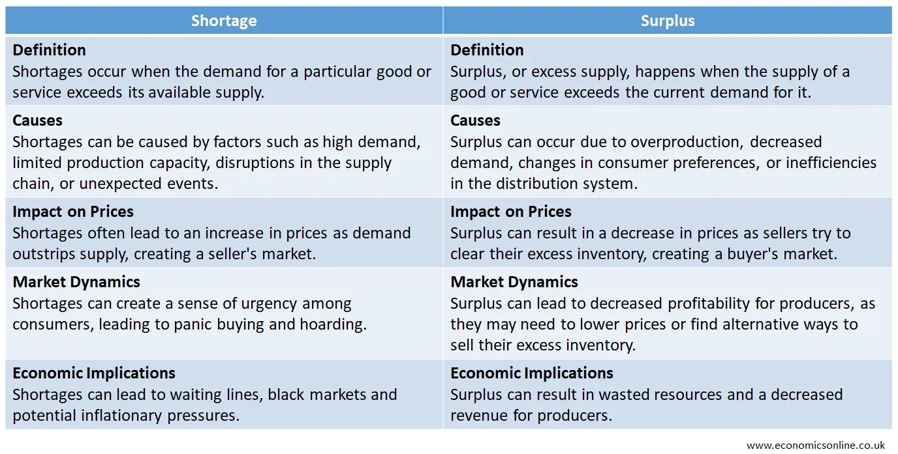

## Table of Contents

## What is an economic shortage?

An economic shortage happens when there isn't enough of a product or service to meet the demand from people who want it. This can occur for many reasons, like problems in making the product, not having enough resources, or when too many people suddenly want the same thing. When there's a shortage, it can lead to higher prices because people are willing to pay more to get what they need or want.

Shortages can affect everyday life. For example, if there's a shortage of a popular toy during the holiday season, it might be hard to find and more expensive. Governments and businesses often try to manage shortages by finding new ways to produce more of the item or by finding substitutes. But until they solve the problem, people might have to wait longer or pay more to get what they need.

## What are the main causes of economic shortages?

Economic shortages can happen for many reasons. One big reason is when there are problems making the product. This could be because of a natural disaster that stops factories from working, or because there aren't enough workers. Another reason is when the materials needed to make the product become hard to find or more expensive. For example, if a key ingredient for a medicine becomes scarce, it can lead to a shortage of that medicine.

Another cause of shortages is when the demand for a product suddenly goes up a lot. This can happen if a product becomes really popular very quickly, like a new video game or a trendy fashion item. Sometimes, people might start buying more of something because they are worried it will run out, which can make the shortage even worse. Governments can also cause shortages by putting limits on how much of something can be made or sold, like with certain types of energy or food.

In some cases, shortages can be caused by problems in how goods are moved from where they are made to where people want to buy them. If there are issues with transportation, like strikes or bad weather, products might not reach stores on time. This can lead to empty shelves and frustrated customers. Understanding these causes can help businesses and governments find ways to prevent or manage shortages better.

## How do supply and demand contribute to economic shortages?

Supply and demand are key to understanding economic shortages. Supply is how much of a product is available, and demand is how much people want to buy. When demand goes up a lot but supply stays the same, it can cause a shortage. For example, if everyone wants the latest smartphone but the factory can only make so many, there won't be enough phones for everyone who wants one. This mismatch between what people want and what's available leads to shortages.

Sometimes, the supply can drop because of problems like bad weather, strikes, or not enough materials. When this happens, even if demand stays the same, there can still be a shortage. For instance, if a hurricane stops oil from being shipped, there might not be enough gas at the pumps, even though people still need to fill up their cars. Balancing supply and demand is tricky, but it's important for avoiding shortages and keeping things running smoothly.

## What are the different types of economic shortages?

There are different kinds of economic shortages, and they can be grouped in different ways. One type is a temporary shortage, which happens when there's a sudden problem that stops the supply of a product for a short time. For example, a factory might shut down because of a power outage, or a big storm might stop trucks from delivering goods. These shortages usually go away once the problem is fixed.

Another type is a long-term shortage, which happens when there's not enough of something for a longer period. This can be because there aren't enough resources to make the product, or because the demand keeps growing faster than the supply. For example, if a country doesn't have enough water to grow crops, there might be a long-term food shortage.

There are also artificial shortages, which happen when people or governments control how much of a product is available. This can be done on purpose, like when a company decides to make less of a product to keep prices high, or when a government puts limits on how much of something can be sold. These types of shortages are different because they're caused by choices people make, not by natural problems or sudden changes in supply and demand.

## Can you provide examples of economic shortages in history?

One famous example of an economic shortage happened during World War II. Many countries faced shortages of food, fuel, and other important things because the war disrupted normal trade and production. In the United States, the government had to ration things like sugar, meat, and gasoline. People got coupons that let them buy only a certain amount each week. This helped make sure everyone got a fair share, but it still meant people had to do without some things they were used to having.

Another example is the oil crisis of the 1970s. There was a big shortage of oil because some countries in the Middle East decided to stop selling oil to countries that supported Israel during a conflict. This led to long lines at gas stations and higher prices for gasoline. People had to wait for hours just to fill up their cars, and some businesses had to close because they couldn't get the fuel they needed to run. The shortage affected many parts of the economy and showed how important oil is for modern life.

A more recent example is the global shortage of semiconductors that started in 2020. Semiconductors are tiny parts used in everything from cars to computers. The demand for these parts went up a lot because more people were working from home and needed new electronics. At the same time, factories that make semiconductors had to close because of the COVID-19 pandemic. This led to a big shortage that made it hard for companies to make enough products to meet the demand. Cars and electronics became more expensive and harder to find, showing how a shortage in one part can affect many different industries.

## How do government policies affect economic shortages?

Government policies can make economic shortages better or worse. Sometimes, governments put rules in place that limit how much of something can be made or sold. This can happen with things like energy or certain foods. If a government decides to limit how much oil can be produced to protect the environment, it might lead to a shortage of gasoline. On the other hand, if the government sees a shortage coming, they might try to help by giving money or other support to companies that make the product. This can help increase the supply and reduce the shortage.

Another way government policies affect shortages is through how they manage emergencies. When there's a natural disaster or a sudden problem, governments can step in to help manage the situation. They might set up emergency plans to get food and supplies to people who need them. But if the government's response is slow or not well-organized, the shortage can get worse. For example, if a hurricane hits and the government can't get aid to people quickly, there might be a shortage of water and food. So, good government policies can help prevent or fix shortages, while bad policies can make them worse.

## What role do natural disasters play in causing economic shortages?

Natural disasters can cause economic shortages by messing up the way goods are made and moved around. When a big storm, earthquake, or flood hits, it can damage factories and farms, making it hard for them to keep making things people need. For example, if a hurricane ruins a bunch of crops, there might not be enough food to go around. Also, roads and bridges might get destroyed, which makes it tough to get products from where they're made to where people want to buy them. This can lead to empty shelves in stores and higher prices because there's less of everything to go around.

Governments and businesses often try to help when natural disasters cause shortages. They might bring in supplies from other places or set up emergency plans to make sure people get what they need. But it's not always easy to fix the problem quickly. Sometimes, the damage is so bad that it takes a long time to get things back to normal. Until then, people might have to deal with not having enough of important things like food, water, and medicine. So, natural disasters can shake up the economy and make life harder for a lot of people.

## How can economic shortages impact different sectors of the economy?

Economic shortages can really shake up different parts of the economy. When there's not enough of something important, like oil or food, it can make it hard for businesses to keep running smoothly. For example, if there's a shortage of oil, it can make gas prices go up a lot. This means that people and businesses have to pay more to drive their cars and trucks, which can make other things more expensive too. Factories might have to slow down or stop working if they can't get the materials they need, which can lead to fewer products on the shelves and higher prices for everything.

Another way shortages can affect the economy is by making people change how they spend their money. When things like food or medicine are hard to find, people might have to spend more on those things and less on other stuff, like clothes or going out to eat. This can hurt businesses that sell those other things, because they might not make as much money. Sometimes, shortages can even make people lose their jobs if companies have to cut back or close down because they can't get what they need to keep going. So, shortages can cause a ripple effect that touches many different parts of the economy.

## What are the short-term and long-term effects of economic shortages on a country's economy?

In the short term, economic shortages can cause a lot of problems for a country's economy. When there's not enough of something important, like food or fuel, prices can go up quickly. This means people have to spend more money on basic things, and they might not have as much left over for other stuff. Businesses can also struggle because they might not be able to get the materials they need to make their products. This can lead to fewer jobs and less money moving around in the economy. Sometimes, people might start to panic and buy more than they need, which can make the shortage even worse.

In the long term, the effects of economic shortages can be even more serious. If a country keeps facing shortages, it can slow down the whole economy. Businesses might decide to move to other countries where they can get what they need more easily. This can lead to fewer jobs and less investment in the country with the shortages. People might also start to lose trust in the economy, which can make it harder for the country to grow and develop. Governments might have to spend a lot of money trying to fix the problems caused by shortages, which can put a strain on their budgets. Overall, long-term shortages can make it tough for a country to keep its economy strong and stable.

## How can economic theory help in predicting and managing economic shortages?

Economic theory helps us understand how supply and demand work, which is key to predicting and managing economic shortages. By studying these patterns, economists can see when demand might go up a lot or when supply might go down. For example, if a new product becomes really popular, economists can predict that there might be a shortage if factories can't make enough of it. They can also look at things like weather forecasts to predict if natural disasters might cause problems with supply. This helps businesses and governments plan ahead so they can try to prevent shortages or deal with them better when they happen.

Once economists predict a shortage, they can use economic theory to come up with ways to manage it. One way is to find other sources for the product that's in short supply. For example, if there's not enough oil from one place, they might look for more oil from another place. Another way is to use prices to help balance supply and demand. If prices go up when there's a shortage, it can encourage people to use less of the product and encourage businesses to make more of it. Governments can also use policies like rationing or subsidies to help manage shortages. By using these ideas from economic theory, countries can try to keep their economies running smoothly even when there are shortages.

## What strategies can businesses implement to mitigate the effects of economic shortages?

Businesses can do a few things to help when there's not enough of something important. One way is to find other places to get the things they need. If they usually get a part from one factory, they might look for another factory that can make it. This can help keep their products coming even if one place runs out. Another way is to change how they make their products. If they can't get one part, they might use a different part instead. This can help them keep making things even when there's a shortage.

Another strategy is to plan ahead. Businesses can keep extra supplies in stock, so they have something to use if there's a sudden shortage. They can also work with other companies to share supplies and help each other out. Sometimes, businesses can talk to their customers about the shortage and explain why things might be more expensive or take longer to get. By being honest and working together, businesses can help manage shortages better and keep their customers happy.

## How do global economic shortages differ from local ones, and what are the unique challenges in addressing them?

Global economic shortages affect many countries at the same time and can be harder to fix than local ones. When there's a shortage all over the world, it's tough because countries can't just get what they need from somewhere else. For example, if there's a global shortage of oil, every country is trying to get more, and there's just not enough to go around. This can make prices go up a lot everywhere, and it can be hard for any one country to solve the problem on its own. Global shortages can also make it harder for countries to work together because they might all be trying to get the same things at the same time.

Local shortages, on the other hand, usually affect just one area or country. These can be easier to manage because other places might have enough of the product to help out. For example, if there's a shortage of a certain food in one city because of a bad harvest, other cities or countries might be able to send more food to help. The challenge with local shortages is making sure the help gets to the right place quickly. Sometimes, local governments might not have the money or the plans they need to fix the problem fast enough, which can make the shortage worse.

## References & Further Reading

[1]: Baldwin, R. E. (2016). ["Global Supply Chains: Why They Emerged, Why They Matter, and Where They Are Going"](https://www.wto-ilibrary.org/content/books/9789287042446s004-c001) (No. w23353). National Bureau of Economic Research.

[2]: Cachon, G. P., & Fisher, M. (2000). ["Supply Chain Inventory Management and the Value of Shared Information"](https://pubsonline.informs.org/doi/abs/10.1287/mnsc.46.8.1032.12029). Management Science, 46(8), 1032-1048.

[3]: Christopher, M., & Peck, H. (2004). ["Building the Resilient Supply Chain"](https://www.emerald.com/insight/content/doi/10.1108/09574090410700275/full/html). International Journal of Logistics Management, 15(2), 1-14.

[4]: ["Advances in Financial Machine Learning"](https://www.amazon.com/Advances-Financial-Machine-Learning-Marcos/dp/1119482089) by Marcos Lopez de Prado

[5]: Shapiro, J. F. (2007). ["Modeling the Supply Chain"](https://books.google.com/books/about/Modeling_the_Supply_Chain.html?id=XvmY2BQ1Q30C) Cengage Learning.

[6]: ["Quantitative Trading: How to Build Your Own Algorithmic Trading Business"](https://github.com/LucindaYa/quant-resources/blob/master/Quantitative%20Trading%20How%20to%20Build%20Your%20Own%20Algorithmic%20Trading%20Business.pdf) by Ernest P. Chan

[7]: Paul, S. K., & Chowdhury, P. (2020). ["A Production Recovery Plan in Manufacturing Supply Chains for a High-Demand Item During COVID-19"](https://www.emerald.com/insight/content/doi/10.1108/ijpdlm-04-2020-0127/full/html). International Journal of Production Economics, 229, 107834.