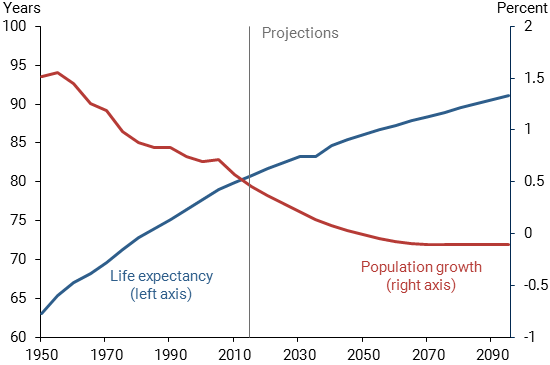

## Table of Contents

## What is an economic slump?

An economic slump is when the economy of a country or the world slows down. During this time, people buy fewer things, businesses make less money, and it can be hard for people to find jobs. This slowdown can last for months or even years, and it affects everyone from big companies to regular families.

When an economic slump happens, the government and central banks might try to help by lowering interest rates or spending more money on projects to create jobs. These actions are meant to encourage people to spend more and get the economy moving again. However, it can take a long time for these efforts to work, and sometimes the situation can get worse before it gets better.

## What are the common indicators of an economic slump?

Common indicators of an economic slump include a drop in the Gross Domestic Product (GDP), which means the total value of all goods and services produced in a country goes down. Another sign is when unemployment goes up, and more people are out of work. You might also see businesses making less money and people spending less on things they want, like new clothes or going out to eat.

Stock markets can also show signs of an economic slump. When stock prices fall a lot, it can mean that investors are worried about the future of the economy. Another thing to look at is the housing market. If fewer homes are being sold and prices are going down, it can be a sign that people are not feeling confident about their finances. All these signs together can show that an economic slump is happening.

Governments and economists keep a close eye on these indicators to understand how the economy is doing. When these signs start showing up, it might be time for the government to take action to help the economy recover. By watching these indicators, people can get a sense of whether the economy is slowing down and prepare for tougher times.

## How does an economic slump differ from a recession or depression?

An economic slump is a period when the economy slows down, but it's not as bad as a recession or a depression. During a slump, people might buy less, businesses might make less money, and it could be harder to find a job. But it's not as serious as a recession, which is when the economy shrinks for two quarters in a row. A recession means things are really bad, with more people out of work and businesses struggling a lot more.

A depression is even worse than a recession. It's a long-lasting and deep downturn in the economy that can last for years. During a depression, unemployment is very high, and many businesses go bankrupt. People have a really hard time, and the whole economy suffers a lot. So, while an economic slump is bad, it's not as severe or long-lasting as a recession or a depression.

To sum it up, an economic slump is a mild slowdown, a recession is a more serious and official downturn, and a depression is the worst kind of economic crisis, lasting a long time and causing a lot of damage to the economy and people's lives.

## What are the main causes of an economic slump?

Economic slumps can happen for many reasons. One big reason is when people and businesses lose confidence in the economy. If people think things are going to get worse, they might start spending less money. When people spend less, businesses sell fewer things and make less money. This can lead to them cutting jobs, which makes the economy slow down even more. Another reason for an economic slump is when there are big changes in the world, like a financial crisis or a natural disaster. These events can shake up the economy and make it hard for businesses to keep going as usual.

Another cause of an economic slump can be when countries trade less with each other. If a country relies a lot on selling things to other countries, and those countries start buying less, it can hurt the economy. Also, if the government raises taxes or cuts spending a lot, it can slow down the economy. When the government spends less, there are fewer jobs and less money moving around. All these things together can push the economy into a slump, making it hard for everyone from big companies to regular families.

## How do economic slumps affect employment and unemployment rates?

When an economic slump happens, it often leads to higher unemployment rates. This is because businesses make less money when people buy fewer things. To save money, businesses might lay off workers or not hire new ones. This means more people are out of work and looking for jobs, which makes the unemployment rate go up. It can be really tough for people who lose their jobs, as it might take a long time to find new work during an economic slump.

The effects of an economic slump on employment can also make it harder for young people and new graduates to find jobs. Companies might be more careful about hiring, and they might choose people with more experience over new workers. This can lead to a situation where even people who want to start their careers have a hard time finding work. As more people are out of work and spending less money, the economic slump can get worse, making it a cycle that's hard to break.

## What role do consumer confidence and spending play in an economic slump?

Consumer confidence and spending are really important when it comes to an economic slump. If people feel good about the economy, they are more likely to spend money on things they want and need. This spending helps businesses make money, which means they can keep their workers and maybe even hire more people. But if people start to worry that the economy is going to get worse, they might start saving their money instead of spending it. When lots of people do this, it can lead to an economic slump because businesses are not selling as much and might have to let workers go.

When an economic slump happens, consumer confidence can drop even more. People see that businesses are struggling and more people are out of work, so they get worried about their own money. This makes them spend even less, which can make the slump worse. It's like a circle: low consumer confidence leads to less spending, which hurts the economy, and then people get even less confident. Governments and businesses often try to boost consumer confidence by doing things like lowering prices or offering deals to get people spending again.

## How do interest rates influence the onset and duration of an economic slump?

Interest rates can play a big role in whether an economic slump happens and how long it lasts. When interest rates are high, it costs more for people and businesses to borrow money. This can make people less likely to take out loans for things like buying a house or starting a business. When fewer people are borrowing and spending, the economy can slow down and go into a slump. On the other hand, if interest rates are low, borrowing money is cheaper, which can encourage people to spend more and help keep the economy going strong.

Central banks often use interest rates to try to control the economy. When they see that an economic slump might be coming, they might lower interest rates to make it easier for people to borrow and spend money. This can help stop the slump from getting worse or help the economy recover faster. But if interest rates stay low for a long time, it can sometimes lead to other problems, like too much borrowing, which can cause its own kind of trouble. So, managing interest rates is a careful balancing act to help keep the economy stable.

## What are the global impacts of an economic slump in a major economy?

When a big economy like the United States or China goes into an economic slump, it can affect the whole world. These countries trade a lot with other countries, so if they start buying and selling less, it can hurt businesses everywhere. For example, if the US economy slows down, American companies might buy fewer things from other countries, which means those countries make less money. This can lead to job losses and slower growth in other parts of the world.

Also, when a major economy is in a slump, it can make people in other countries feel less confident about their own economies. If people see that a big economy is struggling, they might start to worry that the same thing could happen to them. This can make them spend less money, which can slow down their own economies. Governments and businesses around the world have to watch what's happening in big economies and be ready to help their own countries if things start to go bad.

## What policy measures can governments and central banks take to mitigate an economic slump?

When an economic slump hits, governments and central banks can do several things to help. One big thing they can do is lower interest rates. When interest rates are low, it's cheaper for people and businesses to borrow money. This can encourage them to spend more, which helps the economy grow. Governments can also spend more money on things like building roads or schools. This creates jobs and gets more money moving around in the economy. Another thing they can do is cut taxes, which gives people more money to spend.

Central banks can also use something called quantitative easing. This is when they buy things like government bonds to put more money into the economy. This can help keep interest rates low and encourage spending. Governments might also help people who are out of work by giving them unemployment benefits or other kinds of help. All these actions are meant to get the economy moving again and help people feel more confident about spending money.

These policy measures can take time to work, and sometimes they might not be enough to stop an economic slump. But by taking action, governments and central banks can try to make the slump shorter and less painful for everyone. It's all about finding the right balance to help the economy recover without causing other problems down the road.

## How effective are fiscal stimulus packages in combating an economic slump?

Fiscal stimulus packages can be pretty helpful in fighting an economic slump. These packages usually mean the government spends more money or cuts taxes to get the economy moving again. When the government spends more, it can pay for things like building roads or schools, which creates jobs and puts more money in people's pockets. If they cut taxes, people have more money to spend on things they need or want. This extra spending can help businesses make more money and maybe even hire more workers, which can help stop the slump from getting worse.

But fiscal stimulus packages don't always work perfectly. Sometimes, it can take a while for the money to start helping the economy. People might save the extra money instead of spending it, which doesn't help the economy grow as fast. Also, if the government spends too much, it might have to borrow a lot of money, which can lead to other problems later on. So, while fiscal stimulus can be a good way to fight an economic slump, it needs to be used carefully to make sure it really helps without causing new issues.

## What are the long-term economic consequences of prolonged slumps?

When an economic slump lasts a long time, it can have big effects on the economy. People might stay out of work for a long time, which can make it hard for them to find new jobs even after the slump is over. This can lead to a lot of people feeling unsure about their money and spending less, which can slow down the economy even more. Businesses might also struggle a lot during a long slump, and some might even have to close down. This can mean fewer jobs and less money moving around in the economy, making it harder for things to get better.

Also, a long economic slump can hurt things like schools and hospitals because the government might not have as much money to spend on them. If the government spends a lot to try to fix the slump, it might have to borrow a lot of money. This can lead to more debt, which can be a problem later on. Over time, a long slump can make people lose trust in the economy, which can make it take even longer for things to get back to normal. It's important for governments and businesses to work together to try to keep slumps from lasting too long and to help the economy recover as quickly as possible.

## How can predictive models and economic indicators help in anticipating and preparing for an economic slump?

Predictive models and economic indicators are like tools that help us see into the future of the economy. They use math and data to look at things like how much people are spending, how many people have jobs, and how much businesses are making. By looking at these numbers, economists can guess if an economic slump might be coming. For example, if people start spending less money and businesses start making less, it might be a sign that a slump is on the way. These models and indicators help governments and businesses get ready by making plans to help the economy stay strong.

Getting ready for an economic slump can make a big difference. If governments and businesses know a slump might be coming, they can do things like lowering interest rates or spending more money on projects to create jobs. This can help stop the slump from getting too bad or help the economy recover faster. By using predictive models and watching economic indicators, everyone can be more prepared and work together to keep the economy going strong, even when times get tough.

## Question: Can Algo Trading Predict Economic Downturns?

The intersection of [algorithmic trading](/wiki/algorithmic-trading) and economic forecasting presents a significant opportunity for predicting economic downturns. Leveraging [artificial intelligence](/wiki/ai-artificial-intelligence) (AI) and [machine learning](/wiki/machine-learning) (ML), modern financial algorithms have the capability to process and analyze vast datasets. These datasets may include historical market prices, real-time economic indicators, and macroeconomic variables, aiming to identify early signals of economic instability.

To understand the mechanics, consider an algorithm designed to predict economic downturns. Such an algorithm typically employs supervised learning models, like regression analysis or neural networks, to spot patterns in data that precede past downturns. By training on historical data, the algorithm learns to identify a combination of factors indicating an upcoming slump. 

For instance, a simple linear regression model may be defined as follows:

$$

Y = \beta_0 + \beta_1 X_1 + \beta_2 X_2 + \cdots + \beta_n X_n + \epsilon 
$$

In this context, $Y$ represents the economic indicator of interest, such as GDP growth rate or unemployment rate, while $X_1, X_2, \ldots, X_n$ signify independent variables like consumer spending, interest rates, and inflation rates. The coefficients $\beta_1, \beta_2, \ldots, \beta_n$ are parameters determined during the training phase, and $\epsilon$ is the error term.

The application of AI involves more sophisticated models such as support vector machines (SVM), random forests, or [deep learning](/wiki/deep-learning) architectures, which are better equipped to handle nonlinear relationships and interactions among variables. These models can be implemented in Python using libraries like scikit-learn or TensorFlow. An example Python implementation of a random forest for predicting GDP decline may look as follows:

```python
from sklearn.model_selection import train_test_split
from sklearn.ensemble import RandomForestRegressor

# Load your dataset
# Assume X contains predictor variables and Y contains GDP growth rate
X_train, X_test, y_train, y_test = train_test_split(X, Y, test_size=0.2, random_state=42)

# Initialize and train random forest regressor
model = RandomForestRegressor(n_estimators=100, random_state=42)
model.fit(X_train, y_train)

# Predict future GDP growth
predictions = model.predict(X_test)
```

Despite the progress, there are inherent challenges in predicting economic downturns with algorithmic trading. One major issue is accounting for human behavior, which can be irrational and unpredictable during financial stress. Moreover, geopolitical events like wars or sudden regulatory changes pose significant risks to model accuracy, as they introduce variables that are difficult to quantify mathematically and are exogenous to historical data.

Nevertheless, advancements in AI technologies continue to enhance the predictive capabilities of such models. Algorithms are increasingly capable of integrating [alternative data](/wiki/best-alternative-data) sources, such as social media sentiment or satellite imagery, providing a more comprehensive view of economic conditions. This integration extends the models' predictive horizon, offering better chances for early intervention strategies that could mitigate the adverse effects of potential economic downturns. Thus, while challenges remain, the evolving landscape of AI and algorithmic trading offers promising avenues for improved economic forecasting.

## References & Further Reading

[1]: Bergstra, J., Bardenet, R., Bengio, Y., & Kégl, B. (2011). ["Algorithms for Hyper-Parameter Optimization."](https://dl.acm.org/doi/10.5555/2986459.2986743) Advances in Neural Information Processing Systems 24.

[2]: ["Advances in Financial Machine Learning"](https://www.amazon.com/Advances-Financial-Machine-Learning-Marcos/dp/1119482089) by Marcos Lopez de Prado

[3]: ["Evidence-Based Technical Analysis: Applying the Scientific Method and Statistical Inference to Trading Signals"](https://www.amazon.com/Evidence-Based-Technical-Analysis-Scientific-Statistical/dp/0470008741) by David Aronson

[4]: ["Machine Learning for Algorithmic Trading"](https://github.com/stefan-jansen/machine-learning-for-trading) by Stefan Jansen

[5]: ["Quantitative Trading: How to Build Your Own Algorithmic Trading Business"](https://github.com/LucindaYa/quant-resources/blob/master/Quantitative%20Trading%20How%20to%20Build%20Your%20Own%20Algorithmic%20Trading%20Business.pdf) by Ernest P. Chan