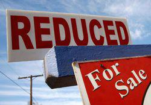

Economic downturns, recessions, and slumps are phenomena that evoke significant concern among investors and policymakers. These terms describe phases of economic decline that can drastically affect global markets and individual financial stability. Understanding the nuances of these economic states and their implications is increasingly important as the landscape of financial markets evolves with technological advancements.

In the contemporary financial ecosystem, algorithmic trading—commonly referred to as algo trading—plays a vital role. This technological innovation, which uses computer algorithms to execute trades at high speed and volume, has become a cornerstone in market operations. Its impact is especially pronounced during periods of economic instability. As economic slumps and recessions unfold, the behavior of financial markets can be significantly influenced by the activity of algorithmic trading systems.



This article scrutinizes the nature of economic slumps and the broader impacts of recessions, alongside evaluating the escalating relevance of algorithmic trading during these challenging periods. We aim to understand how modern technology not only influences market dynamics but also holds the potential to stabilize or even predict these downturns. By leveraging advancements in AI and machine learning, algorithmic trading could analyze extensive datasets to foresee emerging economic trends, thus offering a novel approach to mitigating economic risks. 

Through the integration of algorithmic trading with economic forecasting, there is potential to enhance the resilience of financial strategies. However, this intersection poses challenges, including the need to balance technological prowess with regulatory oversight and account for unpredictable human behaviors and geopolitical events. As we explore these complex interactions, the article aims to provide insights into the dual role of algorithmic trading as both a stabilizing force and a potential risk factor during economic downturns.

## Table of Contents

## What is an Economic Slump?

An economic slump refers to a period characterized by underperformance within an economy or market, often seen as a precursor to more severe economic contractions such as recessions. During a slump, there is a noticeable decline in trade volumes, market values, and general business activity. 

Key indicators that signal the onset of an economic slump include rising unemployment rates and a falling Gross Domestic Product (GDP). When unemployment increases, it suggests that businesses are reducing their workforce due to decreased demand for goods and services, which in turn reduces consumer spending power and further dampens economic activity. The decline in GDP, a measure of the total economic output, reflects an overall slowdown in economic productivity.

Slumps can be better understood through close examination of economic data trends. For instance, examining variations in the unemployment rate $u$ and GDP $Y$ over time can highlight the onset of a slump. An increasing trend in $u$ accompanied by a decreasing trend in $Y$ typically signals economic distress. A Python simulation example might display these trends through time series analysis or plotting, aiding in visualizing these dynamics.

```python
import matplotlib.pyplot as plt
import numpy as np

# Example of simulating simplified economic data for visualization
time = np.linspace(0, 10, 100)
gdp = np.exp(-0.1 * time) * 100  # Simulating a decreasing GDP
unemployment_rate = np.log(time + 1)  # Simulating an increasing unemployment rate

plt.figure(figsize=(10, 5))
plt.plot(time, gdp, label='GDP', color='blue')
plt.plot(time, unemployment_rate, label='Unemployment Rate', color='red')
plt.xlabel('Time')
plt.ylabel('Indicators')
plt.title('Simulated Economic Slump Indicators')
plt.legend()
plt.show()
```

Understanding economic slumps offers valuable insights into broader economic cycles and trends, enabling investors and policymakers to anticipate and mitigate potential adverse effects on the market. By recognizing these slumps early, stakeholders can implement measures to buffer against impending downturns, thereby safeguarding economic stability.

## Recession and Its Impact

Recessions are economic periods characterized by a sustained decline in several key economic indicators, most notably the gross domestic product (GDP). Officially, a recession is marked by two consecutive quarters of negative GDP growth. This phase of economic decline is not merely a statistical occurrence but has significant implications for employment, consumer confidence, and spending behavior.

During a recession, employment rates typically suffer as businesses scale back operations in response to decreased demand for goods and services. This leads to job losses and rising unemployment, further exacerbating the economic downturn. With fewer people employed and general uncertainty about the future, consumer confidence wanes. As a result, individuals and businesses alike reduce their spending, leading to a contraction in economic activity across various sectors.

Historical instances such as the Great Depression of the 1930s and the financial crisis of 2008 provide clear illustrations of the devastating impacts of recessions. The Great Depression, triggered by stock market crashes and a series of bank failures, resulted in widespread poverty and economic dislocation globally. Similarly, the 2008 financial crisis, fueled by collapse in the housing market and complex financial derivatives, led to a severe global recession with banking institutions requiring substantial government bailouts to stay afloat.

To mitigate the effects of recessions, policymakers deploy a range of fiscal and monetary tools. Fiscal policy measures include government spending and tax adjustments aimed at stimulating economic activity and boosting employment. On the monetary side, central banks might lower interest rates to encourage borrowing and investment. Additionally, they may implement quantitative easing to inject [liquidity](/wiki/liquidity-risk-premium) into the economy, aiming to foster an environment conducive to economic recovery. These interventions, while often effective, require careful calibration to avoid long-term inflationary pressures or unsustainable public debt levels.

## The Role of Algorithmic Trading

Algorithmic trading, often referred to as algo trading, involves the use of complex algorithms to facilitate trading decisions and execute trades with precision and speed. These algorithms process vast amounts of market data to identify profitable trading opportunities, executing trades at speeds and frequencies that are difficult for human traders to match. By relying on quantitative models, algo trading seeks to optimize trading efficiency, often targeting very small price fluctuations.

During economic slumps, when markets might experience heightened [volatility](/wiki/volatility-trading-strategies) and reduced liquidity, algo trading plays a significant role. One of its primary advantages is the ability to introduce liquidity into the markets. Liquidity refers to the ease with which assets can be bought or sold in the market without affecting their price. Algos can rapidly execute large volumes of trades, providing liquidity that might be missing from human traders who may be hesitant to participate during uncertain times. This stabilization of liquidity can, in turn, help reduce market volatility, as more participants generally lead to narrower bid-ask spreads and more predictable trading patterns.

However, the rapid execution capability of [algorithmic trading](/wiki/algorithmic-trading) is a double-edged sword. While it can stabilize markets by maintaining liquidity, it can also exacerbate market fluctuations if not properly managed. For instance, excessive reliance on high-frequency trading ([HFT](/wiki/high-frequency-trading-strategies)), which executes a large number of orders at very high speeds, can lead to situations where market reactions become too rapid, potentially triggering a cascade of automated sell-offs. This was observed during events such as the 2010 Flash Crash, where a sudden withdrawal of liquidity led to dramatic market swings within minutes.

The evolution of algo trading can be seen in its increasing sophistication and integration with [artificial intelligence](/wiki/ai-artificial-intelligence) (AI) and [machine learning](/wiki/machine-learning). Algorithms are now not only executing trades but also adapting to new patterns and learning from historical data to improve their predictive accuracy. Modern algo trading systems can assess risk in real-time, analyze unstructured data, and make informed decisions based on evolving market conditions. This adaptability is crucial during economic downturns when traditional trading strategies might falter due to unexpected market dynamics.

Despite these advancements, the implementation of algorithmic trading during economic downturns requires careful risk management strategies. Regulatory oversight and market safeguards are necessary to mitigate potential risks associated with algos' rapid and large-scale trading activities. As the role of algo trading continues to evolve, it remains vital for market participants and regulators to work together to harness its benefits while minimizing its risks, ensuring that it serves as a stabilizing force rather than a destabilizing one.

## Can Algo Trading Predict Economic Downturns?

The intersection of algorithmic trading and economic forecasting presents a significant opportunity for predicting economic downturns. Leveraging artificial intelligence (AI) and machine learning (ML), modern financial algorithms have the capability to process and analyze vast datasets. These datasets may include historical market prices, real-time economic indicators, and macroeconomic variables, aiming to identify early signals of economic instability.

To understand the mechanics, consider an algorithm designed to predict economic downturns. Such an algorithm typically employs supervised learning models, like regression analysis or neural networks, to spot patterns in data that precede past downturns. By training on historical data, the algorithm learns to identify a combination of factors indicating an upcoming slump. 

For instance, a simple linear regression model may be defined as follows:

$$

Y = \beta_0 + \beta_1 X_1 + \beta_2 X_2 + \cdots + \beta_n X_n + \epsilon 
$$

In this context, $Y$ represents the economic indicator of interest, such as GDP growth rate or unemployment rate, while $X_1, X_2, \ldots, X_n$ signify independent variables like consumer spending, interest rates, and inflation rates. The coefficients $\beta_1, \beta_2, \ldots, \beta_n$ are parameters determined during the training phase, and $\epsilon$ is the error term.

The application of AI involves more sophisticated models such as support vector machines (SVM), random forests, or [deep learning](/wiki/deep-learning) architectures, which are better equipped to handle nonlinear relationships and interactions among variables. These models can be implemented in Python using libraries like scikit-learn or TensorFlow. An example Python implementation of a random forest for predicting GDP decline may look as follows:

```python
from sklearn.model_selection import train_test_split
from sklearn.ensemble import RandomForestRegressor

# Load your dataset
# Assume X contains predictor variables and Y contains GDP growth rate
X_train, X_test, y_train, y_test = train_test_split(X, Y, test_size=0.2, random_state=42)

# Initialize and train random forest regressor
model = RandomForestRegressor(n_estimators=100, random_state=42)
model.fit(X_train, y_train)

# Predict future GDP growth
predictions = model.predict(X_test)
```

Despite the progress, there are inherent challenges in predicting economic downturns with algorithmic trading. One major issue is accounting for human behavior, which can be irrational and unpredictable during financial stress. Moreover, geopolitical events like wars or sudden regulatory changes pose significant risks to model accuracy, as they introduce variables that are difficult to quantify mathematically and are exogenous to historical data.

Nevertheless, advancements in AI technologies continue to enhance the predictive capabilities of such models. Algorithms are increasingly capable of integrating [alternative data](/wiki/best-alternative-data) sources, such as social media sentiment or satellite imagery, providing a more comprehensive view of economic conditions. This integration extends the models' predictive horizon, offering better chances for early intervention strategies that could mitigate the adverse effects of potential economic downturns. Thus, while challenges remain, the evolving landscape of AI and algorithmic trading offers promising avenues for improved economic forecasting.

## Historical Context: Lessons from the Past

The Great Depression and the Great Recession serve as pivotal case studies in understanding the dynamics of economic downturns. These significant events not only reflect the intricacies of economic contractions but also highlight the necessity of robust regulatory measures and forward-thinking policy approaches.

The Great Depression, commencing in 1929, was marked by a dramatic decline in consumer spending and investment, leading to widespread bank failures and skyrocketing unemployment rates. Key lessons from this period emphasize the critical need for government intervention and regulation. The introduction of the Glass-Steagall Act in 1933, which separated commercial and investment banking, exemplifies effective regulatory action that aimed to stabilize financial institutions and restore public confidence.

Fast forward to the 2008 financial crisis, commonly referred to as the Great Recession, the global economy faced another severe downturn, prompted by the collapse of Lehman Brothers and a burgeoning mortgage crisis. This downturn highlighted the vulnerabilities associated with financial innovations and insufficient oversight. In response, the Dodd-Frank Wall Street Reform and Consumer Protection Act was enacted in 2010, aiming to curtail the risk-taking behaviors of financial entities and enhance transparency.

A crucial aspect of these historical downturns is the evolution and integration of algorithmic trading into the financial system. Initially an emerging technology, algorithmic trading has since become a cornerstone, offering both opportunities and challenges in market stability. While algorithms can provide liquidity and facilitate rapid trades, they also [carry](/wiki/carry-trading) the potential to intensify market volatility, as evidenced in events like the 2010 Flash Crash.

The lessons from past economic crises underscore the importance of regulatory frameworks capable of adapting to technological advancements. Continuous monitoring and refinement of such frameworks are essential to safeguard against emergent financial risks. Thus, understanding the historical context of economic downturns equips policymakers and market participants with insights necessary for fostering a resilient financial system in the face of future challenges.

## The Future of Algorithmic Trading in Economic Slumps

As technology continues to evolve, algorithmic trading—often referred to as algo trading—is poised to play an increasingly pivotal role in financial markets, particularly during periods of economic distress. One of the primary ways in which algo trading may influence future economic slumps is through enhanced risk assessments and swift market responses. The ability of algorithms to process large volumes of data at speeds unattainable by human traders allows for a more granular analysis of market conditions, leading to well-informed trading decisions. This capability can contribute to market stability by mitigating potential panic sell-offs that exacerbate economic slumps.

Moreover, the integration of algo trading with artificial intelligence (AI) and advanced economic forecasting tools holds promise for developing superior risk management strategies. Using machine learning techniques, algorithms can refine their predictive accuracy by continuously learning from new data inputs and adjusting to emerging market patterns. For example, machine learning models can be implemented to identify correlations between seemingly disparate economic indicators, potentially uncovering early warning signs of downturns. Python, with its robust libraries such as TensorFlow and scikit-learn, is frequently used to develop and train these predictive models:

```python
from sklearn.model_selection import train_test_split
from sklearn.ensemble import RandomForestRegressor
import pandas as pd

# Sample code for building a predictive model for economic indicators
data = pd.read_csv('economic_data.csv')  # hypothetical dataset
X = data.drop('target_indicator', axis=1)
y = data['target_indicator']

X_train, X_test, y_train, y_test = train_test_split(X, y, test_size=0.2, random_state=42)

model = RandomForestRegressor(n_estimators=100, random_state=42)
model.fit(X_train, y_train)

predictions = model.predict(X_test)
```

This code sets the groundwork for a model that could predict economic shifts by analyzing relevant data, thereby allowing traders and policymakers to make proactive decisions to curb potential downturns.

The synergetic effect of integrating AI with algo trading also fosters advancements in economic stability, providing a buffer against the adverse effects of economic crises. By employing AI to analyze complex datasets, algorithms can identify patterns and anomalies that may signal impending economic woes, allowing traders to act preemptively. This anticipatory action can serve as a protective measure, softening the blow of economic shocks and preserving market integrity.

The future landscape of algorithmic trading is thus set to incorporate a more comprehensive risk management framework. Enhanced through AI and economic forecasting, algo trading is positioned to become an essential tool in shielding financial markets from the repercussions of economic downturns. As these technologies progress, they will inevitably form the backbone of strategies designed to navigate and mitigate the impacts of future economic slumps, ensuring greater resilience in global financial systems.

## Conclusion

Understanding economic downturns alongside the role of algorithmic trading is essential for strengthening financial strategies amidst instability. Economic downturns are inevitable, and their impacts on markets necessitate robust strategies that can not only withstand but also adapt to rapid changes. Algorithmic trading, with its advanced capability to process vast amounts of data, stands out as a modern approach that financial [agents](/wiki/agents) can harness to achieve this resilience.

Despite the promise offered by technology, certain challenges need to be addressed to maximize the potential benefits of algorithmic trading. Key among these challenges is the integration of artificial intelligence and machine learning algorithms capable of accurately predicting economic disruptions. Currently, these models face obstacles such as modeling human behavior and reacting to unforeseen geopolitical events, which complicate precise forecasting.

Furthermore, the implementation of algorithmic trading must be carefully managed to avoid exacerbating market volatility. Historical instances illustrate that while well-executed algorithmic strategies can deliver market liquidity and price stability, inadequate oversight can result in significant adverse effects. Thus, regulatory measures must evolve concurrently with technological advancements to ensure algorithms operate within established parameters that reinforce market integrity.

The path forward lies in continuing to refine algorithmic models with improved precision, adaptability, and transparency. Collaboration between technology developers, financial institutions, and regulatory entities could foster an environment where algorithmic trading becomes an invaluable part of the financial system's infrastructure. By doing so, the financial sector can better mitigate the effects of downturns and ensure more stable economic environments globally.

## References & Further Reading

[1]: Bergstra, J., Bardenet, R., Bengio, Y., & Kégl, B. (2011). ["Algorithms for Hyper-Parameter Optimization."](https://dl.acm.org/doi/10.5555/2986459.2986743) Advances in Neural Information Processing Systems 24.

[2]: ["Advances in Financial Machine Learning"](https://www.amazon.com/Advances-Financial-Machine-Learning-Marcos/dp/1119482089) by Marcos Lopez de Prado

[3]: ["Evidence-Based Technical Analysis: Applying the Scientific Method and Statistical Inference to Trading Signals"](https://www.amazon.com/Evidence-Based-Technical-Analysis-Scientific-Statistical/dp/0470008741) by David Aronson

[4]: ["Machine Learning for Algorithmic Trading"](https://github.com/stefan-jansen/machine-learning-for-trading) by Stefan Jansen

[5]: ["Quantitative Trading: How to Build Your Own Algorithmic Trading Business"](https://github.com/LucindaYa/quant-resources/blob/master/Quantitative%20Trading%20How%20to%20Build%20Your%20Own%20Algorithmic%20Trading%20Business.pdf) by Ernest P. Chan