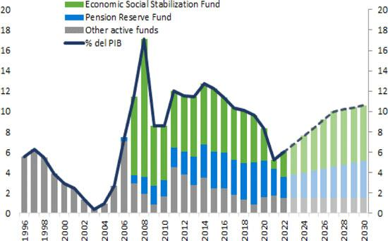

## Table of Contents

## What is the Economic and Social Stabilization Fund of Chile?

The Economic and Social Stabilization Fund of Chile, also known as the FEES (Fondo de Estabilización Económica y Social), is a savings fund set up by the Chilean government. It was created in 2007 to help manage the country's economy during times when prices of copper and other important resources go up and down. The money in the fund comes from the extra earnings the government gets when copper prices are high. This way, the government can save money for times when copper prices fall and the economy might need extra help.

The main goal of the FEES is to keep the economy stable and protect it from big changes in copper prices. When the economy is doing well, the government can put money into the fund. When the economy is struggling, they can take money out to help pay for important programs and keep things running smoothly. This helps make sure that the government can still provide services and support to people even when times are tough.

## When was the Economic and Social Stabilization Fund of Chile established?

The Economic and Social Stabilization Fund of Chile, or FEES, was set up in 2007. It was made to help manage the country's money during times when the prices of important resources like copper go up and down.

The money for the fund comes from the extra earnings the government gets when copper prices are high. This way, the government can save money for times when copper prices fall and the economy might need extra help. The main goal of the FEES is to keep the economy stable and protect it from big changes in copper prices.

## What are the main objectives of the Economic and Social Stabilization Fund?

The Economic and Social Stabilization Fund of Chile, or FEES, has a main goal to keep the country's economy stable. It does this by saving money when times are good and using that money when times are tough. The fund gets its money from extra earnings the government makes when the price of copper, a very important resource for Chile, is high. By saving this money, the government can help the economy when copper prices go down.

Another important aim of the FEES is to protect the economy from big changes in copper prices. When the economy is doing well, the government can put money into the fund. When the economy is struggling, they can take money out to help pay for important programs and keep things running smoothly. This helps make sure that the government can still provide services and support to people even when times are tough.

## How is the Economic and Social Stabilization Fund financed?

The Economic and Social Stabilization Fund of Chile, or FEES, gets its money from the extra earnings the government makes when the price of copper is high. Copper is a very important resource for Chile, and when its price goes up, the government makes more money. This extra money is saved in the FEES so it can be used later.

The main goal of saving this money is to help the economy when the price of copper goes down. When copper prices fall, the government can use the money from the FEES to pay for important programs and keep things running smoothly. This helps make sure that the government can still provide services and support to people even during tough times.

## Who manages the Economic and Social Stabilization Fund?

The Economic and Social Stabilization Fund of Chile, or FEES, is managed by the Chilean government. The Ministry of Finance is in charge of taking care of the fund. They make sure the money is saved when copper prices are high and used when prices are low.

The Ministry of Finance works with the Central Bank of Chile to manage the fund. The Central Bank helps with keeping the money safe and making sure it's used the right way. Together, they make sure the fund helps keep Chile's economy stable.

## How does the fund contribute to Chile's economic stability?

The Economic and Social Stabilization Fund, or FEES, helps keep Chile's economy stable by saving money when copper prices are high and using it when prices are low. Copper is a big part of Chile's economy, so when its price goes up, the government gets extra money. This extra money is put into the FEES. When copper prices fall, the government can take money out of the fund to help pay for important things and keep the economy running smoothly.

This way, the FEES acts like a safety net for the economy. It helps make sure that the government can still provide services and support to people, even during tough times. By saving money during good times and using it during bad times, the fund helps protect Chile's economy from big changes in copper prices, making the country's financial situation more stable.

## What role does the fund play during economic downturns?

During economic downturns, the Economic and Social Stabilization Fund, or FEES, helps Chile by giving the government money to use. When the price of copper, which is very important for Chile, goes down, the economy can struggle. But the FEES has money saved from when copper prices were high. The government can take this money out of the fund to help pay for important things like schools, hospitals, and other services that people need.

By using the money from the FEES, the government can keep the economy going even when times are tough. This helps make sure that people still have jobs and can get the help they need. The fund acts like a safety net, protecting the economy from big problems caused by low copper prices. This way, Chile can stay stable and keep moving forward, even during economic downturns.

## How has the fund been used in past economic crises?

The Economic and Social Stabilization Fund, or FEES, has been very helpful during past economic crises in Chile. One big example was during the global financial crisis in 2008 and 2009. At that time, copper prices dropped a lot, and the economy was struggling. The government used money from the FEES to help keep things running smoothly. They spent the money on important programs like building roads and bridges, and also on helping people who lost their jobs.

Another time the fund was used was during the economic slowdown caused by the COVID-19 pandemic in 2020. The world's economy was hit hard, and Chile was no different. Copper prices went down again, and many people were out of work. The government took money from the FEES to help pay for things like healthcare, unemployment benefits, and other support for people who needed it. This helped keep the economy stable and made sure people could still get the help they needed during the tough times.

## What are the current assets and investments of the fund?

The Economic and Social Stabilization Fund of Chile, or FEES, has money saved up from when copper prices were high. As of the latest data available, the fund has around $5 billion in assets. These assets are mostly in the form of money and investments that can be easily turned into cash when needed. This helps the government to use the money quickly during tough economic times.

The FEES invests its money in safe and liquid assets, like government bonds and other low-risk securities. This way, the fund can grow a little bit over time and still be ready to help the economy when needed. The goal is to keep the money safe and available, so it can be used to support important programs and services in Chile during economic downturns.

## How does the fund interact with other sovereign wealth funds in Chile?

The Economic and Social Stabilization Fund, or FEES, works together with other sovereign wealth funds in Chile to help keep the country's economy stable. One of these other funds is the Pension Reserve Fund, or FRP. The FRP saves money to help pay for pensions when the population gets older and more people need pensions. The FEES and the FRP both get money from the government when copper prices are high, but they use it for different things. The FEES uses its money to help the economy during tough times, while the FRP saves for the future.

Another important fund in Chile is the Social and Economic Stabilization Fund, or FEESE. The FEESE was set up to help pay for big projects that help the economy grow, like building roads and schools. Both the FEES and the FEESE work together to make sure the government has money to use when it's needed. The FEES can give money to the FEESE if there's a big project that needs extra funding. By working together, these funds help make sure Chile's economy stays strong and can handle tough times.

## What are the legal and regulatory frameworks governing the fund?

The Economic and Social Stabilization Fund, or FEES, is managed under the rules set by the Chilean government. These rules are part of a law called the Fiscal Responsibility Law, which was passed in 2006. This law says how the government should save money when copper prices are high and use it when prices are low. It also makes sure that the money in the FEES is used in a way that helps the whole country, not just a few people. The Ministry of Finance is in charge of following these rules and making sure the fund is used the right way.

The Central Bank of Chile also plays a big role in managing the FEES. They help keep the money safe and make sure it's invested in the right places. The Central Bank works with the Ministry of Finance to make sure the fund is always ready to help the economy when needed. Together, these rules and the work of the Ministry of Finance and the Central Bank make sure the FEES can do its job of keeping Chile's economy stable during tough times.

## What future challenges and strategies are anticipated for the Economic and Social Stabilization Fund?

The Economic and Social Stabilization Fund, or FEES, might face some challenges in the future. One big challenge could be if copper prices stay low for a long time. This would mean the government wouldn't have extra money to put into the fund. Another challenge could be if there are big changes in the world's economy that affect Chile a lot. The fund needs to be ready to help during these times, but it also needs to make sure it doesn't run out of money. Keeping the right balance between saving and spending will be important.

To deal with these challenges, the government might need to come up with new strategies. One idea could be to find other ways to make money for the fund, not just from copper. This could mean investing in other resources or industries that are growing in Chile. Another strategy could be to work more closely with other funds in Chile, like the Pension Reserve Fund and the Social and Economic Stabilization Fund. By sharing resources and planning together, they can help each other and make sure the economy stays strong. The goal is to keep the FEES ready to help the economy, no matter what happens in the future.

## References & Further Reading

[1]: Zahawi, L. et al. (2019). ["Algorithmic and High-Frequency Trading in Latin America."](https://assets.cambridge.org/97811070/91146/frontmatter/9781107091146_frontmatter.pdf) Division of Production, Productivity and Management. CEPAL Review.

[2]: Velasco, A. (2016). ["The Economic and Social Stabilization Fund of Chile."](https://www.hacienda.cl/english/work-areas/international-finance/sovereign-wealth-funds/economic-and-social-stabilization-fund) Research Gate.

[3]: "Chile's Economic and Social Stabilization Fund: A Case Study." (2014). ["IMF Fiscal Monitor."](https://www.tandfonline.com/doi/full/10.1080/14693062.2024.2441226)

[4]: Frankel, J. A. (2011). ["A Solution to Fiscal Procyclicality: The Structural Budget Institutions Pioneered by Chile."](https://www.nber.org/papers/w16945) National Bureau of Economic Research.

[5]: Arrau, P. (2018). ["How Sovereign Wealth Funds are Made: The Evolution of Chile's Copper Fund."](https://www.sciencedirect.com/science/article/pii/S1057521918308068) Panoeconomicus.