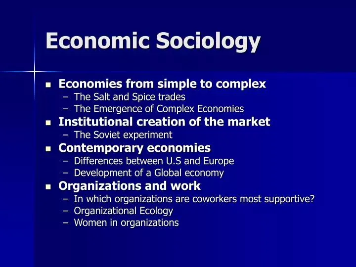

## Table of Contents

## What is economic sociology?

Economic sociology is a field that looks at how society and the economy are connected. It studies how social relationships, norms, and institutions affect economic activities like buying, selling, and working. Instead of just focusing on numbers and markets like traditional economics, economic sociology considers the human side of the economy. It asks questions like: How do people's relationships influence their economic decisions? How do social structures shape markets?

This field helps us understand that the economy isn't just about money and goods; it's also about people and their interactions. For example, economic sociology might look at how trust between people affects business deals, or how social networks help people find jobs. By studying these things, economic sociology gives us a fuller picture of how the economy really works. It shows that economic activities are deeply influenced by the social world around them.

## How does economic sociology differ from traditional economics?

Economic sociology and traditional economics look at the economy in different ways. Traditional economics focuses a lot on numbers, markets, and how people make choices based on what they want and what they can afford. It uses things like supply and demand to explain how prices are set and how markets work. Traditional economics often assumes that people always make decisions in a way that helps them the most, and it looks at the economy as something separate from other parts of life.

On the other hand, economic sociology sees the economy as being deeply connected to society. It looks at how social relationships, like friendships and family ties, affect economic activities. Economic sociology is interested in things like how trust between people can influence business deals, or how social networks help people find jobs. Instead of just focusing on markets and numbers, economic sociology tries to understand the human side of the economy and how social norms and institutions shape economic behavior.

## What are the key theories in economic sociology?

One key theory in economic sociology is the embeddedness theory, which says that economic actions are deeply connected to social relationships. Karl Polanyi, who came up with this idea, believed that the economy doesn't exist in a vacuum but is part of society. For example, when people make business deals, they often rely on trust and personal connections, not just on what's best for their wallets. This theory helps us see that economic decisions are influenced by social ties and that the economy is a social thing, not just a set of numbers and markets.

Another important theory is the network theory, which focuses on how social networks shape economic activities. This theory looks at how people's connections to others can help them get jobs, start businesses, or make deals. For instance, someone might get a job because they know someone at the company, not just because they're the most qualified. Network theory shows us that who you know can be just as important as what you know in the economic world.

A third key theory is the institutional theory, which explains how rules, laws, and organizations affect the economy. This theory says that the way the economy works is shaped by things like government policies, business practices, and cultural norms. For example, laws about minimum wage or working hours can change how businesses operate and how people work. Institutional theory helps us understand that the economy isn't just about individual choices but is also influenced by the bigger structures and rules of society.

## Who are the main contributors to the field of economic sociology?

Karl Polanyi is a big name in economic sociology. He came up with the idea of "embeddedness," which means that the economy is not separate from society but is a part of it. Polanyi believed that things like trust and personal relationships affect how people make economic choices. His book, "The Great Transformation," explains how the economy changed a lot during the Industrial Revolution and how those changes affected society. Polanyi's ideas help us see that the economy is about people and their connections, not just about money and markets.

Mark Granovetter is another important person in economic sociology. He is known for his work on social networks and how they shape the economy. Granovetter's idea of "the strength of weak ties" says that the people we don't know very well can actually help us a lot, like by giving us job leads. His research shows that who you know can be just as important as what you know when it comes to getting ahead in the economy. Granovetter's work helps us understand that social connections play a big role in economic life.

Another key figure is Max Weber. Weber looked at how social and economic structures affect each other. He studied how different religions and beliefs can shape the way people work and do business. For example, Weber's idea of the "Protestant work ethic" says that certain religious beliefs can lead people to work hard and save money, which can help the economy grow. Weber's work shows us that the economy is influenced by many parts of society, including culture and religion.

## How does economic sociology analyze the role of social networks in economic activities?

Economic sociology looks at how social networks help shape economic activities. It says that who you know can be just as important as what you know when it comes to things like getting a job or starting a business. For example, if you have a friend who works at a company, they might tell you about a job opening before anyone else knows about it. Or if you're trying to start a business, knowing people who can help you get funding or find customers can make a big difference. Economic sociologists study these connections to understand how they help people move forward in the economy.

Mark Granovetter is a big name in this area. He came up with the idea of "the strength of weak ties," which means that the people you don't know very well can actually help you a lot. For instance, your close friends might not know about new job opportunities, but someone you met at a conference might. Granovetter's work shows that these weaker connections can give you information and opportunities that your close friends can't. By studying social networks, economic sociology helps us see that the economy isn't just about money and markets—it's also about the people and relationships that make it all work.

## What is the impact of culture on economic behavior according to economic sociology?

Culture plays a big role in shaping how people act in the economy. Economic sociology says that the beliefs, values, and traditions of a society can influence how people work, save, and spend money. For example, in some cultures, it's important to save money and not spend too much, while in others, it's okay to enjoy life and spend more. These cultural norms can affect things like how much people are willing to borrow, what kinds of jobs they want, and how they negotiate business deals. Culture can also shape what people think is a fair price or a good deal, which can change how markets work.

Max Weber, a famous sociologist, talked about how culture affects the economy in his idea of the "Protestant work ethic." He said that certain religious beliefs can make people work hard and save money, which can help the economy grow. For example, if people believe that working hard is a way to show their faith, they might be more likely to start businesses or take on tough jobs. Weber's ideas show us that the economy isn't just about money and numbers—it's also about the beliefs and values that people hold. By studying how culture shapes economic behavior, economic sociology helps us understand that the economy is a part of the bigger social world.

## How does economic sociology explain the influence of institutions on economic outcomes?

Economic sociology says that institutions, like laws, rules, and organizations, have a big impact on how the economy works. These institutions set the rules for how people and businesses can act. For example, laws about minimum wages or working hours can change how businesses operate and how people work. If the government says that workers have to be paid a certain amount, businesses might have to change how much they charge for their products or how many people they hire. Institutions also include things like banks, schools, and government agencies, which can shape what people do in the economy. For instance, if a country has good schools, more people might get the skills they need to start businesses or get better jobs.

Institutions can also affect how people trust each other and work together in the economy. If there are strong laws that make sure people keep their promises, like contracts, then people might be more willing to do business with each other. This can help the economy grow because people feel safer making deals. On the other hand, if there are weak institutions, like corrupt governments or unfair laws, it can make it harder for the economy to work well. People might not want to invest or start businesses if they think the rules are unfair or that they won't be protected. So, economic sociology helps us see that institutions are a big part of how the economy turns out.

## What methods are commonly used in economic sociology research?

Economic sociology often uses qualitative methods to study how society and the economy connect. This means researchers might do interviews or spend time watching people in their everyday lives to see how they make economic choices. They might ask people about their jobs, how they spend money, or how they use their social networks to get ahead. By talking to people and seeing what they do, researchers can learn a lot about the social side of the economy. They can find out how trust, friendships, and cultural beliefs shape economic behavior, which numbers and graphs might not show.

Another common method is using surveys to gather data from a large group of people. Surveys can help researchers understand things like how people's social networks affect their job searches or how cultural values influence their spending habits. By asking lots of people the same questions, researchers can see patterns and trends that help explain how the economy works. Sometimes, economic sociologists also use quantitative methods, like analyzing big data sets, to look at things like how institutions affect economic outcomes. These methods help them see the bigger picture and understand how rules and organizations shape the economy.

## How does economic sociology approach the study of markets?

Economic sociology looks at markets in a different way than traditional economics. Instead of just seeing markets as places where people buy and sell things based on numbers like supply and demand, economic sociology sees markets as social spaces. This means that markets are not just about money and goods, but also about the people and relationships that make them work. Economic sociologists study how trust, social networks, and cultural norms shape how markets operate. For example, they might look at how people's friendships help them find good deals or how trust between buyers and sellers can make a market more successful.

Economic sociology also pays attention to how institutions, like laws and organizations, affect markets. These rules and structures set the stage for how people can buy, sell, and do business. For instance, laws about contracts can make people feel safer when they make deals, which can help markets grow. By looking at these social and institutional factors, economic sociology helps us understand that markets are more than just economic systems—they are part of the bigger social world. This approach shows us that the way markets work is deeply connected to the society around them.

## What are some contemporary issues addressed by economic sociology?

Economic sociology helps us understand many important issues today, like how the gig economy works. In the gig economy, people work as freelancers or do short-term jobs instead of having regular jobs. Economic sociology looks at how social networks help people find these gigs and how trust between workers and customers makes the gig economy possible. It also studies how laws and rules affect gig workers, like if they get benefits or not. By looking at these things, economic sociology helps us see that the gig economy isn't just about money—it's also about the social world around it.

Another big issue is how technology changes the economy. Economic sociology looks at how things like social media and online platforms shape economic activities. For example, it studies how people use social media to find jobs or start businesses. It also looks at how technology can create new markets, like online shopping, and how trust and social connections affect these new markets. By studying these things, economic sociology helps us understand that technology and the economy are deeply connected to society and the way people interact with each other.

## How does economic sociology contribute to our understanding of global economic processes?

Economic sociology helps us see that global economic processes are not just about money and trade, but also about how people and countries connect with each other. It looks at how social relationships, like trust and networks, can affect how countries do business with each other. For example, if two countries have good relationships, they might be more likely to trade with each other. Economic sociology also studies how global institutions, like the World Bank or the United Nations, set rules that shape how the world economy works. These rules can affect things like how much money countries can borrow or how they can trade with each other.

Another way economic sociology helps us understand global economic processes is by looking at how culture and values influence economic behavior around the world. Different countries have different beliefs about work, money, and fairness, which can change how they act in the global economy. For example, some cultures might value saving money more than others, which can affect how much they invest or spend. By studying these cultural differences, economic sociology shows us that the global economy is not just about numbers and markets—it's also about the people and societies that make it all work.

## What are the future directions and challenges in the field of economic sociology?

Economic sociology is likely to keep growing and changing in the future. One big direction is looking more at how technology changes the economy. As more people use things like social media and online platforms to work and shop, economic sociology will study how these technologies shape economic activities. It will look at how trust and social connections work in these new online spaces. Another direction is understanding global economic processes better. As the world becomes more connected, economic sociology will study how countries work together and how global institutions affect the economy. It will also look at how different cultures around the world shape economic behavior.

There are also challenges that economic sociology will face in the future. One challenge is keeping up with fast changes in technology and the economy. As new ways of working and buying things keep popping up, economic sociologists will need to learn quickly to understand these changes. Another challenge is making sure that research is fair and includes different groups of people. Economic sociology needs to look at how the economy affects everyone, not just certain groups. This means studying how things like race, gender, and class shape economic behavior. By facing these challenges, economic sociology can help us understand the economy better and make it work better for everyone.

## References & Further Reading

[1]: Granovetter, M. (1985). ["Economic Action and Social Structure: The Problem of Embeddedness."](https://www.jstor.org/stable/2780199) American Journal of Sociology, 91(3), 481-510.

[2]: Callon, M. (1998). ["The Laws of the Markets."](https://archive.org/details/lawsofmarkets0000unse) Blackwell Publishers.

[3]: MacKenzie, D. (2006). ["An Engine, Not a Camera: How Financial Models Shape Markets."](https://academic.oup.com/mit-press-scholarship-online/book/20588) The MIT Press.

[4]: Weber, M. (1930). ["The Protestant Ethic and the Spirit of Capitalism."](https://archive.org/details/protestantethics00webe) Scribner.

[5]: Durkheim, É. (1893). ["The Division of Labour in Society."](https://books.google.com/books/about/The_Division_of_Labor_in_Society.html?id=B955X3C-9E8C) Macmillan.

[6]: Jones, C., & Spicer, A. (2009). ["Unmasking the Entrepreneur"](https://www.e-elgar.com/shop/gbp/unmasking-the-entrepreneur-9781845426545.html). Edward Elgar Publishing.

[7]: Pasquale, F. (2015). ["The Black Box Society: The Secret Algorithms That Control Money and Information."](https://www.jstor.org/stable/j.ctt13x0hch) Harvard University Press.

[8]: Godechot, O. (2016). ["Financialization is Marketization!"](https://sociologicalscience.com/articles-v3-22-495/) Sociological Review, 64(S1), 43-55.