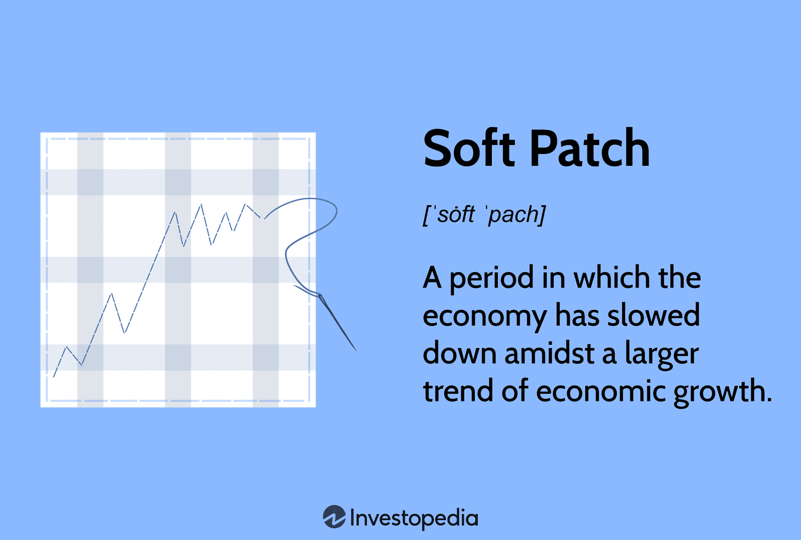

Understanding economic cycles is crucial for comprehending the fluctuations in economic activity over time. These cycles, often described as the natural ebb and flow of economic expansion and contraction, are key to grasping how economies grow and adjust. Within this framework, the terms 'economic slowdown' and 'soft patch' often surface during periods of reduced growth, indicating temporary disruptions in long-term economic expansion rather than full-scale recessions.

An 'economic slowdown' refers to a sustained reduction in economic activity, often marked by a decrease in GDP growth rates, without necessarily descending into a recession. In contrast, a 'soft patch' denotes a brief and temporary slowdown in economic growth amidst a longer trend of expansion, characterized by minimal impact on unemployment rates and other major economic indicators. Identifying these patterns is vital for economic stakeholders as it enables them to anticipate potential impacts on markets and make informed strategic decisions.



Moreover, the advent of algorithmic trading has drastically transformed how economic data is interpreted and utilized. This technology employs sophisticated algorithms to process large volumes of data at exceptional speeds, allowing investors to make real-time decisions and improve market efficiency. By analyzing trends and anomalies within economic cycles, algorithmic trading systems can swiftly adjust trading strategies to respond to changing market conditions.

Overall, this article will explore how these concepts of economic cycles, slowdowns, and algorithmic trading intersect and influence one another. Through detailed analysis, we aim to provide a clearer understanding of how these elements shape economic realities and inform investor and policymaker strategies.

## Table of Contents

## Understanding Economic Cycles

Economic cycles, often referred to as business cycles, represent the fluctuations in economic activity observed over time. These cycles are inherent to market-driven economies and consist of four principal phases: expansion, peak, recession, and recovery.

During the expansion phase, the economy experiences growth characterized by increasing employment, consumer spending, and production output. This phase is generally associated with rising gross domestic product (GDP) and improved corporate earnings, resulting in higher investment activity.

The expansion phase eventually reaches its zenith at the peak. At this juncture, the economy operates at its maximum output capacity, marked by high but stable inflation rates, optimal employment levels, and resource utilization. This stage often signals potential overheating, similar to a point of plateau, where further growth may lead to imbalances such as asset bubbles or unsustainable debt levels.

Following the peak, the economy transitions into a recession, defined by a decrease in GDP over two consecutive quarters. This phase is characterized by declining economic performance, increasing unemployment, reduced consumer confidence, and decreased spending. The recession phase can be influenced by various factors, including shifts in consumer preferences, policy adjustments, or external shocks like financial crises or geopolitical tensions. 

The final phase, recovery, signifies the economy's gradual return to growth. This recovery is marked by the stabilization of financial markets, increased consumer spending, and improved business confidence, leading to renewed investment. Policies aimed at stimulating demand often play a critical role during recovery, involving measures such as [interest rate](/wiki/interest-rate-trading-strategies) adjustments or government spending initiatives designed to encourage economic activity.

Understanding these economic cycle phases is vital for predicting future economic conditions and informing investment strategies. By analyzing economic indicators and historical data, investors and policymakers can anticipate shifts in the cycle, helping to minimize risks and seize opportunities associated with different phases. Furthermore, an understanding of economic cycles enables the formulation of effective fiscal and monetary policies, aimed at smoothing out the more extreme fluctuations for sustained economic growth. 

Mathematically, these cycles can be modeled using time series analysis techniques, which allow economists and analysts to forecast future trends based on historical data. Advanced methods such as autoregressive integrated moving average (ARIMA) models or [machine learning](/wiki/machine-learning) algorithms may be employed to enhance predictive accuracy in economic forecasting. 

By leveraging these insights, stakeholders can develop robust strategies to navigate the complexities of economic cycles, ensuring stability and growth in a constantly evolving economic landscape.

## Defining Economic Slowdown and Soft Patch

An economic slowdown represents a significant reduction in economic activity, distinct from a full recession. Typically, it is characterized by a decrease in the rate of economic growth, though it does not involve the negative growth seen in recessions. During a slowdown, indicators such as GDP growth, consumer spending, and industrial production may decline, although these metrics do not necessarily turn negative. This phase can result from various factors, including tightened monetary policy, decreased consumer confidence, or global economic disruptions. Importantly, while an economic slowdown suggests a deceleration, it does not inherently equate to economic contraction or the adverse effects associated with recessions, such as widespread unemployment or sustained declines in investments and production.

The term 'soft patch' is used to describe a temporary slowdown in economic growth during a broader, ongoing expansionary period. This phenomenon can be seen as a short-lived phase where economic growth weakens but remains positive, with eventual recovery without significant long-term impact. Soft patches might arise due to transient factors like supply chain disruptions, geopolitical events, or short-term shifts in market conditions. These factors can lead to momentary reductions in consumer spending or investments but typically do not have the sustained impact necessary to derail broader economic growth.

Identifying soft patches is crucial for investors and policymakers as it allows for strategic adjustments to mitigate potential negative impacts. For investors, recognizing a soft patch provides an opportunity to reassess and adjust portfolios to optimize risk management strategies. This might involve diversifying assets or temporarily shifting investments to sectors less affected by the slowdown. Policymakers can use these insights to tailor fiscal and monetary policies to support economic stabilization. By deploying targeted measures, such as temporary tax incentives or interest rate adjustments, governments can alleviate the effects of a soft patch, minimizing disruptions to economic activity and fostering conditions for a swift return to stronger growth.

Understanding the nuanced differences between an economic slowdown and a soft patch enables a more accurate interpretation of economic conditions, facilitating proactive decision-making. Such comprehension is crucial for both mitigating adverse outcomes during temporary slowdowns and positioning for eventual economic recovery.

## Causes and Characteristics of Soft Patches

Soft patches in an economy are typically characterized by a temporary deceleration in GDP growth that does not lead to a significant increase in unemployment rates. These phases are often indicative of transient disturbances rather than indicative of a broader economic downturn. External shocks and shifts in government policy are common catalysts for such conditions.

External shocks can include geopolitical tensions, natural disasters, or fluctuations in global commodity prices. For example, a sudden increase in oil prices can pressure manufacturing and transportation sectors, leading to subdued economic activity. Similarly, geopolitical tensions can disrupt trade routes and supply chains, resulting in temporary economic stagnation.

Changes in government policy, too, can play a significant role. Fiscal austerity measures, such as tax hikes or spending cuts, can dampen consumer and business spending. On the other hand, uncertainty regarding policy, such as anticipated regulatory changes, can lead businesses to postpone investments, contributing to a soft patch.

During soft patches, while GDP growth may slow, the labor market often remains relatively stable. This stability is because companies, viewing the slowdown as temporary, often choose to retain workers, avoiding the costs and disruptions associated with layoffs.

Identifying the causes of a soft patch is crucial in determining its likely duration and severity. Policymakers and investors analyze whether such economic slowdowns are primarily due to external, temporary factors or more sustained issues requiring intervention. Such analysis aids in addressing potential long-term impacts through policy adjustments and strategic investments. Understanding these dynamics enables stakeholders to prepare for rebounds without significant policy shifts or market panic.

## Algorithmic Trading in Economic Cycles

Algorithmic trading, often referred to as algo trading, utilizes computer algorithms to execute trades at speeds and frequencies that are impossible for human traders. This type of trading relies heavily on analyzing large sets of data and implementing rapid trading decisions based on predefined criteria. During economic cycles, particularly in periods of economic slowdown, the role of [algorithmic trading](/wiki/algorithmic-trading) takes on heightened importance as it influences market [liquidity](/wiki/liquidity-risk-premium) and stability.

In the context of economic cycles, algorithmic trading systems are programmed to respond to economic data updates swiftly. These systems assess a multitude of indicators, such as GDP growth rates, unemployment figures, and inflation metrics, to adjust trading strategies accordingly. For instance, in the face of economic slowdown, algorithms might lower their exposure to risky assets or increase the frequency of trades to take advantage of short-term market inefficiencies.

Algorithmic trading affects market liquidity, which refers to the ease with which assets can be bought or sold without causing significant price changes. During periods of economic uncertainty, algo trading can have a stabilizing effect by providing liquidity, as algorithms are capable of executing large volumes of trades quickly. This liquidity can help mitigate some of the [volatility](/wiki/volatility-trading-strategies) that often accompanies economic slowdowns. However, it is important to note that the same ability to execute trades at high speed can also exacerbate volatility under certain conditions, such as in reaction to unexpected economic announcements.

An analysis of algorithmic trading's impact on market stability during economic fluctuations reveals both potential benefits and risks. On one hand, algo trading can enhance market efficiency by narrowing bid-ask spreads and increasing the speed of price discovery. On the other hand, it can lead to increased market volatility, particularly if algorithms across different trading entities are programmed to act on similar signals, resulting in cascading effects.

Moreover, algorithmic trading strategies, such as pairs trading, [momentum](/wiki/momentum) trading, or [arbitrage](/wiki/arbitrage), are adjusted during economic slowdowns to reflect the altered market dynamics. For example, an algorithm utilizing momentum trading might reduce trade [volume](/wiki/volume-trading-strategy) or modify entry and [exit](/wiki/exit-strategy) points to align with decreased market activity levels.

To capture the essence of these trading strategies, a basic pseudocode could look like this:

```python
def economic_slowdown_adjustment(market_data):
    # Example of adjusting trading strategy during slowdown
    for data_point in market_data:
        if data_point['economic_indicator'] < threshold_value:
            # Adjust trade frequency and volume
            trade_frequency *= 0.9
            trade_volume *= 0.8
    return trade_frequency, trade_volume
```

Evaluating algorithmic trading's role within economic cycles helps investors and policymakers understand its contribution to market dynamics. In doing so, they can better anticipate the behavior of financial markets during economic transitions and devise strategies to harness its advantages while mitigating adverse impacts. This understanding is crucial for ensuring that algo trading remains a stabilizing [factor](/wiki/factor-investing) rather than a catalyst for increased market volatility.

## Implications for Investors and Policymakers

Investors play a crucial role in navigating economic cycles, and understanding the nuances of soft patches offers vital insights for portfolio management and risk optimization. A soft patch, defined as a transient slowdown within an overall growth period, provides investors with the opportunity to recalibrate their strategies. By identifying these temporary dips, they can fine-tune asset allocations to minimize risk exposure and leverage potential buying opportunities when asset prices are potentially undervalued.

Algorithmic trading further complicates these dynamics, as algorithms rapidly react to market signals and economic data. This can lead to increased market volatility, especially during soft patches when economic indicators may provide mixed signals. Investors must, therefore, consider the implications of algorithmic trading mechanisms and how they might amplify or dampen market movements. For instance, the use of algorithms that follow momentum-based strategies might exacerbate market trends during a soft patch, potentially impacting asset valuations.

For policymakers, understanding economic cycles is essential for the formulation of prudent fiscal and monetary policies. Economic cycle analysis allows for strategic interventions aimed at stabilizing the economy. During soft patches, policymakers might choose to implement measures such as adjusting interest rates or introducing fiscal stimuli to boost economic activity. These actions require a profound understanding of current economic conditions and the potential lag effects of policy implementation. For instance, reducing interest rates could spur investment and consumption, aiding in faster recovery from a soft patch.

The interaction between algorithmic trading and economic policymaking also demands attention. Policymakers must recognize the role of algorithmic trades in amplifying cycles and consider regulatory measures to mitigate excessive market volatility. This involves regulatory oversight to ensure fair trading practices and prevent systemic risks associated with high-frequency trading, particularly during periods where market sentiment is fragile.

In summary, both investors and policymakers benefit from a deep understanding of economic cycles and soft patches, with algorithmic trading introducing additional variables that necessitate careful analysis. A strategic approach to these elements can optimize investment decisions and enhance economic policy efficacy, ultimately contributing to more stable economic conditions.

## Case Studies and Historical Context

Analyzing historical economic slowdowns and soft patches offers essential insights for understanding the potential dynamics of current and future economic cycles. By examining the patterns and causes of these periods, investors and policymakers can enhance their decision-making processes.

One prominent example of an economic slowdown with measurable soft patches is the Global Financial Crisis of 2007-2008. This period was marked by a severe contraction in economic activity worldwide. Initially, signs of a slowdown were evident in the U.S. housing market, where inflated housing prices, coupled with high-risk mortgage lending practices, led to a significant drop in housing values. The subsequent failure of Lehman Brothers in September 2008 symbolized a broader financial collapse, leading to a global recession. During this time, central banks worldwide, including the Federal Reserve, implemented aggressive monetary policies such as quantitative easing to stabilize the financial system and stimulate economic recovery.

The European Debt Crisis that followed in the early 2010s illustrates a soft patch within the broader post-crisis recovery. Triggered by excessive sovereign debt levels in several Eurozone countries, notably Greece, Ireland, and Portugal, this phase was marked by concerns over fiscal sustainability. The economic impact was seen in slower GDP growth rates across the continent and rising unemployment in affected nations. Nevertheless, targeted interventions by the European Central Bank, including measures like the Outright Monetary Transactions program, helped to alleviate market tensions and supported gradual recovery.

Another noteworthy example is the Japanese Lost Decade, which actually extended beyond a single decade, beginning in the early 1990s. This period highlighted a prolonged economic slowdown characterized by stagnation and deflation, primarily attributed to the burst of a speculative asset price bubble. Japanese policymakers' responses included attempts at monetary easing and fiscal stimulus, such as infrastructure spending. However, these efforts were met with mixed success, as structural issues like aging demographics and difficulties in implementing economic reforms persisted.

In recent times, the COVID-19 pandemic represents a unique case of an abrupt global economic slowdown, with varying soft patches as nations experienced waves of infection. The initial shock in 2020 led to significant contractions in global GDP due to lockdown measures and disruptions in supply chains. The recovery has been inconsistent, marked by soft patches influenced by vaccine distribution disparities, fiscal stimulus effectiveness, and ongoing supply chain challenges. Policymakers have had to adapt swiftly, balancing public health considerations with economic stabilization efforts.

These historical examples highlight patterns where initial external shocks, policy responses, and structural economic conditions dictate the trajectory and recovery from slowdowns and soft patches. Understanding these patterns assists in anticipating potential challenges and crafting strategic responses, ensuring resilient economic planning for both investors and policymakers in the face of future cycles.

## Conclusion and Takeaways

Economic cycles, slowdowns, and soft patches require careful analysis and understanding to facilitate effective economic planning. These phenomena underscore the dynamic nature of economies, which operate through repetitive patterns of growth and contraction. Recognizing the phases of these cycles enables investors and policymakers to anticipate potential changes in the economic environment and adjust their strategies accordingly.

Algorithmic trading has added a layer of complexity to economic analysis by significantly influencing market dynamics. This technology uses advanced algorithms to process large volumes of data quickly, assess economic indicators, and execute trades at speeds outperforming human capability. While it enhances market efficiency and liquidity, algorithmic trading can also contribute to increased volatility, particularly during periods of economic uncertainty. Algorithms are designed to respond to specific market conditions, and their collective actions can amplify market movements, thus necessitating robust risk management.

For investors and policymakers, a nuanced understanding of economic cycles and their interaction with algorithmic trading is essential. Investors can use insights from economic cycle analysis to optimize their portfolios, ensuring they are resilient to market swings. For example, diversifying investments and utilizing hedging strategies can mitigate risks associated with soft patches or downturns. Similarly, policymakers can tailor fiscal and monetary policies to smooth out economic fluctuations, aiming to stabilize growth and maintain employment levels. They must also consider the regulatory implications of algorithmic trading to prevent systemic risks and ensure market integrity.

The clarity and foresight gained from studying economic cycles, slowdowns, and the impact of algorithmic trading equip stakeholders with the tools necessary to navigate economic challenges. By integrating data-driven insights into their strategies, both investors and policymakers can make informed decisions, thus enhancing economic resilience and fostering sustainable long-term growth.

## References & Further Reading

[1]: ["Business Cycles: History, Theory, and Investment Reality"](https://www.amazon.com/Business-Cycles-History-Investment-Reality/dp/0470018062) by Victor Zarnowitz

[2]: ["The Secrets of Economic Indicators: Hidden Clues to Future Economic Trends and Investment Opportunities"](https://www.amazon.com/Secrets-Economic-Indicators-Investment-Opportunities/dp/0132932075) by Bernard Baumohl

[3]: Forman, J. L., & Argyris, Y. (2000). ["Understanding Business Cycles"](https://infed.org/mobi/chris-argyris-theories-of-action-double-loop-learning-and-organizational-learning/). - National Bureau of Economic Research

[4]: Issing, O. (2003). ["Monetary and Fiscal Policy Interactions in a Monetary Union"](https://www.bis.org/review/r030331f.pdf). European Central Bank.

[5]: Aldridge, I. (2013). ["High-Frequency Trading: A Practical Guide to Algorithmic Strategies and Trading Systems"](https://www.amazon.com/High-Frequency-Trading-Practical-Algorithmic-Strategies/dp/1118343506) by Irene Aldridge