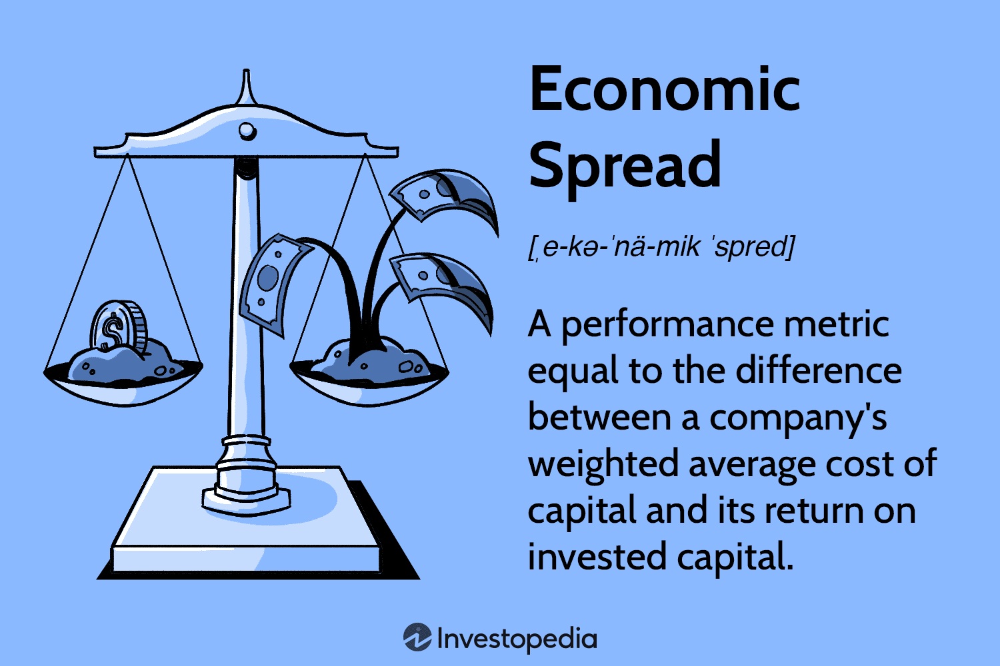

In today's rapidly evolving financial landscape, understanding key investment strategies is crucial for both novice and seasoned investors. As markets become increasingly complex, driven by globalization and technological advancements, investors must equip themselves with knowledge and tools that enhance their decision-making processes. This article focuses on several essential components, including economic spreads, financial terms, and algorithmic trading, to provide a comprehensive guide for optimizing trading strategies.

Economic spreads serve as a critical metric for evaluating a company's financial performance. By comparing the Return on Invested Capital (ROIC) with the Weighted Average Cost of Capital (WACC), investors can gain insights into how effectively a company utilizes its capital. A positive economic spread indicates that a company is generating returns greater than its cost of capital, signifying efficient capital use. Conversely, a negative spread suggests inefficiencies, pointing to areas that require strategic adjustments.



In addition to grasping economic spreads, a solid understanding of financial terms is foundational for making informed investment decisions. Concepts such as ROIC, WACC, and inflation are integral to assessing investment profitability and risk. Familiarity with these terms enables investors to evaluate potential returns and make choices aligned with their financial goals.

Algorithmic trading introduces another layer of sophistication to modern markets. By employing computer algorithms, traders can execute orders based on predefined criteria, surpassing human capabilities in speed and efficiency. This method is particularly useful for managing large volumes of transactions and capitalizing on fleeting market opportunities.

By examining these components, investors will be better equipped to navigate the financial markets, optimize their trading strategies, and achieve greater success in their investment endeavors.

## Table of Contents

## Understanding Economic Spread

Economic spread serves as a pivotal metric for assessing a company's financial performance. It is calculated by subtracting the Weighted Average Cost of Capital (WACC) from the Return on Invested Capital (ROIC). Formally, it is defined as:

$$
\text{Economic Spread} = \text{ROIC} - \text{WACC}
$$

ROIC measures the efficiency with which a company generates returns on the capital it has invested in its operations. It is calculated as:

$$
\text{ROIC} = \frac{\text{Net Operating Profit After Taxes (NOPAT)}}{\text{Invested Capital}}
$$

On the other hand, WACC represents the average rate of return a company is expected to pay its security holders to finance its assets. It is a composite cost accounting for the cost of equity and the cost of debt, based on the proportion of each within the company's capital structure.

A positive economic spread indicates that the company's ROIC exceeds its WACC, suggesting that the company is generating value beyond the baseline cost of its capital. This situation is indicative of efficient capital allocation and profitability, which investors typically view favorably as it signifies potential for sustainable growth and higher shareholder value.

Conversely, a negative economic spread occurs when the ROIC is less than the WACC, pointing to an inefficiency where the company's capital fails to yield returns that surpass the costs incurred to secure it. This scenario typically prompts investors and company management to reconsider current operational strategies or capital structure adjustments to address these inefficiencies.

Understanding economic spread is crucial for both strategic decision-making and investment evaluation. It allows investors to discern whether a company is operating efficiently and effectively, ultimately serving as a key indicator of a company's financial health and long-term viability. Strategies to improve economic spread might include optimizing operational processes, enhancing revenue generation, or restructuring capital investments to achieve a more favorable cost balance.

## Utilizing Financial Terms for Informed Investments

Understanding financial terms is foundational for making informed investment decisions. Among these, Return on Invested Capital (ROIC), Weighted Average Cost of Capital (WACC), and inflation are critical in evaluating investment potential and risk.

**Return on Invested Capital (ROIC)** is a measure of a company's efficiency in allocating its capital to generate returns. Calculated as:

$$

\text{ROIC} = \frac{\text{Net Operating Profit After Tax (NOPAT)}}{\text{Invested Capital}} 
$$

ROIC provides insight into how well a company is generating profit relative to the capital employed. A higher ROIC indicates effective management and a profitable investment.

**Weighted Average Cost of Capital (WACC)** is the average rate of return a company is expected to pay its security holders to finance its assets. It reflects the cost of equity and debt, weighted by their respective use in the capital structure. The formula is:

$$

\text{WACC} = \left( \frac{E}{V} \times \text{Re} \right) + \left( \frac{D}{V} \times \text{Rd} \times (1 - T) \right) 
$$

Where:
- $E$ is the market value of equity,
- $D$ is the market value of debt,
- $V$ is $E + D$,
- $\text{Re}$ is the cost of equity,
- $\text{Rd}$ is the cost of debt,
- $T$ is the tax rate.

WACC serves as a hurdle rate for investment decisions; an investment is generally considered if the ROIC exceeds the WACC, indicating that the generated returns surpass the cost of capital.

**Inflation** impacts real returns on investment. It measures the rate at which the general price level of goods and services rises, eroding purchasing power. For accurate investment assessment, it is crucial to adjust nominal returns to real terms using:

$$

\text{Real Return} = \frac{1 + \text{Nominal Return}}{1 + \text{Inflation Rate}} - 1 
$$

Understanding these financial terms allows investors to assess potential investments thoroughly. By comparing ROIC and WACC, investors can determine whether a company generates value over its cost of capital. Additionally, accounting for inflation ensures that investors measure true profitability. These steps are critical in developing robust investment strategies that optimize risk and reward profiles.

## The Role of Algorithmic Trading in Modern Markets

Algorithmic trading employs computer algorithms to automate the trading process, executing trades at speeds and efficiencies that surpass human capabilities. This advanced trading method harnesses predefined criteria, enabling traders to implement strategies based on complex mathematical models and statistical analyses, avoiding the emotional biases typically associated with human trade execution.

A significant advantage of [algorithmic trading](/wiki/algorithmic-trading) is its ability to process and analyze vast datasets in real time, identifying trading opportunities that might elude manual methods. Algorithms can quickly scan various criteria, including price, [volume](/wiki/volume-trading-strategy), timing, and more intricate patterns, to initiate trades without delay. This speed is particularly beneficial in modern financial markets, where conditions can shift rapidly, and opportunities are fleeting.

Among the myriad strategies employed in algorithmic trading, some of the most prevalent include statistical [arbitrage](/wiki/arbitrage), pairs trading, and high-frequency trading. Statistical arbitrage leverages quantitative models to identify and exploit pricing inefficiencies between related securities. Pairs trading involves going long on one asset while shorting another, ideally offsetting risk while profiting from relative price changes. High-frequency trading ([HFT](/wiki/high-frequency-trading-strategies)) seeks to capture small price discrepancies through ultra-fast execution and short holding periods, often in fractions of a second.

An example of a simple algorithmic trading strategy is moving average crossover. This strategy involves two moving averages: a short-term and a long-term. A buy signal is triggered when the short-term average crosses above the long-term average, while a sell signal is generated when the reverse happens. The simplicity of the algorithm can be translated into Python code as follows:

```python
import numpy as np
import pandas as pd

# Simulated price data
data = pd.DataFrame({'Price': [100 + i*np.random.randn() for i in range(1, 201)]})

# Moving average windows
short_window = 40
long_window = 100

# Initialize signals DataFrame
signals = pd.DataFrame(index=data.index)
signals['signal'] = 0.0

# Create short simple moving average (SMA)
signals['short_mavg'] = data['Price'].rolling(window=short_window, min_periods=1, center=False).mean()

# Create long simple moving average (SMA)
signals['long_mavg'] = data['Price'].rolling(window=long_window, min_periods=1, center=False).mean()

# Create signals
signals['signal'][short_window:] = np.where(signals['short_mavg'][short_window:] > signals['long_mavg'][short_window:], 1.0, 0.0)   

# Generate trading orders
signals['positions'] = signals['signal'].diff()
```

Algorithmic trading is prevalent in contemporary markets, contributing significantly to trading volumes, especially in highly liquid markets like [forex](/wiki/forex-system), equities, and futures. Despite its advantages, algorithmic trading is not without risks. These include technology failures, erroneous algorithms causing financial loss, and market impact where large trades may lead to adverse price movements.

In conclusion, algorithmic trading's ability to systematically execute trades with precision and minimal latency makes it indispensable in modern financial markets. By leveraging sophisticated algorithms, traders can capitalize on opportunities faster and more efficiently than traditional methods permit, albeit with a necessary recognition of the accompanying risks and challenges.

## Types of Algorithmic Trading Strategies

Algorithmic trading strategies have become integral to modern financial markets, offering investors and firms the ability to automate trading processes and capitalize on efficient execution. Among the most prevalent strategies are [trend following](/wiki/trend-following), mean reversion, and [market making](/wiki/market-making), each catering to distinct market conditions and objectives.

### Trend Following

Trend following strategies are based on the principle that financial instruments, including stocks, commodities, or currencies, will continue to move in the direction of an established trend. These strategies typically utilize technical analysis to identify these trends and determine entry and [exit](/wiki/exit-strategy) points. Key indicators used include moving averages, [momentum](/wiki/momentum) indicators, and support and resistance levels. A simple Python implementation of a trend following strategy using moving averages could look like this:

```python
import pandas as pd
import numpy as np

# Assuming df is a DataFrame with a 'Close' column
df['SMA_50'] = df['Close'].rolling(window=50).mean()
df['SMA_200'] = df['Close'].rolling(window=200).mean()

df['Signal'] = np.where(df['SMA_50'] > df['SMA_200'], 1, 0)  # Buy signal
df['Position'] = df['Signal'].diff()  # 1 means buy, -1 means sell

```

This code identifies a buy signal when the 50-day simple moving average (SMA) crosses above the 200-day SMA, implying an upward trend.

### Mean Reversion

Mean reversion strategies are predicated on the idea that prices will revert to their historical averages over time. When a security's price diverges significantly from its average, the strategy anticipates a reversal. This approach often uses statistical measures and indicators like the Bollinger Bands or the Relative Strength Index (RSI) to identify potential reversion points. The Z-score is a common statistical tool used to determine how far a price has deviated from its mean:

$$
Z = \frac{(X - \mu)}{\sigma}
$$

Where $X$ is the current price, $\mu$ is the mean, and $\sigma$ is the standard deviation.

### Market Making

Market making strategies involve providing [liquidity](/wiki/liquidity-risk-premium) to markets by simultaneously offering buy and sell quotes and profiting from the bid-ask spread. These strategies are characterized by high-frequency trading and are crucial for maintaining market efficiency. Market makers must constantly adjust their quotes based on market conditions, inventory risks, and competitive behavior. A C++ implementation of a simple market making strategy might focus on maintaining a balanced book, frequently updating bid and ask prices in response to market changes, although such implementations are typically complex and highly optimized for speed.

Each of these algorithmic trading strategies exploits different market dynamics, making them suitable for varying objectives. Trend following favors extended market movements, mean reversion capitalizes on short-term price corrections, and market making benefits from capturing the bid-ask spread while enhancing market liquidity. Understanding and selecting the appropriate strategy requires a comprehensive analysis of market conditions, asset class behavior, and investor goals.

## Implementing Spread Trading in Algorithmic Trading

Spread trading is an investment strategy that involves taking advantage of price discrepancies between related financial instruments. This technique is commonly used in the trading of equities, commodities, currencies, and [interest rate](/wiki/interest-rate-trading-strategies) derivatives. By simultaneously buying and selling two correlated assets, traders aim to profit from the spread, or the price difference, between them.

With the advent of technology, spread trading has been significantly enhanced by algorithmic trading, which utilizes computer algorithms to automate the execution of trades. This automation offers several advantages, including increased speed, precision, and the ability to handle large volumes of data, which can improve both execution and risk management.

### Automation and Execution Enhancement

Algorithmic trading systems can execute trades at a velocity that surpasses human capabilities. By employing algorithms, traders can seamlessly monitor multiple markets, identify price discrepancies, and execute trades in real-time. This level of automation is crucial for capturing the small, often fleeting profit opportunities typical in spread trading.

For instance, pairs trading, a common form of spread trading, involves identifying two stocks with historical price correlations. An algorithm can continuously track these stocks and execute trades as soon as a divergence from their typical spread occurs, betting on their eventual convergence. A simple Python implementation for pairs trading is:

```python
import numpy as np
import pandas as pd
from statsmodels.tsa.stattools import coint

def zscore(series):
    return (series - series.mean()) / np.std(series)

# Assume a and b are time series of stock prices
def pairs_trading_strategy(a, b):
    score, pvalue, _ = coint(a, b)
    if pvalue < 0.05:  # Significance level
        spread = a - b
        z_spread = zscore(spread)

        if z_spread[-1] > 2:
            # Current price is high compared to historical spread
            print("Sell a, Buy b")
        elif z_spread[-1] < -2:
            # Current price is low compared to historical spread
            print("Buy a, Sell b")

```

### Risk Management

The use of algorithmic trading in spread trading also enhances risk management. Algorithms can be programmed to include stop-loss orders, manage leverage, and diversify spreads across different asset classes. This automation reduces human error and emotional decision-making, which can be detrimental to trading success.

Moreover, algorithms can quickly adjust to changing market conditions, either by re-calibrating the spread threshold for executing trades or by dynamically allocating more or less capital to the strategy. This adaptability is crucial, especially in volatile markets, where price discrepancies can widen unexpectedly.

In summary, the integration of spread trading with algorithmic processes provides a robust framework for optimizing trade execution and risk management. By leveraging technological advancements, traders can efficiently harness market inefficiencies and enhance their return profiles while mitigating potential risks.

## Risks and Profitability in Spread Trading

Spread trading, a strategy focused on leveraging price discrepancies between related financial instruments, offers substantial opportunities for profit. However, it also involves significant risks that must be managed effectively to ensure successful outcomes.

### Market Volatility
One of the primary risks in spread trading is market [volatility](/wiki/volatility-trading-strategies). When the pricing relationship between two assets becomes unpredictable, the spread can widen or narrow unexpectedly, potentially leading to losses. Volatility is influenced by numerous factors, including geopolitical events, economic announcements, or sudden changes in market sentiment. Thus, traders must constantly evaluate the volatility environment when engaging in spread trading.

### Leverage Risks
Spread trading often involves the use of leverage, which magnifies both potential gains and losses. While leverage can significantly increase profits, it also poses a risk of margin calls and substantial losses when the market moves unfavorably. To manage this risk, traders should employ prudent leverage ratios and maintain adequate margin levels to buffer against adverse market movements. 

### Risk Management Strategies
Proper risk management is vital to combating these risks. Key strategies include setting stop-loss orders to automatically close a trade at a predetermined price, limiting potential losses. Additionally, traders can diversify their spread positions across various sectors or asset classes to spread risk. Employing rigorous analytical methods to assess potential trades and simulate market conditions will also help in making informed decisions.

### Disciplined Execution
Successful spread trading requires disciplined execution of strategies. This involves adhering to predetermined trading plans and avoiding impulsive decisions driven by emotions. Traders should establish clear entry and exit points, regularly review their trading performance, and adjust strategies as necessary. Consistency in execution helps in optimizing profits while minimizing risk.

The balance between risk and profitability in spread trading requires a nuanced understanding of market dynamics and a commitment to systematic risk management practices. By actively managing these factors, traders can enhance the potential for profitability while safeguarding their capital against significant downside risks.

## The Future of Investment Strategies

The integration of technology within financial markets is poised to redefine the landscape of investment strategies, offering investors a plethora of sophisticated tools. As computational power increases and data analytics become more advanced, traders and investors are equipped to make more informed decisions at speeds previously unattainable. Technologies such as Artificial Intelligence (AI) and Machine Learning (ML) are at the forefront, enabling the processing of vast datasets to identify patterns and trends that are not immediately apparent to human analysts.

Blockchain technology is another significant advancement, providing transparent and tamper-proof transaction records, thus ensuring high levels of security and reducing the risks associated with fraud. Smart contracts, automated contracts with the terms of the agreement directly written into code, enable seamless transactions and are increasingly used in various facets of the financial sphere.

Quantitative investing and algorithmic trading strategies continue to grow as technology allows for the implementation of complex mathematical models and strategies. These methods leverage statistical analysis to inform trading decisions, with Python being a favored language due to its extensive libraries, such as NumPy for numerical computations and pandas for data manipulation.

```python
import pandas as pd
import numpy as np

# Example of simple moving average trading strategy
def simple_moving_average(data, window=50):
    data['SMA'] = data['Close'].rolling(window=window).mean()
    data['Signal'] = 0
    data['Signal'][window:] = np.where(data['Close'][window:] > data['SMA'][window:], 1, -1)
    return data

# Load data
data = pd.read_csv('market_data.csv')

# Apply strategy
strategy_data = simple_moving_average(data)
```

Rising automation and high-speed trading platforms are minimizing latency and enhancing trade execution, giving rise to new forms of trading such as high-frequency trading (HFT), where fractions of a second can determine trade success.

To effectively navigate these dynamic market environments, investors must remain informed and adaptable. The exponential growth of financial technologies necessitates continuous learning and flexibility in strategy application. Future-focused investors might consider integrating these technological advancements into their decision-making processes to optimize outcomes and maintain a competitive edge. The key lies in balancing technology with human insight, as intuition and experience still play crucial roles in areas where technology falls short. By embracing both innovation and traditional skills, investors can navigate the complexities of future market dynamics successfully.

## Conclusion

Investment strategies such as economic spread analysis and algorithmic trading stand as influential tools within the financial market, capable of significantly optimizing investment outcomes when applied effectively. Economic spread analysis, which evaluates financial performance through the comparison of a company's Return on Invested Capital (ROIC) and its Weighted Average Cost of Capital (WACC), serves as a crucial indicator of a firm's capital efficiency. By identifying a positive economic spread, investors can deduce that a company is utilizing its capital proficiently, thereby indicating potential for favorable investment returns. Conversely, a negative spread signals inefficiencies, urging a reevaluation of investment propositions associated with the firm.

In conjunction with economic spread analysis, algorithmic trading brings precision and speed to trading activities, surpassing human capabilities through the automation of trade execution based on sophisticated algorithms. The effectiveness of algorithmic trading is contingent upon a thorough understanding of trading strategies such as trend following, mean reversion, and spread trading, as well as the ability to implement these through programming languages like Python. Here is an illustrative example snippet in Python for implementing a simple moving average strategy:

```python
def simple_moving_average(prices, window_size):
    return [sum(prices[i:i+window_size])/window_size for i in range(len(prices)-window_size+1)]

data = [10, 20, 30, 40, 50, 60, 70, 80, 90, 100]
sma = simple_moving_average(data, 3)
print(sma)
```

The blend of qualitative evaluations from economic spread analysis with the quantitative rigor of algorithmic trading ensures a more comprehensive approach to investment. However, the integration of these components necessitates a firm grounding in financial terms and principles. Concepts like ROIC, WACC, and inflation are pivotal in making informed decisions and assessing the risk and profitability of investments. Possessing a robust understanding of these terms empowers investors to navigate the complexities of modern financial markets effectively.

In conclusion, harmonizing economic spread analysis and algorithmic trading within an investment strategy, supported by a profound comprehension of financial terminology, can augment the decision-making process. As the financial landscape continues to evolve with technological advancements, leveraging these strategies will be indispensable for maximizing returns and sustaining competitive advantage in trading endeavors.

## References & Further Reading

1. **Books and Publications**:
   - *"Algorithmic Trading" by Ernie Chan*: This book provides a practical framework for implementing algorithmic trading systems, covering various strategies like mean reversion and statistical arbitrage.
   - *"Options, Futures, and Other Derivatives" by John C. Hull*: A comprehensive guide on derivatives markets and trading strategies, essential for understanding risk management and investment strategies.

2. **Academic Journals**:
   - The *Journal of Finance* and the *Review of Financial Studies* regularly publish cutting-edge research on financial markets, including studies on algorithmic trading and economic spreads.
   - *Quantitative Finance* is a specialized journal focusing on the rapid development of quantitative techniques in finance, ideal for exploring mathematical models and their applications in trading.

3. **Online Resources**:
   - *Investopedia*: An excellent resource for learning financial terms and concepts such as ROIC, WACC, and different types of spread trading.
   - *Khan Academy* offers free courses on economics and finance, which are beneficial for grasping the foundational elements of investment strategies.

4. **Industry Reports and White Papers**:
   - Many investment banks and financial institutions publish reports discussing market trends, algorithmic trading advancements, and risk management practices. Websites like *Goldman Sachs Insights* and *JP Morgan Research* provide valuable content.
   - The *World Economic Forum* frequently releases white papers on the future of financial markets and technology integration.

5. **Programming and Algorithm Development**:
   - Python Libraries such as *Pandas*, *NumPy*, and *SciPy* are pivotal for analyzing financial data and developing algorithmic trading models. Documentation and tutorial sites like *Real Python* and *DataCamp* are useful for beginners and advanced users alike.
   - *GitHub* repositories often contain open-source algorithmic trading systems which can serve as learning tools or starting points for developing your own strategies.

6. **Conferences and Webinars**:
   - Events like the *QuantCon* and *Algorithmic Trading Conference* bring together industry experts, offering deep insights into the latest trends and innovative strategies in algorithmic trading.

By leveraging these resources, investors and traders can deepen their understanding of complex financial markets, enhance their trading strategies, and stay ahead in the rapidly evolving landscape of algorithmic and spread trading.

