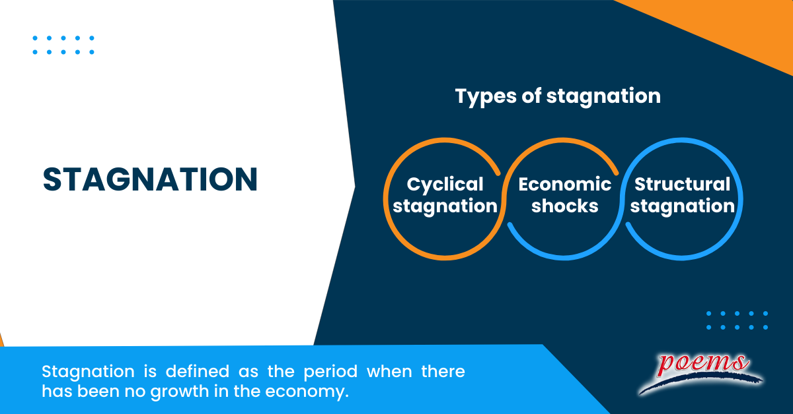

## Table of Contents

## What is economic stagnation?

Economic stagnation is when an economy stops growing or grows very slowly for a long time. This means that businesses are not making more money, people are not earning more, and the overall wealth of a country does not increase much. It can happen for many reasons, like when there are not enough new ideas or technologies to help businesses grow, or when people are not spending enough money.

When an economy stagnates, it can be hard for people to find good jobs or get raises. This can make people feel unhappy and less hopeful about the future. Governments often try to fix stagnation by making new laws or spending more money to help businesses and people. But sometimes, these efforts do not work quickly, and the stagnation can last for years.

## What are the main causes of economic stagnation?

Economic stagnation can happen for many reasons. One big reason is when there are not enough new ideas or technologies to help businesses grow. When businesses can't find new ways to make things better or cheaper, they don't make more money, and the economy slows down. Another reason is when people don't spend enough money. If people are worried about their jobs or the future, they might save their money instead of buying things. When people don't buy things, businesses don't make as much money, and the economy can stagnate.

Another cause of economic stagnation is when a country's population gets older. Older people often don't work as much and spend less money than younger people. This can slow down the economy because there are fewer people working and buying things. Also, if a country depends a lot on selling things to other countries, and those countries start buying less, it can cause stagnation. For example, if a country sells a lot of cars and suddenly other countries stop buying them, the car-making businesses will struggle, and the economy might stagnate.

Governments can also play a role in causing economic stagnation. If the government makes too many rules or taxes businesses too much, it can be hard for businesses to grow. Sometimes, governments spend too much money and borrow a lot, which can make people and businesses worried about the future. This worry can make people spend less money and businesses invest less, leading to stagnation. So, economic stagnation can come from not having enough new ideas, people not spending enough, an aging population, less demand from other countries, and government policies that make it hard for businesses to grow.

## How can economic stagnation be identified in a country?

You can tell if a country is facing economic stagnation by looking at how much the economy is growing. If the economy is not growing or growing very slowly for a long time, that's a sign of stagnation. You can check this by looking at the country's Gross Domestic Product (GDP), which is the total value of all goods and services produced in a year. If the GDP stays the same or goes up very little over several years, the economy might be stagnating.

Another way to identify economic stagnation is by looking at unemployment rates and wage growth. If a lot of people are out of work and can't find jobs, or if people's wages are not going up, it can mean the economy is not doing well. Also, if businesses are not investing in new projects or expanding, it's another sign that the economy might be stagnating. By keeping an eye on these things, you can get a good idea if a country's economy is stuck in stagnation.

## What are the economic indicators used to measure stagnation?

To measure economic stagnation, economists look at several key indicators. The most important one is the Gross Domestic Product (GDP). GDP is the total value of all goods and services produced in a country over a year. If the GDP stays the same or grows very slowly over a long time, it's a sign that the economy might be stagnating. Another important indicator is the unemployment rate. If a lot of people are out of work and can't find jobs, it shows that businesses are not growing and the economy might be stuck.

Other indicators include wage growth and business investment. If people's wages are not going up, it means they are not [earning](/wiki/earning-announcement) more money, which can be a sign of stagnation. Also, if businesses are not investing in new projects or expanding, it shows they are not confident about the future, which can lead to economic stagnation. By keeping an eye on these indicators, economists can tell if a country's economy is growing slowly or not growing at all, which is what we call economic stagnation.

## Can you provide historical examples of economic stagnation?

One famous example of economic stagnation happened in Japan starting in the early 1990s. Before that, Japan's economy was growing fast. But then, it stopped growing much. People called this time the "Lost Decade." It actually lasted for more than ten years. During this time, Japan's GDP did not grow much, and many people lost their jobs. Businesses did not want to spend money on new projects. This happened because Japan had a big bubble in its real estate and stock markets that burst. After that, people and businesses were scared to spend money, and the economy stayed stuck for a long time.

Another example of economic stagnation is Italy, starting in the early 2000s. Italy's economy did not grow much for many years. The GDP stayed the same or grew very slowly. Many people could not find jobs, and the ones who had jobs did not get raises. Italy had problems with too much government debt and not enough new businesses starting up. Also, Italy's population was getting older, which meant fewer people were working and spending money. These problems made it hard for Italy's economy to grow, and it stayed in stagnation for a long time.

## How does economic stagnation affect employment rates?

Economic stagnation makes it harder for people to find jobs. When the economy is not growing, businesses do not need as many workers. They might stop hiring new people or even let some workers go. This means more people are out of work and looking for jobs. The unemployment rate goes up because there are not enough new jobs being created. People who have jobs might also find it hard to get raises or move to better jobs because businesses are not making more money.

When a lot of people are out of work for a long time, it can make the economy even worse. People who don't have jobs do not have money to spend on things they need or want. When people spend less money, businesses make less money, and they might have to let go of even more workers. This can create a cycle where the economy stays stuck and more people stay out of work. It's a big problem that can make life harder for everyone in the country.

## What role do government policies play in preventing or exacerbating economic stagnation?

Government policies can help prevent economic stagnation by making it easier for businesses to grow and for people to spend money. For example, the government can lower taxes for businesses, which gives them more money to invest in new projects and hire more workers. They can also spend more money on things like building roads or schools, which creates jobs and helps the economy grow. By making rules that encourage new businesses to start up and by helping people find good jobs, the government can keep the economy moving and avoid stagnation.

On the other hand, government policies can also make economic stagnation worse if they are not careful. If the government makes too many rules that make it hard for businesses to grow, or if they raise taxes too high, businesses might not want to invest or hire new people. Also, if the government spends too much money and borrows a lot, it can make people and businesses worried about the future. When people are worried, they might save their money instead of spending it, which can slow down the economy and lead to stagnation. So, it's important for the government to find the right balance in their policies to help the economy grow and not get stuck.

## How do demographic changes contribute to economic stagnation?

Demographic changes, like an aging population, can make economic stagnation worse. When a country has a lot of older people, fewer people are working. Older people often retire and stop working, so there are fewer workers to make things and provide services. This means the economy grows more slowly because there are not enough people working to keep it going strong. Also, older people usually spend less money than younger people. They might save more or spend on different things, like healthcare, instead of buying new things that help the economy grow. So, when a country's population gets older, it can lead to less spending and slower economic growth.

Another way demographic changes can contribute to economic stagnation is through changes in the birth rate. If fewer babies are born, there will be fewer young people growing up to join the workforce in the future. This can lead to a smaller working population, which makes it harder for the economy to grow. Countries with low birth rates might also see their populations shrink over time, which can make it even harder to keep the economy growing. So, changes in the number of people and their ages can play a big role in whether an economy stagnates or keeps growing.

## What are the long-term effects of economic stagnation on a country's economy?

Economic stagnation can have serious long-term effects on a country's economy. When the economy stops growing for a long time, it means that businesses are not making more money, and people are not earning more. This can lead to higher unemployment rates because businesses do not need as many workers. When a lot of people are out of work, they do not have money to spend, which makes businesses struggle even more. This can create a cycle where the economy stays stuck, and it becomes harder and harder for it to start growing again. Over time, this can make people feel hopeless about their future and less likely to spend money or start new businesses.

Another long-term effect of economic stagnation is that it can make a country fall behind other countries. When an economy is not growing, it does not have the money to invest in new technologies or improve things like schools and hospitals. This means that the country might not be able to keep up with other countries that are growing and investing in their future. Over time, this can make the country less competitive in the global market. It can also lead to problems like more people leaving the country to find better opportunities elsewhere, which can make the economy even weaker. So, economic stagnation can have big effects that last for many years and make it hard for a country to catch up and start growing again.

## How can technological advancements influence economic stagnation?

Technological advancements can help prevent economic stagnation by making businesses more productive and creating new jobs. When businesses use new technology, they can make things faster and cheaper. This helps them make more money and grow. New technology can also create new kinds of jobs that did not exist before. For example, when the internet became popular, it created jobs in things like web design and online sales. So, when a country keeps up with new technology, it can help the economy keep growing and avoid stagnation.

On the other hand, if a country falls behind in technology, it can make economic stagnation worse. If businesses do not use new technology, they might not be able to compete with businesses in other countries that do. This can make them lose money and stop growing. Also, if a country does not have new technology, it might not have the new kinds of jobs that come with it. This can make it harder for people to find work and can slow down the economy even more. So, staying up-to-date with technology is important for keeping the economy growing and avoiding stagnation.

## What are the differences between economic stagnation and a recession?

Economic stagnation and a recession are both bad for the economy, but they are different in some ways. Economic stagnation happens when the economy stops growing or grows very slowly for a long time. During stagnation, things like unemployment might go up a little, but the main problem is that the economy is not getting bigger. It can last for many years, and people might feel like the economy is stuck. On the other hand, a recession is when the economy shrinks for a short time, usually less than a year. During a recession, a lot of people lose their jobs, and businesses make less money. It's like a sudden drop, and it can be scary for everyone.

The main difference between stagnation and a recession is how long they last and how bad they are. Stagnation is more about slow growth over a long time, while a recession is a sharp drop in the economy that happens quickly. Another difference is that during a recession, the government and businesses might try to fix things quickly with new plans and spending. But with stagnation, it can be harder to fix because the problems are more spread out and can be harder to see. Both situations are bad, but they need different kinds of help to get better.

## What strategies can be implemented to overcome economic stagnation?

To overcome economic stagnation, a country can focus on boosting innovation and technology. This means helping businesses use new ideas and tools to make things better and cheaper. The government can do this by giving money to research and development or by making it easier for new businesses to start up. When businesses grow and make new things, they need more workers, which helps lower unemployment. Also, new technology can create new kinds of jobs, like working with computers or making new kinds of products. By keeping up with technology, a country can keep its economy growing and avoid staying stuck.

Another strategy is to encourage people to spend more money. If people feel good about the future, they will buy more things, which helps businesses grow. The government can help by lowering taxes or giving people money to spend. They can also spend more on things like building roads or schools, which creates jobs and helps the economy. It's also important to make sure that people have good jobs that pay well. When people earn more, they can spend more, and this helps the economy grow. By working on these things, a country can get out of economic stagnation and start growing again.

## References & Further Reading

[1]: Bergstra, J., Bardenet, R., Bengio, Y., & Kégl, B. (2011). ["Algorithms for Hyper-Parameter Optimization."](https://papers.nips.cc/paper/4443-algorithms-for-hyper-parameter-optimization) Advances in Neural Information Processing Systems 24.

[2]: ["Advances in Financial Machine Learning"](https://www.amazon.com/Advances-Financial-Machine-Learning-Marcos/dp/1119482089) by Marcos Lopez de Prado

[3]: ["Evidence-Based Technical Analysis: Applying the Scientific Method and Statistical Inference to Trading Signals"](https://books.google.com/books/about/Evidence_Based_Technical_Analysis.html?id=jbD47VkOHAEC) by David Aronson

[4]: ["Machine Learning for Algorithmic Trading"](https://github.com/stefan-jansen/machine-learning-for-trading) by Stefan Jansen

[5]: ["Quantitative Trading: How to Build Your Own Algorithmic Trading Business"](https://www.amazon.com/Quantitative-Trading-Build-Algorithmic-Business/dp/1119800064) by Ernest P. Chan