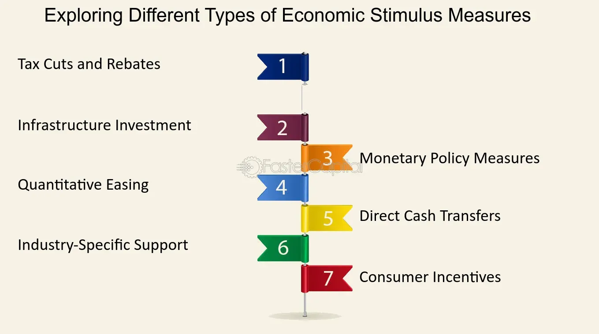

## Table of Contents

## What is an economic stimulus?

An economic stimulus is a policy or action taken by a government to boost the economy when it's not doing well. It's like giving the economy a little push to help it grow faster. Governments might do this by spending more money on projects, cutting taxes, or giving money directly to people. The idea is to increase spending and investment, which can help create jobs and make businesses more active.

For example, during a recession, when people are not spending much and businesses are struggling, a government might start building new roads or schools. This not only creates jobs for construction workers but also encourages other businesses to invest and hire more people. Another way is by giving tax cuts or direct payments to people, so they have more money to spend on things they need or want. This extra spending can help businesses sell more and, in turn, help the economy recover.

## What are the main types of economic stimulus mechanisms?

There are mainly three types of economic stimulus mechanisms: fiscal policy, monetary policy, and direct financial assistance. Fiscal policy involves the government changing how much it spends or how much it taxes. For example, the government might spend more on building roads or hospitals, which creates jobs and boosts the economy. Or, it might lower taxes so people and businesses have more money to spend or invest.

Monetary policy is controlled by a country's central bank, like the Federal Reserve in the United States. This involves changing interest rates or the amount of money in circulation. If the central bank lowers interest rates, borrowing money becomes cheaper, which can encourage people and businesses to take out loans and spend more. If the central bank prints more money, there's more cash available for people to spend, which can also help the economy grow.

Direct financial assistance is when the government gives money directly to people or businesses. This can be in the form of checks, grants, or loans with favorable terms. For example, during tough economic times, the government might send checks to families to help them pay for necessities. This extra money can help people keep spending, which supports businesses and helps the economy recover.

## How does government spending act as an economic stimulus?

When the government spends more money, it can help the economy grow. This is because the government might build new roads, schools, or hospitals. These projects create jobs for people like construction workers, engineers, and teachers. When these people get paid, they have more money to spend on things they need or want, like food, clothes, or entertainment. This extra spending helps other businesses sell more and hire more people, which makes the whole economy busier and healthier.

Sometimes, the government spends money on things that help businesses directly. For example, they might give money to companies to help them buy new machines or start new projects. This can make businesses more productive and able to sell more. When businesses do well, they hire more people and pay more taxes, which helps the economy grow even more. So, by spending money in smart ways, the government can give the economy the boost it needs to get better.

## What role do tax cuts play in stimulating the economy?

Tax cuts can help the economy grow by putting more money in people's pockets. When the government lowers taxes, people and businesses have more money to spend or invest. For example, if a family gets a tax cut, they might use the extra money to buy a new car or go on a vacation. This extra spending helps businesses sell more and hire more people. When businesses do well, they pay more taxes, which can help the government too.

Tax cuts can also encourage businesses to invest more. If a company gets a tax cut, it might use the extra money to buy new machines or start new projects. This can make the company more productive and able to sell more. When businesses invest more, they create more jobs and help the economy grow. So, by cutting taxes, the government can help both people and businesses spend and invest more, which can make the economy stronger.

## Can you explain how monetary policy can be used as an economic stimulus?

Monetary policy is a way the central bank can help the economy grow. They do this by changing interest rates or the amount of money in the economy. If the central bank lowers interest rates, borrowing money becomes cheaper. This can encourage people to take out loans for things like buying a house or starting a business. When people borrow and spend more, it helps businesses sell more and hire more people, which makes the economy busier and healthier.

Another way the central bank can stimulate the economy is by printing more money. When they do this, there's more cash available for people to spend. This can help businesses sell more because people have more money to buy things. More spending can lead to more jobs and a stronger economy. So, by using these tools, the central bank can help the economy grow when it's not doing well.

## What are the immediate benefits of implementing an economic stimulus?

When a government or central bank implements an economic stimulus, it can help the economy right away. For example, if the government starts spending more money on projects like building roads or schools, it creates jobs for people. These people then have more money to spend on things they need or want, like food or clothes. This extra spending helps other businesses sell more and hire more people, which makes the economy busier and healthier.

Another way an economic stimulus can help immediately is by cutting taxes or lowering interest rates. When people and businesses pay less in taxes, they have more money to spend or invest. If interest rates go down, borrowing money becomes cheaper, so people might take out loans to buy things like cars or houses. This extra spending and borrowing can quickly boost the economy by helping businesses sell more and create more jobs.

## How does an economic stimulus affect employment rates?

When the government uses an economic stimulus, it can help more people find jobs. For example, if the government spends more money on building roads or schools, they need to hire construction workers, engineers, and teachers. These new jobs mean more people are working and [earning](/wiki/earning-announcement) money. When people have jobs, they spend more money on things they need or want, like food or clothes. This extra spending helps other businesses sell more, so they might hire more people too. So, an economic stimulus can quickly help lower unemployment by creating new jobs.

Another way an economic stimulus can help employment is by cutting taxes or lowering interest rates. When people and businesses pay less in taxes, they have more money to spend or invest. If interest rates go down, borrowing money becomes cheaper, so people might take out loans to buy things like cars or houses. This extra spending and borrowing can help businesses sell more and create more jobs. When businesses do well, they hire more people, which helps lower unemployment. So, by using these tools, the government can help more people find work and make the economy stronger.

## What are the long-term benefits of an economic stimulus on economic growth?

An economic stimulus can help the economy grow over the long term by creating jobs and encouraging people to spend more. When the government spends money on projects like building roads or schools, it creates jobs for people. These people then have more money to spend on things they need or want, like food or clothes. This extra spending helps businesses sell more and hire more people. Over time, this can lead to a stronger economy because more people are working and spending money. Businesses might also invest more in new projects or machines, which can make them more productive and able to sell even more.

Another way an economic stimulus can help the economy grow in the long term is by cutting taxes or lowering interest rates. When people and businesses pay less in taxes, they have more money to spend or invest. If interest rates go down, borrowing money becomes cheaper, so people might take out loans to buy things like cars or houses. This extra spending and borrowing can help businesses sell more and create more jobs. Over time, this can lead to a healthier economy because businesses are doing well and more people are working. So, by using these tools, the government can help the economy grow stronger over the long term.

## What are the potential risks and drawbacks of using economic stimulus?

Using an economic stimulus can have some risks and problems. One big worry is that it might make prices go up too fast. If the government spends a lot of money or prints more money, there can be too much money chasing too few things. This can lead to inflation, where the cost of things like food and gas goes up. If prices go up too fast, it can hurt people who are living on a fixed income, like retirees, because their money doesn't go as far. It can also make it hard for businesses to plan and grow if they don't know how much things will cost in the future.

Another problem is that the money might not be used in the best way. Sometimes, the government might spend money on projects that don't help the economy as much as they could. For example, if they build something that isn't really needed, it might not create as many jobs or help as many people. Also, if the government gives tax cuts or loans to businesses, those businesses might not use the money to create jobs or invest in new projects. Instead, they might just save the money or pay it out to shareholders. This means the stimulus might not help the economy grow as much as people hoped.

Lastly, using an economic stimulus can add to the government's debt. If the government borrows money to pay for the stimulus, it has to pay back that money later with interest. This can make it harder for the government to spend money on other important things, like schools or healthcare, in the future. If the debt gets too big, it might even make people worry about the country's finances, which can hurt the economy in other ways. So, while an economic stimulus can help the economy, it's important to think about these risks and try to use the money in the best way possible.

## How can an economic stimulus lead to inflation?

When the government uses an economic stimulus, it might spend a lot of money or print more money. This can put more money into people's hands. If everyone has more money to spend, but there aren't more things to buy, the prices of things like food and gas can go up. This is called inflation. When prices go up too fast, it can make life harder for people, especially those who have a fixed amount of money each month, like retirees.

Inflation can also happen if the stimulus doesn't help the economy grow in a good way. For example, if the government spends money on projects that don't really help, like building things that aren't needed, it might not create many jobs or help businesses. If businesses don't sell more or hire more people, the extra money from the stimulus can just make prices go up instead of helping the economy grow. So, it's important for the government to use the stimulus money wisely to avoid causing too much inflation.

## What are the challenges in measuring the effectiveness of an economic stimulus?

Measuring how well an economic stimulus works can be tricky because there are so many things happening in the economy at the same time. It's hard to tell if the stimulus is the reason the economy is getting better or if other things, like people feeling more confident or businesses doing well, are helping too. For example, if the government spends money on building roads and more people get jobs, it might look like the stimulus is working. But if people are also spending more because they feel good about their future, it's hard to know exactly how much the stimulus helped.

Another challenge is that the effects of an economic stimulus can take a long time to show up. Sometimes, it can take months or even years to see if the money was spent in the right way or if it helped create jobs and grow the economy. This makes it hard to measure the success of the stimulus right away. Also, different parts of the economy might react differently to the stimulus. Some businesses might do well, while others might not see any change. This makes it even harder to figure out if the stimulus was effective overall.

## How do different economic theories interpret the impact of economic stimulus?

Different economic theories have different ideas about how an economic stimulus works. Keynesian economists believe that when the economy is not doing well, the government should spend more money to help it grow. They think that if the government builds roads or gives people money, it can create jobs and make people spend more. This extra spending helps businesses sell more and hire more people, which makes the economy stronger. Keynesians see economic stimulus as a way to fix problems quickly and get the economy moving again.

On the other hand, some economists who follow classical or neoclassical theories might not agree with using economic stimulus. They believe that the economy can fix itself without the government's help. They think that if the government spends a lot of money, it can lead to problems like inflation, where prices go up too fast. These economists worry that economic stimulus might not help the economy in the long run and could even make things worse by adding to the government's debt. They believe that the best way to help the economy is to let businesses and people make their own choices without too much government help.

## What is the relationship between Economic Policy and Stimulus?

Economic policy involves strategic actions by governments to guide the economic performance of their countries, largely focusing on achieving macroeconomic objectives like growth, employment, and price stability. One of the pivotal components of economic policy is economic stimulus, which is particularly critical during economic downturns or periods of stagnant growth. Stimulus measures are designed to invigorate economic activity by enhancing consumer and business spending, ultimately aiming to restore aggregate demand and achieve full employment.

Economic stimulus can take two primary forms: fiscal and monetary. Fiscal stimulus refers to government actions involving increased public spending and tax reductions. By injecting capital into the economy, fiscal stimulus seeks to boost consumer consumption and business investment. A quintessential example is the Coronavirus Aid, Relief, and Economic Security (CARES) Act in the United States, which provided direct payments to individuals and financial support to businesses to counteract the economic impact of the COVID-19 pandemic.

Monetary stimulus, on the other hand, involves adjusting the monetary policies to influence economic activities. Central banks typically lower interest rates to reduce the cost of borrowing, incentivizing both consumer spending and business investments. Additionally, monetary authorities may engage in quantitative easing, purchasing securities to inject [liquidity](/wiki/liquidity-risk-premium) directly into the financial system.

The primary goal of these stimulus strategies is to encourage private sector expenses, improving economic confidence and activity. Empirical studies often use mathematical models to simulate the effects of different stimulus measures. For instance, using a basic model of aggregate expenditure, the equilibrium level of national income ($Y$) can be calculated as:

$$
Y = C + I + G + (X - M)
$$

where $C$ is consumer spending, $I$ stands for investments, $G$ represents government spending, $X$ is exports, and $M$ is imports. By increasing $G$ or reducing taxes, the government can shift the aggregate demand curve to the right, thereby elevating the level of economic output and employment.

Historic initiatives provide practical insights into the functionality and impacts of economic stimulus. Programs such as the "Cash for Clunkers" initiative in 2009 in the U.S. illustrate mechanisms through which temporary boosts in demand are achieved, in this case by incentivizing consumers to replace old vehicles with new, more efficient ones. These examples underscore the targeted nature of specific stimulus efforts, which are often designed to address particular sectors or economic issues.

Understanding these strategies' components and effects forms a cornerstone of engaging with economic policy. Policymakers, economists, and analysts utilize these tools to navigate complex economic environments and strive towards achieving economic stability and growth objectives.

## References & Further Reading

[1]: U.S. Department of the Treasury. (n.d.). [The Financial Crisis Response](https://quizlet.com/572901720/unit-2-money-and-the-monetary-system-flash-cards/). 

[2]: U.S. Congress. (2020). [The CARES Act](https://www.congress.gov/bill/116th-congress/house-bill/748).

[3]: Lopez de Prado, M. (2018). [Advances in Financial Machine Learning](https://www.amazon.com/Advances-Financial-Machine-Learning-Marcos/dp/1119482089). Wiley.

[4]: Aronson, D. R. (2006). [Evidence-Based Technical Analysis: Applying the Scientific Method and Statistical Inference to Trading Signals](https://www.amazon.com/Evidence-Based-Technical-Analysis-Scientific-Statistical/dp/0470008741). Wiley.

[5]: Jansen, S. (2020). [Machine Learning for Algorithmic Trading](https://github.com/stefan-jansen/machine-learning-for-trading). Packt Publishing.

[6]: Chan, E. (2008). [Quantitative Trading: How to Build Your Own Algorithmic Trading Business](https://github.com/ftvision/quant_trading_echan_book). Wiley.