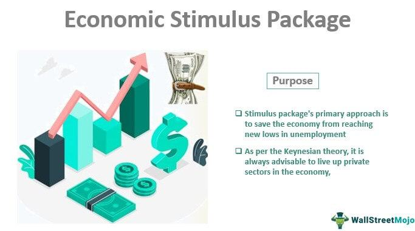

In the modern economic landscape, governments and financial institutions play pivotal roles by employing fiscal measures and economic policies to sustain and enhance economic growth. These targeted efforts aim to stabilize economies by addressing fluctuations in economic cycles and mitigating the impacts of financial crises. A notable trend in contemporary economic management is the integration of algorithmic trading and economic stimulus programs. This integration represents a strategic symbiosis between technological advancement and fiscal policy, promoting efficiency and responsiveness in financial markets.

Algorithmic trading algorithms are utilized to efficiently manage investment portfolios by executing trades based on pre-programmed criteria and market data. These systems enhance market liquidity and can react rapidly to changes in economic policy, providing a dynamic component to traditional economic strategies. Simultaneously, economic stimulus programs, which include both fiscal and monetary measures, seek to revitalize economic activity during downturns. By influencing consumer spending, investment, and overall demand, such programs support economic recovery and sustainable growth.

Understanding the interplay between fiscal measures, economic stimulus strategies, and algorithmic trading is crucial for effectively managing economic cycles and responding to financial crises. These components collectively influence economic policy decisions and market dynamics, presenting both opportunities and challenges for investors, policymakers, and analysts. This article explores the distinctive roles and impacts of each element, offering insights that are essential for navigating the complexities of modern economies.

## Table of Contents

## Understanding Fiscal Measures

Fiscal measures encompass a range of government strategies designed to adjust tax rates and government spending with the goal of influencing economic activity. These measures serve as vital components of fiscal policy, which governments employ to either stimulate or restrain the economy depending on prevailing economic conditions.

To stimulate economic activity, particularly during periods of recession or economic slowdowns, governments may resort to deficit spending or tax reductions. Deficit spending involves the government spending more money than it collects in revenue, effectively injecting money into the economy. This can lead to an increase in aggregate demand, thereby encouraging consumer spending and business investment. Conversely, reducing taxes can increase disposable income for individuals and corporations, spurring consumption and investment.

Fiscal measures also aim to stabilize the economy, especially during downturns, by counteracting reduced private sector demand. By adjusting these measures appropriately, governments can work towards achieving sustainable long-term economic growth. The ultimate goal is to prevent severe economic downturns and ensure that economic expansions are durable and inclusive.

The effectiveness of fiscal measures often depends on several key factors. Timing is crucial; interventions must be implemented promptly to counteract economic slowdowns effectively. If measures are delayed, they may not have the desired impact, potentially exacerbating economic challenges. The scale of interventions also matters; measures need to be substantial enough to influence economic conditions without leading to negative side effects like inflation or excessive public debt. The structure of these interventions should be well-targeted, ensuring that fiscal measures reach the sectors and populations that need them the most.

For example, targeted tax cuts for low-income households can effectively boost consumption, as these households are more likely to spend additional income. Similarly, government investment in infrastructure projects can create jobs and provide a multiplier effect throughout the economy, fostering growth beyond the initial expenditure.

Understanding and effectively implementing fiscal measures requires careful consideration of the economic context and the specific goals of fiscal policy. Governments must balance the immediate need to stimulate or restrain economic activity with long-term fiscal sustainability, ensuring that such measures contribute positively to overall economic health.

## Economic Policy and Stimulus

Economic policy involves strategic actions by governments to guide the economic performance of their countries, largely focusing on achieving macroeconomic objectives like growth, employment, and price stability. One of the pivotal components of economic policy is economic stimulus, which is particularly critical during economic downturns or periods of stagnant growth. Stimulus measures are designed to invigorate economic activity by enhancing consumer and business spending, ultimately aiming to restore aggregate demand and achieve full employment.

Economic stimulus can take two primary forms: fiscal and monetary. Fiscal stimulus refers to government actions involving increased public spending and tax reductions. By injecting capital into the economy, fiscal stimulus seeks to boost consumer consumption and business investment. A quintessential example is the Coronavirus Aid, Relief, and Economic Security (CARES) Act in the United States, which provided direct payments to individuals and financial support to businesses to counteract the economic impact of the COVID-19 pandemic.

Monetary stimulus, on the other hand, involves adjusting the monetary policies to influence economic activities. Central banks typically lower interest rates to reduce the cost of borrowing, incentivizing both consumer spending and business investments. Additionally, monetary authorities may engage in quantitative easing, purchasing securities to inject [liquidity](/wiki/liquidity-risk-premium) directly into the financial system.

The primary goal of these stimulus strategies is to encourage private sector expenses, improving economic confidence and activity. Empirical studies often use mathematical models to simulate the effects of different stimulus measures. For instance, using a basic model of aggregate expenditure, the equilibrium level of national income ($Y$) can be calculated as:

$$
Y = C + I + G + (X - M)
$$

where $C$ is consumer spending, $I$ stands for investments, $G$ represents government spending, $X$ is exports, and $M$ is imports. By increasing $G$ or reducing taxes, the government can shift the aggregate demand curve to the right, thereby elevating the level of economic output and employment.

Historic initiatives provide practical insights into the functionality and impacts of economic stimulus. Programs such as the "Cash for Clunkers" initiative in 2009 in the U.S. illustrate mechanisms through which temporary boosts in demand are achieved, in this case by incentivizing consumers to replace old vehicles with new, more efficient ones. These examples underscore the targeted nature of specific stimulus efforts, which are often designed to address particular sectors or economic issues.

Understanding these strategies' components and effects forms a cornerstone of engaging with economic policy. Policymakers, economists, and analysts utilize these tools to navigate complex economic environments and strive towards achieving economic stability and growth objectives.

## The Role of Algorithmic Trading

Algorithmic trading, often referred to as algo trading, involves the use of computer algorithms to automate trading strategies. These pre-programmed instructions can execute orders at high speed and [volume](/wiki/volume-trading-strategy), enhancing the overall liquidity and efficiency of financial markets. By executing trades automatically, [algorithmic trading](/wiki/algorithmic-trading) can react to changes in economic policy almost instantaneously. This responsiveness allows market participants to adjust their positions in reaction to fiscal and monetary policy shifts, potentially optimizing their investment strategies.

The integration of algorithmic trading within economic strategies allows for more efficient implementation of fiscal and monetary policies. For instance, policymakers can use algorithmic trading systems to better manage market expectations and influence economic variables such as interest rates and inflation. By automating the trading process, these systems can help ensure that market conditions reflect the intended outcomes of policy interventions more swiftly and accurately.

Despite its advantages, algorithmic trading poses several risks. One significant concern is market [volatility](/wiki/volatility-trading-strategies), which can be exacerbated by the rapid execution of large-scale trades. This automated nature increases the likelihood of flash crashes, where market values plunge within seconds and recover almost as quickly. Additionally, the concentration of trading power in the hands of a few large algorithmic trading firms can lead to systemic risks, as heavy reliance on these systems may disrupt market stability in the case of software errors or cyber-attacks.

The integration of algorithmic trading with fiscal measures and economic stimuli requires careful regulation and oversight. Regulators must ensure that these trading systems operate under robust frameworks to mitigate associated risks. Measures could include setting trading limits, enhancing transparency, and monitoring trading activities to prevent market manipulation.

In summary, while algorithmic trading enhances market operations and can improve the effectiveness of economic policy implementations, it necessitates ongoing regulatory scrutiny to mitigate potential risks. As algorithmic trading continues to evolve, it will remain critical for policymakers to adapt regulatory practices to balance the benefits of technological innovation with the need for market stability.

## Interplay Between Policy and Technology

The intertwining of fiscal measures, economic stimulus, and algorithmic trading underscores the significant role technology plays in shaping economic policy. The rise of algorithmic trading, often executed using complex algorithms designed to assess market conditions and execute trades based on predefined criteria, highlights the immediate impact technology can have on investment strategies and market dynamics. These algorithms can be configured to anticipate outcomes of economic stimuli, such as changes in interest rates or government spending, and adjust trading strategies accordingly. This adaptability allows traders to respond rapidly to policy announcements, potentially influencing market behavior by amplifying the effects of these policies through increased liquidity and volatility.

The digital transformation pervasive in financial services necessitates a re-evaluation and adaptation of policies to adequately manage these technological advances. As financial markets become more reliant on technology, the potential for systemic risks increases. Algorithmic trading can contribute to market anomalies, such as flash crashes, due to the speed and volume of trades executed far surpassing human capability. Policymakers must address these risks by crafting regulations that ensure stability without stifling innovation. This involves developing frameworks that encourage transparency, set limitations on high-frequency trading practices, and implement circuit breakers to mitigate extreme market disruptions.

Furthermore, technological integration into fiscal and economic strategies requires careful consideration from policymakers. For instance, algorithmic models could be utilized to forecast economic tendencies post-stimulus more accurately, offering insights that could refine policy responses. This anticipation aligned with fiscal measures allows for a more dynamic approach to economic management, where interventions can be fine-tuned to maximize effectiveness.

Balancing innovation with regulation is crucial to leveraging the advantages of technology while minimizing the associated risks. Regulations need to evolve in tandem with technology advancements, ensuring that they are sufficiently robust to handle new challenges without impeding progress. This dynamic balance will be central to achieving the potential benefits that technology can offer to economic policy frameworks, such as improved efficiency, accuracy in forecasting, and enhanced market resilience.

In summary, the intersection of fiscal strategies, economic stimuli, and algorithmic trading offers a complex landscape where technology serves as both a tool and a challenge. Thoughtful integration and regulation of this intersection are imperative for maintaining economic stability and fostering sustainable growth in an increasingly digitized financial world.

## Case Studies and Historical Context

Examining past instances of economic stimulus and algorithmic trading provides valuable insights into their long-term effects and their role within broader economic policy frameworks. Notably, the financial crisis of 2007-2008 and the COVID-19 pandemic represent significant periods when fiscal stimuli were deployed on a massive scale.

### Financial Crisis of 2007-2008

The financial crisis of 2007-2008 showcased a pivotal moment in the application of fiscal stimuli. As global financial systems teetered on the brink of collapse, governments around the world took coordinated measures to stabilize the economy. In the United States, the Troubled Asset Relief Program (TARP) and subsequent stimulus packages, such as the American Recovery and Reinvestment Act (ARRA) of 2009, aimed to restore confidence, encourage investment, and revitalize economic activity by injecting liquidity into the financial system and providing tax relief to consumers and businesses [1].

These initiatives demonstrated the capacity of fiscal stimulus to address immediate economic downturns, while also spotlighting challenges such as long-term debt implications and the need for precise targeting of aid. The actions taken during this period have been extensively analyzed and serve as a reference point for subsequent fiscal responses, revealing the necessity for timely and adequately scaled interventions.

### COVID-19 Pandemic

The COVID-19 pandemic introduced economic disruptions of unprecedented scale, prompting historic global economic stimulus efforts. Governments worldwide initiated expansive fiscal and monetary measures in response to widespread lockdowns and supply chain disruptions. In the United States, the Coronavirus Aid, Relief, and Economic Security (CARES) Act, along with additional relief packages, provided over $3 trillion in economic support. These measures included direct payments to individuals, expanded unemployment benefits, and support for small businesses [2].

The swift, substantial economic response underscored the importance of direct fiscal interventions during crises, emphasizing the role of government aid in cushioning economic shocks. However, the pandemic's unique challenges also highlighted the limitations of traditional monetary policy, necessitating innovative approaches to fiscal policy design and implementation.

### Lessons Learned

These case studies underscore the necessity of a nuanced approach in implementing fiscal measures. They illustrate the balance required between immediate economic support and long-term fiscal sustainability. The lessons learned inform current policy frameworks, advocating for the timely deployment of comprehensive plans that consider both short-term relief and the strategic allocation of resources to support enduring economic stability.

The experiences gained from these periods of economic turbulence provide invaluable guidance for future challenges. The integration of sophisticated tools, such as algorithmic trading, within these frameworks warrants careful consideration by policymakers to optimize outcomes. Ongoing analysis of these past events provides a foundation to improve strategies aimed at mitigating potential crises and fostering stable economic growth worldwide.

[1] U.S. Department of the Treasury. (n.d.). The Financial Crisis Response. https://www.treasury.gov
[2] U.S. Congress. (2020). The CARES Act. https://www.congress.gov

## Conclusion

Fiscal measures, economic stimulus, and algorithmic trading are integral components that collectively shape economic policy. Their interplay is a critical [factor](/wiki/factor-investing) in navigating the complexities of modern financial markets and economic shifts. Fiscal measures, through adjustments in taxes and government spending, provide the groundwork for economic stabilization and growth. Economic stimulus, implemented via fiscal and monetary policies, is essential in reviving economic activity during downturns and restoring equilibrium. Meanwhile, algorithmic trading brings technological advancement to financial markets, enhancing liquidity and efficiency, while also necessitating careful oversight to prevent excessive volatility.

The merits and risks associated with each of these components highlight the importance of their combined analysis for effective economic management. Fiscal measures can spur consumer spending or curb inflation, but require precise timing and execution. Economic stimulus actions can successfully boost aggregate demand, but they [carry](/wiki/carry-trading) the risk of inflation if not scaled appropriately. Algorithmic trading increases market responsiveness but poses systemic risks if inadequately regulated.

As technology advances, its role within economic policy frameworks is poised to grow. Algorithmic trading's rapid evolution exemplifies how technological progress can transform traditional economic tools. Policymakers must remain vigilant in understanding and integrating these advancements to unlock their potential fully. This involves maintaining a balance between fostering innovation and implementing sufficient regulatory safeguards to mitigate potential risks associated with rapid technological change.

Continued research and adaptation are imperative to leverage these tools for sustained economic growth and stability. The dynamic nature of global markets requires an agile approach to policy development, ensuring that fiscal measures, economic stimulus, and technology are effectively aligned to meet evolving economic challenges. By focusing on informed policy design and execution, governments and financial institutions can harness these elements to promote resilience and progress in economic environments.

## References & Further Reading

[1]: U.S. Department of the Treasury. (n.d.). [The Financial Crisis Response](https://quizlet.com/572901720/unit-2-money-and-the-monetary-system-flash-cards/). 

[2]: U.S. Congress. (2020). [The CARES Act](https://www.congress.gov/bill/116th-congress/house-bill/748).

[3]: Lopez de Prado, M. (2018). [Advances in Financial Machine Learning](https://www.amazon.com/Advances-Financial-Machine-Learning-Marcos/dp/1119482089). Wiley.

[4]: Aronson, D. R. (2006). [Evidence-Based Technical Analysis: Applying the Scientific Method and Statistical Inference to Trading Signals](https://www.amazon.com/Evidence-Based-Technical-Analysis-Scientific-Statistical/dp/0470008741). Wiley.

[5]: Jansen, S. (2020). [Machine Learning for Algorithmic Trading](https://github.com/stefan-jansen/machine-learning-for-trading). Packt Publishing.

[6]: Chan, E. (2008). [Quantitative Trading: How to Build Your Own Algorithmic Trading Business](https://github.com/ftvision/quant_trading_echan_book). Wiley.