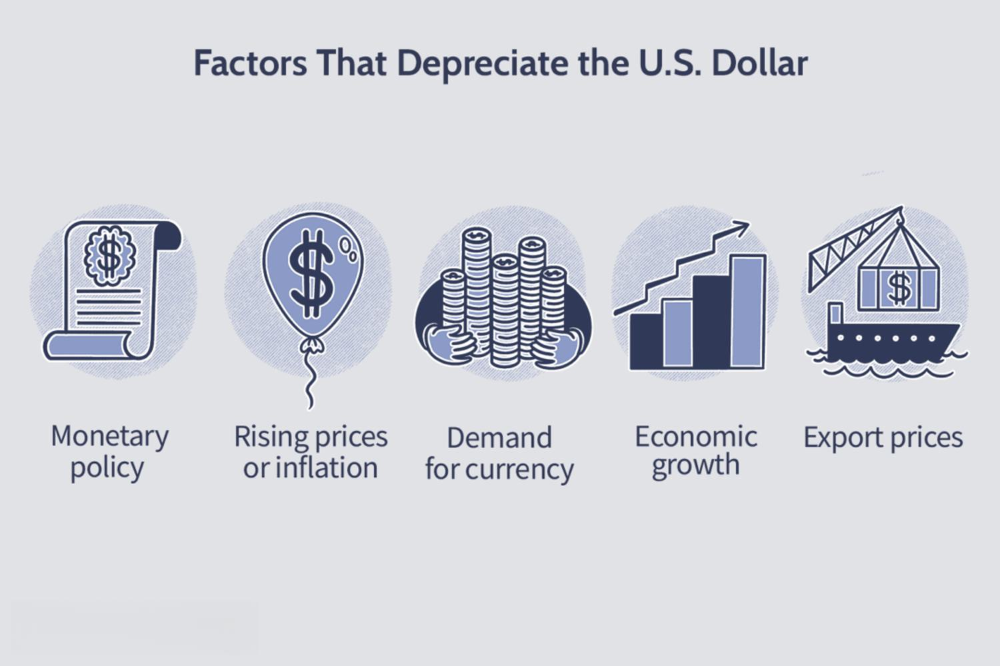

The world of economic strategies and financial technology is rapidly evolving, with the U.S. dollar and algorithmic trading standing out as crucial influencers. The U.S. dollar, as the foremost global reserve currency, has a significant impact on both international and domestic economic landscapes. Its value fluctuations can dramatically alter trading strategies and investment returns, shaping how markets operate globally and domestically.

Algorithmic trading, on the other hand, represents a revolution in financial markets. By harnessing advanced algorithms and computational power, traders can respond in real-time to currency fluctuations, thus optimizing economic strategies. This form of trading has become indispensable in modern financial markets, as it can efficiently leverage economic changes to benefit traders and investors alike.

In an age marked by digital transformation, understanding the repercussions of currency movements on global trade and investment is more important than ever. Currency strategies, particularly those focusing on the U.S. dollar, hold the potential to redefine economic relationships. By utilizing algorithmic trading, these strategies can be fine-tuned to increase financial returns and decision-making efficiency.

This exploration provides an opportunity to comprehend the interconnectedness of dollar value strategies and algorithmic trading. It underscores the importance of these elements in crafting innovative approaches to economic strategies and maximizing investment returns. Engaging with these dynamics enhances one's ability to navigate the complexities of global finance, thus fostering economic success in increasingly volatile markets.

## Table of Contents

## Understanding the U.S. Dollar's Global Economic Role

The U.S. dollar's pathway to becoming the world's primary reserve currency is deeply rooted in historical developments and strategic economic policies. Post-World War II, the Bretton Woods Agreement established the U.S. dollar as the backbone of international finance by pegging it to gold while other currencies were fixed to the dollar. This laid the groundwork for the U.S. dollar's dominance in global economics and trade. Its stature as a reserve currency ensures its pervasive use in global transactions, allowing it to shape economic policies and strategies worldwide.

Underpinning the dollar's global influence is its role in determining economic trends, investment decisions, and trade relationships. The value of the U.S. dollar often acts as a barometer for economic health, impacting exchange rates, trade balances, and capital flows. A strong dollar typically dampens U.S. exports by making them more expensive abroad, while a weaker dollar boosts exports but increases the cost of imports. This sensitivity to currency fluctuations influences multinational investment decisions and trade policies, directly affecting global financial stability.

Several factors contribute to the strength or weakness of the U.S. dollar, including macroeconomic indicators, fiscal policies, and geopolitical events. Key drivers include [interest rate](/wiki/interest-rate-trading-strategies) differentials between the U.S. and other economies, economic growth forecasts, and investor sentiment. For instance, higher interest rates attract foreign capital, increasing demand for the dollar. Conversely, periods of economic uncertainty can lead to capital outflows and a weaker dollar. The resultant fluctuations ripple through global financial markets, influencing everything from commodity prices to foreign exchange reserves.

Domestically, the U.S. dollar significantly affects inflation, interest rates, and monetary policy. A strong dollar usually suppresses inflation by reducing import prices, allowing the Federal Reserve to maintain or lower interest rates. On the flip side, a weaker dollar can trigger inflationary pressures, prompting monetary tightening to preserve economic stability. Policymakers must thus balance domestic economic objectives with the imperatives of maintaining a stable currency conducive to global trade.

The U.S. dollar serves a dual role as both a measure of economic health and a strategic tool for international trade. As a measure, it offers insights into the U.S. economy's robustness, with strength typically reflecting positive economic conditions and confidence among international investors. Strategically, it remains pivotal in negotiating trade agreements and ensuring competitive advantage in international markets. In this capacity, the dollar influences decisions related to tariffs, trade barriers, and bilateral economic partnerships.

Understanding these dynamics highlights the intricate tapestry of global economic interactions dictated by the U.S. dollar's status. As the linchpin of international finance, it will continue to play a crucial role in shaping the economic landscapes of nations worldwide.

## Algorithmic Trading: A New Age in Currency Strategy

Algorithmic trading, a computer-driven, rules-based method of executing trades, has become an essential element in modern financial markets. Its rise as a significant player is attributed to the capacity to manage large and complex orders in ways that human traders cannot replicate with the same precision or speed.

Algorithmic trading systems optimize trading outcomes by exploiting market inefficiencies and price discrepancies. These systems can monitor and analyze vast amounts of market data at speeds far beyond human capabilities. They are programmed to identify trends, price patterns, and [arbitrage](/wiki/arbitrage) opportunities, executing trades based on pre-defined parameters. By automating the decision-making process, [algorithmic trading](/wiki/algorithmic-trading) helps mitigate human error and biases, ensuring more consistent and strategic trading approaches.

Technological advancements have spurred the growth of algorithmic trading, with [artificial intelligence](/wiki/ai-artificial-intelligence) (AI) and [machine learning](/wiki/machine-learning) playing crucial roles. Machine learning algorithms improve their market predictions by learning from historical data, adjusting their trading strategies in real-time as they gain new insights. These technologies enable traders to refine their models, ensuring they remain adaptive and responsive to ever-changing market conditions. AI-driven models can predict foreign exchange movements and trading volumes, making them invaluable tools in currency trading, where timely and informed decisions are paramount.

The use of algorithmic trading offers numerous benefits, particularly in navigating currency [volatility](/wiki/volatility-trading-strategies) and increasing market [liquidity](/wiki/liquidity-risk-premium). By deploying algorithms to trade large volumes of currency, traders can significantly reduce market impact and transaction costs. This liquidity boost stabilizes markets, providing more predictable price movements and creating a more attractive trading environment for all market participants. The enhanced speed and precision of executions further minimize risks associated with currency fluctuations, thus optimizing returns.

However, algorithmic trading is not without its challenges. Market anomalies, such as "flash crashes," can result from automated systems operating based on erroneous signals or insufficient data, leading to significant financial disruptions. Moreover, the regulatory landscape presents ongoing challenges for algorithmic traders. Regulations in financial markets are continually evolving to address the risks associated with high-frequency trading. Compliance with these regulations is crucial, requiring traders to maintain transparency and implement robust risk management practices.

In summary, algorithmic trading has revolutionized currency strategies by harnessing technology's power to execute trades with unprecedented efficiency. The integration of AI and machine learning in these systems has enhanced their ability to predict and respond to market dynamics, offering immense advantages in liquidity and volatility management. Nonetheless, traders must navigate the challenges of market irregularities and regulatory requirements to fully capitalize on the benefits of algorithmic trading.

## Economic Impact of Algorithmic Trading on U.S. Dollar Strategies

Algorithmic trading has profoundly impacted U.S. dollar currency strategies, leading to significant economic implications. Its role in shaping volatility and liquidity in global markets is noteworthy, especially as technology-driven trading systems increasingly dominate financial exchanges. By leveraging sophisticated algorithms, traders can analyze massive datasets to detect market inefficiencies and execute trades at optimal times, thereby influencing the behavior of U.S. dollar pairs.

One of the primary impacts of algorithmic trading on the U.S. dollar is the modulation of market volatility. Algorithms react at exceptional speeds to changes in market conditions, which can either dampen volatility by providing liquidity or exacerbate it if algorithms collectively engage in similar trading decisions. The liquidity provided by algorithmic traders can tighten bid-ask spreads, resulting in a more efficient market for U.S. dollar pairs. This phenomenon can enhance market stability and provide better pricing for investors. However, excessive trading by algorithms can lead to flash crashes or unexplained price swings, as observed in several past instances, raising concerns about market stability.

Case studies illustrate the tangible effects of algorithmic trading on currency movements. For example, during significant economic news releases, algorithmic trading can cause rapid fluctuations in the U.S. dollar's value due to the algorithms' ability to instantly process and react to information. This has led markets to become increasingly sensitive to news, requiring policymakers and investors to consider the algorithmic landscape when devising economic strategies.

Algorithmic trading also presents substantial opportunities for amplifying economic strategies for international investors and policymakers. With access to superior data analytics and predictive modeling, these algorithms can forecast trends and execute strategies that were previously inconceivable. For international stakeholders, this means the ability to hedge currency exposure more efficiently and speculate on future currency movements with greater precision. For instance, by using neural networks and machine learning models, algorithms can predict currency pair trends, adjusting trading strategies in real-time to optimize outcomes.

Globally, the integration of technology with currency trading may redefine economic relationships, as algorithmic strategies transcend geographical and temporal boundaries. As algorithms efficiently arbitrage global discrepancies, the traditional barriers between markets are diminishing. This increased interconnectedness necessitates a reevaluation of how countries engage in foreign exchange trading and manage economic policies.

In conclusion, algorithmic trading is reshaping U.S. dollar strategies through enhanced market efficiency and new trading paradigms. While it offers significant advantages in terms of liquidity and strategic opportunities, it also poses challenges that need to be addressed to maintain market integrity and stability. As the landscape continues to evolve, the collaboration between technology and currency trading will undoubtedly redefine global economic relationships.

## The Future Outlook of U.S. Dollar Strategies and Algorithmic Trading

Predictive analysis forecasts an evolving landscape where the integration of algorithmic trading with U.S. dollar strategies will continue to transform global economics. Algorithmic trading, characterized by the use of complex algorithms and advanced technologies like artificial intelligence (AI) and machine learning (ML), is expected to play a pivotal role in determining the future value and positioning of the U.S. dollar in world markets.

Potential scenarios where algorithmic trading could influence global economics and the U.S. dollar's stance are abundant. Algorithms excel in analyzing vast datasets at unprecedented speeds, allowing them to detect market trends and execute trades more efficiently than human traders. This capability could lead to a more responsive and dynamic currency market. Consider a scenario where a sudden geopolitical event affects the dollar's value; algorithmic systems can adapt instantaneously, potentially stabilizing or further destabilizing the currency depending on the algorithms' design and objectives.

The integration of cutting-edge technologies into currency trading presents both challenges and opportunities. On one hand, leveraging AI in trading strategies allows for improved predictive precision, enhancing returns on investments. However, this evolution necessitates robust risk management frameworks to mitigate issues such as flash crashes—sudden market declines caused by algorithmic trading anomalies. Furthermore, the complexity and opaqueness of AI-driven algorithms pose ethical and regulatory challenges, including potential market manipulation.

Policymakers and investors can harness the benefits of algorithmic trading by developing more informed and agile currency strategies. For policymakers, understanding the intricacies of algorithmic systems is crucial for crafting regulations that ensure market stability while fostering innovation. Investors who embrace algorithmic trading platforms can achieve better diversification and risk management, enhancing the resilience of their currency portfolios.

Regulatory frameworks are poised to evolve in tandem with advancements in trading technologies. Regulatory bodies worldwide are increasingly recognizing the need to balance innovation with risk mitigation. Developments may include stricter oversight of algorithmic trading practices, enhanced transparency requirements, and improved safeguards to prevent systemic risks.

In conclusion, the future of U.S. dollar strategies intertwined with algorithmic trading is set against a backdrop of rapid technological advancements. Stakeholders must navigate this complex environment with agility, foresight, and a commitment to developing resilient and ethical trading systems. Continued innovation and adaptation will be essential for capitalizing on the opportunities presented by this technological integration, ensuring robust economic performance and stability in a digital age.

## Conclusion

The intersection of currency strategies and algorithmic trading reveals a profound impact on the economic landscape, particularly concerning the U.S. dollar. Algorithmic trading has significantly altered traditional financial paradigms by introducing advanced technologies, such as artificial intelligence and machine learning, into currency trading. These advancements allow for analyzing vast data sets and executing trades at speeds previously unimaginable, enabling market participants to exploit inefficiencies and optimize trading outcomes effectively. As a result, traditional currency strategies tied to manual decision-making processes are evolving, increasingly incorporating algorithmic methods to enhance performance.

For investors and policymakers, the integration of advanced trading technologies with dollar strategies presents both opportunities and challenges. It is imperative for them to adapt to and harness these developments to maintain competitive advantages and foster economic stability. Policymakers must ensure that regulatory frameworks evolve to address technological advancements, safeguarding against systemic risks while promoting innovation.

Ongoing research and innovation are crucial to navigating the dynamic environment of global finance. Embracing technological shifts is essential for sustaining economic success in a rapidly advancing financial world. This requires a commitment to education, the development of new skill sets, and the continued exploration of innovative trading strategies and tools.

Adapting to both technological and strategic shifts is vital for sustained economic prosperity. As algorithmic trading continues to reshape financial markets, stakeholders must remain agile and forward-thinking, ensuring they are equipped to leverage the full potential of emerging technologies and strategies. This approach will enable them to optimize financial strategies effectively, navigate market complexities, and capitalize on the opportunities presented by an ever-evolving economic landscape.

## References & Further Reading

[1]: Bergstra, J., Bardenet, R., Bengio, Y., & Kégl, B. (2011). ["Algorithms for Hyper-Parameter Optimization."](https://dl.acm.org/doi/10.5555/2986459.2986743) Advances in Neural Information Processing Systems 24.

[2]: ["Advances in Financial Machine Learning"](https://www.amazon.com/Advances-Financial-Machine-Learning-Marcos/dp/1119482089) by Marcos Lopez de Prado

[3]: ["Evidence-Based Technical Analysis: Applying the Scientific Method and Statistical Inference to Trading Signals"](https://www.amazon.com/Evidence-Based-Technical-Analysis-Scientific-Statistical/dp/0470008741) by David Aronson

[4]: ["Machine Learning for Algorithmic Trading"](https://github.com/stefan-jansen/machine-learning-for-trading) by Stefan Jansen

[5]: ["Quantitative Trading: How to Build Your Own Algorithmic Trading Business"](https://www.amazon.com/Quantitative-Trading-Build-Algorithmic-Business/dp/1119800064) by Ernest P. Chan