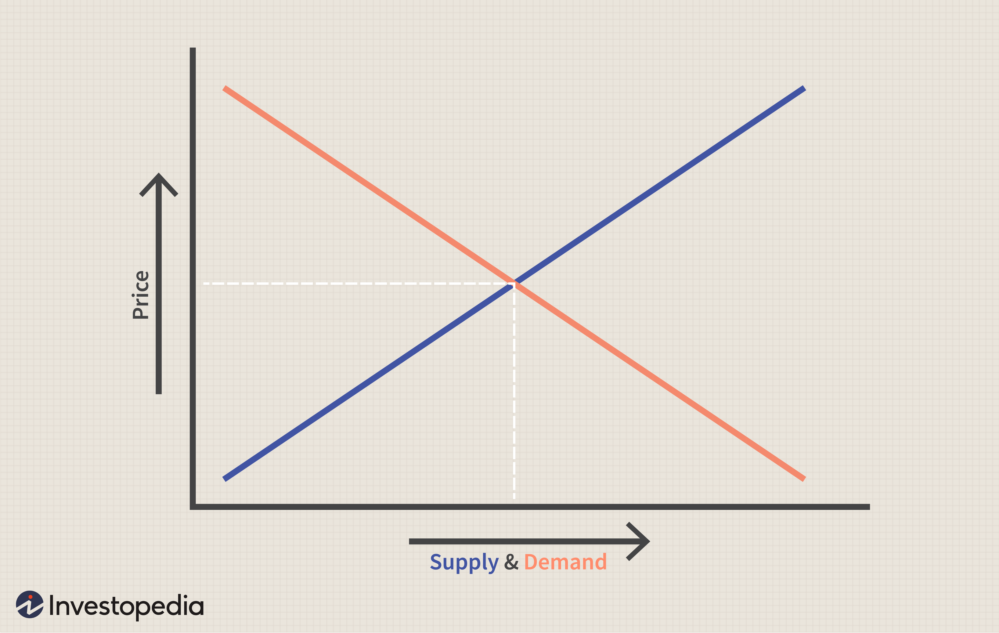

## Table of Contents

## What is the basic concept of economic supply?

Economic supply refers to the amount of a product or service that producers are willing and able to offer for sale at various prices during a certain time period. It's based on the idea that as the price of a product goes up, producers are usually willing to supply more of it because they can make more profit. This relationship between price and quantity supplied is often shown on a supply curve, which slopes upward from left to right.

The supply of a product can be influenced by several factors, including the cost of production, technology, and the number of sellers in the market. For example, if the cost of raw materials goes down, producers might be able to supply more of the product at the same price because their costs are lower. Similarly, if new technology makes production more efficient, more goods can be supplied. The number of sellers also matters; more sellers usually mean more supply.

## How does the law of supply work?

The law of supply says that if the price of something goes up, people who make that thing will want to make and sell more of it. This is because they can make more money when the price is higher. Imagine you sell lemonade. If you can sell each cup for more money, you might want to make more lemonade to sell, because you'll earn more.

On the other hand, if the price of something goes down, the people who make it will want to make and sell less of it. They won't make as much money, so it's not worth their time and effort. Going back to the lemonade example, if you can only sell each cup for a little bit of money, you might decide to make less lemonade because it's not worth the effort for such a small profit. This relationship between price and how much is made is shown on a supply curve, which goes up as the price goes up.

## What factors can shift the supply curve?

The supply curve can move because of different things that affect how much of a product people want to make and sell. One big thing is the cost to make the product. If it costs less to make, like if the price of the things you need goes down, then people will want to make more of it. They can still make money even if they sell it for less. Another thing is if there's new technology that makes it easier or quicker to make the product. This can also make people want to make more because it's easier and they can make more money.

Another reason the supply curve can move is because of how many people are selling the product. If more people start selling it, then there's more of it available, so the supply curve moves to show there's more. Also, if the government makes new rules or taxes that affect how much it costs to make the product, that can change how much people want to make. For example, if there's a new tax that makes it more expensive to make, then people might make less, and the supply curve would move to show there's less.

Sometimes, things outside of the market can change the supply too. For example, if there's a natural disaster that makes it hard to get the things you need to make the product, then there might be less of it available. Or if there's a big change in what people expect will happen with prices in the future, that can make people want to make more or less now. All these things can make the supply curve move, showing that there's more or less of the product available at every price.

## How do producers respond to changes in price according to supply theory?

When the price of a product goes up, producers usually want to make and sell more of it. This is because they can make more money when the price is higher. For example, if you're selling cookies and the price of each cookie goes up, you might decide to bake more cookies because you can earn more money. This is what supply theory says: higher prices mean more supply because it's more profitable for the producers.

On the other hand, if the price of a product goes down, producers will usually want to make and sell less of it. When the price is lower, they don't make as much money, so it's not worth their time and effort to produce as much. Going back to the cookie example, if the price of each cookie goes down, you might decide to bake fewer cookies because it's not as profitable. This is why the supply curve slopes upward; as the price decreases, the quantity supplied also decreases.

## What is the difference between short-run and long-run supply?

Short-run supply is about what producers can do right now or in the near future. In the short run, some things can't change quickly. For example, a factory can't be built overnight, so the number of factories stays the same. But other things can change, like how many workers are hired or how much they work. So, in the short run, if the price goes up, producers might make more of the product by using the resources they already have better. But they can't suddenly make a lot more because they're limited by what they already have.

Long-run supply is different because it looks at what can happen over a longer time. In the long run, everything can change. Producers can build new factories, buy new machines, or even start making something different. So, if the price stays high for a long time, producers might decide to make a lot more of the product. They can do this because they have time to get everything they need. This means that in the long run, the supply can change a lot more than in the short run.

## How does the concept of elasticity apply to supply?

Elasticity of supply tells us how much the amount of a product that producers want to make and sell changes when the price changes. If the supply is elastic, it means that even a small change in price can make a big difference in how much is supplied. For example, if the price of apples goes up a little bit, farmers might decide to grow a lot more apples because it's worth it for them. On the other hand, if the supply is inelastic, it means that changes in price don't make much difference in how much is supplied. This can happen if it's hard to make more of the product quickly, like with oil, where it takes a long time to start new wells.

The elasticity of supply depends on a few things. One is how easy it is to make more of the product. If it's easy to increase production, like with T-shirts, the supply is more elastic. But if it's hard, like with diamonds, the supply is more inelastic. Another thing is time. In the short run, it's harder to change how much is supplied, so supply is usually more inelastic. But in the long run, producers have more time to adjust, so supply can become more elastic. Understanding elasticity helps businesses and economists predict how changes in price will affect the market.

## What role do production costs play in supply theory?

Production costs are really important in supply theory. They affect how much of a product producers want to make and sell. If the costs to make something go down, like if the price of the materials goes down, then producers can make more money even if they sell the product for the same price. So, they will want to make and sell more of it. This means that the supply of the product will go up because it's more profitable for the producers.

On the other hand, if the costs to make something go up, like if there's a new tax or if the price of materials goes up, then producers will make less money when they sell the product. They might decide to make and sell less of it because it's not as profitable. This means that the supply of the product will go down. So, production costs are a big part of what decides how much of a product is available in the market.

## How do technological changes impact supply?

Technological changes can make a big difference in how much of a product producers want to make and sell. When new technology makes it easier or quicker to make something, it can lower the cost of making it. For example, if a new machine helps a factory make toys faster, the factory can make more toys without spending more money. This means the factory might want to make and sell more toys because it's more profitable. So, the supply of toys goes up because of the new technology.

But sometimes, new technology can also make it harder for some producers. If a new way of making something is really expensive to start using, smaller producers might not be able to afford it. This can make them produce less because they can't compete with the bigger producers who can use the new technology. So, while new technology can increase supply overall, it might also make some producers supply less if they can't keep up with the changes.

## What is the relationship between supply and market equilibrium?

Market equilibrium is when the amount of a product that people want to buy is the same as the amount that producers want to sell. Supply is about how much producers want to sell, and it goes up when the price goes up because producers can make more money. When the price is just right, the amount people want to buy matches the amount producers want to sell, and that's market equilibrium.

If the price is too high, people might not want to buy as much, and there will be more of the product left over than producers want. This is called a surplus. Producers might then lower the price to sell more, and the supply will go down until it matches what people want to buy. If the price is too low, people might want to buy more than what's available, and there will be a shortage. Producers might then raise the price to make more money, and the supply will go up until it matches what people want to buy. So, supply helps find the right price where everyone is happy, and that's market equilibrium.

## How do government policies affect supply?

Government policies can change how much of a product producers want to make and sell. If the government gives money to help producers, like subsidies, it can make it cheaper for them to make things. So, producers might decide to make and sell more because they can make more money. But if the government puts a tax on making something, it can make it more expensive for producers. They might decide to make and sell less because it's not as profitable.

Also, rules set by the government can affect supply. For example, if there are new rules about how to make something safely, it might cost more money or take more time. This can make producers want to make less of the product. On the other hand, if the government makes it easier to get the things needed to make a product, like by lowering trade barriers, it can help producers make more. So, government policies can move the supply curve, changing how much of a product is available at every price.

## What are some advanced models of supply in economic theory?

In economic theory, there are some advanced models that help us understand supply better. One of these is the kinked demand curve model. It's used to explain why prices in some markets, like those for everyday things we buy, don't change much even when costs change. The idea is that if a producer raises the price, other producers won't follow, and people will buy less from the producer who raised the price. But if a producer lowers the price, others will follow, and the producer won't get much more business. So, the producer doesn't want to change the price much, and the supply stays the same even when costs change.

Another advanced model is the cobweb model. It shows how supply and price can go up and down over time. Imagine farmers growing wheat. If the price of wheat goes up one year, farmers might plant more wheat the next year because they think they'll make more money. But if everyone plants more wheat, there might be too much wheat, and the price will go down. Then, farmers might plant less wheat the year after that, and the price might go up again. This back-and-forth can keep happening, making the supply and price move like a cobweb. These models help us see how supply can act in different and sometimes surprising ways.

## How can supply theory be applied to predict market trends?

Supply theory helps us guess what might happen in markets by looking at how much producers want to make and sell. If we know that the cost to make something goes down, we can predict that producers will want to make more of it because they can make more money. For example, if the price of making cars goes down, car companies might make more cars. This means there will be more cars to buy, and the price might go down because there are more cars than people want to buy at the old price. By understanding these things, we can predict that the supply of cars will go up and the price might go down.

Another way to use supply theory to predict market trends is by looking at new technology. If a new way to make something comes out, it might make it easier or cheaper to produce. For example, if a new machine helps farmers grow more wheat faster, they might decide to grow more wheat. This means there will be more wheat available, and the price of wheat might go down because there's more than people want to buy at the old price. By watching for new technology, we can predict that the supply of wheat will increase and the price might decrease.

## What is the understanding of Market Theory and Supply Economics?

Market theory is a fundamental concept that explains how supply and demand interact to determine prices in a free market. At its core, it represents the equilibrium state where the quantity of goods supplied equals the quantity demanded by consumers, thus setting a market price. The graphical representation of these interactions often comes in the form of supply and demand curves. The demand curve typically slopes downwards, indicating that as prices decrease, the quantity demanded increases. Conversely, the supply curve usually slopes upwards, as higher prices motivate producers to supply more goods.

Supply economics specifically focuses on the production side of the equation, putting an emphasis on the factors that influence the ability of producers to deliver goods and services to the market. It scrutinizes production capacity, technological advancements, and other influencing factors such as government policies and subsidies. One of the key principles of supply economics is the idea of elasticity, which measures how the quantity supplied responds to changes in price. Formulaically, elasticity can be represented as:

$$
E_s = \frac{\Delta Q_s/Q_s}{\Delta P/P}
$$

where $E_s$ is the elasticity of supply, $\Delta Q_s$ is the change in quantity supplied, $Q_s$ is the original quantity supplied, $\Delta P$ is the change in price, and $P$ is the original price.

Historical as well as current supply economics have left significant imprints on today’s financial markets. During the Industrial Revolution, for instance, technological advancements rapidly increased production capacity, thereby shaping supply theories around mass production and economies of scale. In contrast, modern supply economics often integrates sustainability and automation as key factors, with governments around the world increasingly adopting policies that encourage sustainable production methods and penalize environmentally harmful practices.

Supply-driven markets, ones where producers significantly influence the price and availability of goods and services, can foster sustainable economic growth when managed effectively. Sustainable growth arises when supply economics encourages innovation and efficiency in production, leading to lower costs and increased output without depleting resources. This can create a virtuous cycle where increased output and efficiency stimulate economic expansion, which in turn funds further advancements in production technology and capacity.

A practical understanding of market theory and supply economics is essential for traders and economists alike. By recognizing the interplay between supply forces and market dynamics, stakeholders are better equipped to anticipate market changes and adapt strategies accordingly. This knowledge provides a strategic advantage in leveraging supply conditions to optimize economic outcomes.

## References & Further Reading

1. **Key Articles and Books**
   - *"A Random Walk Down Wall Street"* by Burton G. Malkiel: This book provides an accessible and comprehensive examination of financial markets and the unpredictable nature of market movements.
   - *"The Wealth of Nations"* by Adam Smith: A foundational text in economics, this book outlines key principles of free markets and supply-demand dynamics.
   - *"Supply-Side Revolution: An Insider's Account of Policy-Making in Washington"* by Paul Craig Roberts: Offers insights into the theory and practice of supply-side economics.
   - *"Algorithmic Trading and DMA: An introduction to direct access trading strategies"* by Barry Johnson: A detailed guide to algorithmic trading strategies and technological applications in finance.

2. **Papers and Academic Journals**
   - *"The Impact of High Frequency Trading on Market Quality"* published in the Journal of Financial Economics, which discusses how high-frequency trading affects liquidity and market behavior.
   - *"Supply-Side Macroeconomics in the 1980s: A Retrospective"* published in the Journal of Economic Perspectives, offering a retrospective analysis of supply-side economic policies.
   - *"The Efficient Market Hypothesis and Its Critics"* by Burton G. Malkiel, which explores the arguments for and against the efficient market hypothesis.

3. **Datasets and Further Studies**
   - [Kaggle Datasets on Algorithmic Trading](https://www.kaggle.com/datasets): A collection of datasets useful for developing and testing trading algorithms.
   - [Federal Reserve Economic Data (FRED)](https://fred.stlouisfed.org/): Offers vast economic data, including supply-side economic indicators and financial markets trends.
   - [QuantConnect Research](https://www.quantconnect.com/research): A platform providing resources and data for algorithmic trading research and development.

4. **Acknowledgment of Primary Sources**
   - The formation of this article was greatly enriched by seminal publications in economic theory and contemporary analyses of algorithmic trading.
   - Scholarly contributions to the understanding of supply economics provide critical historical and theoretical context to current financial practices.

5. **Encouragement for Further Exploration**
   - Readers are encouraged to engage with both classic economic theories and contemporary technological advances to develop a nuanced understanding of financial markets.
   - Exploring the suggested readings and datasets will foster a deeper comprehension of market dynamics and the integration of economic theory with algorithmic strategies.

This compilation aims to aid readers in expanding their knowledge and skill set in the intersection of market theory, supply economics, and algorithmic trading.

