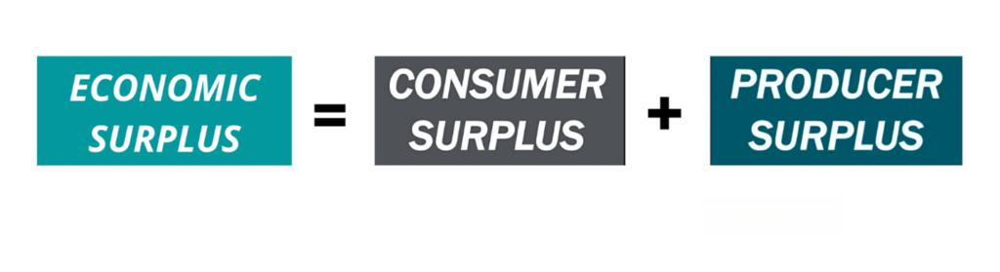

The concept of surplus is integral to understanding various economic and financial phenomena. Surplus can be broadly defined as the situation where the aggregate supply of a resource or service exceeds its demand, leading to different implications and interpretations across contexts. In economics, surplus manifests in forms such as consumer surplus and producer surplus, both of which offer insights into market transactions and societal welfare.

Consumer surplus occurs when individuals are able to purchase a product or service for a price lower than the maximum they are willing to pay. This represents the additional benefit that consumers receive from a transaction, reflecting the utility derived beyond the price paid. Producer surplus, on the other hand, is realized when sellers receive a price higher than the minimum at which they would be willing to sell their product, signifying the added benefit accrued to producers over their costs.



In financial markets, the concept of surplus takes on another dimension through excess production—when goods produced exceed the market demand. This situation can lead to a shift in market dynamics as supplies exceed the market's capacity to consume them, potentially driving down prices and impacting producers' financial viability.

Algorithmic trading, or algo trading, introduces a modern technological framework to manage and exploit surpluses. This approach utilizes predetermined algorithms to make trading decisions, allowing for the swift adaptation to market conditions and the efficient exploitation of surplus situations. By analyzing vast amounts of data, algorithms can strategically execute trades to optimize financial outcomes.

This article explores the interplay between these various forms of surplus—economic surplus, financial surplus, excess production—and the role of algorithmic trading in managing these conditions. Understanding these dynamics provides valuable insights for policymakers, businesses, and traders in navigating the complexities of modern economic systems.

## Table of Contents

## Understanding Economic Surplus

Economic surplus is a fundamental concept in economics that reflects the net benefits to society from the production and consumption of goods and services within a free market. This concept is divided into two main components: consumer surplus and producer surplus, both of which contribute to the overall economic welfare.

Consumer surplus represents the difference between what consumers are willing to pay for a product and what they actually pay. It is a measure of the benefit that consumers receive when they purchase a good or service at a price lower than their maximum willingness to pay. Mathematically, consumer surplus can be illustrated as the area between the demand curve and the market price level, up to the quantity consumed. For a simple linear demand curve, the consumer surplus is given by:

$$
\text{Consumer Surplus} = \frac{1}{2} \times \text{Quantity} \times (\text{Maximum Price willing to pay} - \text{Market Price})
$$

Producer surplus, on the other hand, is the difference between the price at which producers are willing to sell a good and the higher price they actually receive. This surplus is a measure of the benefit producers gain from selling at a market price that exceeds their minimum acceptable price. Similar to consumer surplus, producer surplus can be calculated as the area above the supply curve and below the market price. For a linear supply curve, producer surplus can be expressed as:

$$
\text{Producer Surplus} = \frac{1}{2} \times \text{Quantity} \times (\text{Market Price} - \text{Minimum Price sellers accept})
$$

The sum of consumer and producer surplus constitutes the total economic surplus, often referred to as social surplus. This total surplus is maximized at the point of market equilibrium—where the quantity demanded equals the quantity supplied. At equilibrium, the allocation of resources is most efficient, meaning no additional trades could make one party better off without making another party worse off. This efficiency results in the optimal distribution of goods and services, maximizing the overall welfare in the economy.

Market equilibrium is crucial for ensuring maximum social surplus. When markets are in equilibrium, any deviation would lead to a decrease in total surplus, either through surplus loss from consumers or producers. Efficient market operations aim to maintain this equilibrium to ensure that both consumer and producer benefits are balanced, ultimately contributing to a more efficient and prosperous economy.

## Financial Surplus and Budgetary Implications

A financial surplus is a key indicator of economic health for both governmental and business entities. It represents the situation where revenue exceeds expenditures, thereby creating a positive balance. This fiscal condition is desirable as it allows for multiple strategic financial management options.

Achieving a budget surplus can enhance financial stability. For governments, it can serve as a cushion against economic fluctuations, providing a buffer during periods of economic downturns. During periods of economic growth, governments often strive to run surpluses with the objective of building reserves that can be deployed in challenging times. This strategic financial planning ensures that economic policies are sustainable over the long term, minimizing the need for austerity measures during economic recessions.

For businesses, a financial surplus enables reinvestment into operations, research and development, or exploring new markets. It also allows firms to pay down existing debt, thereby improving their balance sheet and reducing financial risk. The management of surplus funds must be carefully orchestrated to maximize returns while ensuring [liquidity](/wiki/liquidity-risk-premium) for future needs.

However, managing excess financial surplus comes with its own challenges. If not effectively allocated, surplus funds can lead to inefficiencies or the misallocation of resources. For example, hoarding surplus without reinvesting can slow economic growth and innovation. Moreover, decisions regarding surplus deployment must consider future economic conditions and potential investment avenues to prevent financial distortion in markets. 

Optimal management of financial surplus requires a balance between saving and investment. Techniques such as economic forecasting and risk assessment are fundamental in determining the best use of surplus funds. Businesses and governments need to develop robust strategies to handle their surpluses responsibly, ensuring they contribute to overall economic stability and growth.

## Excess Production and Market Dynamics

Excess production occurs when the quantity of goods produced surpasses the quantity demanded in the market. This situation typically results in a decrease in market prices as suppliers attempt to sell their surplus inventory. The basic economic principle of supply and demand dictates that, when supply exceeds demand, prices generally decline. As a result, producers may face financial challenges if they cannot sell their inventory at prices that cover production costs, potentially leading to losses.

When excess production leads to market disequilibrium, the market often undergoes a self-correcting process. Lower prices can stimulate demand or discourage further production until equilibrium between supply and demand is restored. This self-regulating mechanism highlights the dynamic nature of market economies, where imbalances are typically temporary and lead to adjustments in price and supply levels.

Government interventions sometimes occur in response to excess production. One common measure is the implementation of price floors, legally enforced minimum prices for certain goods. While price floors can help maintain producer surplus by ensuring producers receive a minimum payment for their goods, they may inadvertently reduce social surplus. Price floors can lead to unsold excess inventory, inefficiencies, and potential market distortions as they disrupt the natural adjustment of supply and demand.

Effective management of excess production requires strategic planning and a thorough understanding of market conditions. Producers must anticipate demand accurately, managing production levels accordingly to avoid the costs associated with surplus inventory. Techniques such as demand forecasting, inventory management, and flexible production processes can mitigate the financial impacts of excess production. Additionally, producers can explore alternative markets or diversify their product offerings to absorb surpluses and minimize potential losses.

To illustrate, consider a scenario where a farmer produces more tomatoes than the local market demands. The excess tomatoes reduce prices, compelling the farmer to sell at a loss or let the tomatoes spoil. However, adopting strategies like diversifying crops, entering secondary markets, or processing tomatoes into derivative products (e.g., sauces or canned goods) can alleviate financial pressure from excess production.

## The Role of Algorithmic Trading

Algorithmic trading utilizes sophisticated computer algorithms to automate trading activities based on a set of predetermined criteria. This process allows traders and financial institutions to respond swiftly to market changes, efficiently managing economic surpluses by capitalizing on price differentials. The algorithms are designed to analyze vast amounts of market data in real-time, identifying trends, patterns, and [arbitrage](/wiki/arbitrage) opportunities that may be fleetingly available in the fast-paced trading environment.

Enhancing market liquidity is a notable advantage of [algorithmic trading](/wiki/algorithmic-trading). By increasing the [volume](/wiki/volume-trading-strategy) of trades executed in the market, these algorithms help tighten bid-ask spreads and contribute to more robust price discovery. Similarly, automation drastically reduces transaction costs. Manual trading involves human intervention with potentially higher costs associated with labor and slower execution times. Algorithmic trading minimizes these expenses, allowing traders to execute high-frequency trades at a fraction of traditional costs.

Despite its benefits, algorithmic trading is not without risks. One significant concern is the potential for massive sell-offs catalyzed by algorithm errors or market misinterpretations. Algorithms operate based on coded logic and predefined parameters, and if there is a flaw in the programming or an unexpected market condition arises, it can lead to abrupt and substantial market movements. Such events may result in significant financial losses across markets, as observed during incidents like the 2010 Flash Crash.

Effectively managing these risks requires an intricate balance between speed, strategy, and control. Traders must ensure that their algorithms are equipped with failsafe mechanisms to prevent unintended market impacts. Regular monitoring, [backtesting](/wiki/backtesting), and updating of algorithmic strategies are essential to maintaining their efficacy and responsiveness to evolving market conditions. Ensuring robust risk management frameworks within algorithmic systems is paramount to controlling the inherent [volatility](/wiki/volatility-trading-strategies) that accompanies automated trading.

In conclusion, algorithmic trading's ability to efficiently manage surpluses and enhance market operations is invaluable to modern financial markets. The continued development of these strategies, fortified by advancements in technology and robust risk management practices, will ensure their pivotal role in future market dynamics.

## Intersections: Surplus and Algorithmic Strategies

Algorithmic strategies harness periods of economic surplus to maximize trading gains through a computational approach that blends economic theory with advanced technology. Surpluses, by their very nature, create valuable data and patterns which algorithms exploit to optimize trading decisions. These patterns help algorithms identify price anomalies and arbitrage opportunities, allowing traders to make informed buy or sell decisions swiftly.

Producers facing excess production can benefit significantly from algorithmic trading by aligning supply with demand. Instead of incurring losses from unsold inventory, producers can use data-driven strategies to adjust pricing dynamically, distribute surplus products to alternative markets, or hedge against potential declines in market prices. This alignment ensures a more efficient distribution of resources and helps stabilize prices by addressing supply overhangs promptly.

The success of algorithmic trading in managing surpluses depends heavily on precise data analysis and decision-making capabilities. Algorithms analyze large datasets to detect trends and correlations that human traders might overlook. For example, a simple moving average crossover strategy might signal a potential price increase when the short-term average rises above the long-term average, prompting a buy action.

```python
# Example of a moving average crossover strategy in Python
import pandas as pd

def moving_average_crossover(data, short_window=40, long_window=100):
    signals = pd.DataFrame(index=data.index)
    signals['price'] = data['price']
    signals['short_mavg'] = data['price'].rolling(window=short_window).mean()
    signals['long_mavg'] = data['price'].rolling(window=long_window).mean()

    signals['signal'] = 0.0
    signals['signal'][short_window:] = np.where(signals['short_mavg'][short_window:] 
                                                 > signals['long_mavg'][short_window:], 1.0, 0.0)   

    signals['positions'] = signals['signal'].diff()

    return signals
```

As technology advances, the potential for [artificial intelligence](/wiki/ai-artificial-intelligence) (AI) and [machine learning](/wiki/machine-learning) to refine surplus management strategies in trading becomes increasingly significant. AI models can forecast market trends with greater accuracy by learning from historical data and simulating various market scenarios. Machine learning approaches allow for the continuous adaptation of trading algorithms to changing market conditions, enhancing their ability to manage surpluses effectively.

Incorporating AI and machine learning in trading strategies not only optimizes economic gains from surpluses but also enhances market efficiency by contributing to liquidity and narrowing bid-ask spreads. As these technologies evolve, they promise more sophisticated approaches to surplus management, ensuring that future trading systems will be more resilient and robust in capitalizing on economic and financial surpluses.

## Conclusion

Economic and financial surpluses are integral to market dynamics and fiscal policies, acting as a catalyst for stability and growth within economic systems. Effective management of these surpluses provides pathways to achieving more stable, efficient, and profitable economic outcomes. By harnessing both economic and financial surpluses, entities can optimize resource allocation, strengthen financial security, and invigorate economic [momentum](/wiki/momentum). 

Algorithmic trading represents a pivotal shift in surplus management, offering a sophisticated, computational avenue for addressing market complexities. By employing algorithms, traders can efficiently exploit surplus conditions, enabling rapid adaptation to market fluctuations and identifying opportunities for profit maximization. This method relies heavily on precise data analysis and strategic execution, making it a cornerstone of modern financial markets.

As technology continues to advance, the intersection of economic theory and computational methods such as algorithmic trading is expected to deepen. Innovations in artificial intelligence and machine learning are poised to enhance the capabilities of surplus management, fostering more nuanced and adaptive trading strategies. These technological advancements can lead to the development of algorithms that are not only faster but also more intelligent in anticipating market trends and responding to surplus conditions.

A balanced approach to deploying surplus and trading strategies is crucial for future market success. This involves a keen understanding of economic fundamentals, coupled with the strategic application of cutting-edge technology. By aligning these elements, markets can achieve greater resilience and efficiency, paving the way for sustainable economic prosperity. The continual integration of surplus management and algorithmic trading strategies is likely to be a defining [factor](/wiki/factor-investing) in the evolving landscape of financial markets.

## References & Further Reading

[1]: Bergstra, J., Bardenet, R., Bengio, Y., & Kégl, B. (2011). ["Algorithms for Hyper-Parameter Optimization."](https://proceedings.neurips.cc/paper/2011/file/86e8f7ab32cfd12577bc2619bc635690-Paper.pdf) Advances in Neural Information Processing Systems 24.

[2]: ["Advances in Financial Machine Learning"](https://www.amazon.com/Advances-Financial-Machine-Learning-Marcos/dp/1119482089) by Marcos Lopez de Prado

[3]: ["Evidence-Based Technical Analysis: Applying the Scientific Method and Statistical Inference to Trading Signals"](https://www.amazon.com/Evidence-Based-Technical-Analysis-Scientific-Statistical/dp/0470008741) by David Aronson

[4]: ["Machine Learning for Algorithmic Trading"](https://github.com/PacktPublishing/Machine-Learning-for-Algorithmic-Trading-Second-Edition) by Stefan Jansen

[5]: ["Quantitative Trading: How to Build Your Own Algorithmic Trading Business"](https://books.google.com/books/about/Quantitative_Trading.html?id=j70yEAAAQBAJ) by Ernest P. Chan