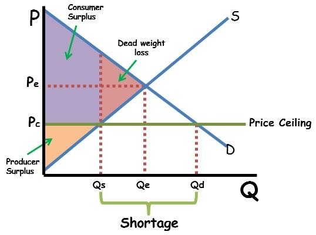

## Table of Contents

## What is economic surplus?

Economic surplus is a concept in economics that shows how well an economy is doing. It is the total of consumer surplus and producer surplus. Consumer surplus is the difference between what consumers are willing to pay for a good or service and what they actually have to pay. Producer surplus is the difference between what producers are willing to accept for a good or service and what they actually receive. When you add these two surpluses together, you get the economic surplus, which tells us how much extra value is being created in the economy.

Economic surplus is important because it helps us understand how resources are being used and how much benefit people are getting from the economy. When economic surplus is high, it means that both consumers and producers are getting more value than they expected, which is good for the economy. If the surplus is low, it might mean that resources are not being used efficiently, and there could be ways to improve how the economy works. By looking at economic surplus, economists can suggest ways to make the economy better for everyone.

## How is economic surplus different from economic profit?

Economic surplus and economic profit are two different ideas in economics. Economic surplus is about the total extra value that both buyers and sellers get from trading goods or services. It's the sum of consumer surplus, which is how much more buyers were willing to pay than they actually did, and producer surplus, which is how much more sellers got than the least they would have accepted. So, economic surplus shows the overall benefit to society from economic activities.

On the other hand, economic profit is about how much money a business makes after paying all its costs, including the opportunity costs. Opportunity costs are what the business owners could have earned if they had used their resources in a different way. Economic profit is important for a business because it shows if the business is doing better than other possible uses of the same resources. While economic surplus looks at the well-being of both buyers and sellers, economic profit focuses only on the financial gain of the business.

## What are the components of economic surplus?

Economic surplus is made up of two parts: consumer surplus and producer surplus. Consumer surplus is the extra value that buyers get when they buy something for less than they were willing to pay. Imagine you really want a toy that you think is worth $20, but you find it on sale for $10. The $10 difference is your consumer surplus because you got more value than you expected.

Producer surplus is the extra money that sellers make when they sell something for more than the lowest price they would have accepted. For example, if a farmer is willing to sell apples for $1 per pound but ends up selling them for $2 per pound, the extra $1 per pound is the producer surplus. When you add up the consumer surplus and the producer surplus, you get the total economic surplus, which shows how much extra value is created in the economy from everyone trading with each other.

## How is consumer surplus calculated?

Consumer surplus is the difference between what someone is willing to pay for something and what they actually pay. Imagine you want a toy and you think it's worth $20 to you. But when you go to the store, you find it on sale for $10. The $10 difference between what you were willing to pay ($20) and what you actually paid ($10) is your consumer surplus. It's like getting a bonus because you got more value than you expected.

To calculate consumer surplus for a whole market, you need to look at the demand curve. The demand curve shows how many people want to buy something at different prices. The area under the demand curve but above the price line represents the total consumer surplus. If you draw a graph, the consumer surplus is the area of the triangle or shape formed between the demand curve and the price line. This area shows how much extra value all the buyers in the market are getting from their purchases.

## How is producer surplus calculated?

Producer surplus is the extra money that sellers get when they sell something for more than the lowest price they would accept. Imagine a farmer who is willing to sell apples for $1 per pound but ends up selling them for $2 per pound. The extra $1 per pound is the farmer's producer surplus. It's like a bonus because the farmer got more money than expected.

To find out the total producer surplus for a whole market, you look at the supply curve. The supply curve shows how many sellers are willing to sell at different prices. The area above the supply curve but below the price line is the total producer surplus. If you draw a graph, the producer surplus is the area of the triangle or shape between the supply curve and the price line. This area shows how much extra money all the sellers in the market are getting from their sales.

## What role does economic surplus play in market efficiency?

Economic surplus helps us see how well a market is working. When the total economic surplus, which is the sum of consumer surplus and producer surplus, is big, it means the market is doing a good job. It shows that people are getting more value than they expected when they buy things, and sellers are making more money than they needed to. This means resources are being used in a smart way, and everyone is happy with the trades they are making.

If the economic surplus is small, it might mean the market isn't working as well as it could. Maybe prices are too high, or there aren't enough goods to go around. When this happens, people might not be able to buy what they want, or sellers might not be able to sell as much as they could. By looking at the economic surplus, we can find ways to make the market better, like changing prices or making more goods, so that everyone can get more value from their trades.

## How do changes in supply and demand affect economic surplus?

Changes in supply and demand can have a big impact on economic surplus. When demand for a product goes up, people are willing to pay more for it. This can lead to a higher price, which might reduce the consumer surplus because people are paying more than before. But if the supply stays the same or increases, producers might be able to sell more at the higher price, which could increase the producer surplus. The total economic surplus might go up if the gain in producer surplus is more than the loss in consumer surplus.

On the other hand, if the supply of a product goes up, the price might go down because there's more of the product available. This can increase the consumer surplus because people are paying less than before. But it might reduce the producer surplus because sellers are getting less money for each item they sell. If the increase in consumer surplus is bigger than the decrease in producer surplus, the total economic surplus could still go up. So, changes in supply and demand can shift the economic surplus around, but the total amount can still grow if the market adjusts well.

## Can economic surplus be negative, and what does that indicate?

Economic surplus can't be negative in the way we usually think about it. It's the total of consumer surplus and producer surplus, and both of these are always positive or zero. Consumer surplus is how much more people were willing to pay than they actually did, and producer surplus is how much more sellers got than the least they would have accepted. So, even if one of them is zero, the total economic surplus will still be at least zero.

But, if we think about it differently, a situation where economic surplus seems negative could mean that the market isn't working well. For example, if a product is being sold at a price higher than what anyone is willing to pay, no one will buy it, and there will be no consumer surplus or producer surplus. This can happen if there are big problems in the market, like too much control over prices or not enough competition. In these cases, it's not that the economic surplus is negative, but that it's zero, showing that the market isn't creating any extra value for anyone.

## What are the implications of government policies on economic surplus?

Government policies can change how much economic surplus there is in a market. If the government puts a tax on something, it can make the price go up. This means people might pay more for it, which can make their consumer surplus smaller. But the government gets the tax money, which it can use to help the economy in other ways. If the government gives money to producers, like subsidies, it can make the price go down. This can make the consumer surplus bigger because people pay less, but it might make the producer surplus smaller because the government is helping them out.

Sometimes, the government makes rules about prices, like setting a maximum price or a minimum price. If they set a maximum price that's lower than what the market would normally be, it can make the consumer surplus bigger because people pay less. But it can also make the producer surplus smaller because sellers get less money. If they set a minimum price that's higher than what the market would normally be, it can make the producer surplus bigger because sellers get more money, but it can make the consumer surplus smaller because people have to pay more. These policies can help some people but might hurt others, so the government has to think carefully about how to make the total economic surplus as big as possible for everyone.

## How does economic surplus relate to welfare economics?

Economic surplus is a big part of welfare economics, which looks at how well off people are in the economy. Welfare economics tries to understand how resources are shared and how happy people are with what they get. Economic surplus helps with this by showing how much extra value is created when people buy and sell things. It's made up of consumer surplus, which is how much more people were willing to pay than they actually did, and producer surplus, which is how much more sellers got than the least they would have accepted. When the economic surplus is big, it means the economy is doing a good job of making people happy with their trades.

Welfare economists use economic surplus to see if the economy is working well and to suggest ways to make it better. If the economic surplus is small, it might mean that resources aren't being used in the best way, and people aren't getting as much value as they could. Governments can use policies like taxes, subsidies, and price controls to change the economic surplus. For example, a tax might make consumer surplus smaller but give the government money to help the economy in other ways. By looking at how these policies affect economic surplus, welfare economists can help make sure that the economy is working to make as many people as possible better off.

## What are the limitations of using economic surplus as a measure of economic well-being?

Economic surplus is a good way to see how well the economy is doing, but it has some problems. One big problem is that it doesn't look at how money is shared among people. If a few people get a lot of the surplus and most people get very little, the total surplus might look big, but many people might not feel well off. Also, economic surplus doesn't think about things like the environment or how happy people are. If making more surplus means hurting the environment or making people work too hard, then it might not be good for overall well-being.

Another problem is that economic surplus only looks at what people buy and sell. It doesn't count things that people do for free, like taking care of family or helping neighbors. These things are important for how well off people feel, but they don't show up in economic surplus. Also, economic surplus can be hard to measure because it depends on how much people say they are willing to pay, which can change and might not be the same as how much they really value something. So, while economic surplus is useful, it's not the whole story of how well people are doing.

## How can advanced economic models enhance the analysis of economic surplus?

Advanced economic models can help us understand economic surplus better by looking at more details and different situations. These models can take into account things like how people's tastes change over time or how new technology can affect what people want to buy and sell. They can also show how different groups of people, like rich and poor, might get different amounts of surplus. By using computers and math, these models can look at many different scenarios quickly and help us see what might happen if the economy changes in certain ways.

Using these advanced models, economists can make better guesses about how government policies will affect economic surplus. For example, they can see how a new tax might change prices and how that would affect both consumer and producer surplus. They can also look at how different markets are connected and how a change in one market might affect others. This helps policymakers make choices that could make the total economic surplus bigger, leading to a better economy for everyone.

## What is Understanding Economic Surplus?

Economic surplus is a fundamental concept in economics that reflects the net benefits to society from the production and consumption of goods and services within a free market. This concept is divided into two main components: consumer surplus and producer surplus, both of which contribute to the overall economic welfare.

Consumer surplus represents the difference between what consumers are willing to pay for a product and what they actually pay. It is a measure of the benefit that consumers receive when they purchase a good or service at a price lower than their maximum willingness to pay. Mathematically, consumer surplus can be illustrated as the area between the demand curve and the market price level, up to the quantity consumed. For a simple linear demand curve, the consumer surplus is given by:

$$
\text{Consumer Surplus} = \frac{1}{2} \times \text{Quantity} \times (\text{Maximum Price willing to pay} - \text{Market Price})
$$

Producer surplus, on the other hand, is the difference between the price at which producers are willing to sell a good and the higher price they actually receive. This surplus is a measure of the benefit producers gain from selling at a market price that exceeds their minimum acceptable price. Similar to consumer surplus, producer surplus can be calculated as the area above the supply curve and below the market price. For a linear supply curve, producer surplus can be expressed as:

$$
\text{Producer Surplus} = \frac{1}{2} \times \text{Quantity} \times (\text{Market Price} - \text{Minimum Price sellers accept})
$$

The sum of consumer and producer surplus constitutes the total economic surplus, often referred to as social surplus. This total surplus is maximized at the point of market equilibrium—where the quantity demanded equals the quantity supplied. At equilibrium, the allocation of resources is most efficient, meaning no additional trades could make one party better off without making another party worse off. This efficiency results in the optimal distribution of goods and services, maximizing the overall welfare in the economy.

Market equilibrium is crucial for ensuring maximum social surplus. When markets are in equilibrium, any deviation would lead to a decrease in total surplus, either through surplus loss from consumers or producers. Efficient market operations aim to maintain this equilibrium to ensure that both consumer and producer benefits are balanced, ultimately contributing to a more efficient and prosperous economy.

## References & Further Reading

[1]: Bergstra, J., Bardenet, R., Bengio, Y., & Kégl, B. (2011). ["Algorithms for Hyper-Parameter Optimization."](https://proceedings.neurips.cc/paper/2011/file/86e8f7ab32cfd12577bc2619bc635690-Paper.pdf) Advances in Neural Information Processing Systems 24.

[2]: ["Advances in Financial Machine Learning"](https://www.amazon.com/Advances-Financial-Machine-Learning-Marcos/dp/1119482089) by Marcos Lopez de Prado

[3]: ["Evidence-Based Technical Analysis: Applying the Scientific Method and Statistical Inference to Trading Signals"](https://www.amazon.com/Evidence-Based-Technical-Analysis-Scientific-Statistical/dp/0470008741) by David Aronson

[4]: ["Machine Learning for Algorithmic Trading"](https://github.com/PacktPublishing/Machine-Learning-for-Algorithmic-Trading-Second-Edition) by Stefan Jansen

[5]: ["Quantitative Trading: How to Build Your Own Algorithmic Trading Business"](https://books.google.com/books/about/Quantitative_Trading.html?id=j70yEAAAQBAJ) by Ernest P. Chan