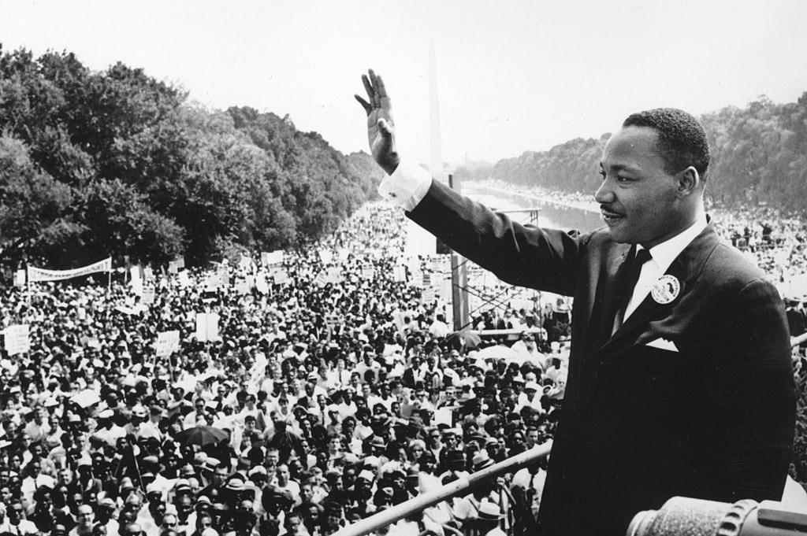

## Table of Contents

## What is the main focus of Martin Luther King Jr.'s 'I Have a Dream' speech?

Martin Luther King Jr.'s 'I Have a Dream' speech mainly focuses on the dream of equality and freedom for all people, no matter their skin color. He talks about how African Americans were not free even though the Emancipation Proclamation was supposed to set them free. He says that they are still not treated the same as white people and are facing a lot of unfairness.

King dreams of a world where everyone can live together peacefully and with equal rights. He imagines a future where his children can grow up in a country where they are judged by their character, not by the color of their skin. He believes that one day, people of all races will be able to join hands and live in harmony, and he calls on everyone to work together to make this dream come true.

## How does Martin Luther King Jr. address economic inequality in his 'I Have a Dream' speech?

In his 'I Have a Dream' speech, Martin Luther King Jr. talks about economic inequality by saying that African Americans are still not free, even though they were supposed to be. He explains that many African Americans are poor and don't have the same opportunities as white people. He mentions that they live in poverty and can't get good jobs or education because of their skin color. This makes it hard for them to have a better life.

King believes that economic inequality is a big problem that needs to be fixed. He dreams of a world where everyone, no matter their skin color, can have a good job and live comfortably. He thinks that if everyone works together, they can make sure that all people have the same chances to succeed. He wants to see a future where economic fairness is a reality for everyone.

## What specific economic issues does Martin Luther King Jr. mention in the speech?

In his 'I Have a Dream' speech, Martin Luther King Jr. talks about how African Americans are stuck in poverty. He says they live on a "lonely island of poverty" in the middle of a "vast ocean of material prosperity." This means that while many people around them are doing well and have money, African Americans are left behind and struggling to make ends meet.

King also mentions that African Americans can't get good jobs because of their skin color. He says they are often pushed into low-paying jobs and don't have the same chances as white people to move up in the world. He dreams of a time when everyone can work together to make sure all people have the same opportunities to earn a good living and live a better life.

## How does the economic context of the 1960s influence the themes in the 'I Have a Dream' speech?

In the 1960s, the United States was going through big changes. The economy was growing, but not everyone was feeling the benefits. Many African Americans were still very poor and had trouble finding good jobs. This was because of racism and unfair laws that kept them from having the same opportunities as white people. Martin Luther King Jr. saw this and talked about it in his 'I Have a Dream' speech. He wanted to show how economic inequality was a big problem that needed to be fixed.

King used the economic struggles of African Americans to make his point stronger. He talked about how they were living in poverty even though the country was getting richer. He dreamed of a world where everyone could have a good job and a better life, no matter their skin color. By bringing up these economic issues, King showed how important it was to fight for equal rights and opportunities for all people. He believed that everyone should work together to make sure that everyone could share in the country's prosperity.

## Can you identify any indirect references to economic themes in the speech?

In his 'I Have a Dream' speech, Martin Luther King Jr. talks about how African Americans are not free even though the Emancipation Proclamation was supposed to set them free. He says they are living on a "lonely island of poverty" in the middle of a "vast ocean of material prosperity." This means that while the country is getting richer, African Americans are still poor and don't have the same chances as white people. King is indirectly pointing out how the economy is not fair to everyone and how African Americans are left behind.

King also dreams of a future where his children can grow up in a country where they are judged by their character, not by the color of their skin. This dream includes a world where everyone can have a good job and live comfortably. By talking about this dream, King is indirectly saying that economic fairness is important. He wants everyone to work together to make sure that all people have the same opportunities to succeed and live a better life.

## How do the economic themes in the 'I Have a Dream' speech relate to the broader Civil Rights Movement?

The economic themes in Martin Luther King Jr.'s 'I Have a Dream' speech are very important to the broader Civil Rights Movement. In the 1960s, many African Americans were poor and had trouble finding good jobs because of racism. King talked about this in his speech to show how important it was to fight for equal rights and opportunities. He wanted to make sure that everyone knew that economic inequality was a big problem that needed to be fixed. By talking about how African Americans were living in poverty while the country was getting richer, King connected the fight for civil rights with the need for economic fairness.

The Civil Rights Movement was not just about ending segregation and getting the right to vote. It was also about making sure that African Americans could have the same chances as white people to get good jobs and live a better life. King's speech showed how these economic issues were a big part of the movement. He dreamed of a world where everyone could work together to make sure that all people had the same opportunities to succeed. By focusing on economic themes, King made it clear that the fight for civil rights was also a fight for economic justice.

## What was the economic situation of African Americans during the time of the speech, and how does King address this?

During the time of Martin Luther King Jr.'s 'I Have a Dream' speech in 1963, many African Americans were very poor. They had trouble finding good jobs and often ended up in low-paying work. This was because of racism and unfair laws that kept them from having the same opportunities as white people. Even though the country was getting richer, African Americans were left behind and struggled to make ends meet. They lived in poverty and didn't have the same chances to move up in the world.

In his speech, Martin Luther King Jr. talks about how African Americans are living on a "lonely island of poverty" in the middle of a "vast ocean of material prosperity." He is saying that while many people around them are doing well and have money, African Americans are still struggling. King dreams of a world where everyone can have a good job and live comfortably, no matter their skin color. He believes that if everyone works together, they can make sure that all people have the same opportunities to succeed. By talking about these economic issues, King shows how important it is to fight for equal rights and a better life for everyone.

## How have interpretations of the economic themes in the 'I Have a Dream' speech evolved over time?

When Martin Luther King Jr. gave his 'I Have a Dream' speech in 1963, people mostly focused on the big ideas about ending racism and wanting everyone to be treated the same. But as time went on, more and more people started to see how important the economic parts of the speech were. King talked about how African Americans were poor and couldn't get good jobs. He said they were living in poverty while the country was getting richer. This made people think more about how economic fairness is a big part of fighting for equal rights.

Over the years, people have looked at King's words in new ways. They see that he was not just talking about ending segregation and getting the right to vote. He also wanted African Americans to have the same chances as white people to get good jobs and live a better life. Today, many people think about how economic inequality is still a problem and how we need to keep working to make things fair for everyone. King's dream of economic justice is still important, and his speech helps us remember that we need to fight for both equal rights and a fair economy.

## What are some critiques of how Martin Luther King Jr. addressed economic issues in the 'I Have a Dream' speech?

Some people think that Martin Luther King Jr. did not talk about economic issues enough in his 'I Have a Dream' speech. They say that he focused more on ending racism and wanting everyone to be treated the same, but he did not go into a lot of detail about how African Americans were poor and couldn't get good jobs. These people think that King should have talked more about how important it is to fix economic problems to really make things fair for everyone.

Others believe that King did talk about economic issues, but he did it in a way that was not strong enough. They say that he used words like "lonely island of poverty" and "vast ocean of material prosperity," but he did not give specific plans on how to fix these problems. These critics think that King's speech would have been more powerful if he had talked more about what needed to be done to help African Americans get out of poverty and have the same chances as white people.

## How do the economic themes in the speech compare to those in other speeches by Martin Luther King Jr.?

In the 'I Have a Dream' speech, Martin Luther King Jr. talks about how African Americans are poor and can't get good jobs. He says they are living in poverty while the country is getting richer. King dreams of a world where everyone can have a good job and live comfortably, no matter their skin color. He believes that if everyone works together, they can make sure that all people have the same opportunities to succeed. This speech shows how important it is to fight for equal rights and a better life for everyone.

In other speeches, like 'Beyond Vietnam' and 'The Three Evils of Society,' King talks more directly about economic issues. In 'Beyond Vietnam,' he says that the war is making it harder for poor people to get help and have a better life. He believes that the money spent on the war could be used to help people in need. In 'The Three Evils of Society,' King talks about how poverty, racism, and war are all connected. He says that fixing economic problems is a big part of fighting for equal rights. Compared to the 'I Have a Dream' speech, these speeches go into more detail about how to fix economic problems and why they are so important.

## What impact did the economic themes in the 'I Have a Dream' speech have on subsequent economic policies?

The economic themes in Martin Luther King Jr.'s 'I Have a Dream' speech helped people see that fighting for equal rights also meant fighting for a fair economy. After the speech, more people started to think about how African Americans were poor and couldn't get good jobs. This made them want to change laws and policies to help everyone have the same chances to succeed. The speech made people realize that ending racism was not enough; they also needed to fix economic problems to make things fair for everyone.

Over time, the ideas from King's speech helped shape new laws and programs. For example, the Civil Rights Act of 1964 and the Voting Rights Act of 1965 were important steps toward equal rights, but people also started to focus on economic fairness. Programs like affirmative action and efforts to help poor people get better jobs and education were influenced by King's call for economic justice. Even though there is still a lot of work to do, King's speech helped start important conversations about how to make the economy fair for everyone.

## How can the economic themes from the 'I Have a Dream' speech be applied to contemporary economic issues?

The economic themes from Martin Luther King Jr.'s 'I Have a Dream' speech still matter today. King talked about how African Americans were poor and couldn't get good jobs. This is still a problem for many people, not just African Americans. Today, people from all different backgrounds face economic inequality. They struggle to find good jobs and live in poverty while others around them are doing well. King's speech reminds us that we need to work together to make sure everyone has the same chances to succeed and live a better life.

King dreamed of a world where everyone could have a good job and live comfortably, no matter their skin color. This dream can help us think about what we need to do today to make the economy fair for everyone. We can use his ideas to support policies that help people get better education and job opportunities. We can also work to make sure that everyone has a fair chance to earn a good living. By remembering King's words, we can keep fighting for economic justice and help build a world where everyone can share in the country's prosperity.

## References & Further Reading

[1]: ["Stride Toward Freedom: The Montgomery Story"](https://kinginstitute.stanford.edu/stride-toward-freedom-montgomery-story) by Martin Luther King Jr.

[2]: ["Where Do We Go from Here: Chaos or Community?"](https://en.wikipedia.org/wiki/Where_Do_We_Go_from_Here:_Chaos_or_Community%3F) by Martin Luther King Jr.

[3]: McCarty, N. (2006). ["Race, Income, and Public Schooling in the United States."](https://compass.onlinelibrary.wiley.com/doi/abs/10.1111/soc4.12386) American Behavioral Scientist, 49(7).

[4]: ["Why We Can't Wait"](https://kinginstitute.stanford.edu/why-we-cant-wait) by Martin Luther King Jr.

[5]: Narang, R. (2013). ["Inside the Black Box: A Simple Guide to Quantitative and High Frequency Trading"](https://onlinelibrary.wiley.com/doi/book/10.1002/9781118662717).

[6]: ["The Three Trillion Dollar War: The True Cost of the Iraq Conflict"](https://www.amazon.com/Three-Trillion-Dollar-War-Conflict/dp/0393067017) by Joseph E. Stiglitz and Linda J. Bilmes

[7]: ("Flash Boys: A Wall Street Revolt"](https://en.wikipedia.org/wiki/Flash_Boys) by Michael Lewis

[8]: ["The Speech: The Story Behind Dr. Martin Luther King Jr.’s Dream"](https://archive.org/details/speechstorybehin0000youn) by Gary Younge