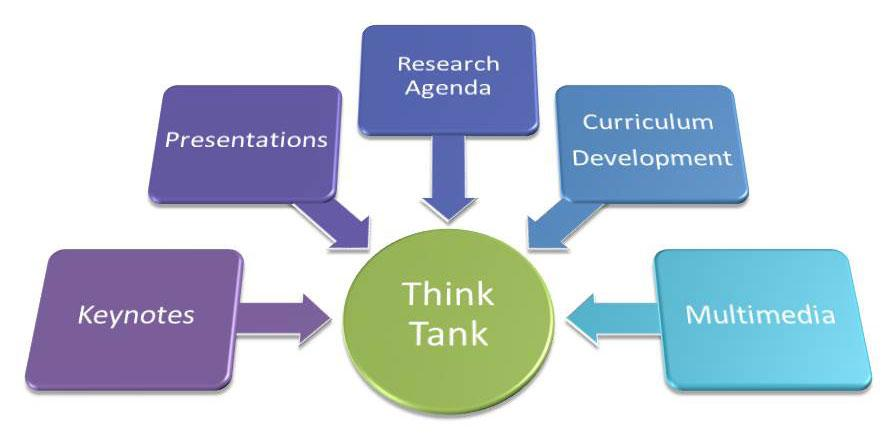

## Table of Contents

## What is an economic think tank?

An economic think tank is a group of experts who study and give advice on economic issues. They do research, write reports, and suggest new ideas to help governments, businesses, and other organizations make better decisions about the economy. Think tanks are often independent, which means they are not controlled by the government or a political party. This allows them to give honest and unbiased opinions.

Think tanks can focus on many different areas of the economy, like jobs, taxes, or trade. They might suggest ways to create more jobs, make taxes fairer, or help countries trade with each other more easily. Some think tanks are well-known and respected, so their ideas can influence important decisions. For example, a think tank might suggest a new law to help small businesses, and if the government likes the idea, they might turn it into a real law.

## What is the primary function of an economic think tank?

The main job of an economic think tank is to study and understand the economy. They look at things like how people spend money, how businesses work, and how governments make economic decisions. By doing this, they can figure out what is happening in the economy and why. They use this information to come up with new ideas and solutions to economic problems.

These think tanks then share their findings and suggestions through reports, articles, and sometimes even by talking to the media. Their goal is to help people who make important decisions, like government leaders and business owners, understand the economy better. By doing this, they hope to influence policies and actions that can make the economy stronger and help more people.

## How do economic think tanks influence public policy?

Economic think tanks influence public policy by doing a lot of research and then sharing what they find. They write reports and papers that explain how the economy works and what could be done to make it better. When these reports are good and make sense, people who make laws and rules, like government leaders, read them. If the ideas in the reports seem helpful, these leaders might use them to make new laws or change old ones. This way, think tanks can help shape what the government does about the economy.

Think tanks also talk to the media and the public. They go on TV, write in newspapers, and use the internet to explain their ideas. When more people know about these ideas, it can put pressure on the government to listen. If a lot of people start talking about a think tank's idea, it can become popular and important. Then, politicians might decide to use the idea to win support from voters. So, by getting their ideas out to the public, think tanks can push for changes in public policy.

## What are the different types of economic think tanks?

There are different types of economic think tanks, and they can be grouped in a few ways. Some think tanks are called "advocacy think tanks." They have strong beliefs about what should happen in the economy and they try to get people to agree with them. They might want lower taxes or more help for poor people, and they work hard to make these things happen. Other think tanks are "research think tanks." They focus on studying the economy and finding out what is true, without pushing for one side. They just want to understand how things work and share that information.

Another way to group think tanks is by who pays for them. Some are "independent think tanks," which means they get money from many different places, like donations or selling reports. This can help them stay free to say what they think. Other think tanks are "government-funded" or "corporate-funded." These get money from the government or businesses, which can affect what they say or do. Government-funded think tanks might focus on what the government wants to know, while corporate-funded ones might look at things that help businesses.

Think tanks can also be grouped by the size of the area they study. Some are "national think tanks," which look at the economy of just one country. Others are "international think tanks," which study how economies work all over the world. National think tanks might suggest ways to help their own country's economy, while international ones might look at how countries can work together better.

## Can you name some well-known economic think tanks?

Some well-known economic think tanks include the Brookings Institution, which is based in the United States. They do a lot of research on many parts of the economy, like jobs and taxes. Another famous think tank is the Adam Smith Institute, which is in the United Kingdom. They often talk about how to make the economy better by letting businesses do more on their own. The Peterson Institute for International Economics, also in the U.S., focuses on how countries can trade with each other and help each other's economies grow.

The Centre for Economic Policy Research, which is in Europe, brings together experts from many countries to study the economy. They look at big issues that affect many places, like climate change and how money moves around the world. In Asia, the Institute of Developing Economies in Japan studies how poorer countries can grow their economies. These think tanks all work hard to understand the economy and share their ideas with people who make important decisions.

## How do economic think tanks fund their operations?

Economic think tanks get money from different places to do their work. Some think tanks are independent, which means they get money from many sources. They might get donations from people who want to help them study the economy. They can also sell their reports and papers to people who want to read them. Sometimes, they get money from big groups or foundations that want to support their research. This way, they can stay free to say what they think without being told what to do.

Other think tanks get money from the government or businesses. Government-funded think tanks might get money from the government to study certain things that the government cares about. This can help them focus on important issues, but it might also mean they need to be careful about what they say. Corporate-funded think tanks get money from businesses. These businesses might want the think tank to study things that help them, like how to make more money or how to make laws better for them. This kind of funding can affect what the think tank studies and says.

## What is the role of research in economic think tanks?

Research is very important for economic think tanks. It helps them understand how the economy works and what problems need to be fixed. Think tanks do a lot of studying to find out things like how people spend money, how businesses make decisions, and how the government can help the economy grow. They use this research to come up with new ideas and solutions. By doing good research, think tanks can make sure their ideas are based on facts and not just guesses.

Think tanks share their research in reports, papers, and talks with the public and people who make laws. This way, their ideas can help shape what the government does about the economy. If a think tank's research shows that a new law could create more jobs, for example, the government might listen and make that law. Good research helps think tanks be trusted and respected, so their ideas can have a big impact on public policy.

## How do economic think tanks disseminate their findings?

Economic think tanks share what they learn in many ways. They write reports and papers that explain their research and ideas. These reports are often long and detailed, so they can be read by people who want to understand the economy better. Think tanks also write shorter articles and blog posts that are easier to read. They put these on their websites so anyone can find them. Sometimes, they even make videos or use social media to talk about their findings in a way that more people can understand.

Think tanks also talk to the media to spread their ideas. They might go on TV or radio shows to explain their research to a big audience. They can also write in newspapers and magazines to reach even more people. By doing this, think tanks can help the public understand important economic issues. They also talk directly to people who make laws and decisions, like government leaders and business owners. They might meet with these people, give them reports, or speak at special events to share their ideas and try to influence what happens next.

## What are the key challenges faced by economic think tanks?

Economic think tanks face a few big challenges. One challenge is getting enough money to do their work. They need to find people or groups who will give them money, but sometimes it's hard to find enough. If they get money from the government or businesses, they might have to be careful about what they say or study. This can make it hard for them to stay independent and honest.

Another challenge is making sure their research is good and trusted. Think tanks need to do careful and smart research so that people believe what they say. But sometimes, other groups or people might not like their ideas and try to say bad things about their research. This can make it hard for think tanks to share their ideas and have an impact on public policy.

## How do economic think tanks collaborate with governments and other organizations?

Economic think tanks work with governments by doing research and giving advice. They study the economy and write reports that explain what they found. Governments might ask think tanks to look at certain problems, like how to create more jobs or make taxes better. When think tanks finish their research, they share it with government leaders. These leaders can use the ideas from the reports to make new laws or change old ones. Sometimes, think tanks meet with government people to talk about their research and help them understand it better.

Think tanks also work with other groups, like businesses and schools. They might do research that helps businesses understand the economy better. Businesses can use this information to make good decisions, like where to spend their money or how to grow. Think tanks can also work with schools to teach students about the economy. They might give talks or help write [books](/wiki/algo-trading-books) that explain how the economy works. By working with these different groups, think tanks can share their ideas and help more people understand and improve the economy.

## What metrics are used to evaluate the impact of an economic think tank?

People use different ways to see how well an economic think tank is doing. One way is to look at how much their reports and ideas are used by the government. If the government makes new laws or changes old ones based on what the think tank says, it shows that the think tank is having a big impact. Another way is to see how often their work is talked about in the news or on social media. If a lot of people are reading and sharing their ideas, it means the think tank is reaching a big audience and influencing what people think about the economy.

Another important measure is the quality of their research. If other experts and researchers think the think tank's work is good and trust what they say, it shows they are doing a good job. Think tanks also look at how much money they get from different places. If they get a lot of money from many different sources, it means people believe in their work and want to support it. All these things together help show how much of a difference an economic think tank is making.

## How do economic think tanks adapt to changing economic theories and global economic conditions?

Economic think tanks have to keep up with new ideas about how the economy works and what is happening around the world. They do this by always doing new research and studying the latest economic theories. When new ideas come out, think tanks look at them carefully to see if they make sense and can help solve problems. They might change their own ideas or start looking at new parts of the economy based on what they learn. This way, they can stay useful and give good advice even when the world changes.

Think tanks also watch what is happening in the global economy. They look at things like big events, new laws in different countries, and changes in how people spend money. When something big happens, like a new trade deal or a big financial crisis, think tanks study it to understand how it affects the economy. They then use this information to update their reports and advice. By staying on top of these changes, think tanks can help governments and businesses make smart decisions that work well in the new situation.

## References & Further Reading

[1]: Bergstra, J., Bardenet, R., Bengio, Y., & Kégl, B. (2011). ["Algorithms for Hyper-Parameter Optimization."](https://papers.nips.cc/paper/4443-algorithms-for-hyper-parameter-optimization) Advances in Neural Information Processing Systems 24.

[2]: ["Advances in Financial Machine Learning"](https://www.amazon.com/Advances-Financial-Machine-Learning-Marcos/dp/1119482089) by Marcos Lopez de Prado

[3]: ["Evidence-Based Technical Analysis: Applying the Scientific Method and Statistical Inference to Trading Signals"](https://www.amazon.com/Evidence-Based-Technical-Analysis-Scientific-Statistical/dp/0470008741) by David Aronson

[4]: ["Machine Learning for Algorithmic Trading"](https://github.com/stefan-jansen/machine-learning-for-trading) by Stefan Jansen

[5]: ["Quantitative Trading: How to Build Your Own Algorithmic Trading Business"](https://www.amazon.com/Quantitative-Trading-Build-Algorithmic-Business/dp/1119800064) by Ernest P. Chan