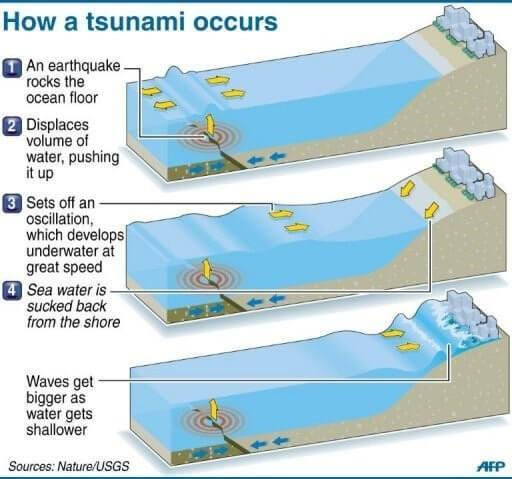

## Table of Contents

## What is an economic tsunami?

An economic tsunami is a term used to describe a massive and sudden economic crisis that can sweep through an economy, causing widespread damage. It is similar to a natural tsunami, where a huge wave crashes onto the shore, but instead of water, it's financial instability that overwhelms markets and economies. This kind of crisis can be triggered by various factors, such as a major financial institution failing, a sharp drop in stock markets, or a global event like a pandemic.

When an economic tsunami hits, it can lead to job losses, business failures, and a decrease in consumer spending. People may find it hard to get loans, and the value of their savings and investments might drop. Governments and central banks often step in to try to stabilize the situation, but recovery can take a long time. The effects of an economic tsunami can be felt for years, impacting not just the economy but also the lives of many people.

## How does an economic tsunami differ from a regular economic downturn?

An economic tsunami is a lot bigger and more sudden than a regular economic downturn. A regular downturn might happen slowly, like when fewer people buy things and businesses start to struggle. But an economic tsunami is like a huge, fast wave that hits the economy hard and all at once. It can be caused by something big and unexpected, like a bank failing or a global crisis.

When an economic tsunami happens, it can cause a lot more damage than a regular downturn. Jobs can disappear quickly, businesses can go bankrupt, and people might lose a lot of money in a short time. It's harder to fix and can take much longer for things to get better. A regular downturn might be tough, but an economic tsunami is like a disaster that shakes everything up and leaves a bigger mess to clean up.

## What are the primary causes of an economic tsunami?

An economic tsunami can be caused by many things, but it usually starts with something big and unexpected. One common cause is a major financial institution failing, like a big bank going bankrupt. When this happens, it can scare people and make them pull their money out of other banks, causing more problems. Another cause can be a sharp drop in the stock market. If lots of people start selling their stocks at the same time, the value can go down quickly, and this can spread fear and panic throughout the economy.

Another cause of an economic tsunami is a global event, like a pandemic or a war. These events can disrupt trade and make it hard for businesses to operate. For example, during a pandemic, people might not be able to go to work, and businesses might have to close. This can lead to less money being spent and more people losing their jobs. All these factors together can create a huge wave of economic trouble that spreads quickly and causes a lot of damage.

Sometimes, an economic tsunami can also be caused by problems in one country spreading to others. If a big economy like the United States or China runs into trouble, it can affect other countries that do business with them. This is called a ripple effect, where the problems in one place cause problems in other places too. When these big events happen, they can combine and lead to an economic tsunami that is hard to stop and takes a long time to recover from.

## Can you explain the mechanism behind an economic tsunami?

An economic tsunami starts when something big and unexpected happens, like a major bank failing or a sharp drop in the stock market. This event can scare people and make them pull their money out of banks or sell their stocks quickly. When lots of people do this at the same time, it can cause a chain reaction. Banks might not have enough money to give to people who need loans, and the value of stocks can go down a lot. This fear and panic can spread fast, making the problem bigger and bigger.

Once the problem starts, it can spread to other parts of the economy. Businesses might not be able to get the money they need to keep running, so they might have to close or lay off workers. When people lose their jobs, they spend less money, which makes it even harder for businesses to stay open. This can lead to a cycle where the economy keeps getting worse. If the problem started in one country, it can spread to other countries that do business with it, making the economic tsunami even bigger and harder to stop.

Governments and central banks try to help by giving money to banks and businesses or by lowering interest rates to make borrowing easier. But fixing an economic tsunami can take a long time because the damage is so widespread. It's like trying to clean up after a huge wave has hit the shore – it takes a lot of work and time to get things back to normal.

## What are some historical examples of economic tsunamis?

One big example of an economic tsunami was the Great Depression that started in 1929. It began when the stock market in the United States crashed, and lots of people lost a lot of money very quickly. This made people scared, and they started taking their money out of banks. Many banks failed, and businesses closed down. People lost their jobs and couldn't buy things, which made the economy even worse. The Great Depression spread to other countries and lasted for many years, causing a lot of suffering.

Another example is the 2008 financial crisis. It started when many people couldn't pay back their home loans, and big banks that had given out these loans started to fail. This caused panic, and the stock market dropped a lot. Banks stopped lending money, and businesses struggled to stay open. Many people lost their jobs and homes. The crisis spread around the world, and it took years for the economy to recover. Governments had to step in with a lot of money to help fix things.

These two examples show how an economic tsunami can start with a big problem and quickly spread, causing a lot of damage and taking a long time to fix.

## How do economic tsunamis impact global markets?

When an economic tsunami hits, it doesn't just stay in one place. It can spread to other countries and affect global markets. If a big economy like the United States or China has a problem, it can make it hard for other countries to do business with them. Companies in other countries might not be able to sell their products to these big markets, and they might lose money. This can make the stock markets in other countries go down and cause businesses to close or lay off workers.

The impact on global markets can be really big. When people in one country lose their jobs, they spend less money, which can hurt businesses in other countries that rely on them buying things. Banks might also stop lending money, making it hard for businesses around the world to get the money they need to keep going. This can lead to a cycle where the economy keeps getting worse in many places. It can take a long time for things to get better, and governments around the world have to work together to help fix the problem.

## What role do government policies play in mitigating or exacerbating an economic tsunami?

Government policies can help make an economic tsunami less bad or even make it worse. When an economic tsunami hits, governments can step in to help by giving money to banks and businesses. They can also lower interest rates to make it easier for people and businesses to borrow money. These actions can help stop the panic and keep the economy from getting even worse. For example, during the 2008 financial crisis, many governments gave money to banks to keep them from failing and helped people who lost their jobs.

On the other hand, if government policies are not good, they can make an economic tsunami even worse. If a government doesn't act quickly or doesn't help enough, the problems can keep growing. Sometimes, bad policies can even cause an economic tsunami. For example, if a government lets banks take too many risks, it can lead to a big problem later. So, what governments do, and how fast they do it, can make a big difference in how bad an economic tsunami is and how long it takes to fix.

## How can individuals and businesses prepare for an economic tsunami?

Individuals and businesses can get ready for an economic tsunami by saving money and not spending too much. For people, it's a good idea to have some money saved up for emergencies. This way, if they lose their job or if prices go up, they can still pay for what they need. Businesses should also save money and not borrow too much. They should try to have enough cash to keep going if things get tough. It's also smart for both people and businesses to not take too many risks with their money, like putting it all in one stock or one type of investment.

Another way to prepare is to learn about the economy and keep an eye on what's happening. If people know what's going on, they can see if an economic tsunami might be coming and get ready. Businesses can do the same by watching the markets and their own money carefully. They can also make plans for what to do if things go bad, like having a backup plan for money or ways to keep the business running with less. By being ready and knowing what to do, individuals and businesses can handle an economic tsunami better and maybe not get hurt as much.

## What are the long-term effects of an economic tsunami on an economy?

An economic tsunami can have big effects on an economy that last for a long time. After the tsunami hits, it can take years for things to get back to normal. Many people might lose their jobs and have a hard time finding new ones. Businesses might close down and not open again, which means fewer places for people to work. The stock market might stay low for a while, so people who put their money in stocks might not see it grow for a long time. All of this can make people feel less sure about the future and spend less money, which can keep the economy from getting better quickly.

Even after things start to get better, the effects of an economic tsunami can still be felt. Governments might have to borrow a lot of money to help fix the economy, which can lead to more debt. This debt can make it hard for the government to spend money on other things people need, like schools and hospitals. Also, some parts of the economy might never go back to how they were before. For example, some businesses might close forever, and new ones might take their place. People might also change how they spend and save money, which can change the way the whole economy works. So, an economic tsunami can change an economy in big ways that last for many years.

## How do international trade and financial systems contribute to the spread of an economic tsunami?

International trade and financial systems can make an economic tsunami spread from one country to another really fast. When a big economy like the United States or China has a problem, it can hurt other countries that do a lot of business with them. If people in those big economies stop buying things, companies in other countries can't sell their products and might lose money. This can make the stock markets in other countries go down and cause businesses to close or lay off workers. Banks might also stop lending money to businesses in other countries, making it hard for them to keep going.

Financial systems can also help spread an economic tsunami because money moves around the world so quickly. If a bank in one country fails, it can scare people in other countries and make them take their money out of banks too. This can cause more banks to fail and make the problem bigger. Also, if the stock market in one country goes down a lot, people in other countries might sell their stocks too, making stock markets around the world go down. So, because of how connected international trade and financial systems are, a problem in one place can quickly turn into a big problem everywhere.

## What predictive models are used to forecast an economic tsunami?

People use different kinds of models to try and predict if an economic tsunami might happen. These models look at lots of different things, like how much people are spending, how many people have jobs, and how the stock market is doing. They also look at things like how much money banks are lending and how much debt the government has. By putting all this information together, the models can try to guess if the economy might be heading for a big problem.

Some models use math to look at patterns and see if they match up with what happened before an economic tsunami. For example, if the stock market is going down a lot and people are starting to take their money out of banks, these models might say that an economic tsunami could be coming. Other models might use computer programs to look at lots of data really fast and find signs that something bad might happen. But even with all these models, it's really hard to predict an economic tsunami because there are so many things that can change and go wrong.

## What advanced strategies can policymakers use to manage the aftermath of an economic tsunami?

After an economic tsunami hits, policymakers can use advanced strategies to help the economy recover. One strategy is to use something called "quantitative easing," which means the central bank buys a lot of bonds to put more money into the economy. This can help lower interest rates and make it easier for businesses and people to borrow money. Another strategy is to set up special programs to help people who lost their jobs. These programs can give people money or help them find new jobs, which can keep them spending and help the economy get better.

Policymakers can also work together with other countries to manage the aftermath of an economic tsunami. They can make agreements to keep trade going and help each other's economies. For example, they might lower taxes on things that are traded between countries or help each other with loans. By working together, countries can help stop the economic tsunami from getting worse and help each other recover faster. These strategies can take time and a lot of planning, but they can make a big difference in getting the economy back on track.

## References & Further Reading

Bergstra, J., Bardenet, R., Bengio, Y., & Kégl, B. (2011). "Algorithms for Hyper-Parameter Optimization." This work introduces methods for hyper-parameter optimization which play a crucial role in refining [algorithmic trading](/wiki/algorithmic-trading) models, ensuring they operate efficiently and reliably.

Lopez de Prado, M. (2018). "Advances in Financial Machine Learning." John Wiley & Sons. This book provides a comprehensive overview of applying [machine learning](/wiki/machine-learning) techniques to the challenges of financial markets, offering insights into the development and testing of algorithmic trading strategies.

Aronson, D. R. (2006). "Evidence-Based Technical Analysis: Applying the Scientific Method and Statistical Inference to Trading Signals." John Wiley & Sons. This text emphasizes the importance of a scientific approach to technical analysis, which can be integrated into algorithmic trading to enhance the reliability of trading signals.

Jansen, S. (2020). "Machine Learning for Algorithmic Trading: Predictive Models to Extract Signals from Market and Alternative Data for Systematic Trading Strategies with Python." Packt Publishing Ltd. A practical guide focused on using machine learning in Python to create and implement systematic trading strategies.

Chan, E. P. (2009). "Quantitative Trading: How to Build Your Own Algorithmic Trading Business." John Wiley & Sons. This book offers a pragmatic approach to establishing an algorithmic trading business, covering essential concepts and strategies necessary for success in [quantitative trading](/wiki/quantitative-trading).

