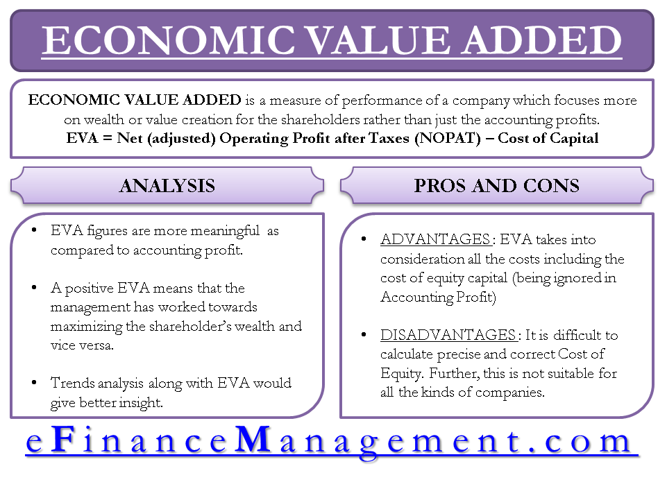

## Table of Contents

## What is Economic Value Added (EVA)?

Economic Value Added (EVA) is a measure of a company's financial performance that shows how much value it has created for its shareholders. It is calculated by taking the company's net operating profit after taxes and subtracting the cost of capital. The cost of capital is the return that investors expect for putting their money into the company. If EVA is positive, it means the company is creating value because it is earning more than the cost of the capital it uses. If EVA is negative, the company is destroying value because it is not earning enough to cover the cost of its capital.

EVA is useful because it helps companies focus on creating value for their shareholders. It encourages managers to think about the cost of the capital they use and to make decisions that will increase the company's profitability. By using EVA, companies can see which parts of their business are adding value and which are not. This helps them make better decisions about where to invest their money and how to improve their operations.

## How is EVA calculated?

Economic Value Added (EVA) is calculated by taking a company's net operating profit after taxes (NOPAT) and then subtracting the cost of capital. NOPAT is the profit a company makes from its operations after paying taxes. The cost of capital is the amount of money the company needs to pay to its investors for using their money. This includes the cost of debt and the cost of equity.

To find the cost of capital, you multiply the total capital the company uses by the weighted average cost of capital (WACC). The WACC is the average rate of return the company needs to pay to all its investors. Once you have the NOPAT and the cost of capital, you subtract the cost of capital from the NOPAT. If the result is positive, the company is creating value. If it's negative, the company is losing value.

## What are the key components of EVA?

The key components of Economic Value Added (EVA) are the net operating profit after taxes (NOPAT) and the cost of capital. NOPAT is the money a company makes from its business after paying taxes. It shows how much profit the company is making from its operations. The cost of capital is the money the company has to pay to its investors for using their money. This includes both the cost of borrowing money (debt) and the cost of using shareholders' money (equity).

To calculate EVA, you take the NOPAT and subtract the cost of capital. The cost of capital is found by multiplying the total capital the company uses by the weighted average cost of capital (WACC). The WACC is the average rate of return the company needs to pay to all its investors. If the result of subtracting the cost of capital from NOPAT is positive, the company is creating value. If it's negative, the company is losing value.

## Why is EVA important for businesses?

EVA is important for businesses because it shows if they are making money for their owners. It helps businesses see if they are using their money in a smart way. When a business calculates its EVA, it looks at how much profit it makes after paying taxes and then takes away the cost of the money it uses. If the EVA is more than zero, the business is doing well and making more money than it costs to run. If the EVA is less than zero, the business is not doing well and is losing money.

Using EVA helps businesses make better choices about where to spend their money. It can show which parts of the business are doing well and which parts need to be improved. By focusing on increasing EVA, businesses can work on making more profit and using their money more wisely. This helps them grow and be more successful in the long run.

## How does EVA differ from traditional financial performance measures?

EVA differs from traditional financial performance measures like net income or earnings per share because it takes into account the cost of the money a company uses. Traditional measures focus on profits without considering how much it costs to use the money that helped make those profits. EVA, on the other hand, subtracts the cost of capital from the net operating profit after taxes. This gives a clearer picture of whether a company is truly making money for its owners or just covering its costs.

Another way EVA differs is that it encourages managers to think about the long-term value of the company, not just short-term profits. Traditional measures can sometimes lead to decisions that boost short-term earnings but might not be good for the company in the long run. EVA pushes managers to make choices that will increase the company's value over time, helping the business grow and be more successful in the future.

## What are the advantages of using EVA as a performance metric?

Using EVA as a performance metric helps businesses see if they are really making money for their owners. It does this by taking away the cost of the money the business uses from the profit it makes. This gives a clear picture of whether the business is doing well or not. If the EVA is positive, the business is making more money than it costs to run, which means it's creating value. If the EVA is negative, the business is losing money, showing it needs to make changes.

EVA also helps managers make better decisions about where to spend money. It shows which parts of the business are doing well and which need to be improved. By focusing on increasing EVA, businesses can work on making more profit and using their money more wisely. This helps them grow and be more successful in the long run. EVA encourages managers to think about the long-term value of the company, not just short-term profits, which can lead to smarter choices and a healthier business.

## Can EVA be used for all types of businesses? If not, why?

EVA can be used for many types of businesses, but it might not be the best choice for every one. It works well for businesses that have a lot of money tied up in things like factories or machines. These businesses can see clearly if they are making enough money to cover the cost of their big investments. EVA helps them understand if they are using their money in a smart way and if they are making profits after paying for all their costs.

However, EVA might not be as useful for businesses that don't have a lot of money tied up in big things, like service companies. These businesses might find it harder to measure their EVA because they don't have big investments to account for. Also, some businesses might find the calculations for EVA too complicated, especially if they don't have the right information or if their financial situation is very complex. So, while EVA can be a helpful tool for many businesses, it might not be the best fit for all of them.

## What are the common criticisms or drawbacks of EVA?

Some people think EVA can be hard to use because it needs a lot of detailed information. You have to know the exact cost of the money a business uses, which can be tricky to figure out. Also, different businesses might use different ways to calculate EVA, so it can be hard to compare them. This means that EVA might not be the best way to see how well a business is doing if you want to compare it to others.

Another problem with EVA is that it might make managers focus too much on short-term gains instead of long-term growth. If managers see that EVA is low, they might try to cut costs quickly, which could hurt the business in the long run. Also, EVA doesn't consider things like how happy customers are or how good the business is at coming up with new ideas. These things are important for a business to do well over time, but EVA doesn't show them.

## How can EVA influence managerial decision-making?

EVA can help managers make better choices by showing them if the business is making money for its owners. When managers see that EVA is low or negative, they know they need to find ways to make more profit or use less money. This might mean cutting costs, finding new ways to make money, or investing in projects that will bring in more profit than they cost. By focusing on EVA, managers can make sure they are using the business's money in a smart way and helping the business grow.

On the other hand, EVA might push managers to focus too much on short-term gains. If they see that EVA is low, they might try to quickly cut costs or boost profits without thinking about the long-term effects. This could hurt the business in the future. Also, EVA doesn't show things like how happy customers are or how good the business is at coming up with new ideas. These things are important for a business to do well over time, but EVA doesn't take them into account. So, while EVA can be a helpful tool, managers need to think about more than just EVA when making decisions.

## What are some real-world examples of companies using EVA successfully?

Coca-Cola has used EVA to make its business better. They started using EVA to see which parts of their business were making money and which were not. By focusing on EVA, Coca-Cola found ways to cut costs and make more profit. This helped them grow and become more successful. Now, Coca-Cola uses EVA to make sure they are always making smart choices with their money.

Another company that has used EVA well is Siemens. They use EVA to help their managers make good decisions about where to spend money. By looking at EVA, Siemens can see if their projects are making more money than they cost. This has helped Siemens focus on projects that create value and avoid ones that do not. Using EVA has made Siemens a stronger and more profitable company.

## How can EVA be integrated into a company's overall strategy?

EVA can be a big part of a company's overall plan by helping them make smart choices about where to spend money. When a company uses EVA, they look at how much profit they make after paying taxes and then take away the cost of the money they use. If the EVA is positive, the company knows they are doing well and making more money than it costs to run. This helps them decide which parts of the business to focus on and where to invest more money. By always trying to increase EVA, a company can make sure they are using their money in the best way possible and growing over time.

To use EVA in their strategy, a company needs to make sure everyone understands what EVA is and why it's important. They can set goals for EVA and reward managers who help increase it. This encourages everyone to work together to make the company more profitable. But, companies also need to remember that EVA is just one tool. They should not forget about other important things like keeping customers happy or coming up with new ideas. By using EVA along with other measures, a company can make a strong plan that helps them succeed in the long run.

## What advanced techniques can be used to refine EVA calculations and interpretations?

To make EVA calculations and interpretations better, companies can use something called adjusted EVA. This means they look at more than just the numbers on their financial statements. They might add back costs that don't really affect the business's value, like research and development or marketing expenses. By doing this, they get a clearer picture of how much value the business is really creating. They can also use different ways to figure out the cost of capital, like looking at what other companies in the same industry are paying, to make sure their calculations are as accurate as possible.

Another way to refine EVA is by using it along with other measures. Companies can look at things like customer satisfaction or how good they are at coming up with new ideas. By combining EVA with these other measures, they get a fuller picture of how well the business is doing. This helps them make smarter choices about where to spend money and how to grow. Using EVA this way helps managers see the bigger picture and make decisions that are good for the business in the long run.

## What is the EVA Formula and how can it be understood?

Economic Value Added (EVA) is a financial metric that calculates the surplus generated by business operations over the required return based on the company's cost of capital. The formula for EVA is given by:

$$
\text{EVA} = \text{NOPAT} - (\text{Invested Capital} \times \text{WACC})
$$

Where:

- **Net Operating Profit After Tax (NOPAT):** This is the operating profit of a company after taxes have been deducted. NOPAT reflects the efficiency of core business operations, disregarding capital structure and tax benefits from debt. It's a measure of profit that is available to all capital providers, both equity and debt.

- **Invested Capital:** This represents the total amount of capital invested in a company that is used for business operations. It typically encompasses both equity and debt, as well as other financial assets utilized by the company. Invested Capital can be thought of as the economic equivalent of the resources attributable to the business that are expected to generate returns.

- **Weighted Average Cost of Capital (WACC):** WACC is the average rate of return required by all of a company's security holders (both equity and debt). It is a key indicator used by investors to assess the desirability of investment opportunities. WACC accounts for the cost of equity and cost of debt, weighing each by their respective proportions in the firm's capital structure. A lower WACC suggests lower risk and cost of financing.

In practical terms, EVA provides a clear measure of whether a company is generating returns in excess of the minimum rate required by investors. A positive EVA indicates that a company is creating value beyond its costs, whereas a negative value suggests the opposite. This makes EVA a useful tool for managers aiming to understand the performance of their operational and strategic decisions in relation to the expectations of capital providers.

## What is the role of EVA in algorithmic trading?

Algorithmic trading is increasingly leveraging Economic Value Added (EVA) to refine trading strategies by identifying undervalued or overvalued stocks. The principle is straightforward: EVA's emphasis on value creation naturally aligns with trading objectives that focus on investment opportunities surpassing the cost of capital. This alignment is crucial for traders and investors who seek to maximize their returns by focusing on economic profits rather than just accounting profits.

EVA is calculated using the formula:

$$
\text{EVA} = \text{NOPAT} - (\text{Invested Capital} \times \text{WACC})
$$

where NOPAT (Net Operating Profit After Tax) exemplifies the profits from operations minus taxes, Invested Capital illustrates the total capital invested in the company, and WACC (Weighted Average Cost of Capital) represents the average expected returns by investors on their capital.

Incorporating EVA within trading algorithms enhances investment analysis by concentrating on stocks that generate true economic profit. This method moves beyond traditional metrics that may overlook the cost of capital and focuses instead on sustainable long-term value creation.

The intricacies involved in EVA calculations, such as handling various financial assumptions and estimates, can be efficiently managed using advanced algorithms and [machine learning](/wiki/machine-learning) techniques. By automating these calculations, [algorithmic trading](/wiki/algorithmic-trading) systems can quickly process large datasets, identify profitable stock opportunities, and execute trades based on robust economic insights.

For instance, a trading algorithm might use historical EVA data to predict future stock performance and identify trends. With machine learning, such algorithms can adapt and improve over time, becoming more accurate in pinpointing stocks that are mispriced in relation to their economic value.

The Python code snippet below illustrates a basic framework for integrating EVA calculations into an algorithmic trading strategy:

```python
import pandas as pd

def calculate_eva(nopat, invested_capital, wacc):
    """Calculate Economic Value Added."""
    return nopat - (invested_capital * wacc)

def identify_opportunities(stock_data):
    """Identify undervalued stocks using EVA."""
    opportunities = []
    for index, row in stock_data.iterrows():
        eva = calculate_eva(row['NOPAT'], row['Invested Capital'], row['WACC'])
        if eva > 0:
            opportunities.append(row['Stock Symbol'])
    return opportunities

# Example stock data
stock_data = pd.DataFrame({
    'Stock Symbol': ['AAPL', 'GOOGL', 'AMZN'],
    'NOPAT': [5000, 6000, 5500],
    'Invested Capital': [25000, 30000, 28000],
    'WACC': [0.08, 0.07, 0.085]
})

undervalued_stocks = identify_opportunities(stock_data)
print("Undervalued stocks based on EVA:", undervalued_stocks)
```

This example demonstrates a simple approach to determining which stocks might generate EVA, and hence, could be considered undervalued in terms of economic profit.

Understanding EVA's nuances can significantly enhance trading outcomes by prioritizing stocks with sustainable economic benefits. Thus, EVA-based algorithmic trading strategies can achieve superior returns by steering investments toward value-generating opportunities.

## References & Further Reading

[1]: Stewart, G. Bennett III. (1991). ["The Quest for Value: A Guide for Senior Managers"](https://www.amazon.com/Quest-Value-Guide-Senior-Managers/dp/0887304184). HarperBusiness.

[2]: Copeland, T., Koller, T., & Murrin, J. (2000). ["Valuation: Measuring and Managing the Value of Companies"](https://books.google.com/books/about/Valuation.html?id=rL5hCoUpr0kC). Wiley Finance.

[3]: Damodaran, Aswath (2012). ["Investment Valuation: Tools and Techniques for Determining the Value of Any Asset"](https://books.google.com/books/about/Investment_Valuation.html?id=5SRHAAAAQBAJ). Wiley Finance.

[4]: Young, S. D., & O'Byrne, S. F. (2000). ["EVA and Value-Based Management: A Practical Guide to Implementation"](https://books.google.com/books/about/EVA_and_Value_Based_Management_A_Practic.html?id=GOO9FdX-2OMC). McGraw-Hill.

[5]: ["The Handbook of News Analytics in Finance"](https://onlinelibrary.wiley.com/doi/book/10.1002/9781118467411) by Gautam Mitra and Leela Mitra