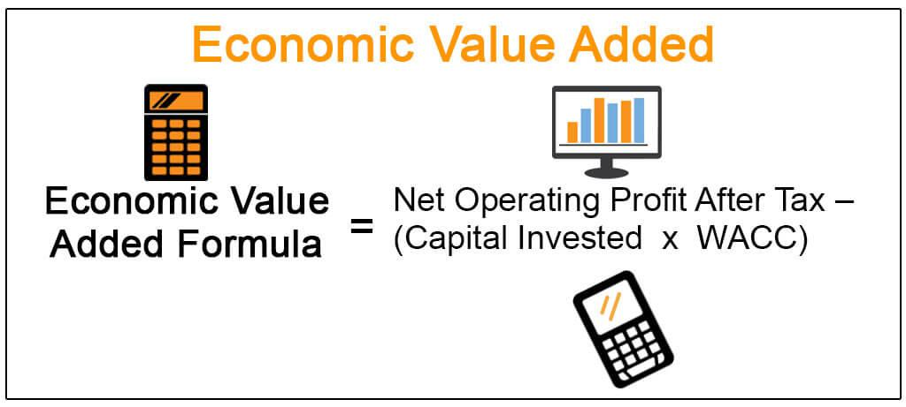

Economic Value Added (EVA) is a prominent financial metric employed to gauge a company’s true economic profit. As opposed to traditional accounting measures, EVA provides a lens through which businesses can assess their real economic viability by determining whether they are generating returns above their cost of capital. By evaluating the surplus generated after covering the capital cost, EVA offers insights into a company’s genuine profitability and efficiency.

This article will explore the EVA formula and its key components in detail, as well as articulate the benefits and drawbacks inherent in its application. By considering both the positive and negative aspects, a comprehensive understanding of EVA's role in economic assessment is achieved. This knowledge is essential for businesses aiming to align their strategy with wealth generation and optimal resource use.



Moreover, the article will investigate EVA’s implications in the context of algorithmic trading, where its focus on identifying value creation opportunities provides a compelling advantage in financial markets. The interplay between EVA and algorithmic trading underscores its relevance in modern finance, where it aids in maximizing investment returns.

Ultimately, mastering EVA enables companies to execute more informed decisions. They can ascertain with clarity whether their operational efforts contribute to appreciable value above their cost of capital. This analytical capability is vital for sustaining competitive advantage in an increasingly intricate financial landscape, ensuring operations are syncopated with long-term value creation and shareholder wealth maximization.

## Table of Contents

## Understanding the EVA Formula

Economic Value Added (EVA) is a financial metric that calculates the surplus generated by business operations over the required return based on the company's cost of capital. The formula for EVA is given by:

$$
\text{EVA} = \text{NOPAT} - (\text{Invested Capital} \times \text{WACC})
$$

Where:

- **Net Operating Profit After Tax (NOPAT):** This is the operating profit of a company after taxes have been deducted. NOPAT reflects the efficiency of core business operations, disregarding capital structure and tax benefits from debt. It's a measure of profit that is available to all capital providers, both equity and debt.

- **Invested Capital:** This represents the total amount of capital invested in a company that is used for business operations. It typically encompasses both equity and debt, as well as other financial assets utilized by the company. Invested Capital can be thought of as the economic equivalent of the resources attributable to the business that are expected to generate returns.

- **Weighted Average Cost of Capital (WACC):** WACC is the average rate of return required by all of a company's security holders (both equity and debt). It is a key indicator used by investors to assess the desirability of investment opportunities. WACC accounts for the cost of equity and cost of debt, weighing each by their respective proportions in the firm's capital structure. A lower WACC suggests lower risk and cost of financing.

In practical terms, EVA provides a clear measure of whether a company is generating returns in excess of the minimum rate required by investors. A positive EVA indicates that a company is creating value beyond its costs, whereas a negative value suggests the opposite. This makes EVA a useful tool for managers aiming to understand the performance of their operational and strategic decisions in relation to the expectations of capital providers.

## Pros of Using EVA

Economic Value Added (EVA) is a respected metric that offers a comprehensive measure of economic profit, emphasizing wealth creation above the cost of capital. By meticulously incorporating the full cost of capital, which includes both debt and equity, EVA provides a more precise and insightful assessment of a company's performance as compared to traditional profit metrics like net income or EBITDA. This holistic view facilitates a deeper understanding of a firm’s true economic profitability and encourages decision-making that genuinely enhances shareholder value.

One of the primary advantages of EVA is its ability to steer strategic investments and operational decisions towards those that cultivate genuine value. Companies using EVA are better equipped to recognize opportunities that build value for shareholders by exceeding the cost of capital. This alignment with value creation means that businesses can strategically allocate resources to initiatives and projects that promise substantial returns, thereby optimizing capital efficiency and effectiveness.

Moreover, EVA is versatile in its application across various organizational levels, making it instrumental in evaluating performance and directing resource allocation. It provides a clear metric that managers and other decision-makers can use to assess different divisions or projects within a company, empowering them to channel investments toward the most promising avenues for growth and profitability.

EVA's significance aligns seamlessly with a company’s long-term goal of maximizing shareholder value. By accentuating long-term wealth creation and emphasizing sustainable financial performance, EVA ensures that companies focus on strategies that are not only profitable but also enduring. This focus fosters a culture of responsibility and forward-thinking among management, which is crucial for long-term success in today’s competitive market landscape.

In summary, EVA offers substantial benefits by providing a robust framework for economic performance evaluation and advocating for investment strategies that enhance overall value. Through its emphasis on the true cost of capital, EVA assists organizations in making informed strategic decisions that are in harmony with their overarching objective of maximizing shareholder wealth.

## Cons of Using EVA

Economic Value Added (EVA) is a popular financial metric, but its utilization is accompanied by several drawbacks that users must consider.

One of the primary challenges associated with EVA is the complexity and resource intensity of its calculations. To accurately compute EVA, extensive financial data is required, encompassing diverse elements such as Net Operating Profit After Tax (NOPAT), Invested Capital, and the Weighted Average Cost of Capital (WACC). This requirement for comprehensive data makes the process labor-intensive and time-consuming, potentially straining smaller companies with limited resources or those without robust financial systems.

Furthermore, EVA may not be ideally suited for businesses that possess significant intangible assets, like technology firms or brands with proprietary intellectual property. Since EVA primarily focuses on tangible capital, it can overlook the economic contributions of intangible assets, which can lead to an undervaluation of such companies' true economic profit.

Another issue with EVA is its potential to encourage short-term thinking. The complexity of the metric might lead managers to emphasize immediate results rather than sustainable long-term value creation. This bias can manifest if managers prioritize decisions that improve EVA in the short run, potentially at the expense of strategic investments that would generate greater value over time.

Additionally, the assessment of the cost of capital in the EVA formula introduces subjectivity, which can affect the accuracy and consistency of the results. Calculating WACC involves assumptions about market risk premiums, debt equity ratios, and other variables, which might vary based on the estimator's perspective or external market conditions. This subjectivity could lead to inconsistencies in EVA calculations, making it difficult to compare performance accurately over time or across different entities.

Ultimately, these limitations highlight the importance of critical evaluation and balanced usage of EVA as a financial performance metric. Companies must weigh these drawbacks against the benefits to effectively leverage the metric for strategic decision-making.

## EVA in Algorithmic Trading

Algorithmic trading is increasingly leveraging Economic Value Added (EVA) to refine trading strategies by identifying undervalued or overvalued stocks. The principle is straightforward: EVA's emphasis on value creation naturally aligns with trading objectives that focus on investment opportunities surpassing the cost of capital. This alignment is crucial for traders and investors who seek to maximize their returns by focusing on economic profits rather than just accounting profits.

EVA is calculated using the formula:

$$
\text{EVA} = \text{NOPAT} - (\text{Invested Capital} \times \text{WACC})
$$

where NOPAT (Net Operating Profit After Tax) exemplifies the profits from operations minus taxes, Invested Capital illustrates the total capital invested in the company, and WACC (Weighted Average Cost of Capital) represents the average expected returns by investors on their capital.

Incorporating EVA within trading algorithms enhances investment analysis by concentrating on stocks that generate true economic profit. This method moves beyond traditional metrics that may overlook the cost of capital and focuses instead on sustainable long-term value creation.

The intricacies involved in EVA calculations, such as handling various financial assumptions and estimates, can be efficiently managed using advanced algorithms and [machine learning](/wiki/machine-learning) techniques. By automating these calculations, [algorithmic trading](/wiki/algorithmic-trading) systems can quickly process large datasets, identify profitable stock opportunities, and execute trades based on robust economic insights.

For instance, a trading algorithm might use historical EVA data to predict future stock performance and identify trends. With machine learning, such algorithms can adapt and improve over time, becoming more accurate in pinpointing stocks that are mispriced in relation to their economic value.

The Python code snippet below illustrates a basic framework for integrating EVA calculations into an algorithmic trading strategy:

```python
import pandas as pd

def calculate_eva(nopat, invested_capital, wacc):
    """Calculate Economic Value Added."""
    return nopat - (invested_capital * wacc)

def identify_opportunities(stock_data):
    """Identify undervalued stocks using EVA."""
    opportunities = []
    for index, row in stock_data.iterrows():
        eva = calculate_eva(row['NOPAT'], row['Invested Capital'], row['WACC'])
        if eva > 0:
            opportunities.append(row['Stock Symbol'])
    return opportunities

# Example stock data
stock_data = pd.DataFrame({
    'Stock Symbol': ['AAPL', 'GOOGL', 'AMZN'],
    'NOPAT': [5000, 6000, 5500],
    'Invested Capital': [25000, 30000, 28000],
    'WACC': [0.08, 0.07, 0.085]
})

undervalued_stocks = identify_opportunities(stock_data)
print("Undervalued stocks based on EVA:", undervalued_stocks)
```

This example demonstrates a simple approach to determining which stocks might generate EVA, and hence, could be considered undervalued in terms of economic profit.

Understanding EVA's nuances can significantly enhance trading outcomes by prioritizing stocks with sustainable economic benefits. Thus, EVA-based algorithmic trading strategies can achieve superior returns by steering investments toward value-generating opportunities.

## Conclusion

Economic Value Added (EVA) serves as a crucial instrument in financial performance evaluation and strategic decision-making. By focusing on true economic profit, it delivers a comprehensive viewpoint on wealth creation, differentiating itself from more traditional profit metrics. Despite the complexities inherent in its calculation—stemming from the necessity of detailed financial data and the involvement of multiple assumptions—EVA provides significant insights into value generation above the cost of capital. This characteristic empowers businesses to evaluate their ability to not only cover operational costs but also to generate profits that exceed their financial obligations.

Furthermore, the integration of EVA in algorithmic trading methods highlights its potential in identifying stocks that are undervalued or overvalued, optimizing trading strategies to enhance profitability. This usage aligns with the strategic investment philosophies of firms seeking to maximize returns sustainably. By leveraging advanced computational techniques and machine learning, the intricacies surrounding EVA computations can be mitigated, allowing firms to capitalize on the insights it provides.

The strategic application of EVA enables companies to sustain a competitive edge. By aligning operations and strategic goals with long-term shareholder value maximization, firms can foster sustainable growth and profitability. Acknowledging both EVA's strengths and potential limitations ensures a balanced approach to implementing this financial metric within various organizational settings, enhancing its role in contemporary financial analysis. Hence, EVA remains a vital tool for companies striving to balance day-to-day operational demands with overarching strategic objectives, enhancing both shareholder wealth and corporate efficiency in a globalized economy.

## References & Further Reading

[1]: Stewart, G. Bennett III. (1991). ["The Quest for Value: A Guide for Senior Managers"](https://www.amazon.com/Quest-Value-Guide-Senior-Managers/dp/0887304184). HarperBusiness.

[2]: Copeland, T., Koller, T., & Murrin, J. (2000). ["Valuation: Measuring and Managing the Value of Companies"](https://books.google.com/books/about/Valuation.html?id=rL5hCoUpr0kC). Wiley Finance.

[3]: Damodaran, Aswath (2012). ["Investment Valuation: Tools and Techniques for Determining the Value of Any Asset"](https://books.google.com/books/about/Investment_Valuation.html?id=5SRHAAAAQBAJ). Wiley Finance.

[4]: Young, S. D., & O'Byrne, S. F. (2000). ["EVA and Value-Based Management: A Practical Guide to Implementation"](https://books.google.com/books/about/EVA_and_Value_Based_Management_A_Practic.html?id=GOO9FdX-2OMC). McGraw-Hill.

[5]: ["The Handbook of News Analytics in Finance"](https://onlinelibrary.wiley.com/doi/book/10.1002/9781118467411) by Gautam Mitra and Leela Mitra