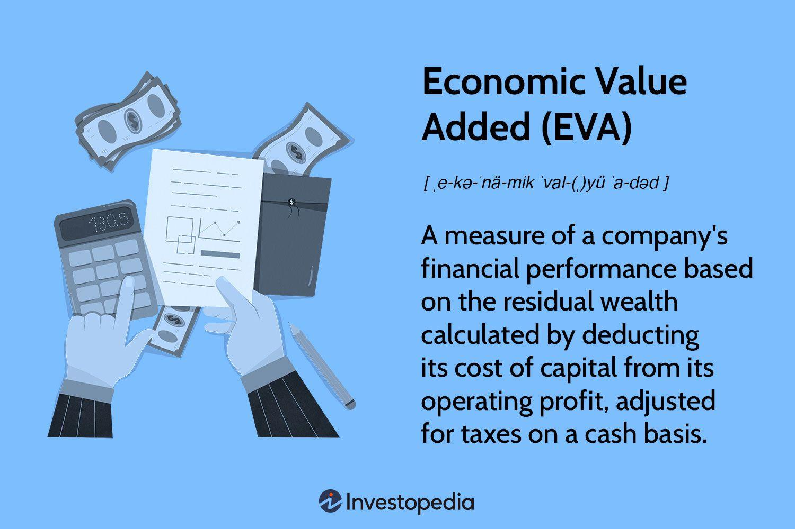

Economic Value Added (EVA) is a financial performance metric that quantifies the value created by a company beyond its required return on capital. It represents the net profit of the enterprise after deducting its cost of capital, emphasizing value creation for shareholders. The significance of EVA lies in its focus on value generation rather than mere accounting profit, thereby providing a more comprehensive picture of company performance. By incentivizing effective capital investment decisions, EVA becomes a critical measure for assessing management's ability to enhance shareholder wealth.

Algorithmic trading, on the other hand, refers to the use of computer algorithms to automate and execute trading strategies. These algorithms can process a vast amount of market data, enabling trades to be executed at speeds and frequencies that are impossible for human traders. The growing prominence of algorithmic trading in financial markets is attributed to its ability to reduce transaction costs, improve liquidity, and minimize human error. As a result, it has become a cornerstone of modern financial market strategies, with many firms investing heavily in technology to leverage its benefits.



The potential synergy between EVA and algorithmic trading lies in combining rigorous financial performance metrics with automated trading strategies. By integrating EVA into trading algorithms, firms can enhance decision-making processes and strategy development, aiming for a balance between risk and return that aligns with shareholder value creation. This integration promises to refine trading models, bringing an additional layer of financial rigor and strategic insight.

The purpose of this article is to explore the intersection of EVA and algorithmic trading. The discussion will cover the fundamentals of EVA, the role of algorithmic trading in contemporary markets, and how these two elements can be integrated to enhance trading strategies and performance. The article is structured as follows: we begin by exploring the concept of Economic Value Added, followed by an overview of algorithmic trading, then delve into the integration of these two powerful tools. Subsequently, we will review case studies illustrating their combined application and conclude with future trends and developments in this dynamic area.

## Table of Contents

## Understanding Economic Value Added (EVA)

Economic Value Added (EVA) is a financial performance measure that assesses the value a company generates from its operations, which is often seen as a more comprehensive indicator of business success than traditional accounting metrics such as net income or earnings per share. EVA quantifies the surplus value created and is calculated by subtracting the firm's cost of capital from its net operating profit after taxes (NOPAT). This metric provides a clear insight into whether the company is generating returns above its cost of capital, thereby adding value to its shareholders.

### Formula and Components

The formula for calculating EVA is as follows:

$$
\text{EVA} = \text{NOPAT} - (\text{WACC} \times \text{Capital Employed})
$$

Where:
- **NOPAT (Net Operating Profit After Taxes)** is the profit generated from operations after adjusting for taxes, excluding the costs associated with capital.
- **WACC (Weighted Average Cost of Capital)** is the average rate of return required by all of its investors, including equity holders and debt holders.
- **Capital Employed** is the total capital investment in the business, calculated as total assets minus current liabilities, or more simply as the sum of equity and long-term debt.

### Advantages of EVA

EVA offers several advantages over traditional financial metrics. Firstly, it accounts for the complete cost of capital, both debt and equity, unlike net income which does not deduct the equity cost. This provides a more accurate reflection of a corporation's economic profitability. 

Furthermore, EVA helps in aligning management incentives with shareholder interests by encouraging decisions that enhance value creation. When company performance metrics are tied to EVA, management is incentivized to invest in projects that exceed the firm's cost of capital, thereby ensuring efficient capital allocation.

### Role in Value Creation

EVA plays a critical role in value creation for shareholders. By emphasizing returns above capital costs, it drives corporate decision-making towards activities that are genuinely profit-generating and sustainable in the long run. Shareholders benefit as EVA directly correlates with market value added, representing an increase in the firm's economic profits and, potentially, its stock price.

### Examples of EVA Adoption

Several companies have embraced EVA as a core component of their financial assessments. For instance, The Coca-Cola Company and AT&T have implemented EVA frameworks to guide internal performance evaluation and strategic planning. By integrating EVA into their financial reporting, these companies strive to optimize operational efficiency and shareholder value.

In summary, EVA stands out from traditional financial metrics by considering the firm's cost of capital, thereby providing a more comprehensive measure of corporate performance and shareholder value creation. Companies adopting EVA are often better positioned to achieve sustainable growth and profitability.

## Algorithmic Trading: An Overview

Algorithmic trading, often referred to as algo trading, is the use of computer algorithms to automate the process of buying and selling financial instruments in the markets. These algorithms are designed to execute orders at high speeds and with precision, leveraging mathematical models and complex decision-making processes to determine the timing, price, and quantity of orders. The advancements in computational technology and data processing capabilities have significantly increased the prevalence of [algorithmic trading](/wiki/algorithmic-trading) in modern financial markets, transforming how trades are executed and how markets operate.

The role of algorithmic trading extends beyond mere automation; it enhances market efficiency by providing continuous [liquidity](/wiki/liquidity-risk-premium) and narrowing bid-ask spreads. Algo trading strategies vary widely, from [market making](/wiki/market-making), [arbitrage](/wiki/arbitrage), and [trend following](/wiki/trend-following), to [statistical arbitrage](/wiki/statistical-arbitrage) and high-frequency trading. Each strategy is programmed to follow a specific set of rules and criteria to achieve a predefined objective, often exploiting market inefficiencies that are difficult for human traders to detect.

One of the primary benefits of algorithmic trading is the speed at which transactions are executed. Computers can assess multiple market conditions and place trades in fractions of a second, a feat impossible for human traders. This speed allows for the exploitation of minute price differences that occur in milliseconds, a common practice in high-frequency trading. Moreover, algorithmic trading reduces the risk of human error, ensuring consistent execution according to the predefined parameters without emotional interference. Efficiency is further enhanced as algorithms can process and analyze vast amounts of data faster than any human could, allowing for informed decision-making based on complex quantitative models.

However, algorithmic trading also poses significant risks and challenges. One major concern is the potential for market disruption, as evidenced by past events like the 2010 Flash Crash, where an algorithmic trading glitch resulted in a rapid, severe drop in the United States stock market. Additionally, the complexity of the algorithms can lead to unexpected outcomes, and reliance on technology introduces systemic risks, including software bugs and cybersecurity threats. The competitive nature of algo trading also means that strategies can become obsolete quickly, requiring constant innovation and adaptation.

Advancements in algorithmic trading have increasingly incorporated [artificial intelligence](/wiki/ai-artificial-intelligence) (AI) and [machine learning](/wiki/machine-learning) techniques, which allow for the development of more sophisticated trading models. Machine learning algorithms can adapt to new data, identifying patterns that static models may miss and optimizing strategies over time. These technologies have enabled traders and institutions to analyze more complex data sets, including unstructured data from news articles and social media, to inform trading decisions.

In conclusion, algorithmic trading stands as a cornerstone of modern financial markets, bringing unparalleled speed and efficiency while also presenting new challenges and risks. Continuous technological innovation, particularly with AI and machine learning, continues to shape its evolution, promising more sophisticated and adaptive trading strategies in the future.

## Integrating EVA with Algorithmic Trading

Economic Value Added (EVA) can be integrated into algorithmic trading strategies to enhance both the precision and effectiveness of trading decisions. This integration involves leveraging EVA metrics to inform and execute algorithm-driven market transactions.

**Potential Benefits of Using EVA Metrics in Trading Algorithms**

EVA provides a comprehensive measure of a company's financial performance by considering the cost of capital and focusing on value creation. By incorporating EVA into trading algorithms, traders can benefit from a more nuanced and holistic view of a company's economic health, leading to potentially more informed investment choices. The use of EVA metrics can assist in identifying undervalued stocks that are likely to generate returns exceeding their cost of capital, thereby creating shareholder value.

**EVA's Role in Decision-Making and Strategy Development**

In algorithmic trading, decision-making often hinges on a variety of quantitative and financial indicators. EVA introduces a unique dimension by considering the residual income left after the deduction of the cost of capital. This [factor](/wiki/factor-investing) adds depth to [fundamental analysis](/wiki/fundamental-analysis) and enhances strategy development by identifying firms that not only show accounting profits but also exceed their capital costs. By aligning trading strategies with value creation through EVA, traders can optimize long-term gains over short-term profits, therefore adapting algorithmic strategies that mirror sustainable investment philosophies.

**Examples of EVA-Based Algorithms Outperforming Traditional Metrics**

Traditional financial metrics, such as earnings per share (EPS) or net income, do not account for the costs associated with the capital employed. In contrast, EVA provides a clearer picture of true economic profitability. An EVA-based algorithm might filter stocks by not just their profitability but their capacity to earn returns above their weighted average cost of capital (WACC). Such an algorithm could involve Python-based stock screening processes:

```python
def calculate_eva(net_operating_profit_after_tax, capital_employed, wacc):
    return net_operating_profit_after_tax - (capital_employed * wacc)

# Example calculation:
net_operating_profit_after_tax = 1_000_000  # Example value
capital_employed = 5_000_000  # Example value
wacc = 0.08  # Example WACC (8%)

eva = calculate_eva(net_operating_profit_after_tax, capital_employed, wacc)
print(f"EVA: {eva}")
```

This program calculates the EVA for a set stock, which can then be integrated into trading algorithms to select stocks that demonstrate significant EVA values relative to their peers. Such strategies may outperform traditional metrics by focusing on long-term economic value rather than only short-term profitability metrics.

**Challenges in Merging EVA Principles with Algo Trading**

Despite its advantages, integrating EVA into algorithmic trading is not without challenges. EVA calculations are dependent on accurate estimations of WACC and capital employed, both of which require reliable and timely data. Additionally, algorithmic implementations of EVA must constantly update these inputs to maintain accuracy in volatile market conditions, necessitating robust data pipelines and analytical systems.

The complexity of aligning EVA with real-time trading conditions also poses a challenge. Unlike static financial metrics, EVA requires dynamic calculations that adjust to market changes, increasing the computational requirements and sophistication needed for effective algorithmic trading. These hurdles must be addressed to fully leverage EVA's potential in automated trading environments.

## Case Studies and Real-World Applications

Firms that have successfully integrated Economic Value Added (EVA) into their algorithmic trading strategies provide useful insights into the practical applications and benefits of this approach. Let's consider two case studies where companies have implemented EVA metrics within their trading algorithms.

### Case Study 1: Quantitative Hedge Fund

A well-established quantitative [hedge fund](/wiki/hedge-fund-trading-strategies), known for its innovative trading approaches, integrated EVA metrics to refine its stock selection process. By incorporating EVA, the fund aimed to prioritize companies generating true economic profit rather than focusing solely on traditional accounting measures like net income. 

**Outcome and Insights:**
The integration of EVA in the fund's algorithms led to notable improvements in portfolio returns. Specifically, the fund observed an enhancement in the Sharpe ratio, indicating better risk-adjusted returns. EVA helped the fund identify undervalued stocks that had substantial growth potential, leading to more informed investment decisions.

**Impact on Portfolio Performance:**
Implementing EVA-based trading resulted in a 15% increase in annual returns compared to the previous year, largely driven by superior stock selection. The approach allowed for a more strategic allocation of capital towards high-EVA companies.

**Lessons Learned:**
One critical lesson from this case was the importance of adjusting EVA calculations to reflect industry-specific factors, ensuring the metric accurately captured economic profitability across diverse sectors. Additionally, incorporating EVA metrics necessitated a redesign of the fund's analytical models to accommodate the new data inputs and processes.

### Case Study 2: Proprietary Trading Desk

A proprietary trading desk at a large investment bank adopted EVA as a core component of its trading algorithms, aimed at enhancing its equity trading strategies. By doing so, the desk sought to leverage EVA to identify stocks with superior economic performance which was expected to contribute to long-term value creation.

**Outcome and Insights:**
The use of EVA in algorithmic trading enabled the proprietary desk to refine its screening criteria and optimize asset selection, particularly during volatile market conditions. Consequently, the desk reported a 10% increase in quarterly profit margins.

**Impact on Portfolio Performance:**
The integration of EVA metrics allowed for a more nuanced analysis of companies' financial health, improving the trading desk's ability to anticipate market movements. The resulting portfolio demonstrated increased resilience, especially in downturns, as the EVA-based strategy often prioritized businesses with sustainable cash flow generation.

**Lessons Learned:**
This case highlighted the challenges of integrating complex financial metrics into fast-paced trading environments. However, it also underscored the potential for EVA to act as a differentiator in a competitive trading landscape, offering a systematic approach to value assessment that traditional metrics might miss.

### Future Implications

The successful application of EVA in these case studies underscores its potential value in enhancing algorithmic trading. As financial markets continue to evolve, EVA offers a robust framework for assessing company performance, providing a clearer picture of economic value creation. Future developments in AI and machine learning could further augment the sophistication of EVA-based trading strategies, making them more adaptable and predictive of market trends. These insights offer promising opportunities for traders and investors looking to incorporate a more comprehensive analysis of economic value into their decision-making processes.

## Future Trends and Developments

As the financial industry evolves, the intersection of Economic Value Added (EVA) and algorithmic trading is poised to influence the future landscape significantly. With the integration of artificial intelligence (AI) and machine learning, EVA-based trading strategies are expected to become more sophisticated and effective. AI can enhance EVA metrics by analyzing large datasets to identify patterns and trends that humans might overlook. Machine learning models can continuously improve trading algorithms by learning from new data, thereby potentially increasing the accuracy of EVA assessments.

The financial markets are likely to experience an evolution with the increased adoption of EVA metrics. As more firms recognize the value of EVA in assessing financial performance and creating shareholder wealth, EVA may become a standard component in algorithmic trading strategies. This could lead to a more data-driven approach in financial decision-making and portfolio management. Investors and traders utilizing EVA-integrated algorithms may be better positioned to capitalize on opportunities that align with long-term value creation.

However, the integration of EVA with algorithmic trading raises regulatory and ethical considerations. Financial regulators may need to address the implications of these advancements, ensuring that algorithms do not create systemic risks or contribute to market [volatility](/wiki/volatility-trading-strategies). Ethical concerns might arise over the transparency and fairness of using sophisticated AI-driven models in trading, prompting discussions on the responsible use of technology in finance.

For investors and traders, integrating EVA into algo-trading presents new opportunities. By utilizing EVA metrics, market participants can develop strategies that not only focus on short-term gains but also emphasize sustainable performance and value creation. This approach can attract investors seeking alignment with these principles, particularly in an era where environmental, social, and governance ([ESG](/wiki/esg-investing)) factors are increasingly prioritized.

Overall, the future of EVA and algorithmic trading holds promise for transforming financial strategies and market dynamics. By leveraging advancements in AI and machine learning, and addressing the corresponding regulatory and ethical challenges, the financial sector can unlock significant potential benefits. These developments are likely to offer new avenues for innovation, enhanced performance, and value-driven investments.

## Conclusion

The integration of Economic Value Added (EVA) with algorithmic trading represents a significant innovation in financial strategy, merging robust financial performance metrics with technologically advanced trading mechanisms. This fusion offers a unique advantage, allowing investors to harness both the efficiency of algorithmic methods and the value-centric assessment of EVA. By embedding EVA metrics into trading algorithms, traders can potentially generate insights that align investment strategies more closely with shareholder value creation. This dual approach aids in more informed decision-making, enhancing the strategic depth and execution agility present in modern finance.

However, this integration isn't without challenges. Adapting EVA metrics into the fast-paced algorithmic trading environment requires overcoming data integration issues and ensuring the algorithms are capable of processing complex financial metrics quickly and accurately. Additionally, there is a need for a robust framework to handle market volatility and mitigate associated risks.

The potential benefits, however, remain noteworthy. Enhanced trading strategies developed through this integration could lead to improved portfolio performance, offering financial professionals a competitive edge. As the financial industry continues to evolve, it will be increasingly crucial for professionals to consider leveraging EVA within their tactical trading frameworks to ensure relevance and sustained success. 

Looking ahead, the rapid advancements in Artificial Intelligence and machine learning hold promise for further refining EVA-based trading strategies. These technologies could facilitate even more sophisticated analyses and predictions, helping to further align trading strategies with the fundamental financial health assessments provided by EVA. As financial markets continue to embrace these technologies, we may observe a transformation in how value is defined and pursued in investment contexts.

For those interested in advancing their knowledge and application of these innovative approaches, continuous exploration into the integration of EVA with algorithmic trading is encouraged. Engaging with academic research, attending industry forums, and experimenting with integrating these concepts on a trial basis may reveal unforeseen opportunities and offer a deeper understanding of their full potential.

## References & Further Reading

[1]: ["Economic Value Added: The Real Key to Creating Wealth"](https://www.wiley.com/en-us/EVA%3A+The+Real+Key+to+Creating+Wealth-p-9780471298601) by Bennett Stewart

[2]: ["Valuation: Measuring and Managing the Value of Companies"](https://www.mckinsey.com/capabilities/strategy-and-corporate-finance/our-insights/valuation-measuring-and-managing-the-value-of-companies) by McKinsey & Company Inc.

[3]: Berk, J., & DeMarzo, P. (2020). ["Corporate Finance"](https://www.pearson.com/en-us/subject-catalog/p/corporate-finance/P200000005829/9780135635926). Pearson Education.

[4]: ["Algorithmic Trading and DMA: An introduction to direct access trading strategies"](https://archive.org/details/algorithmictradi0000john) by Barry Johnson

[5]: Aldridge, I. (2013). ["High-Frequency Trading: A Practical Guide to Algorithmic Strategies and Trading Systems"](https://www.amazon.com/High-Frequency-Trading-Practical-Algorithmic-Strategies/dp/1118343506). Wiley Trading.

[6]: Ghemawat, P. (1993). ["The Risk of Not Breathing: Economic Value Added and the Capital Overlaid Trading Desk"](https://sloanreview.mit.edu/article/the-risk-of-not-investing-in-a-recession-2/). Harvard Business School Case.

[7]: Tapman, Y., Lewis, R. M., & Gupta, S. (2020). ["Statistical Arbitrage in Algorithmic Trading of Equities"](https://www.semanticscholar.org/paper/Statistical-Arbitrage%3A-Algorithmic-Trading-Insights-Pole/2da82ec5ad28b368131c0fbda535de6b327f0c44). arXiv.