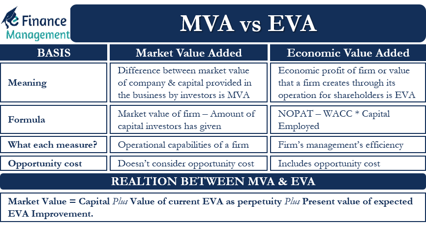

## Table of Contents

## What is Economic Value Added (EVA)?

Economic Value Added (EVA) is a measure of a company's financial performance that shows how much value it has created for its shareholders. It is calculated by subtracting the cost of capital from the company's net operating profit after taxes (NOPAT). The cost of capital represents the return that investors expect for providing capital to the company. If EVA is positive, it means the company is generating returns above the cost of capital, creating value for shareholders. If EVA is negative, the company is not covering its cost of capital, which means it is destroying value.

EVA is useful because it helps companies focus on long-term value creation rather than short-term profits. By considering the cost of capital, EVA encourages managers to make decisions that will increase the company's value over time. For example, a company might decide to invest in a new project that will not show immediate profits but will generate returns higher than the cost of capital in the future. This focus on long-term value can lead to better decision-making and ultimately benefit shareholders.

## What is Market Value Added (MVA)?

Market Value Added (MVA) is a way to see how much a company is worth to its shareholders. It's found by taking the market value of the company and subtracting the money that was put into it. The market value is what people would pay for the whole company if they could buy it right now. The money put into it is what shareholders have invested over time. If MVA is high, it means the company has made its shareholders richer by growing more valuable than the money they put in.

MVA is important because it shows if a company is doing a good job of using the money it gets from shareholders. If MVA goes up, it means the company's value is growing faster than the money invested. This makes shareholders happy because their investment is worth more. On the other hand, if MVA goes down, it means the company isn't doing well at turning that money into more value, which can make shareholders unhappy. So, MVA is a good way to check if a company is successful in the eyes of investors.

## How is EVA calculated?

Economic Value Added (EVA) is a way to see how much money a company makes after paying for the money it uses. To find EVA, you start with the company's net operating profit after taxes (NOPAT). NOPAT is what the company earns from its regular business activities after paying taxes. Then, you take away the cost of capital. The cost of capital is the price the company pays for using money from investors or loans. If the company's NOPAT is bigger than its cost of capital, EVA is positive, which means the company is making more money than it costs to use the money.

EVA is important because it shows if a company is really making money for its owners. If EVA is positive, it means the company is using the money it gets well and making more money than it costs. If EVA is negative, it means the company is not making enough money to cover what it costs to use the money, and it might be losing value. By looking at EVA, people who own the company can see if it's doing a good job with their money over time.

## How is MVA calculated?

Market Value Added (MVA) is a way to see how much more a company is worth than the money people put into it. You find MVA by taking the market value of the company and subtracting the total amount of money that shareholders have invested. The market value is what people would pay to buy the whole company right now, and the money invested is what shareholders have given the company over time.

If MVA is a big number, it means the company has made its shareholders richer by growing more valuable than the money they put in. This shows that the company is doing a good job of using the money it gets from shareholders. On the other hand, if MVA is small or negative, it means the company isn't doing well at turning that money into more value, which can make shareholders unhappy. So, MVA is a good way to check if a company is successful in the eyes of investors.

## What is the significance of EVA in financial performance?

Economic Value Added (EVA) is important because it tells us if a company is really making money for its owners. EVA is found by taking the company's profit after taxes and then subtracting the cost of the money the company uses. This cost is what the company pays to use money from investors or loans. If EVA is positive, it means the company is making more money than it costs to use the money, which is good. If EVA is negative, it means the company isn't making enough money to cover what it costs to use the money, which is bad.

EVA helps companies focus on making money over the long term instead of just looking at short-term profits. By considering the cost of the money they use, companies can make better decisions about where to spend their money. For example, a company might decide to invest in a new project that won't make money right away but will make more money than it costs in the future. This way of thinking can help companies grow and become more valuable over time, which makes their owners happy.

## What does MVA indicate about a company's performance?

Market Value Added (MVA) shows how much a company is worth to its owners compared to the money they put in. MVA is calculated by taking the market value of the company, which is what people would pay to buy the whole company right now, and subtracting the total amount of money that shareholders have invested. If MVA is a big number, it means the company has made its owners richer by growing more valuable than the money they put in. This tells us that the company is doing a good job with the money it gets from its owners.

On the other hand, if MVA is small or negative, it means the company isn't doing well at turning the money it gets into more value. This can make the owners unhappy because their investment isn't growing as much as they hoped. So, MVA is a good way to check if a company is successful in the eyes of its investors. It shows whether the company is using the money it gets wisely to grow and become more valuable over time.

## How do EVA and MVA differ in their approach to measuring value?

Economic Value Added (EVA) and Market Value Added (MVA) are two ways to measure how well a company is doing, but they look at different things. EVA is all about the money a company makes right now. It takes the profit the company makes after paying taxes and subtracts the cost of the money the company uses. This cost is what the company pays to use money from investors or loans. If EVA is positive, it means the company is making more money than it costs to use the money, which is good. If EVA is negative, the company isn't making enough to cover the cost of the money, which is bad. EVA helps companies focus on making money over the long term by thinking about the cost of the money they use.

MVA, on the other hand, looks at the big picture of how much a company is worth to its owners. It compares the total value of the company right now, which is what people would pay to buy it, with the total amount of money that shareholders have put into it. If MVA is high, it means the company has made its owners richer by growing more valuable than the money they put in. This shows that the company is doing a good job with the money it gets from its owners. If MVA is low or negative, it means the company isn't doing well at turning the money it gets into more value, which can make the owners unhappy. So, MVA gives a snapshot of the company's success in the eyes of its investors by looking at how much more the company is worth compared to the money invested.

## Can EVA and MVA be used together to assess a company's financial health?

Yes, EVA and MVA can be used together to get a full picture of a company's financial health. EVA looks at how much money a company makes after paying for the money it uses. It tells us if the company is making more money than it costs to use the money from investors or loans. If EVA is positive, it means the company is doing well because it's making more than it costs. If EVA is negative, it means the company isn't making enough to cover the cost of the money, which is not good.

MVA, on the other hand, shows how much more the company is worth compared to the money people put into it. It compares the total value of the company right now with the total amount of money that shareholders have invested. If MVA is high, it means the company has made its owners richer by growing more valuable than the money they put in. By using both EVA and MVA, you can see if a company is making money now and if it's growing in value over time. This helps to understand if the company is doing well in the short term and the long term.

## What are the limitations of using EVA as a performance metric?

Using EVA as a performance metric has some limitations. One big problem is that EVA depends a lot on how you figure out the cost of capital. If you don't get this number right, your EVA might not show the true picture of how the company is doing. Also, EVA can be hard to understand because it uses a lot of accounting numbers that need to be adjusted. If these adjustments are not done right, EVA can give you the wrong idea about the company's performance.

Another limitation is that EVA focuses on the short term. It looks at the money the company makes now, but it might not show if the company is making good long-term decisions. For example, a company might decide not to spend money on something that could help it grow in the future because it wants to keep its EVA high right now. This can make the company look good today but might hurt it in the long run. So, while EVA is useful, it's important to use it with other measures to get a full picture of how the company is doing.

## What are the challenges in accurately measuring MVA?

Measuring Market Value Added (MVA) can be tricky because it depends on the market value of the company, which can change a lot. The market value is what people would pay to buy the whole company right now, and this number can go up and down based on what people think about the company and the economy. If people feel good about the company, the market value might be high, making MVA look good. But if people are worried, the market value might drop, and MVA could look bad even if the company hasn't changed much.

Another challenge is figuring out how much money shareholders have put into the company. This number includes all the money shareholders have invested over time, but it can be hard to track all of this money accurately. Sometimes, companies might have complex financial structures or have gone through mergers and acquisitions, which can make it even harder to get the right number. So, getting MVA right means you need to be careful about both the market value and the total investment, and it can be a bit of a guessing game.

## How do EVA and MVA correlate with shareholder value?

EVA and MVA both help us understand how much value a company is creating for its shareholders. EVA looks at the money a company makes after paying for the money it uses. If EVA is positive, it means the company is making more money than it costs to use the money from investors or loans. This is good because it shows the company is using the money well and making more money for its owners. If EVA is negative, it means the company isn't making enough to cover the cost of the money, which can make shareholders unhappy because their investment isn't growing.

MVA, on the other hand, shows how much more the company is worth compared to the money people put into it. If MVA is high, it means the company has made its owners richer by growing more valuable than the money they put in. This tells us that the company is doing a good job with the money it gets from its owners. If MVA is low or negative, it means the company isn't doing well at turning the money it gets into more value, which can make the owners unhappy. So, both EVA and MVA give us important information about how well a company is doing for its shareholders.

## What advanced strategies can companies implement to improve both EVA and MVA?

Companies can improve both their EVA and MVA by focusing on making smart investments that will pay off in the long run. For EVA, this means finding projects that will make more money than the cost of the money used to fund them. For example, a company might invest in new technology or expand into new markets where they can make good profits. By doing this, they can increase their net operating profit after taxes (NOPAT) and keep their EVA positive. For MVA, smart investments can also help because they can make the market value of the company go up. If investors see that the company is making good choices, they will be willing to pay more for the company, which raises its market value and improves MVA.

Another strategy is to manage costs better. By cutting down on unnecessary expenses, a company can increase its NOPAT, which helps improve EVA. For example, they might find ways to make their operations more efficient or negotiate better deals with suppliers. Lower costs mean more profit, which can lead to a higher EVA. At the same time, managing costs well can also make the company look more attractive to investors, which can increase its market value and improve MVA. By focusing on both making smart investments and managing costs, a company can work on improving both EVA and MVA, which makes shareholders happy.

## What is Understanding Economic Value Added (EVA)?

Economic Value Added (EVA) is a financial performance metric introduced by the consulting firm Stern Stewart & Co. It provides a quantitative measure of a company's economic profit by assessing value creation over and above the required return on capital. EVA is calculated using the formula:

$$
\text{EVA} = \text{NOPAT} - (\text{Invested Capital} \times \text{WACC})
$$

where NOPAT stands for Net Operating Profit After Taxes, Invested Capital represents the total capital invested in the company, and WACC is the Weighted Average Cost of Capital. 

The significance of EVA lies in its focus on value creation, which incorporates the cost of capital, thereby offering a more comprehensive reflection of a company's profitability compared to traditional metrics. It prioritizes the return on invested capital, enabling companies and investors to evaluate exactly how much value is being generated relative to the funds employed.

Companies with a positive EVA are deemed to be successful in creating value that surpasses the cost of their capital. In this scenario, the company is effectively rewarding its shareholders with returns above the expected threshold, signaling robust financial health and operational efficiency. Conversely, a negative EVA indicates that the company's returns fall short of covering its cost of capital, posing potential concerns regarding its financial strategies and sustainability.

The utility of understanding EVA extends to informed investment decision-making. It allows investors to discern whether a company is generating sufficient returns over its capital expenses. In essence, EVA not only aligns managerial incentives with shareholder interests but also serves as a credible benchmark for evaluating long-term financial performance. By focusing on economic profit, EVA provides a means for companies to enhance strategic decision-making, with the goal of maximizing long-term shareholder value.

## What is Exploring Market Value Added (MVA)?

Market Value Added (MVA) is a vital financial metric that quantifies the wealth a company has created for its shareholders and bondholders. MVA is calculated as the difference between the market value of a company and the total capital invested by its financial supporters. This metric serves as a reliable indicator of a company's operational success and its position in the market, as it encapsulates the market's valuation of the company's future prospects relative to the capital invested.

$$

\text{MVA} = \text{Market Value of Equity} + \text{Market Value of Debt} - \text{Invested Capital} 
$$

MVA provides insights into the underlying value that a company has generated over time beyond just the initial capital investments. A positive MVA indicates that the company has added value, demonstrating that the market perceives the firm to be more successful than just the sum of its equity and debt contributions. Essentially, a higher MVA implies that the market values the company's capabilities and potential for future growth more than the original financial inputs.

Unlike Economic Value Added (EVA), which focuses on past financial performance and operational efficacy, MVA is more forward-looking. It assesses the market's perception and expectation of a company's ongoing and future operational performance. This distinction is crucial, as MVA reflects broader market trends and investor sentiment, providing a barometer for how market forces regard the company's strategic direction and potential for long-term success.

Understanding MVA allows investors and company management to discern the company's strategic efficacy and its market positioning relative to competitors. It provides a framework for evaluating how effectively management is utilizing capital to drive growth and how the market perceives these efforts. An increasing MVA typically signals strong strategic management and potential for sustained growth, while a decreasing MVA may suggest market apprehensions about a company's future profitability or strategic direction.

Overall, MVA serves as an essential gauge of a company's market standing, offering insights into investor confidence and market expectations, which are crucial for strategic planning and investment decisions. Its role in assessing the broader implications of a company's financial and operational strategies makes it indispensable for gauging market success and aligning business objectives with shareholder value creation.

## What are the factors influencing EVA and MVA?

Several factors play a critical role in shaping the Economic Value Added (EVA) and Market Value Added (MVA) for companies. Understanding these factors is essential for businesses and investors as they strategize towards maximizing value creation.

One of the primary elements impacting EVA is changes in operating profit. The formula for EVA:

$$
\text{EVA} = \text{NOPAT} - (\text{Invested Capital} \times \text{WACC})
$$

illustrates that any increase in Net Operating Profit After Taxes (NOPAT) positively influences EVA, assuming capital costs remain constant. Consequently, businesses striving for higher EVA should focus on enhancing operational efficiency and revenue generation.

Alterations in cost structure significantly affect EVA by influencing both NOPAT and the invested capital's weighted average cost of capital (WACC). Cost-saving measures that do not compromise quality can lead to a more favorable EVA as they enhance profitability while maintaining or reducing capital costs.

Shifts in capital costs, manifested through changes in WACC, also impact EVA. A firm's ability to secure lower-cost capital, either through favorable debt terms or improved equity market conditions, can enhance EVA by reducing the multiplier applied to the invested capital. Therefore, prudent financial management and market perception can lead to optimized capital costs.

Market perception, investor sentiment, and external economic conditions bear heavily on MVA. MVA is calculated by:

$$
\text{MVA} = \text{Market Value of Company} - \text{Capital Contributed by Shareholders and Bondholders}
$$

Favorable market sentiment or positive macroeconomic indicators can lead to a higher market valuation of a company, boosting its MVA. Conversely, negative market conditions can reduce a company's market value, hence lowering its MVA.

Management decisions, including mergers and acquisitions (M&A) or substantial project investments, are pivotal in altering both EVA and MVA. M&A can lead to synergistic gains, elevating EVA through enhanced operational efficiencies and market reach, while successful projects can increase market valuations, positively influencing MVA.

Economic policies and market trends are external factors with substantial impacts on EVA and MVA. Policies promoting economic growth and stability can lead to increased market confidence and investment, bolstering both EVA and MVA. In contrast, policies perceived to hinder economic performance might adversely affect these metrics.

In conclusion, comprehending the interplay of these factors facilitates effective strategic planning, allowing firms to adapt to and capitalize on market dynamics, ensuring sustained value creation for stakeholders.

## References & Further Reading

[1]: Stern, J. M., Stewart, G. B., & Chew, D. H. (1996). ["The EVA® Financial Management System."](https://onlinelibrary.wiley.com/doi/abs/10.1111/j.1745-6622.1995.tb00285.x) Harvard Business Review.

[2]: Stewart, G. B. (1991). ["The Quest for Value: A Guide for Senior Managers"](https://books.google.com/books/about/The_Quest_for_Value.html?id=36kEtbxGCKEC) by G. Bennett Stewart, New York: Harper Business.

[3]: Young, S. D., & O'Byrne, S. F. (2001). ["EVA and Value-Based Management: A Practical Guide to Implementation."](https://books.google.com/books/about/EVA_and_Value_Based_Management_A_Practic.html?id=GOO9FdX-2OMC) McGraw-Hill Education.

[4]: Peters, E. A. (1999). ["Patterns in the Dark: Understanding Risk and Predicting Profit in the Financial Markets"](https://archive.org/details/patternsindarkun0000pete) by Edgar E. Peters.

[5]: Copeland, T., Koller, T., & Murrin, J. (1994). ["Valuation: Measuring and Managing the Value of Companies"](https://www.semanticscholar.org/paper/Valuation-%3A-measuring-and-managing-the-value-of-Copeland-Koller/ebebaf4f0d08ebb4577075d386fb04ae4d032b23) by McKinsey & Company Inc., New York: John Wiley & Sons.