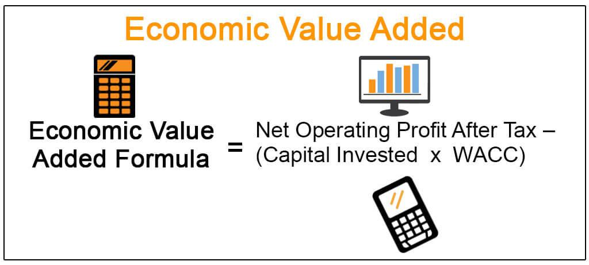

Economic Value Added (EVA) and Market Value Added (MVA) are pivotal financial metrics that serve as benchmarks for assessing a company's performance and its ability to generate value. In a business landscape where profitability is the primary indicator of success, EVA and MVA provide a deeper understanding of whether a company is truly adding value beyond merely generating revenues. 

EVA, a metric developed by Stern Stewart & Co., focuses on economic profit, calculating the value created above the required return on a company's capital. It is expressed as: 

$$
\text{EVA} = \text{NOPAT} - (\text{Invested Capital} \times \text{WACC})
$$

where NOPAT is the Net Operating Profit After Taxes, and WACC is the Weighted Average Cost of Capital. A positive EVA indicates that a company is creating wealth over its capital costs, thus reflecting the efficacy of management in its operational strategies.

MVA, on the other hand, measures the wealth amassed over time by quantifying the difference between the company's market value and the capital provided by shareholders and bondholders. A positive MVA suggests that the market perceives the company as having a robust business model with promising future growth prospects.

The integration of EVA and MVA into trading strategies, especially in the context of the burgeoning field of algorithmic trading, enhances the capacity to make informed financial decisions. Algorithmic trading leverages complex computer algorithms to execute trades with speed and precision, often surpassing human capabilities. By incorporating EVA and MVA into these algorithms, traders can optimize strategies based on indicators of genuine value creation rather than short-term profit data.

As technology continues to evolve, understanding these metrics is becoming increasingly crucial in digital trading environments, where decisions must be based on comprehensive financial analyses. The technological components, such as data analytics and AI, further refine the computation and application of these metrics, aligning them with contemporary trading needs and ensuring that companies are not only profitable but also generative of real economic value.

## Table of Contents

## Understanding Economic Value Added (EVA)

Economic Value Added (EVA) is a financial performance metric introduced by the consulting firm Stern Stewart & Co. It provides a quantitative measure of a company's economic profit by assessing value creation over and above the required return on capital. EVA is calculated using the formula:

$$
\text{EVA} = \text{NOPAT} - (\text{Invested Capital} \times \text{WACC})
$$

where NOPAT stands for Net Operating Profit After Taxes, Invested Capital represents the total capital invested in the company, and WACC is the Weighted Average Cost of Capital. 

The significance of EVA lies in its focus on value creation, which incorporates the cost of capital, thereby offering a more comprehensive reflection of a company's profitability compared to traditional metrics. It prioritizes the return on invested capital, enabling companies and investors to evaluate exactly how much value is being generated relative to the funds employed.

Companies with a positive EVA are deemed to be successful in creating value that surpasses the cost of their capital. In this scenario, the company is effectively rewarding its shareholders with returns above the expected threshold, signaling robust financial health and operational efficiency. Conversely, a negative EVA indicates that the company's returns fall short of covering its cost of capital, posing potential concerns regarding its financial strategies and sustainability.

The utility of understanding EVA extends to informed investment decision-making. It allows investors to discern whether a company is generating sufficient returns over its capital expenses. In essence, EVA not only aligns managerial incentives with shareholder interests but also serves as a credible benchmark for evaluating long-term financial performance. By focusing on economic profit, EVA provides a means for companies to enhance strategic decision-making, with the goal of maximizing long-term shareholder value.

## Exploring Market Value Added (MVA)

Market Value Added (MVA) is a vital financial metric that quantifies the wealth a company has created for its shareholders and bondholders. MVA is calculated as the difference between the market value of a company and the total capital invested by its financial supporters. This metric serves as a reliable indicator of a company's operational success and its position in the market, as it encapsulates the market's valuation of the company's future prospects relative to the capital invested.

$$

\text{MVA} = \text{Market Value of Equity} + \text{Market Value of Debt} - \text{Invested Capital} 
$$

MVA provides insights into the underlying value that a company has generated over time beyond just the initial capital investments. A positive MVA indicates that the company has added value, demonstrating that the market perceives the firm to be more successful than just the sum of its equity and debt contributions. Essentially, a higher MVA implies that the market values the company's capabilities and potential for future growth more than the original financial inputs.

Unlike Economic Value Added (EVA), which focuses on past financial performance and operational efficacy, MVA is more forward-looking. It assesses the market's perception and expectation of a company's ongoing and future operational performance. This distinction is crucial, as MVA reflects broader market trends and investor sentiment, providing a barometer for how market forces regard the company's strategic direction and potential for long-term success.

Understanding MVA allows investors and company management to discern the company's strategic efficacy and its market positioning relative to competitors. It provides a framework for evaluating how effectively management is utilizing capital to drive growth and how the market perceives these efforts. An increasing MVA typically signals strong strategic management and potential for sustained growth, while a decreasing MVA may suggest market apprehensions about a company's future profitability or strategic direction.

Overall, MVA serves as an essential gauge of a company's market standing, offering insights into investor confidence and market expectations, which are crucial for strategic planning and investment decisions. Its role in assessing the broader implications of a company's financial and operational strategies makes it indispensable for gauging market success and aligning business objectives with shareholder value creation.

## Algorithmic Trading and Financial Metrics

Algorithmic trading involves the automated execution of trading strategies using pre-defined criteria and sophisticated computer algorithms. This approach permits the rapid and efficient execution of trades with minimal human intervention, capitalizing on real-time market data and advanced computational capabilities.

Integrating Economic Value Added (EVA) and Market Value Added (MVA) metrics into [algorithmic trading](/wiki/algorithmic-trading) can significantly enhance strategic decision-making. EVA and MVA provide insights into a company's value creation and market perception, respectively, and their inclusion in trading algorithms offers a more nuanced understanding of potential investment opportunities. Specifically, algorithms can incorporate these metrics to evaluate the intrinsic value and market value discrepancies, thereby optimizing trade executions based on genuine value creation insights.

The ability of algorithms to analyze substantial datasets enables the incorporation of EVA and MVA metrics for predicting market movements or validating trading strategies. Given their comprehensive nature, algorithms can be programmed to assess EVA by calculating the net operating profit after taxes (NOPAT) minus the product of invested capital and the weighted average cost of capital (WACC). Moreover, they can estimate MVA through the difference between a company's market value and the total capital supplied by investors. This analytical depth supports more accurate forecasts of market trends and the identification of potential [arbitrage](/wiki/arbitrage) opportunities.

Furthermore, the utilization of EVA and MVA within algorithmic trading can bolster risk management practices. By providing a clearer picture of a company's financial health and market standing, these metrics allow traders to configure algorithms that account for financial stability and growth potential. Consequently, this not only informs trade selection but also aids in the mitigation of financial risks associated with market [volatility](/wiki/volatility-trading-strategies).

The refinement of trading algorithms to incorporate such extensive financial analysis facilitates more informed and potentially profitable trades. As technology advances, the integration of EVA and MVA into algorithmic frameworks will likely become more sophisticated, enabling traders to harness these metrics for achieving competitive advantage in dynamic markets. The continual adaptation of algorithms to include these parameters ensures compliance with evolving financial conditions and enhances the capacity to capitalize on market inefficiencies.

## Technological Impacts on EVA and MVA

Technological advancements have significantly enhanced the efficacy and precision of financial metrics such as Economic Value Added (EVA) and Market Value Added (MVA). With the integration of data analytics and [artificial intelligence](/wiki/ai-artificial-intelligence), the calculation and application of these metrics can be more robust and adaptive.

Real-time data processing capabilities now offer immediate insights into a company's financial metrics, supporting more dynamic and responsive trading strategies. This capability is crucial in high-frequency trading environments where market conditions can change in fractions of a second. By leveraging real-time data, traders and investors can swiftly adjust their strategies, maintaining or gaining a competitive edge.

Automation in financial analytics has reduced human error, leading to a more accurate reflection of a company's performance through EVA and MVA. Automated systems can execute calculations continuously and adjust to new data inputs without the delays inherent in manual processes. This automated accuracy ensures that companies' valuations are grounded in the latest available financial data, thus reflecting a more reliable financial health status.

In addition to refining calculations, technology enables the simulation of a range of market scenarios. This capability assists in predicting potential impacts on a company's EVA and MVA, thus facilitating preemptive strategic decisions. Through simulations, traders and investors can anticipate market trends and evaluate how different conditions might influence a company's value metrics. This foresight supports more strategic investment decisions and stabilizes portfolio management.

Furthermore, technology-driven analytical tools enhance the ability of investors and analysts to gauge market sentiment. These tools often use [machine learning](/wiki/machine-learning) algorithms to analyze vast amounts of market data, recognizing patterns and predicting shifts in investor sentiment. Understanding market sentiment is vital for aligning trading strategies with the underlying economic realities, as sentiment often drives market movements that are not immediately explained by traditional financial metrics.

In summary, technological advancements have transformed the landscape of calculating and applying EVA and MVA, making these financial tools more relevant and actionable in today's fast-paced digital trading environments.

## Factors Influencing EVA and MVA

Several factors play a critical role in shaping the Economic Value Added (EVA) and Market Value Added (MVA) for companies. Understanding these factors is essential for businesses and investors as they strategize towards maximizing value creation.

One of the primary elements impacting EVA is changes in operating profit. The formula for EVA:

$$
\text{EVA} = \text{NOPAT} - (\text{Invested Capital} \times \text{WACC})
$$

illustrates that any increase in Net Operating Profit After Taxes (NOPAT) positively influences EVA, assuming capital costs remain constant. Consequently, businesses striving for higher EVA should focus on enhancing operational efficiency and revenue generation.

Alterations in cost structure significantly affect EVA by influencing both NOPAT and the invested capital's weighted average cost of capital (WACC). Cost-saving measures that do not compromise quality can lead to a more favorable EVA as they enhance profitability while maintaining or reducing capital costs.

Shifts in capital costs, manifested through changes in WACC, also impact EVA. A firm's ability to secure lower-cost capital, either through favorable debt terms or improved equity market conditions, can enhance EVA by reducing the multiplier applied to the invested capital. Therefore, prudent financial management and market perception can lead to optimized capital costs.

Market perception, investor sentiment, and external economic conditions bear heavily on MVA. MVA is calculated by:

$$
\text{MVA} = \text{Market Value of Company} - \text{Capital Contributed by Shareholders and Bondholders}
$$

Favorable market sentiment or positive macroeconomic indicators can lead to a higher market valuation of a company, boosting its MVA. Conversely, negative market conditions can reduce a company's market value, hence lowering its MVA.

Management decisions, including mergers and acquisitions (M&A) or substantial project investments, are pivotal in altering both EVA and MVA. M&A can lead to synergistic gains, elevating EVA through enhanced operational efficiencies and market reach, while successful projects can increase market valuations, positively influencing MVA.

Economic policies and market trends are external factors with substantial impacts on EVA and MVA. Policies promoting economic growth and stability can lead to increased market confidence and investment, bolstering both EVA and MVA. In contrast, policies perceived to hinder economic performance might adversely affect these metrics.

In conclusion, comprehending the interplay of these factors facilitates effective strategic planning, allowing firms to adapt to and capitalize on market dynamics, ensuring sustained value creation for stakeholders.

## Conclusion and Strategic Implications

Economic Value Added (EVA) and Market Value Added (MVA) are essential tools for investors and traders striving to assess a company's intrinsic value, surpassing the insights offered by conventional financial reports. These metrics provide a more comprehensive picture by focusing on the notion of value creation, which is pivotal for informed decision-making in both investment and trading contexts.

Incorporating EVA and MVA into algorithmic trading strategies offers a distinct competitive advantage. By aligning rigorous financial analysis with automated trading functions, investors can enhance the precision and effectiveness of their trading strategies. Algorithmic systems can be programmed to consider EVA and MVA, ensuring that trading decisions are grounded in a thorough understanding of a company's economic performance and market perception. This alignment promotes more strategic trades, increases the probability of achieving superior returns, and aids in effective risk management.

As technology evolves, the accurate calculation and strategic application of EVA and MVA become increasingly critical for financial prosperity. Advanced data analytics, artificial intelligence, and real-time data processing allow companies to perform detailed assessments of these metrics with greater precision and speed. These technological enhancements facilitate an agile response to market changes, enabling organizations to adjust their strategies and maintain a competitive edge in the dynamic financial landscape.

Organizations must remain proactive in adapting to technological innovations to effectively harness these metrics and maximize their capital investments. Leveraging advanced tools for evaluating EVA and MVA enables companies to not only understand their current market position but also anticipate potential future scenarios. This adaptability is crucial for sustaining growth and maintaining viability in increasingly competitive markets.

In conclusion, EVA and MVA are indispensable benchmarks in evaluating the comprehensive aspects of a firm's value and market viability. They equip investors and traders with deeper insights into both the microeconomic foundations of a company and macroeconomic trends, guiding decisions that align with long-term strategic objectives.

## References & Further Reading

[1]: Stern, J. M., Stewart, G. B., & Chew, D. H. (1996). ["The EVA® Financial Management System."](https://onlinelibrary.wiley.com/doi/abs/10.1111/j.1745-6622.1995.tb00285.x) Harvard Business Review.

[2]: Stewart, G. B. (1991). ["The Quest for Value: A Guide for Senior Managers"](https://books.google.com/books/about/The_Quest_for_Value.html?id=36kEtbxGCKEC) by G. Bennett Stewart, New York: Harper Business.

[3]: Young, S. D., & O'Byrne, S. F. (2001). ["EVA and Value-Based Management: A Practical Guide to Implementation."](https://books.google.com/books/about/EVA_and_Value_Based_Management_A_Practic.html?id=GOO9FdX-2OMC) McGraw-Hill Education.

[4]: Peters, E. A. (1999). ["Patterns in the Dark: Understanding Risk and Predicting Profit in the Financial Markets"](https://archive.org/details/patternsindarkun0000pete) by Edgar E. Peters.

[5]: Copeland, T., Koller, T., & Murrin, J. (1994). ["Valuation: Measuring and Managing the Value of Companies"](https://www.semanticscholar.org/paper/Valuation-%3A-measuring-and-managing-the-value-of-Copeland-Koller/ebebaf4f0d08ebb4577075d386fb04ae4d032b23) by McKinsey & Company Inc., New York: John Wiley & Sons.