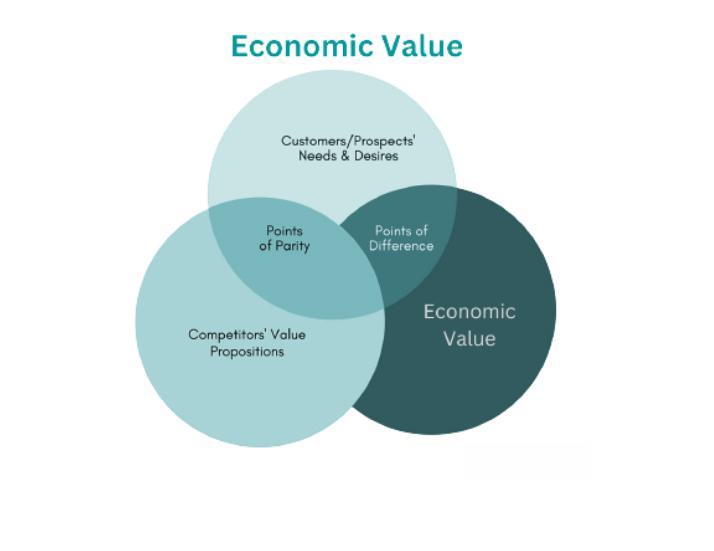

## Table of Contents

## What is economic value?

Economic value is how much something is worth in money. It's what people are willing to pay for a product or service. For example, if you want to buy a toy, the economic value of that toy is the price you are ready to pay for it. Businesses try to make things that people want and will pay for, so understanding economic value is important for them.

Economic value can change. It depends on things like how much people want something, how rare it is, and if there are other choices available. If a lot of people want a new phone and there aren't many of them, the economic value might go up. But if a better phone comes out, the value of the old phone might go down. So, economic value is not always the same and can be different for different people.

## What is market value?

Market value is the price at which something can be bought or sold in the market at a certain time. It's what people are willing to pay for an item right now. For example, if you want to sell your bike, the market value is the amount of money someone is ready to give you for it today. This value can change based on things like how much people want the bike, how many other bikes are for sale, and what condition your bike is in.

The market value is important because it helps people make decisions about buying and selling. If you know the market value of your house, you can decide if it's a good time to sell it or if you should wait for the value to go up. Businesses also use market value to set prices for their products. They try to find a price that people will pay but that also makes them money. So, understanding market value is key to making smart choices in the world of buying and selling.

## How do economic value and market value differ?

Economic value and market value are related but they are not the same thing. Economic value is about how much something is worth to people. It's the highest price someone would be willing to pay for something. For example, if you really want a new video game, the economic value to you might be high because you're willing to pay a lot for it. Economic value can be different for different people because everyone values things differently.

Market value, on the other hand, is the actual price at which something can be bought or sold in the market at a specific time. It's the price that buyers and sellers agree on right now. Using the same example, the market value of the video game is the price you see on the store shelf or online. This value can change based on things like how many people want the game, how many copies are available, and if there are other games that people might choose instead.

So, while economic value is about personal worth and can vary a lot, market value is more about what's happening in the market at the moment. Economic value helps us understand why people might be willing to pay different amounts for the same thing, while market value tells us what people are actually paying for it right now.

## What factors influence economic value?

Economic value is influenced by many things. One big thing is how much people want something. If a lot of people want a new toy, they might be willing to pay more for it. Another thing is how rare the item is. If there are not many of a certain type of phone, people might pay more for it because it's hard to find. Also, if there are other choices, like other phones that are just as good but cheaper, people might not want to pay as much for the rare phone.

Another [factor](/wiki/factor-investing) is how useful something is. If a tool helps you save time or do a job better, you might be willing to pay more for it. People also think about quality. A well-made jacket might cost more than a cheap one, but if it lasts longer, it might be worth it. Finally, personal feelings can change economic value. If you love a certain type of music, you might pay more for a concert ticket than someone who doesn't care about that music. So, economic value depends on a mix of how much people want something, how useful and good it is, and their personal feelings.

## What factors influence market value?

Market value is the price something can be bought or sold for right now. It changes based on how much people want the item and how many of them are available. If a lot of people want a new phone and there aren't many of them, the market value might go up because people are willing to pay more to get it. But if there are a lot of the same phones for sale, the market value might go down because people can find them easily and don't need to pay as much.

Other things that can change market value are what's happening in the economy and what people think might happen in the future. For example, if people think the economy will get better, they might be willing to pay more for houses because they think the value will go up. Also, if there are other choices, like other phones that are just as good but cheaper, the market value of the original phone might go down. So, market value depends on what's happening now and what people think will happen next.

## How is economic value calculated?

Economic value is not something you can find on a price tag. It's more like a feeling of how much something is worth to you. To figure it out, you think about how much you want something and what you're willing to give up to get it. If you really want a new video game, you might be ready to pay a lot for it. But if you don't care about the game, you might not want to pay much at all. So, economic value is different for everyone because everyone values things in their own way.

To calculate economic value, you can think about how much better off you would be with the item. For example, if a new tool can save you time, you might be willing to pay more for it because the time saved is valuable to you. You also consider other choices you have. If there's a cheaper tool that does the same thing, you might not want to pay as much for the new one. So, economic value is about weighing the benefits of having something against what you have to give up to get it.

## How is market value determined?

Market value is the price at which something can be bought or sold right now. It's decided by what people are willing to pay for it at that moment. If a lot of people want a new toy and there aren't many of them, the market value might go up because people are ready to pay more to get it. But if there are a lot of the same toys for sale, the market value might go down because people can find them easily and don't need to pay as much.

Other things that can change market value are what's happening in the economy and what people think might happen in the future. For example, if people think the economy will get better, they might be willing to pay more for houses because they think the value will go up. Also, if there are other choices, like other toys that are just as good but cheaper, the market value of the original toy might go down. So, market value depends on what's happening now and what people think will happen next.

## Can economic value exceed market value? If so, how?

Yes, economic value can be higher than market value. Economic value is how much something is worth to you personally. It's the highest price you'd be willing to pay for something. If you really want a new video game and you think it's worth a lot to you, your economic value for that game might be high. But the market value is just what the game costs in the store right now. If the store price is lower than what you're willing to pay, then the economic value is higher than the market value.

This can happen a lot. For example, if you find a rare book that you've been looking for a long time, you might be willing to pay a lot more for it than what it's currently selling for. The market value might be low because not many people want the book, but to you, it's worth a lot more. So, your economic value for the book is higher than its market value. This shows how personal feelings and wants can make economic value different from market value.

## How do economic and market values impact investment decisions?

When people decide where to invest their money, they think about both economic and market values. Economic value is how much something is worth to someone personally. If an investor thinks a company's product is really important and useful, they might see a high economic value in it. This can make them want to invest in that company because they believe in its future success. But they also need to look at the market value, which is the price the company's stock is selling for right now. If the market value is lower than what they think the company is worth, they might see it as a good time to buy because they think the stock price will go up.

Market value also plays a big role in investment decisions. If a stock's market value is high, it might mean a lot of people want to buy it, which could make the investor think it's a good choice. But if the market value is much higher than the economic value the investor sees, they might decide not to invest because they think the price is too high and might go down. So, investors look at both values to decide if they should buy, sell, or hold onto their investments. They want to make sure they're getting something that's worth it to them and that the price is right in the market.

## What role do economic and market values play in business strategy?

Economic and market values are really important for businesses when they make plans. Economic value is how much something is worth to people. If a business knows what people value, they can make products or services that people want to buy. For example, if people think a new phone is worth a lot, the business might focus on making that phone better and selling it for a price that people are willing to pay. This helps the business make more money and grow.

Market value is the price at which something can be bought or sold right now. Businesses need to know the market value to set their prices right. If the market value of their product is high, they might keep the price high to make more money. But if the market value goes down, they might need to lower their price to keep selling. Understanding both economic and market values helps businesses decide what to make, how to price it, and how to grow. It's like a guide that helps them make smart choices to stay successful.

## How do changes in the economy affect economic and market values?

Changes in the economy can affect both economic and market values in big ways. If the economy is doing well, people might feel more confident about spending money. This can make them willing to pay more for things, which can increase the economic value of products and services. At the same time, if a lot of people want to buy things, the market value can go up because there's more demand. But if the economy is not doing well, people might be more careful with their money. They might not want to spend as much, which can lower the economic value of things because people are not willing to pay as much for them.

Market value can also change a lot with the economy. When the economy is growing, businesses might see higher market values for their products because more people are buying. This can make stocks and other investments go up in value too. But if the economy goes into a recession, people might not have as much money to spend, and businesses might have to lower their prices to sell things. This can make the market value go down. So, the health of the economy can make a big difference in what people think things are worth and what they're willing to pay for them.

## What advanced metrics or models can be used to assess economic and market values more accurately?

To assess economic and market values more accurately, businesses and investors often use advanced metrics and models. One popular method is the Discounted Cash Flow (DCF) model. This model looks at how much money a business is expected to make in the future and then figures out what that money is worth today. It helps people understand the economic value of a business by thinking about how much they're willing to pay for future earnings. Another useful tool is the Price-to-Earnings (P/E) ratio, which compares a company's stock price to its earnings per share. This can give a quick idea of whether a stock's market value is high or low compared to how much money the company is making.

Another advanced metric is the Consumer Surplus, which measures the difference between what consumers are willing to pay for a product and what they actually pay. This helps businesses understand the economic value from the customer's point of view. On the market value side, the Capital Asset Pricing Model (CAPM) is often used to figure out the expected return on an investment, which can help set the right price for stocks. These models and metrics give a deeper look into economic and market values, helping businesses and investors make smarter decisions based on more than just current prices or feelings.

Overall, using these advanced tools can help businesses and investors see beyond simple numbers. They can understand the true value of products, services, and investments by looking at future earnings, customer willingness to pay, and how investments fit into the bigger picture of the market. This can lead to better decisions and a clearer understanding of both economic and market values.

## What is the Understanding of Market Value?

Market value represents the price at which an asset is transacted in an open market, reflecting both the prevailing supply and demand dynamics. This pricing mechanism ensures that the values at which stocks, commodities, and other financial instruments are traded impede or catalyze economic exchanges, ultimately determining the asset’s market capitalization and broader economic valuation.

The interplay between supply and demand is fundamental to understanding how market value fluctuates. When demand for an asset increases relative to its supply, the market value generally escalates. Conversely, when supply overshadows demand, market prices typically diminish. This dynamic equilibrium ensures that market value remains responsive to consumer willingness to pay and availability of the asset in question.

Market value serves as a critical metric for assessing the overall size and financial health of companies through market capitalization. This is calculated as:

$$
\text{Market Capitalization} = \text{Share Price} \times \text{Number of Outstanding Shares}
$$

Where the share price is essentially the market value of each individual share, and the number of outstanding shares reflects total ownership [dispersion](/wiki/dispersion-trading).

Several extrinsic factors can heavily influence market value. Liquidity, or the ease with which an asset can be bought or sold with minimal impact on its price, plays a critical role. Highly liquid markets, such as those for blue-chip stocks, often demonstrate more stable market values due to the ability to trade efficiently.

Economic conditions also weigh heavily on market value. Macroeconomic indicators like interest rates, inflation rates, and industry growth projections can either bolster or undermine confidence in an asset, leading to value fluctuations. Investor perceptions, often shaped by market sentiment, geopolitical events, and corporate news, can further amplify or suppress asset valuations. Understanding these multifaceted interactions  is essential for estimating true market value and making informed financial decisions.

## How can economic and market values be integrated into algorithmic trading?

Incorporating economic and market values into [algorithmic trading](/wiki/algorithmic-trading) involves integrating these metrics into automated trading strategies to enhance decision-making and risk management. Economic Value Added (EVA) and Market Value Added (MVA) are two critical metrics that serve this purpose by providing insights into a company's financial performance and market standing.

EVA, a measure introduced by Stern et al. (1996), calculates the value created beyond the required return of a company’s shareholders. It is represented as:

$$
\text{EVA} = \text{Net Operating Profit After Taxes (NOPAT)} - (\text{Capital} \times \text{Cost of Capital})
$$

This metric helps traders evaluate a firm's operational efficiencies and overall value generation capabilities. By incorporating EVA into algorithmic trading, systems can assess whether a stock is likely undervalued or overvalued compared to its intrinsic value, influencing buy or sell decisions.

Similarly, MVA indicates the difference between the market value of a company and the capital contributed by investors. It measures the wealth a company has generated for its stakeholders. A higher MVA implies better value creation, which can be integrated into algorithmic models to assess growth potential and market perceptions.

Algorithmic trading systems utilize these metrics to refine strategies by evaluating genuine value creation and potential market discrepancies. For instance, [artificial intelligence](/wiki/ai-artificial-intelligence) and [machine learning](/wiki/machine-learning) algorithms can process substantial data sets to quantify EVA and MVA in real time, facilitating timely execution of trades based on robust financial analysis rather than mere market speculations.

The integration of economic and market values into trading algorithms allows traders to better manage risk and predict market movements by aligning their strategies with underlying value drivers. Through advanced data analytics and continuous monitoring of EVA and MVA, traders can anticipate shifts in stock performance and market trends, ultimately enhancing trading precision and profitability. This approach underscores the importance of aligning trading strategies with comprehensive value assessments to achieve sustainable investment outcomes.

## References & Further Reading

Stern, J. M., Stewart, G. B., & Chew, D. H. (1996). "The EVA Financial Management System." Harvard Business Review. This publication explores the concept of Economic Value Added (EVA) as a performance metric for evaluating genuine value creation within firms. It offers insights into how EVA can be applied to strategic decision-making in financial management.

Lopez de Prado, M. (2018). *Advances in Financial Machine Learning*. Wiley. This book provides a comprehensive overview of the use of machine learning techniques in financial markets. It covers the methodologies and complexities of implementing machine learning to enhance algorithmic trading strategies and improve predictive accuracy in market environments.

Chan, E. (2013). *Algorithmic Trading: Winning Strategies and Their Rationale*. Wiley. This resource outlines various algorithmic trading strategies and the rationale behind their design. It emphasizes practical approaches to implementing quantitative strategies in trading, focusing on the integration of economic and market values to optimize decision-making processes.

