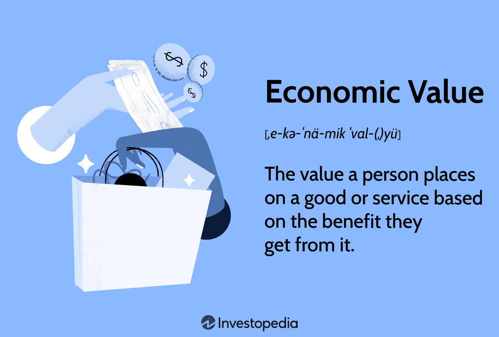

Economic value is a fundamental concept in economics that plays a crucial role in the allocation of resources within markets and influences the broader economy. At its core, economic value represents the worth that individuals assign to goods and services, which, in turn, informs how pricing strategies are formulated and resources are distributed. The subjective nature of economic value means it can vary significantly between individuals, as it is shaped by personal preferences, needs, and perceptions of utility.

Algorithmic trading, an advanced form of trading leveraging mathematical models and computational algorithms, relies heavily on estimates of economic value to exploit potential financial opportunities. By integrating complex data and leveraging precise valuation techniques, algorithmic trading systems aim to optimize decision-making processes, allowing traders to execute strategies with speed and efficiency.



This article will cover a range of examples illustrating economic value, examine various methodologies employed to assess this value, and demonstrate the significance of these concepts within the context of algorithmic trading. By doing so, it aims to provide a comprehensive understanding of how economic value influences market dynamics and the choices made by economic agents.

## Table of Contents

## What is Economic Value?

Economic value is the perceived benefit or utility that an individual derives from consuming a good or service, and this perception can differ significantly among different individuals. This concept is pivotal because it reflects the subjective nature of how individuals measure worth or importance, which influences their decisions as consumers. 

While market value is a more objective measure determined by the forces of supply and demand in a market setting, economic value is inherently subjective and personal. Market value represents the price at which a good or service is traded in a competitive marketplace, whereas economic value considers personal preferences and individual usefulness.

Several methods are employed to estimate economic value, each leveraging various aspects of behavioral economics and market analysis:

1. **Willingness to Pay (WTP):** This is a primary method used to estimate economic value. It quantifies the maximum amount an individual is prepared to spend to purchase a good or service. This method assumes that people are rational agents who will pay up to the point where the economic value to them equals the price.

2. **Hedonic Pricing:** This approach is often used for goods with multiple attributes by analyzing the price of related goods. For example, in real estate, the price of a house may depend on various factors such as location, size, and amenities. Hedonic pricing models attempt to isolate these factors to understand how each contributes to the overall price, essentially using the market value of these attributes to estimate their economic value.

3. **Consumer Surveys:** These are direct methods of gathering data on how consumers perceive the value of different goods and services. Through carefully designed surveys, consumers' preferences, perceived benefits, and WTP are analyzed to estimate economic value. Data collected from surveys can be subjective but are instrumental in capturing consumer sentiment.

Estimating economic value involves recognizing these subjective evaluations and integrating them with more objective data sources, providing businesses insights into consumer behavior. The ability to accurately assess economic value can inform pricing strategies and resource allocation, potentially leading to increased customer satisfaction and financial performance.

## Examples of Economic Value

Economic value in consumer goods is significantly shaped by brand perception and marketing strategies. Companies invest substantial resources into brand building because a strong brand can increase the perceived value of their products. For instance, branded products often command a premium price over generic counterparts, despite having similar functional benefits. This is because consumers associate brands with quality, prestige, or status, which adds to the product's economic value. Marketing strategies such as advertising, packaging, and promotional activities also enhance a product's economic value by effectively communicating its benefits and differentiating it from competitors.

In financial markets, economic value is crucial for evaluating the worth of various financial instruments such as stocks, bonds, and derivatives. Investors assess the economic value of these assets by analyzing factors like future cash flows, risk, and market conditions. For example, the value of a stock is often estimated using models such as the Discounted Cash Flow (DCF) method, where the stock's value $V$ is calculated as:

$$
V = \sum \frac{CF_t}{(1 + r)^t}
$$

Here, $CF_t$ is the cash flow in year $t$ and $r$ is the discount rate. This equation highlights how projected earnings and interest rates influence a stock's economic value. Similarly, bond valuation considers interest payments and the principal repayment, while derivatives are assessed based on the underlying asset’s movement and market [volatility](/wiki/volatility-trading-strategies).

Economic value also plays a pivotal role in corporate finance and personal wealth management, serving as a critical determinant in investment and trading decisions. In corporate finance, understanding the economic value of investment opportunities allows companies to allocate resources efficiently and maximize shareholder value. This is often achieved through methods such as Net Present Value (NPV) analysis or the Economic Value Added (EVA) metric, which measures a company's financial performance by subtracting the cost of capital from its net operating profit.

For individual investors, recognizing the economic value of assets aids in constructing diversified portfolios that align with personal financial goals, while maximizing returns and managing risk. Tools like asset valuation models and financial planning software are employed to evaluate prospective investments and their potential to enhance overall wealth. 

These examples illustrate the pervasive influence of economic value across different sectors, shaping consumption patterns, investment strategies, and financial outcomes.

## Estimating Economic Value

Estimating economic value involves various methodologies tailored to capture the subjective and dynamic nature of how individuals and businesses perceive value. These methods are essential tools for businesses to establish pricing strategies that not only attract consumers but also maximize their perceived value.

One widely used method is the willingness to pay (WTP) approach. This measure assesses how much a consumer is willing to spend for a specific good or service, reflecting their perceived value of the item. The formula to estimate willingness to pay can often involve consumer surveys and behavioral experiments, where adjustments are made based on demographic and psychographic factors. For instance, a typical survey might ask consumers to choose between different product bundles at varying price points to infer their highest acceptable price.

Market price analysis is another common method used to estimate economic value. Through this technique, businesses examine existing market prices for similar goods and services. This analysis includes observing the fluctuations and trends in market prices over time, allowing companies to set competitive prices that align with consumer expectations and market conditions. The equation often used in market price analysis is a comparison of average prices within industry segments:

$$
P_{\text{value}} = \frac{\sum (P_i \times Q_i)}{\sum Q_i}
$$

where $P_{\text{value}}$ is the economic value, $P_i$ is the observed price, and $Q_i$ is the quantity sold.

Hedonic pricing further aids in estimating economic value by dissecting a good into its constituent attributes and determining the value consumers place on each. This method is frequently applied in real estate markets, where properties are evaluated based on characteristics such as location, size, age, and amenities. A regression analysis can be used in hedonic pricing to isolate the impact of each attribute on the overall pricing:

$$
P = \alpha + \beta_1 X_1 + \beta_2 X_2 + \ldots + \beta_n X_n + \epsilon
$$

Here, $P$ represents the property price, $\alpha$ is a constant, $\beta_n$ are the coefficients of different attributes $X_n$, and $\epsilon$ is the error term.

These methods of estimating economic value are synergistically used by businesses to tailor their pricing and marketing strategies. By integrating consumer preferences, market trends, and historical data, companies can better align product offerings with consumer desires, ultimately enhancing competitive positioning and profitability. Analyzing these elements requires sophisticated data analytics tools, which aid in capturing the ever-changing landscape of consumer behavior and preferences, thereby continually refining the estimation of economic value.

## Algorithmic Trading and Economic Value

Algorithmic trading is a modern approach to financial market activity, leveraging computational power and algorithms to execute trades at speeds and frequencies that are beyond human capability. The success of [algorithmic trading](/wiki/algorithmic-trading) heavily depends on the accurate estimation of economic value. By using precise value estimations, algorithms can make informed decisions that optimize trading strategies, identifying profitable opportunities with greater accuracy.

Quantitative models form the backbone of algorithmic trading, where economic value indicators play a crucial role. These quantitative models utilize economic value estimations to determine the intrinsic worth of financial assets and to predict market movements. For example, metrics such as Economic Value Added (EVA) and Market Value Added (MVA) are incorporated to enhance the financial models used by trading algorithms.

Economic Value Added (EVA) is a measure of a company's financial performance based on residual wealth, calculated by deducting the cost of capital from its operating profit. The formula for EVA is given by:

$$
\text{EVA} = \text{Net Operating Profit After Taxes (NOPAT)} - \text{Capital Employed} \times \text{Weighted Average Cost of Capital (WACC)}
$$

EVA provides insight into whether a trading strategy or investment is generating value above the required return by the investors.

Market Value Added (MVA) evaluates a company's ability to generate wealth for shareholders. It is defined as the difference between the market value of a company and the capital contributed by investors:

$$
\text{MVA} = \text{Market Value of Company} - \text{Capital Invested}
$$

In algorithmic trading, these metrics are essential. Trading algorithms analyze large datasets and consider indicators like EVA and MVA to evaluate the potential financial outcome of different trading avenues. The algorithms continuously process market information, assess economic value in real-time, and adjust trading strategies accordingly to exploit profitable opportunities as they arise.

The integration of these metrics into trading algorithms is facilitated by advanced programming and data processing techniques. Python, for instance, is widely used within this domain due to its robust libraries like NumPy for numerical computations, Pandas for data manipulation, and SciPy for further mathematical assessments. Here is a simple representation of how EVA might be calculated in Python:

```python
def calculate_eva(nopat, capital_employed, wacc):
    return nopat - (capital_employed * wacc)

# Example values
nopat = 500000  # Net Operating Profit After Taxes
capital_employed = 2000000  # Total Capital Employed
wacc = 0.08  # Weighted Average Cost of Capital

eva = calculate_eva(nopat, capital_employed, wacc)
print("Economic Value Added (EVA):", eva)
```

In summary, algorithmic trading leverages economic value estimates through sophisticated quantitative models to optimize trade execution. By integrating metrics like EVA and MVA, trading algorithms enhance the accuracy and efficacy of their strategies, capturing financial opportunities that foster economic growth and investor profitability.

## Impact of Technology on Valuation

Technological advancements have significantly impacted the precision and efficiency of economic value estimation, particularly through the application of data analytics and [artificial intelligence](/wiki/ai-artificial-intelligence) (AI). Data analytics processes vast amounts of both structured and unstructured data, allowing for real-time data processing that enhances decision-making capabilities in various economic sectors, including finance and trading.

Real-time data processing is critical in an environment where market conditions can change rapidly. By utilizing big data technologies and [machine learning](/wiki/machine-learning) algorithms, trading systems can swiftly process information to identify emerging market trends and opportunities. This capability improves the accuracy of estimating economic value by integrating multiple data sources and considering a wide array of factors that may influence asset values. Algorithms equipped with AI-driven insights can assess a multitude of variables such as market sentiment, historical patterns, and even geopolitical information to predict economic outcomes with greater reliability.

Moreover, AI technologies facilitate the refinement of valuation models. They help create models that adapt to new data, continuously learning and evolving to improve predictions. For instance, neural networks and [deep learning](/wiki/deep-learning) models can uncover complex patterns within datasets, leading to more nuanced and precise economic value estimations. These methods are crucial in evaluating assets like stocks, bonds, or derivatives, where traditional methods might fail to account for multifaceted and non-linear relationships.

By integrating advancements in technology, investors and companies are better equipped to refine their valuation models. This leads to optimized resource allocation and improved financial outcomes. Automated trading systems, powered by AI and enhanced data analytics, allow for swift and informed trading decisions, yielding a competitive advantage in rapidly changing markets. An example of such integration is the use of sentiment analysis in social media data to predict market movements, thereby assisting in the valuation process.

In conclusion, the impact of technology on valuation practices underscores the importance of embracing new tools and methodologies. By leveraging advancements in data analytics and AI, businesses and traders enhance their ability to estimate economic value accurately and achieve superior financial outcomes in dynamic economic landscapes.

## Conclusion

Understanding and accurately estimating economic value is crucial in today's fast-paced economic and trading environments. The economic value of a good or service reflects the benefit derived by individuals, which in turn influences pricing strategies, resource allocation, and overall market dynamics. As markets become increasingly complex and interconnected, accurately determining economic value becomes essential for traders and businesses aiming to achieve financial success.

Integrating economic value into trading strategies provides a distinct competitive advantage. Traders who can assess economic value effectively are better positioned to make informed decisions, optimizing their portfolio's performance. By leveraging metrics like Economic Value Added (EVA) and Market Value Added (MVA), trading algorithms can pinpoint opportunities for higher returns, ensure more efficient capital allocation, and manage risks more effectively.

Technological advancements play a critical role in empowering traders and companies to capitalize on economic value opportunities. Enhanced data analytics, real-time data processing, and AI-driven insights have significantly improved the precision of economic value estimation. With the capability to analyze vast datasets, identify trends, and adapt to market changes swiftly, traders can enhance their decision-making processes and refine their valuation models continuously.

As technology continues to evolve, its impact on the estimation and application of economic value is expected to strengthen. Future advancements will likely further streamline the integration of economic value into trading strategies, enabling more sophisticated and adaptive models. This ongoing evolution offers promising prospects for traders and companies, allowing them to maintain and enhance their competitive edge in a rapidly changing marketplace.

## References & Further Reading

[1]: Bergstra, J., Bardenet, R., Bengio, Y., & Kégl, B. (2011). ["Algorithms for Hyper-Parameter Optimization."](https://papers.nips.cc/paper/4443-algorithms-for-hyper-parameter-optimization) Advances in Neural Information Processing Systems 24.

[2]: ["Advances in Financial Machine Learning"](https://www.amazon.com/Advances-Financial-Machine-Learning-Marcos/dp/1119482089) by Marcos Lopez de Prado

[3]: ["Evidence-Based Technical Analysis: Applying the Scientific Method and Statistical Inference to Trading Signals"](https://www.amazon.com/Evidence-Based-Technical-Analysis-Scientific-Statistical/dp/0470008741) by David Aronson

[4]: ["Machine Learning for Algorithmic Trading"](https://github.com/stefan-jansen/machine-learning-for-trading) by Stefan Jansen

[5]: ["Quantitative Trading: How to Build Your Own Algorithmic Trading Business"](https://www.amazon.com/Quantitative-Trading-Build-Algorithmic-Business/dp/1119800064) by Ernest P. Chan

[6]: Shleifer, A. (2000). ["Inefficient Markets: An Introduction to Behavioral Finance."](https://academic.oup.com/book/27761) Oxford University Press.

[7]: Fama, E. F., & French, K. R. (1992). ["The Cross-Section of Expected Stock Returns."](https://onlinelibrary.wiley.com/doi/full/10.1111/j.1540-6261.1992.tb04398.x) The Journal of Finance, 47(2), 427-465.

[8]: ["The Little Book of Valuation: How to Value a Company, Pick a Stock and Profit"](https://www.amazon.com/Little-Book-Valuation-Company-Profits/dp/1394244401) by Aswath Damodaran