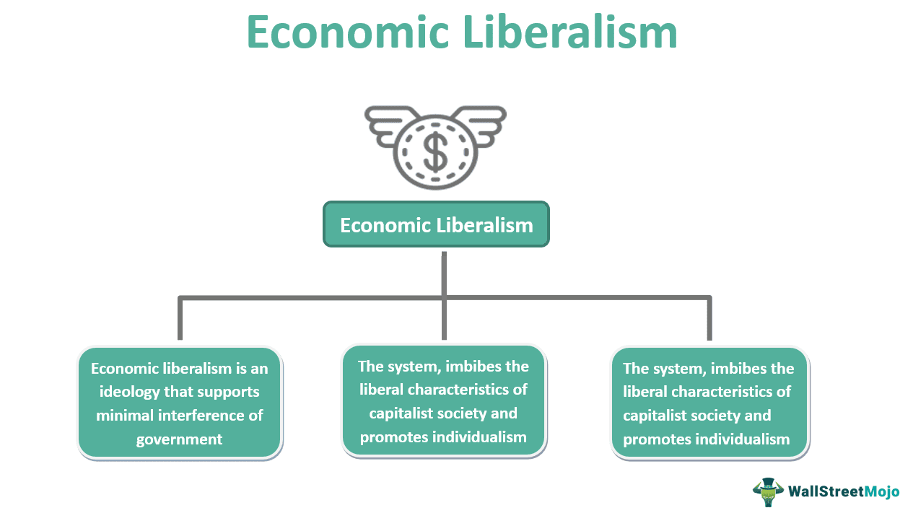

The financial status of U.S. presidents has often reflected the broader economic conditions of their respective eras. While some presidents entered the White House with considerable wealth, others faced notable financial hardships both before and during their presidencies. This article seeks to explore these economic disparities by examining some of the poorest individuals to have held the highest office in the United States and how their financial journeys have mirrored or diverged from national trends.

Historically, a president's financial background and their subsequent monetary challenges have offered insights into the economic climate of the era. Presidents like Abraham Lincoln and Ulysses S. Grant faced difficult economic conditions, which were indicative of wider financial instabilities in the nation at large. By contextualizing these personal financial struggles, one can gain a deeper understanding of the interplay between presidential economics and national prosperity or adversity.

Financial legislation, notably the Former Presidents Act, has been a crucial factor in shaping the post-presidential financial stability of U.S. presidents. Enacted to provide necessary support after leaving office, this act ensures that presidents are not left without financial recourse, reflecting a significant evolution in how the financial security of former presidents is maintained. Additionally, it highlights the broader responsibility of the nation to its leaders beyond their tenure.

In modern times, technological advancements have introduced new dimensions to personal finance management, even for past presidents. Algorithmic trading and other contemporary financial tools have the potential to significantly alter the financial landscapes for individuals who have served as president. These modern tools present opportunities for former presidents to engage in advanced financial management strategies, possibly leading to enhanced financial security post-office.

Ultimately, the financial trajectories of U.S. presidents, influenced by both historical contexts and modern innovations, provide not only a reflection of personal and national economic conditions but also illustrate the ways in which financial security and policymaking are intrinsically linked. This exploration sheds light on the profound implications of financial literacy and strategic management for those who serve in one of the world's most influential roles.

## Table of Contents

## Understanding Presidential Salaries

The salary of the President of the United States is currently set at $400,000 annually. While this figure represents a substantial sum compared to the average American salary, it is modest when juxtaposed with the compensation packages of top business executives, who often earn multi-million-dollar salaries. The presidential salary is just one facet of a broader compensation package, which includes additional perks and benefits designed to offset the unique responsibilities and lifestyle requirements of the presidency.

### Evolution of Presidential Salaries

The salary of the U.S. president has undergone several changes since the founding of the nation. When George Washington took office, the presidential salary was $25,000 per year, a figure intended to ensure that the leader of the nation could maintain a standard of living befitting the position without personal financial strain.

Adjusting for inflation to provide a clearer picture of how presidential compensation has evolved, consider the Consumer Price Index (CPI) as a tool for this adjustment. Let $P$ represent the present value and $I_r$ the initial value, with $f$ indicating the inflator based on the CPI:

$$

P = I_r \times f 
$$

For instance, using historical data, George Washington's $25,000 salary in 1789 would equate to approximately $700,000 in today's dollars. This adjustment illustrates both the continuity and the periodic increases aligned with inflation and the changing economic circumstances of the nation.

Throughout history, presidential salaries have been periodically adjusted to reflect changes in the economic landscape. Notable increments occurred in 1873, when the salary was doubled to $50,000, and in 1909, when the salary was raised to $75,000. The current salary of $400,000 has been in effect since 2001, following legislation passed in 1999.

### Benefits and the Former Presidents Act

The financial compensation package for a U.S. president goes beyond mere salary. Presidents enjoy a range of benefits, including residency in the White House, access to Air Force One, personal security, and a comprehensive staff. Post-presidency, former presidents benefit from pensions and allowances provided under the Former Presidents Act of 1958. This legislation ensures that former heads of state continue to receive financial support, reflecting their service and helping them transition to life after their term(s) in office.

Under the Former Presidents Act, former presidents receive a lifetime pension equivalent to the salary of a cabinet secretary, which was $226,300 as of 2020. They are also eligible for reimbursement of travel, staff, and office expenses, which aid in fulfilling roles as public figures post-tenure. Medical benefits and Secret Service protection further enhance their security and well-being.

In summary, the financial provisions for U.S. presidents, both during and after their terms in office, are carefully structured to reflect the dignity of the position and to ensure adequate support for those who serve in this demanding role. Over the centuries, these financial structures have evolved, balancing historical legacies with modern economic realities to provide both a fair salary and a robust suite of benefits.

## The Poorest Presidents in U.S. History

The financial situations of U.S. presidents have varied widely, with some commanding vast wealth and others grappling with financial constraints. While the modern remuneration of a U.S. president stands at $400,000 annually, a figure notably higher than the average American salary, this was not always the case. Historically, some presidents assumed office with modest personal fortunes, enduring economic struggles both prior to and during their tenure. 

Chester A. Arthur, who served as the 21st president, had a career as a lawyer and politician before assuming office. Despite these roles, Arthur's financial prospects were not particularly strong, especially as the spoils system, which had widely influenced patronage and clientelism, started diminishing, reducing additional income opportunities. His personal financial narrative is best understood against the backdrop of the economic norms of his era, where limited presidential compensation left him with relatively constrained personal finances.

Woodrow Wilson, the 28th president, came from an academic background and served as the president of Princeton University. While Wilson received a comfortable salary, his personal wealth never accumulated significantly. Despite his scholarly prestige, his earnings were based primarily on his professional wages, aligning with an early 20th-century economy where substantial personal wealth from public service roles was uncommon.

James A. Garfield, the 20th president, originated from a rather humble background, having been born into poverty. Before his presidency, Garfield worked through various occupations, including teaching and politics, gradually building a stable, if modest, financial foundation. His financial status was reflective of a mid-19th-century context, where individual wealth was often proportional to career longevity and local economic conditions.

Calvin Coolidge, the 30th president, was known for his frugality. Born into a family with limited wealth, Coolidge's financial management was prudent throughout his political career. His financial conservatism resonated with the Roaring Twenties era in which he served—a time characterized by economic boom but also foreshadowing subsequent financial collapse. Despite societal prosperity, Coolidge maintained a lifestyle that emphasized savings and minimal expenditures.

Harry Truman, the 33rd president, faced notable financial difficulties before and after his presidency. Following his presidency, Truman's financial situation was precarious enough to help catalyze the passage of the Former Presidents Act, which provided a pension for former presidents. Truman's financial trials were emblematic of a mid-20th-century economic reality that did not guarantee sustained wealth following public service, asserting the need for post-office financial security.

In historical terms, the property and wealth associated with these leaders can be contrasted against the economic standards of their respective times. For instance, a 19th-century president like Garfield's financial struggles would have reflected common concerns among average citizens during post-Civil War America—a period without the economic safeguards modern professionals might expect. Meanwhile, the challenges faced by Truman underscore a transitional moment in American history, marking a shift towards formalized post-presidency financial support.

The definition of 'poor', when applied to presidents, often signals a disparity between the expectations associated with the office's prestige and actual financial circumstances. Although these presidents were far from destitute by contemporary standards, their financial statuses were not inherently secure, particularly when measured against expectations of affluence tied to high political office.

## How Presidents Managed Their Finances

The financial management of U.S. presidents has varied greatly, reflecting their personal philosophies and the economic conditions of their times. Calvin Coolidge, known for his frugality, made careful financial decisions, ensuring his expenses remained within a controlled budget during and after his presidency. His modest lifestyle and prudent investments allowed him to maintain financial stability even after leaving office.

In stark contrast, Harry Truman faced significant financial difficulties, partly due to his modest origins and the lack of substantial financial gains during his political career. Truman's financial struggles became particularly pronounced post-presidency, as he received no pension until the enactment of the Former Presidents Act in 1958. This legislation was a pivotal financial relief, providing him with a stipend and preventing him from financial destitution.

Some presidents shored up their finances through book deals and speaking engagements after leaving office. For instance, Ulysses S. Grant, who found himself in financial ruin due to bad investments, managed to secure his family's future through the posthumous success of his memoirs, which were published by Mark Twain's publishing house. Similarly, Barack Obama capitalized on post-presidential opportunities, signing lucrative book deals and engaging in high-profile speaking events, significantly increasing his net worth.

Strategic financial management and investments also played a role in how presidents managed their post-office years. While official stipends and pensions provided some financial security, many presidents pursued additional income sources. Bill Clinton, for instance, leveraged his status to command high fees for speaking events and authored multiple best-selling [books](/wiki/algo-trading-books), contributing to his considerable wealth accumulation after his presidency.

These diverse approaches underscore the varied ways presidents have handled financial management, highlighting the importance of strategic planning and adaptation to ensure financial security, regardless of their initial economic standing.

## Algorithmic Trading: A Modern Financial Tool

Algorithmic trading, often seen as a breakthrough in financial management, utilizes computer algorithms to execute trades at speeds and frequencies impossible for human traders. This technology has transformed how both individuals and institutions approach investment strategies, offering significant advantages in terms of efficiency, precision, and cost-effectiveness.

**Potential for Wealth Management**

For high-profile individuals such as former U.S. presidents, [algorithmic trading](/wiki/algorithmic-trading) offers a distinct advantage in managing post-presidential wealth. These individuals often seek to maintain or grow their financial assets, and the strategic application of algorithmic trading can serve as a powerful tool in achieving these objectives. The benefits of algorithmic trading in this context include:

1. **Speed and Efficiency**: Algorithms can process vast amounts of data and execute trades in milliseconds. This speed allows for capturing market opportunities that exist only for brief periods.

2. **Minimized Emotional Bias**: By automating trading decisions, algorithmic systems remove the emotional and cognitive biases that often impair human decision-making, leading to more disciplined and consistent investment outcomes.

3. **Backtesting**: Algorithms can be tested against historical data to evaluate their effectiveness, enabling the refinement of strategies before deploying them in live markets.

4. **Diversification**: Algorithmic trading can be used to implement diversified strategies across multiple asset classes and markets simultaneously, reducing exposure to market volatility.

**Leveraging Modern Financial Technologies**

Former presidents often possess substantial public platforms and influence, which they can leverage for various income-generating activities, such as book deals and speaking engagements. However, supplementing these income streams with algorithmically-driven investments could significantly enhance their financial portfolios. Here's how they might benefit:

- **Customized Algorithms**: By employing financial experts to develop customized trading algorithms, former presidents can tailor investment strategies to align with their financial goals and risk tolerance.

- **Automated Portfolio Management**: Algorithmic systems can continuously monitor portfolios and automatically adjust asset allocations in response to market conditions, ensuring that portfolios remain aligned with strategic objectives.

- **Risk Management**: Advanced algorithms can incorporate sophisticated risk management frameworks, automatically rebalancing portfolios to mitigate potential losses during market downturns.

The application of algorithmic trading by former presidents highlights not only its adaptability and effectiveness but also its expanding role in modern wealth management. As technological advancements continue to evolve, the capacity of algorithmic trading to influence the financial trajectories of high-profile individuals is likely to grow, underscoring its status as a pivotal component of contemporary financial strategy.

## Privilege, Power, and Poverty: The Presidential Paradox

The paradox of U.S. presidential power juxtaposed with personal financial challenges reveals intriguing dynamics between public perception and fiscal reality. While the office of the president holds immense power and influence, the personal financial health of individuals who occupy this role can vary significantly. This contrast is often not apparent to the public, who may equate holding high office with financial security.

A president's financial status can subtly impact their political decisions and legacy. For instance, personal financial difficulties may lead presidents to prioritize economic policies that resonate with their economic reality, potentially influencing focus areas such as tax reform, social welfare, and government spending. Presidents who have experienced financial hardships might work towards more equitable economic policies, driven by empathy for similar struggles among citizens. Conversely, wealthier presidents might emphasize policies that support business interests or fiscal conservatism.

Historical examples provide insight into how personal finances may shape presidential decisions. Harry Truman, recognized for his financial prudence and modest background, was an advocate for social security and public housing initiatives. His personal experiences with financial adversity likely informed his commitment to policies aimed at aiding the economically disadvantaged.

Furthermore, economic policies proposed by presidents might reflect their personal financial experiences. A president familiar with financial insecurity might push for increased government intervention in markets and expanded social safety nets, recognizing the societal need for financial support systems based on personal relevance. In contrast, presidents from affluent backgrounds, who are comfortably ensconced in financial stability, might lean towards laissez-faire economic models, driven partly by a belief in self-sufficiency.

The dichotomy between presidential privilege and personal financial poverty underscores the complex interplay between personal experience and public service. While the presidency affords significant power, the accompanying financial realities are as varied as the individuals who occupy the role. Understanding these nuances offers insights into the motivations driving economic policy and highlights the importance of economic literacy among leaders.

## Conclusion

The financial trajectories of the poorest U.S. presidents offer valuable insights into the fluctuating nature of wealth among national leaders. Despite the prestige and power associated with the presidency, historical figures like Chester Arthur, James Garfield, and Harry Truman faced financial challenges that echoed the economic uncertainties of their eras. Their experiences underscore the need for financial resilience, emphasizing adaptability in the face of economic adversity.

One key lesson from these financial journeys is the significance of economic literacy. Presidents, past and present, must navigate complex financial landscapes while making decisions that impact the economic well-being of millions. Understanding financial principles not only aids in managing personal wealth but also enhances a leader's ability to formulate sound economic policies. Harry Truman's post-presidential struggle with personal debt, for instance, serves as a poignant reminder of the vulnerabilities even the most influential individuals can face without adequate financial foresight.

Looking forward, the advent of modern financial tools such as algorithmic trading presents new possibilities for enhancing financial security. These technologies, which leverage intricate algorithms to execute trades based on market conditions, have the potential to optimize wealth management strategies. For former presidents, embracing these tools could transform traditional income streams and provide a means to sustain financial stability post-tenure.

In conclusion, the financial experiences of the nation's poorest presidents illuminate the enduring need for financial acumen amid the complexities of leadership. As economic landscapes evolve, so too must the strategies for financial management, opening the door for modern solutions like algorithmic trading to redefine presidential financial legacies.

## FAQs

### FAQs

**Who was the poorest U.S. president?**

Harry S. Truman is often cited as one of the poorest U.S. presidents. Before assuming the presidency, Truman faced significant financial struggles following his failed business venture, a haberdashery. Unlike some of his predecessors and successors, Truman did not accumulate wealth, and upon leaving office, he returned to his modest lifestyle in Independence, Missouri. 

**What financial challenges did Harry Truman face?**

Harry Truman's financial challenges were primarily the result of his private business failures prior to his political career. The collapse of his haberdashery left him in substantial debt. During his presidency, Truman did not amass considerable wealth, and upon leaving office, he mostly relied on his army pension until the passing of the Former Presidents Act, which granted him a federal pension. This legislation was partly enacted due to the financial difficulties faced by Truman and aimed to provide financial security to former presidents.

**Do retired presidents receive a pension?**

Yes, retired U.S. presidents receive a pension under the Former Presidents Act, enacted in 1958. This legislation ensures that former presidents receive a pension equivalent to the salary of a Cabinet Secretary, thus providing them with financial stability after leaving office. In addition to the pension, former presidents also receive funds for office space, staff, and travel expenses.  

**How have presidential salaries changed over time?**

Presidential salaries have evolved significantly since George Washington's presidency. Initially set at $25,000 annually in 1789, the presidential salary has increased over the years to reflect changes in the economy and inflation. As of 2023, the president's salary is $400,000 per year. Adjustments in the presidential salary have occurred periodically, for instance, the salary was raised to its current level in 2001 to ensure that it remains competitive and reflective of the responsibilities of the office.

## References & Further Reading

[1]: DeParle, J. (2012). ["New Deal for Ulysses S. Grant: How Mark Twain and a Pack of Financiers Rescued the General and His Family."](https://www.nybooks.com/articles/2021/11/18/historic-decrease-in-poverty/) The New York Times.

[2]: Truman, M. (1992). ["Harry S. Truman."](https://en.wikipedia.org/wiki/Truman_%28book%29) Penguin Random House.

[3]: Lopez de Prado, M. (2018). ["Advances in Financial Machine Learning."](https://www.amazon.com/Advances-Financial-Machine-Learning-Marcos/dp/1119482089) Wiley.

[4]: Fowler, C. (2009). ["Presidents and Their Pens: Leading America from Truman to Bush."](https://www.britannica.com/topic/Presidents-of-the-United-States-1846696) Tate Publishing.

[5]: Aronson, D. (2006). ["Evidence-Based Technical Analysis: Applying the Scientific Method and Statistical Inference to Trading Signals."](https://www.wiley.com/en-us/Evidence+Based+Technical+Analysis%3A+Applying+the+Scientific+Method+and+Statistical+Inference+to+Trading+Signals-p-9780470008744) Wiley.

[6]: Jansen, S. (2020). ["Machine Learning for Algorithmic Trading: Second Edition."](https://www.oreilly.com/library/view/machine-learning-for/9781839217715/) Packt Publishing.