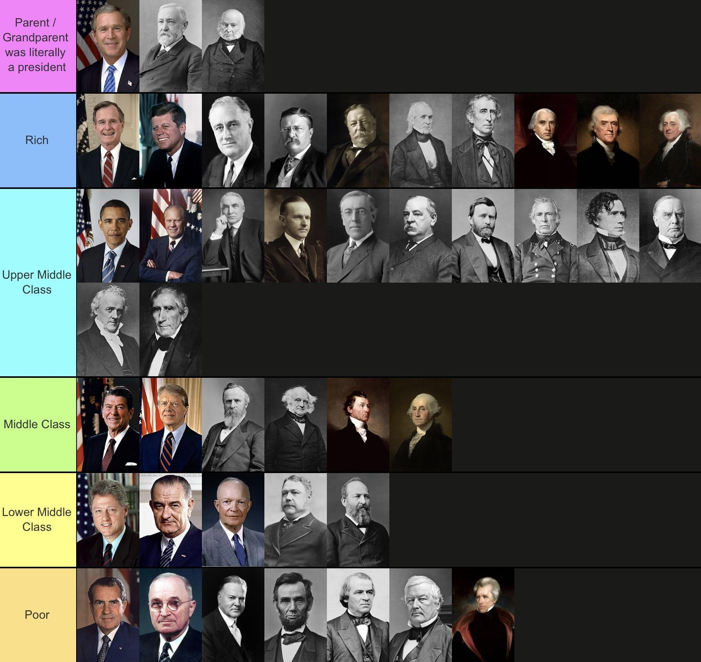

## Table of Contents

## Who are considered economically disadvantaged U.S. Presidents?

Some U.S. Presidents came from humble beginnings and faced economic challenges early in their lives. One example is Abraham Lincoln. He was born in a poor family in a one-room log cabin in Kentucky. His family moved around a lot, and he had to work hard from a young age. Lincoln had very little formal education and taught himself law while working as a store clerk and a postmaster. Despite these challenges, he became a successful lawyer and eventually the President of the United States.

Another President who faced economic hardship was Harry S. Truman. He grew up on a farm in Missouri and his family struggled financially. Truman had to work various jobs to help support his family, including as a timekeeper on the railroad and a bank clerk. He couldn't afford to go to college, so he joined the National Guard and later served in World War I. After the war, he opened a haberdashery store, but it failed, leaving him in debt. Despite these setbacks, Truman went on to become a U.S. Senator and then President.

## What criteria define economic disadvantage in the context of U.S. Presidents?

Economic disadvantage for U.S. Presidents can be defined by looking at their early life and the challenges they faced growing up. This includes being born into a poor family, living in simple or poor housing like a log cabin, and having to move often because of financial struggles. It also means having little formal education because their family couldn't afford it, and having to work hard from a young age to help support the family.

Another part of economic disadvantage is the kind of jobs they had to take to make ends meet. This could be working as a store clerk, a postmaster, or even in manual labor like farming. These jobs often didn't pay well and were not steady, leading to a life of financial uncertainty. Presidents who faced these challenges early on had to overcome significant obstacles to rise to the highest office in the country.

## How did the early life economic conditions of these Presidents influence their later policies?

Abraham Lincoln's early life in poverty shaped his views on equality and fairness. Growing up in a poor family, he understood the struggles of everyday people. This influenced his policies to abolish slavery and promote equal rights. Lincoln believed that everyone should have the chance to succeed, no matter where they came from. His own hard work and self-education showed him that with opportunity, anyone could rise above their circumstances. This belief drove his efforts to keep the country united and to ensure freedom for all.

Harry S. Truman's humble beginnings on a farm and his family's financial struggles also influenced his policies. He knew what it was like to work hard and still face money problems. As President, Truman focused on helping the working class and the poor. He supported programs like the Fair Deal, which aimed to improve housing, healthcare, and education for all Americans. Truman wanted to make sure that everyone had a fair shot at a better life, just like he had to work for. His own experiences with economic hardship made him a strong advocate for social and economic reforms.

## Can you list specific examples of economically disadvantaged U.S. Presidents and their backgrounds?

Abraham Lincoln was born into a very poor family in Kentucky. He lived in a one-room log cabin and his family had to move a lot because they didn't have much money. Lincoln didn't get much school and had to teach himself to read and write. He worked many jobs like a store clerk and a postmaster to help his family. Even though he started with very little, he became a lawyer and then the President of the United States.

Harry S. Truman grew up on a farm in Missouri where his family struggled to make ends meet. They didn't have a lot of money, so Truman had to work different jobs like a timekeeper on the railroad and a bank clerk to help out. He couldn't go to college because it was too expensive, so he joined the National Guard and later fought in World War I. After the war, he tried to run a store selling hats and clothes, but it didn't work out and he ended up in debt. Despite these challenges, Truman became a U.S. Senator and then President.

## What were the major economic challenges faced by these Presidents during their terms?

During Abraham Lincoln's time as President, the biggest economic challenge was the Civil War. The war cost a lot of money and made the country's economy very unstable. Lincoln had to find ways to pay for the war, so he started new taxes and printed more money. This caused prices to go up, which made life harder for many people. Lincoln also wanted to help the economy grow, so he supported building railroads and starting new businesses. Even with all these problems, he worked hard to keep the country together and make sure everyone had a chance to do well.

Harry S. Truman faced big economic challenges after World War II. The country had to change from making things for the war to making things for everyday life. This was hard and caused a lot of people to lose their jobs. Truman tried to help by starting programs like the Fair Deal, which aimed to make housing, healthcare, and education better for everyone. But there were also problems with inflation, which means prices were going up fast. Truman had to work to control this while also trying to help the economy grow and make sure everyone had a fair chance to succeed.

## How did their economic background affect their approach to economic policies?

Abraham Lincoln's early life in poverty made him understand the struggles of everyday people. He knew what it was like to not have much money and to work hard just to get by. This influenced his economic policies when he was President. During the Civil War, Lincoln had to find ways to pay for the war and keep the economy going. He started new taxes and printed more money, even though it made prices go up. Lincoln also wanted to help the economy grow, so he supported building railroads and starting new businesses. His own hard work and self-education showed him that with opportunity, anyone could rise above their circumstances, and he wanted to make sure everyone had that chance.

Harry S. Truman's humble beginnings on a farm and his family's financial struggles also shaped his approach to economic policies. He knew what it was like to work hard and still face money problems. After World War II, Truman had to help the country change from making things for the war to making things for everyday life. This was hard and caused a lot of people to lose their jobs. Truman tried to help by starting programs like the Fair Deal, which aimed to make housing, healthcare, and education better for everyone. He also had to deal with inflation, which means prices were going up fast. Truman worked to control this while also trying to help the economy grow and make sure everyone had a fair chance to succeed, just like he had to work for.

## What were the key economic reforms or initiatives implemented by these Presidents?

Abraham Lincoln had to deal with big money problems because of the Civil War. He started new taxes and printed more money to pay for the war, even though this made prices go up. Lincoln also wanted to help the economy grow, so he supported building railroads and starting new businesses. He believed that everyone should have the chance to succeed, no matter where they came from. His own hard work and self-education showed him that with opportunity, anyone could rise above their circumstances. This belief drove his efforts to keep the country united and to make sure freedom and opportunity were available for all.

Harry S. Truman faced big economic challenges after World War II. The country had to change from making things for the war to making things for everyday life, which caused a lot of people to lose their jobs. Truman tried to help by starting the Fair Deal, which aimed to make housing, healthcare, and education better for everyone. He also had to deal with inflation, which means prices were going up fast. Truman worked to control this while also trying to help the economy grow. He wanted to make sure that everyone had a fair shot at a better life, just like he had to work for. His own experiences with economic hardship made him a strong advocate for social and economic reforms.

## How did public perception of their economic status influence their political careers?

People knew that Abraham Lincoln came from a very poor family. He was born in a simple log cabin and had to work hard from a young age. This made people see him as someone who understood their struggles. They thought he was a man of the people, someone who could relate to everyday folks. This helped Lincoln connect with voters and gain their trust. Even though he became a successful lawyer, his humble beginnings made people believe he would fight for their rights and opportunities. This perception played a big role in his rise to the presidency.

Harry S. Truman also came from a humble background, growing up on a farm with financial struggles. People saw him as a hard-working man who knew what it was like to face money problems. This made voters feel that Truman would understand their needs and work to improve their lives. His early life and the jobs he took to support his family, like working on the railroad and as a bank clerk, showed that he was willing to do whatever it took to get by. This image of a relatable, down-to-earth leader helped Truman in his political career, from becoming a U.S. Senator to eventually serving as President.

## What role did economic disadvantage play in their path to the presidency?

Economic disadvantage played a big part in Abraham Lincoln's journey to becoming President. He was born into a poor family and lived in a simple log cabin. Lincoln had to move around a lot and didn't get much school. He had to teach himself to read and write and worked many jobs to help his family. This tough start made him understand the struggles of everyday people. People saw him as someone who knew what it was like to be poor and work hard. This helped him connect with voters and gain their trust. Even though he became a successful lawyer, his humble beginnings made people believe he would fight for their rights and opportunities. This perception was key in his path to the presidency.

Harry S. Truman's economic background also shaped his road to the presidency. He grew up on a farm where his family struggled to make ends meet. Truman had to work different jobs like a timekeeper on the railroad and a bank clerk to help out. He couldn't go to college because it was too expensive, so he joined the National Guard and later fought in World War I. After the war, he tried to run a store, but it failed, leaving him in debt. People saw Truman as a hard-working man who understood money problems. This made voters feel that he would work to improve their lives. His early life and the jobs he took to support his family showed that he was willing to do whatever it took to get by. This image of a relatable, down-to-earth leader helped Truman in his political career, from becoming a U.S. Senator to eventually serving as President.

## How have historians and economists evaluated the economic policies of these Presidents in relation to their personal economic backgrounds?

Historians and economists have looked at Abraham Lincoln's economic policies and see how his poor background influenced them. Lincoln had to deal with big money problems because of the Civil War. He started new taxes and printed more money to pay for the war, even though this made prices go up. Lincoln also wanted to help the economy grow, so he supported building railroads and starting new businesses. He believed that everyone should have the chance to succeed, no matter where they came from. His own hard work and self-education showed him that with opportunity, anyone could rise above their circumstances. Historians say that Lincoln's policies were shaped by his understanding of the struggles of everyday people and his desire to give them a fair shot at a better life.

Harry S. Truman's economic policies have also been studied in relation to his humble beginnings. After World War II, Truman faced big economic challenges as the country had to change from making things for the war to making things for everyday life. This caused a lot of people to lose their jobs. Truman tried to help by starting the Fair Deal, which aimed to make housing, healthcare, and education better for everyone. He also had to deal with inflation, which means prices were going up fast. Economists and historians note that Truman's policies were influenced by his own experiences with economic hardship. He wanted to make sure that everyone had a fair shot at a better life, just like he had to work for. His background made him a strong advocate for social and economic reforms that would help the working class and the poor.

## What long-term impacts did the economic policies of these Presidents have on the U.S. economy?

Abraham Lincoln's economic policies during the Civil War had big effects on the U.S. economy. He started new taxes and printed more money to pay for the war, which made prices go up. This was hard for people at the time, but it helped keep the country going during the war. Lincoln also supported building railroads and starting new businesses, which helped the economy grow after the war. These actions laid the groundwork for the country to become stronger and more connected. Over time, the railroads and new businesses helped the U.S. economy become one of the biggest in the world. Lincoln's belief that everyone should have a chance to succeed also influenced future economic policies that focused on giving people more opportunities.

Harry S. Truman's economic policies after World War II also had long-lasting effects. He started the Fair Deal to make housing, healthcare, and education better for everyone. These programs helped a lot of people and set the stage for future social and economic reforms. Truman also had to deal with inflation, which means prices were going up fast. He worked to control this while helping the economy grow. His efforts helped the country move from making things for the war to making things for everyday life. This transition was important for the economy and helped create more jobs. Truman's focus on helping the working class and the poor influenced later policies that aimed to give everyone a fair chance at a better life.

## How do the experiences of economically disadvantaged U.S. Presidents compare to those of their more affluent counterparts in terms of policy-making and governance?

Economically disadvantaged U.S. Presidents like Abraham Lincoln and Harry S. Truman had a deep understanding of the struggles faced by everyday people. This influenced their policy-making and governance in big ways. Lincoln, who grew up poor and had to work hard from a young age, knew what it was like to not have much money. This made him focus on policies that would help everyone have a chance to succeed, like building railroads and starting new businesses. Truman, who also came from a humble background, worked to improve housing, healthcare, and education for all Americans through his Fair Deal program. Their personal experiences with economic hardship made them more likely to support policies that helped the working class and the poor.

On the other hand, more affluent U.S. Presidents often had different priorities and approaches to policy-making. They might not have faced the same financial struggles and could focus more on broader economic growth or international issues. For example, Presidents like Franklin D. Roosevelt and John F. Kennedy, who came from wealthier families, still worked on important economic reforms but did so from a different perspective. Roosevelt's New Deal aimed to help the country recover from the Great Depression, but his background allowed him to think about big-picture solutions. Kennedy focused on economic growth and international relations, influenced by his family's wealth and connections. While both groups of Presidents wanted to improve the country, their personal economic backgrounds shaped how they approached these challenges.

## What is the understanding of presidential salaries?

The salary of the President of the United States is currently set at $400,000 annually. While this figure represents a substantial sum compared to the average American salary, it is modest when juxtaposed with the compensation packages of top business executives, who often earn multi-million-dollar salaries. The presidential salary is just one facet of a broader compensation package, which includes additional perks and benefits designed to offset the unique responsibilities and lifestyle requirements of the presidency.

### Evolution of Presidential Salaries

The salary of the U.S. president has undergone several changes since the founding of the nation. When George Washington took office, the presidential salary was $25,000 per year, a figure intended to ensure that the leader of the nation could maintain a standard of living befitting the position without personal financial strain.

Adjusting for inflation to provide a clearer picture of how presidential compensation has evolved, consider the Consumer Price Index (CPI) as a tool for this adjustment. Let $P$ represent the present value and $I_r$ the initial value, with $f$ indicating the inflator based on the CPI:

$$

P = I_r \times f 
$$

For instance, using historical data, George Washington's $25,000 salary in 1789 would equate to approximately $700,000 in today's dollars. This adjustment illustrates both the continuity and the periodic increases aligned with inflation and the changing economic circumstances of the nation.

Throughout history, presidential salaries have been periodically adjusted to reflect changes in the economic landscape. Notable increments occurred in 1873, when the salary was doubled to $50,000, and in 1909, when the salary was raised to $75,000. The current salary of $400,000 has been in effect since 2001, following legislation passed in 1999.

### Benefits and the Former Presidents Act

The financial compensation package for a U.S. president goes beyond mere salary. Presidents enjoy a range of benefits, including residency in the White House, access to Air Force One, personal security, and a comprehensive staff. Post-presidency, former presidents benefit from pensions and allowances provided under the Former Presidents Act of 1958. This legislation ensures that former heads of state continue to receive financial support, reflecting their service and helping them transition to life after their term(s) in office.

Under the Former Presidents Act, former presidents receive a lifetime pension equivalent to the salary of a cabinet secretary, which was $226,300 as of 2020. They are also eligible for reimbursement of travel, staff, and office expenses, which aid in fulfilling roles as public figures post-tenure. Medical benefits and Secret Service protection further enhance their security and well-being.

In summary, the financial provisions for U.S. presidents, both during and after their terms in office, are carefully structured to reflect the dignity of the position and to ensure adequate support for those who serve in this demanding role. Over the centuries, these financial structures have evolved, balancing historical legacies with modern economic realities to provide both a fair salary and a robust suite of benefits.

## References & Further Reading

[1]: DeParle, J. (2012). ["New Deal for Ulysses S. Grant: How Mark Twain and a Pack of Financiers Rescued the General and His Family."](https://www.nybooks.com/articles/2021/11/18/historic-decrease-in-poverty/) The New York Times.

[2]: Truman, M. (1992). ["Harry S. Truman."](https://en.wikipedia.org/wiki/Truman_%28book%29) Penguin Random House.

[3]: Lopez de Prado, M. (2018). ["Advances in Financial Machine Learning."](https://www.amazon.com/Advances-Financial-Machine-Learning-Marcos/dp/1119482089) Wiley.

[4]: Fowler, C. (2009). ["Presidents and Their Pens: Leading America from Truman to Bush."](https://www.britannica.com/topic/Presidents-of-the-United-States-1846696) Tate Publishing.

[5]: Aronson, D. (2006). ["Evidence-Based Technical Analysis: Applying the Scientific Method and Statistical Inference to Trading Signals."](https://www.wiley.com/en-us/Evidence+Based+Technical+Analysis%3A+Applying+the+Scientific+Method+and+Statistical+Inference+to+Trading+Signals-p-9780470008744) Wiley.

[6]: Jansen, S. (2020). ["Machine Learning for Algorithmic Trading: Second Edition."](https://www.oreilly.com/library/view/machine-learning-for/9781839217715/) Packt Publishing.