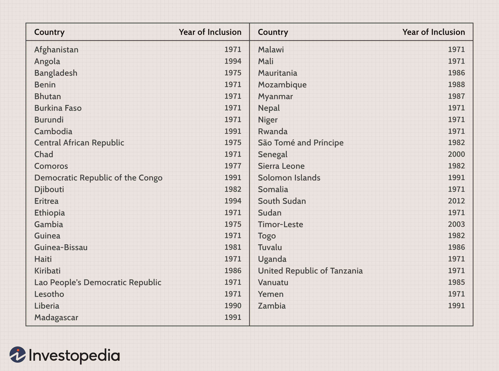

Economic freedom is a crucial determinant in the prosperity and functionality of contemporary nations. It refers to the ease with which individuals and businesses can engage in economic activities without excessive interference from governments or restrictive economic authorities. This freedom is a measure of the opportunities for economic prosperity that a nation provides to its citizens and enterprises. Economic freedom encompasses several elements, including the security of private property rights, freedom to trade, and minimal governmental intervention, which collectively create an environment conducive to economic activities.

Various organizations, such as the Heritage Foundation, quantify and compare the degree of economic freedom across different nations through standardized indices; the Heritage Foundation offers the well-regarded Index of Economic Freedom. This index ranks countries based on several factors, including rule of law, government size, regulatory efficiency, and open markets. Such rankings are not merely academic exercises but essential tools for understanding the economic landscape of a nation. They offer insights into how freedom impacts economic activities and productivity.



The nexus between economically free countries and cutting-edge financial innovations, such as algorithmic trading, is particularly compelling. Algorithmic trading, which relies on computerized programs to execute trades based on predetermined conditions, thrives in environments characterized by robust infrastructure, technological advancement, and minimal legal hindrances—attributes often found in more economically free countries. For investors, understanding the degree of economic freedom in a country can offer valuable insights into potential risks and rewards associated with investment decisions.

The exploration of economic freedom and its implications is vital for comprehending how nations can foster prosperity and growth. The relationship between economic freedom and various economic outcomes is a significant area of study, offering essential lessons for policymakers and investors seeking to optimize economic policies and investment strategies. As global economic dynamics evolve, the championing of economic freedom continues to remain a fundamental principle that nations strive towards to enhance prosperity and attract global investments.

## Table of Contents

## Understanding Economic Freedom

Economic freedom is the fundamental right of every human to control their own labor and property. It is a crucial component in fostering economic growth, innovation, and prosperity within a country. Economic freedom allows individuals to make personal choices, engage in voluntary exchange, and enter into contracts. It minimizes governmental interference in businesses and personal finances, ensuring that the market operates with efficiency and transparency.

Several factors contribute to economic freedom, including:

1. **Property Rights**: The ability to own and use property is a cornerstone of economic freedom. Countries with strong legal protections for property rights encourage investment and entrepreneurial endeavors. Secure property rights ensure that resources are allocated efficiently, as individuals and businesses can invest in long-term projects without fear of expropriation.

2. **Freedom to Trade**: Economic freedom is also characterized by the degree to which a country allows its citizens to trade freely with others. Open trade policies reduce barriers to entry, create competitive markets, and enable consumers to access a variety of goods and services. This openness leads to enhanced productivity and economic welfare.

3. **Governmental Effectiveness**: Government plays a significant role in preserving and promoting economic freedom. Effective governance minimizes corruption and bureaucracy, creates a fair legal system, and supports a stable political and macroeconomic environment. Governments that facilitate a regulatory framework conducive to business operations often see higher levels of economic freedom.

Notable institutions such as the Heritage Foundation and the Fraser Institute evaluate these factors annually to rank countries on their economic freedom. Their reports provide comprehensive analyses that offer insights into how economic policies impact market vitality. For instance, the Economic Freedom of the World report by the Fraser Institute uses indicators such as the size of government, legal system and property rights, sound money, freedom to trade internationally, and regulations to rank countries.

The rankings emphasize the importance of policies that promote free markets and reduce unnecessary governmental constraints. They encourage countries to adopt frameworks that facilitate transparency and competitiveness, leading to improved economic outcomes. By analyzing these indices, policymakers can identify areas for reform, individuals can gauge the economic environment, and investors can make informed decisions regarding where to allocate their resources.

Understanding and enhancing economic freedom is essential for fostering a prosperous society where innovation thrives, and individuals have the opportunity to pursue their economic interests unimpeded.

## Top Economically Free Countries

As of recent assessments on economic freedom, Singapore, Switzerland, and Ireland are consistently ranked at the top, marking them as some of the most economically free countries globally. These nations achieve high scores in critical domains such as property rights and trade freedom, which are central to their success in economic freedom indices.

Singapore is often heralded for its competitive, open business environment and robust property rights protection. The country has developed an efficient regulatory framework that supports innovation and entrepreneurship. Its strategic location as a global trade hub, coupled with minimal trade barriers and efficient customs laws, further enhances Singapore's standing. The country’s judicial system upholds strong property laws, ensuring that individual and company rights are safeguarded against infringement, thus fostering a predictable business climate.

Switzerland, known for its stable economy and political neutrality, scores exceptionally well in various economic freedom parameters. The nation offers a sophisticated legal system that protects property rights and enforces anti-corruption measures, essential for attracting and retaining business investments. Switzerland's high level of trade freedom is supported by transparent tariffs and robust free trade agreements that facilitate international business. This legal and fiscal stability encourages economic activities and innovation, positioning it favorably in global indices.

Ireland also enjoys a high economic freedom ranking, bolstered by its open-market economy and business-friendly tax structures. The country's commitment to maintaining secure property rights ensures a conducive environment for international corporations. Ireland's efficient regulatory framework facilitates ease of doing business, with processes that support flexibility in labor markets and low corporate taxation. These factors have helped transform Ireland into a significant European economic hub, attracting investment from multinational companies.

In all three countries, the existence of well-established legal and fiscal systems plays a crucial role. These systems not only protect property rights but also enhance the ability to conduct business efficiently. They maintain a conducive environment for sustainable economic activities and innovation, which are vital to having high economic freedom rankings. This framework ultimately promotes productivity, attracts global capital, and supports broad economic growth. 

The strategic investments in maintaining these economic pillars ensure these countries continue leading in economic freedom, demonstrating how governance, policy, and fiscal management converge to enable prosperity and advancement.

## Algorithmic Trading in Economically Free Countries

Economically free countries are often characterized by robust infrastructure, comprehensive regulatory frameworks, and a stable economic environment. These factors create a fertile ground for [algorithmic trading](/wiki/algorithmic-trading), which is a method of executing orders using automated and pre-programmed trading instructions to account for variables like timing, price, and [volume](/wiki/volume-trading-strategy). Algorithmic trading is heavily reliant on technology, requiring sophisticated software and high-speed internet connectivity to execute trades at lightning speed, often within microseconds.

In regions with a high degree of economic freedom, the necessary technological infrastructure is more accessible and affordable, enabling financial institutions and individual traders to implement algorithmic trading strategies efficiently. Costs associated with technology, including data acquisition, computational power, and connectivity, are significantly lower in these countries, allowing traders to maximize profitability.

For instance, Singapore and Switzerland are exemplary models of regions where market conditions and regulatory environments are conducive to algorithmic trading. Singapore's advanced financial markets provide comprehensive access to real-time data and sophisticated trading platforms, supporting a thriving environment for automated trading systems. The Monetary Authority of Singapore (MAS) has also developed a forward-thinking regulatory framework that encourages financial innovation while ensuring market stability.

Similarly, Switzerland's financial system is characterized by a high level of transparency and stability, underpinned by regulations that facilitate technological advancements in trading. The country’s strong legal framework and emphasis on investor protection offer a secure environment for deploying complex trading algorithms.

The infrastructure in these economically free countries supports various algorithmic trading strategies including [market making](/wiki/market-making), [trend following](/wiki/trend-following), and [arbitrage](/wiki/arbitrage). Market making involves providing [liquidity](/wiki/liquidity-risk-premium) by simultaneously offering buy and sell prices for financial instruments, while trend-following strategies exploit market [momentum](/wiki/momentum). Arbitrage strategies profit from price discrepancies between markets or related instruments.

Below is a simple Python snippet demonstrating a basic concept in algorithmic trading - a moving average crossover strategy:

```python
import numpy as np
import pandas as pd

def moving_average(series, n):
    """Calculate the moving average of a given time series."""
    return series.rolling(window=n).mean()

# Sample data: closing prices
data = {
    'Date': pd.date_range(start='2023-01-01', periods=100),
    'Close': np.random.normal(100, 5, size=100)
}

df = pd.DataFrame(data)
short_window = 5
long_window = 20

# Calculate moving averages
df['Short_MA'] = moving_average(df['Close'], short_window)
df['Long_MA'] = moving_average(df['Close'], long_window)

# Identify trade signals
df['Signal'] = 0
df.loc[df['Short_MA'] > df['Long_MA'], 'Signal'] = 1
df.loc[df['Short_MA'] < df['Long_MA'], 'Signal'] = -1

print(df[['Date', 'Close', 'Short_MA', 'Long_MA', 'Signal']].tail())
```

This script shows how moving averages can be used to generate buy and sell signals when short-term trends cross long-term trends. Successful algorithmic trading requires more sophisticated strategies and real-time data to handle market dynamics efficiently.

Overall, economically free countries provide the essential elements needed for algorithmic trading success, including reliable infrastructure, favorable regulatory environments, and access to capital, fostering innovation and efficiency in financial markets.

## Impact of Economic Freedom on Investment

Regions with higher economic freedom are often more appealing to foreign investors due to the reduced risks and bureaucratic hurdles associated with these environments. Economic freedom is paramount because it ensures that the business environment is transparent and free from excessive governmental interventions, reducing both the explicit and implicit costs of conducting business. This transparency and predictability mitigate the uncertainty and risk that investors face, making these markets attractive for both short-term and long-term investments.

Investors ascertain the degree of economic freedom in various countries using established indices, and they utilize these rankings to make informed decisions about asset allocation. These indices typically assess a number of factors, such as property rights, business freedom, and investment regulations, which collectively provide a comprehensive picture of each country’s economic landscape. According to the Heritage Foundation and other similar institutions, countries with high economic freedom scores are more likely to foster growth, attract capital, and facilitate innovation, thus presenting lucrative opportunities for investors.

The correlation between a country's economic freedom status and its Gross Domestic Product (GDP) growth is an important consideration for investors. Empirical data often reveal a positive correlation between economic freedom and GDP growth, suggesting that as a country enhances its economic freedom, its economic performance tends to improve. This is because economic freedom can lead to more efficient resource allocation, fostering an environment conducive to entrepreneurship and market-driven innovation.

For example, investors employ quantitative methods to analyze economic indicators. A basic linear regression model in Python can illustrate how economic freedom impacts GDP growth:

```python
import pandas as pd
from sklearn.linear_model import LinearRegression

# Assume 'df' is a pandas DataFrame that includes 'economic_freedom_index' and 'gdp_growth'.
df = pd.read_csv('economic_data.csv')

X = df[['economic_freedom_index']]
y = df['gdp_growth']

model = LinearRegression()
model.fit(X, y)

# Coefficient indicates the change in GDP growth for a unit change in economic freedom index.
print(f"Coefficient: {model.coef_[0]}")
```

The output coefficient would typically show that increases in the economic freedom index are associated with increases in GDP growth, reinforcing the notion that economic freedom is vital for improving a country's economic health and attractiveness to investors. This understanding enables investors to allocate resources more effectively, optimizing their returns while contributing to the host country's economic development.

## Lessons from Low Economic Freedom Countries

Countries ranking at the bottom of economic freedom indices, such as North Korea and Venezuela, demonstrate the detrimental impact of restrictive policies and pervasive corruption. These nations are often characterized by centralized control over economic resources, limiting private ownership and stifling entrepreneurial initiatives. Consequently, the lack of economic freedom leads to significant economic instability, manifesting as hyperinflation, unemployment, and a lack of basic goods and services. This environment hampers economic growth and discourages external investments, as the risk associated with investing in these regions is high due to unpredictable governmental interventions and policy shifts.

For instance, Venezuela's economy has been severely affected by state-controlled management of the oil industry, which once formed the backbone of its economic output. The expropriation of private enterprises and stringent foreign exchange controls have led to a decline in productivity and a loss of investor confidence. Similarly, North Korea's autarkic policies and lack of transparency have resulted in economic isolation and limited access to foreign capital and technology.

The lessons drawn from these examples highlight the critical need for regulatory and policy reforms to enhance economic freedom. Transitioning towards market-oriented policies, ensuring protection of property rights, reducing bureaucratic red tape, and promoting transparency can foster an environment conducive to economic prosperity. Creating an independent judicial system and combating corruption are also vital to building investor trust and ensuring stable economic growth.

Implementing these reforms can lead to diversified economies, increased foreign direct investment (FDI), and improved living standards. Empirical evidence suggests that countries improving their economic freedom tend to experience higher Gross Domestic Product (GDP) growth rates and better overall economic performance. Therefore, adopting strategies that enhance economic freedom is essential for countries seeking development and prosperity in a globally competitive landscape.

## Conclusion

The Index of Economic Freedom serves as a crucial analytical tool for understanding the intricate dynamics of a country's economic landscape. It does so by evaluating various parameters that contribute to economic efficiency and opportunity. Countries with higher rankings on this index often showcase more efficient markets, bolstered by robust property rights, open trading systems, and effective governance. These elements collectively foster an environment conducive to growth and development. The advantageous position of such nations becomes evident in their ability to attract foreign investments, catalyze innovation, and sustain economic growth. 

Economic freedom, therefore, is not just a marker of current economic health but also a predictor of future economic resilience and adaptability. In a world where global economies are increasingly interconnected and subject to rapid shifts, having a high degree of economic freedom grants nations a competitive edge. This edge manifests as stable regulatory climates, reduced risks for investors, and streamlined processes for business operations. These factors make countries with high economic freedom particularly appealing to traders and investors who seek stable and rewarding environments.

As global economic landscapes continue to shift, the pursuit and maintenance of economic freedom remain essential. This means ongoing policy reforms, international collaboration, and adaptive governance strategies are necessary to preserve and enhance this freedom. The continued focus on maintaining high levels of economic freedom will ultimately determine a country's success, attractiveness to investors, and its capacity for sustainable growth in the future.

## References & Further Reading

[1]: Miller, T. (2023). ["The Heritage Foundation's Index of Economic Freedom"](https://www.heritage.org/index/). The Heritage Foundation.

[2]: Gwartney, J., Lawson, R., & Hall, J. (2023). ["Economic Freedom of the World: 2023 Annual Report"](https://www.fraserinstitute.org/studies/economic-freedom-of-the-world-2023-annual-report). Fraser Institute.

[3]: Lopez de Prado, M. (2018). ["Advances in Financial Machine Learning"](https://www.amazon.com/Advances-Financial-Machine-Learning-Marcos/dp/1119482089). Wiley.

[4]: Jansen, S. (2020). ["Machine Learning for Algorithmic Trading"](https://github.com/stefan-jansen/machine-learning-for-trading). Packt Publishing.

[5]: Chan, E. P. (2009). ["Quantitative Trading: How to Build Your Own Algorithmic Trading Business"](https://github.com/ftvision/quant_trading_echan_book). Wiley.

[6]: Aronson, D. R. (2006). ["Evidence-Based Technical Analysis: Applying the Scientific Method and Statistical Inference to Trading Signals"](https://www.wiley.com/en-us/Evidence+Based+Technical+Analysis%3A+Applying+the+Scientific+Method+and+Statistical+Inference+to+Trading+Signals-p-9780470008744). Wiley.