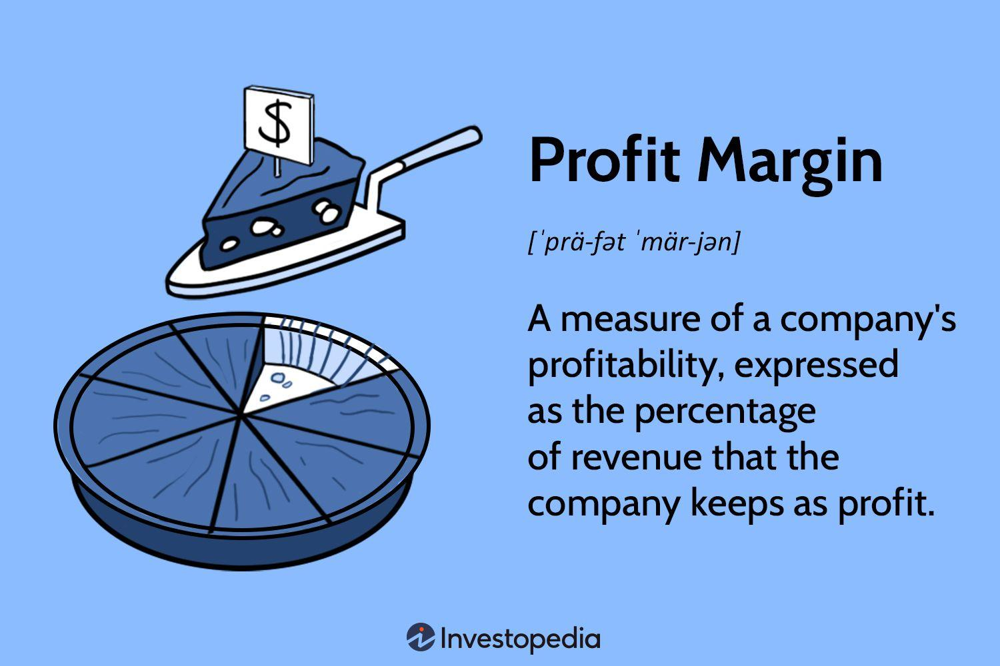

## Table of Contents

## What is the basic concept of a margin in economics?

In economics, the term "margin" refers to the point where the next unit of something will start to affect the overall outcome. It's all about making decisions based on the additional benefits and costs of doing a little bit more or a little bit less. Think of it like deciding whether to eat one more slice of pizza. You consider if the enjoyment of that slice is worth the extra cost, like feeling too full or spending more money.

Understanding margins helps businesses and individuals make better choices. For example, a company might look at the marginal cost of producing one more item. If the cost is lower than the price they can sell it for, it makes sense to produce it. On the other hand, if the cost is higher, they might decide not to. This way, margins guide decisions to maximize benefits and minimize costs, leading to more efficient use of resources.

## How is margin used in business operations?

In business operations, margin is used to help companies make smart decisions about what to do next. For example, a business might look at the margin to decide if they should make more of a product. They compare the cost of making one more item, called the marginal cost, with the money they will get from selling it. If the selling price is higher than the cost, it makes sense to produce more. This helps the business use its resources in the best way possible and make more profit.

Margins also help businesses decide on pricing. If a company knows how much it costs to make one more item, they can set a price that covers this cost and also adds some profit. This is called the profit margin. By keeping an eye on these margins, a business can adjust prices or costs to stay competitive and profitable. Understanding and using margins well can really help a business grow and succeed.

## What is the difference between gross margin and net margin?

Gross margin and net margin are two important ways to measure how well a business is doing, but they look at different things. Gross margin is the money a business makes after it pays for the stuff it sells, but before it pays for other costs like rent, salaries, and taxes. It's like figuring out how much profit you make just from selling your products without thinking about other expenses. If you sell a shirt for $20 and it costs you $10 to make, your gross margin is $10.

Net margin, on the other hand, is a more complete picture of a business's profit. It takes into account all the costs of running the business, not just the cost of the products sold. So, after you subtract the cost of the shirt, you also subtract rent, salaries, taxes, and other expenses. If those extra costs add up to $5, your net margin would be $5 ($10 gross margin minus $5 other costs). Net margin shows how much money the business keeps after all expenses, giving a clearer idea of overall profitability.

## How do businesses calculate their profit margins?

To calculate the gross profit margin, businesses take the money they make from selling their products and subtract the cost of making those products. This gives them the gross profit. Then, they divide this gross profit by the total sales and multiply by 100 to get a percentage. For example, if a business sells a product for $100 and it costs $60 to make, the gross profit is $40. The gross profit margin would be ($40 / $100) * 100 = 40%. This percentage shows how much of each dollar in sales is profit before other costs.

For the net profit margin, businesses start with their total sales and subtract all their costs, including the cost of the products, rent, salaries, taxes, and other expenses. This gives them the net profit. They then divide this net profit by the total sales and multiply by 100 to get the net profit margin percentage. For instance, if the total sales are $100, the cost of the product is $60, and other expenses are $20, the net profit is $20. The net profit margin would be ($20 / $100) * 100 = 20%. This percentage tells the business how much of each dollar in sales is profit after all costs.

Both gross and net profit margins help businesses see how well they are doing. The gross margin focuses on the profit from selling products, while the net margin gives a complete picture of the business's profitability. By keeping an eye on these margins, a business can make smart decisions about pricing, costs, and how to grow.

## What role does margin play in pricing strategies?

Margin is really important when businesses decide on their prices. It helps them figure out how much they can charge for their products and still make a good profit. For example, if it costs $5 to make a toy and the business wants to have a 50% gross profit margin, they would need to sell the toy for at least $10. This is because half of the $10 (which is $5) would cover the cost of making the toy, and the other half would be profit. By understanding their margins, businesses can set prices that are fair to customers but also keep the business making money.

Margins also help businesses stay competitive. If a business knows their costs and what kind of profit they need, they can see how their prices compare to other companies. If another business sells a similar toy for $9, the first business might need to find ways to lower their costs or accept a smaller profit margin to stay in the game. This way, margins guide businesses in adjusting prices to attract customers while still making enough money to keep going.

## How can understanding margins help in financial decision-making?

Understanding margins is key for making smart financial decisions in a business. Margins show how much profit a business makes on each sale after paying for the costs. This helps business owners see if they are making enough money to cover all their expenses and still have some left over. For example, if a business knows their gross margin, they can decide if they need to raise prices or lower costs to make more profit. This information is crucial for planning and making sure the business stays healthy and grows.

Margins also help businesses decide where to put their money. If a company sees that one product has a high profit margin, they might choose to invest more in making and selling that product. On the other hand, if another product has a low margin, they might decide to stop selling it or find ways to make it cheaper to produce. By looking at margins, businesses can figure out the best way to use their money and resources, leading to better financial decisions and a stronger business overall.

## What are the common challenges businesses face in maintaining healthy margins?

Keeping healthy margins can be tough for businesses because of many reasons. One big challenge is rising costs. Things like raw materials, labor, and shipping can get more expensive over time. If a business can't raise their prices to match these higher costs, their margins shrink. Another problem is competition. If other companies sell similar products for less money, a business might have to lower their prices too, which can hurt their margins. Also, if customers don't want to pay more, it's hard to keep prices high enough to maintain good margins.

Another challenge is managing overhead costs. These are the regular expenses like rent, utilities, and salaries that don't change much no matter how many products a business sells. If these costs go up, they can eat into the profit margins. Businesses also need to keep an eye on their inventory. If they make too much of something and it doesn't sell, they're stuck with extra costs that lower their margins. Finally, economic changes like a recession can make it harder to keep margins healthy because people might spend less money, forcing businesses to cut prices to keep selling their products.

## How do economic conditions affect business margins?

Economic conditions can really change how well a business does with its margins. When the economy is doing well, people have more money to spend, so businesses can often charge more for their products. This can help them keep their margins healthy or even make them better. But if the economy is not doing so great, like during a recession, people might not want to spend as much money. This can push businesses to lower their prices to keep selling stuff, which makes their margins smaller.

Also, economic conditions can affect the costs that businesses have to pay. During good economic times, costs for things like materials and labor might go up because everyone wants them. If businesses can't pass these higher costs onto customers by raising prices, their margins can suffer. On the other hand, when the economy is bad, some costs might go down, which could help margins if businesses can keep their prices steady. But it's a tricky balance, and economic ups and downs always make it hard for businesses to keep their margins where they want them to be.

## What advanced techniques can be used to analyze and optimize margins?

To really understand and improve margins, businesses can use some advanced techniques. One way is to use data analytics. This means looking at a lot of information about sales, costs, and customers to find patterns and make better decisions. For example, a business might use data to see which products have the best margins and focus on selling more of those. They can also use predictive analytics to guess what might happen in the future, like if costs will go up or if people will want to buy more of something. This helps them plan ahead and keep their margins healthy.

Another technique is called activity-based costing. This is a way to figure out exactly how much it costs to do each part of making and selling a product. By understanding these costs better, a business can find ways to save money and make their margins bigger. For example, they might see that one step in making a product is really expensive and find a cheaper way to do it. Businesses can also use something called value chain analysis to look at all the steps from making a product to selling it and see where they can make things more efficient. This helps them cut costs and improve their margins without having to raise prices.

## How do margins vary across different industries?

Margins can be very different from one industry to another. In industries like retail, where there are a lot of similar products and competition, margins are usually pretty small. Stores might only make a few cents or dollars on each item they sell. This is because they have to keep their prices low to attract customers. On the other hand, industries like software or pharmaceuticals can have much bigger margins. A software company might spend a lot of money to make a program, but once it's done, it costs very little to sell copies of it. So, they can charge a lot and make a big profit on each sale.

Even within the same industry, margins can change a lot depending on the specific business. For example, in the food industry, a fancy restaurant might have higher margins than a fast food place. The fancy restaurant can charge more for its meals because people are willing to pay for a special experience. But they also have higher costs, like paying for better ingredients and a nicer place to eat. A fast food place, on the other hand, keeps its prices low and its costs down by using cheaper ingredients and a simple way of making food. So, understanding margins in different industries and even within the same industry can help businesses figure out the best way to make money.

## What is the impact of technology on margin management?

Technology has a big impact on how businesses manage their margins. It helps them keep track of costs and sales in real time. With special software, businesses can see exactly how much they are spending and making on each product. This helps them make quick decisions, like changing prices or cutting costs, to keep their margins healthy. Technology also lets businesses use data to predict what might happen next, like if costs will go up or if people will want to buy more of something. By knowing this, they can plan better and keep their margins strong.

Another way technology helps is by making things more efficient. For example, machines and computers can do some jobs faster and cheaper than people. This can lower the cost of making products, which helps businesses keep their margins high. Also, technology like online selling can reach more customers without needing a big, expensive store. This can help businesses sell more without spending a lot more money, which is good for their margins. So, technology is really important for managing margins and helping businesses make more profit.

## How can predictive analytics be used to forecast margin trends?

Predictive analytics is a smart way for businesses to guess what will happen with their margins in the future. By looking at a lot of past information about sales, costs, and other things, businesses can use special computer programs to see patterns. These patterns help them predict if their margins will go up or down. For example, if they see that the cost of materials goes up every winter, they can plan for this and maybe buy materials earlier or find cheaper ones. This helps them keep their margins healthy even when things change.

Using predictive analytics also lets businesses see what might affect their margins in the future. They can look at things like what customers might want to buy, how much competitors might charge, or if there will be any big changes in the economy. By understanding these things, businesses can make plans to keep their margins good. For example, if they think people will want to buy more of a certain product next year, they can make more of it now and sell it at a good price. This way, predictive analytics helps businesses stay one step ahead and keep making a good profit.

## What are the margins in algorithmic trading?

Algorithmic trading employs margin as a means to manage larger trading positions with a relatively minimal capital outlay. This practice allows traders to enhance capital efficiency across multiple concurrent trades, thereby maximizing potential returns while maintaining effective risk control. Margin is crucial in this context because it enables traders to leverage their existing capital to control a more substantial amount of an asset, amplifying both potential profits and risks.

Investors in [algorithmic trading](/wiki/algorithmic-trading) rely on margin calculators, essential tools that play a significant role in assessing the financial needs for various trades. These calculators provide a systematic approach to manage risk and optimize strategy effectiveness. By evaluating multiple factors such as asset type, trade size, leverage, and market [volatility](/wiki/volatility-trading-strategies), margin calculators can accurately compute the required margin for any given trading position.

The computation of the required margin is based on several variables, each contributing to a comprehensive risk assessment. For example, the margin requirement can be mathematically represented as:

$$
\text{Required Margin} = \frac{\text{Trade Size} \times \text{Price}}{\text{Leverage}}
$$

where:
- $\text{Trade Size}$ denotes the number of units being traded.
- $\text{Price}$ refers to the current market price of the asset.
- $\text{Leverage}$ reflects the borrowing ratio offered by the broker.

Furthermore, margin calculators incorporate market volatility as a critical [factor](/wiki/factor-investing) in their computations. By analyzing historical price data and current market conditions, these calculators can advise traders on the appropriate position sizes aligned with their available capital, ensuring that they maintain effectiveness in volatile markets.

Python, as a preferred language, can be utilized to design a margin calculator. The following simple code snippet illustrates the structure of a margin calculator utilizing basic inputs:

```python
def calculate_required_margin(trade_size, price, leverage):
    return (trade_size * price) / leverage

# Example usage:
trade_size = 100  # number of units
price = 50.0      # price per unit
leverage = 10     # leverage ratio

required_margin = calculate_required_margin(trade_size, price, leverage)
print(f"Required Margin: ${required_margin}")
```

This example helps traders compute the necessary margin for a given trading scenario, assisting them in aligning their positions with available capital and predefined risk parameters. The integration of real-time data can further enhance these tools, enabling quick adjustments to trading strategies in response to market fluctuations, thus ensuring that traders remain agile and precise in their approach.

## What is the difference between Economic Margin and Business Margin?

Economic margin is a critical metric for evaluating a company's financial health by comparing the cost of capital with the return on capital. It provides insight into whether an enterprise is generating value above its cost of resources. The formula for calculating economic margin can be expressed as:

$$
\text{Economic Margin} = \text{Return on Capital} - \text{Cost of Capital}
$$

A positive economic margin indicates that the company is producing value for its shareholders, whereas a negative margin suggests value erosion, necessitating strategic review and potential operational adjustments.

In contrast, business margin involves more immediate and operational financial indicators, such as gross margin or contribution margin. These metrics help assess business efficiency by focusing on revenue relative to direct costs. Gross margin, for example, is calculated as:

$$
\text{Gross Margin} = \frac{\text{Revenue} - \text{Cost of Goods Sold}}{\text{Revenue}} \times 100
$$

The contribution margin addresses profitability at a different level, emphasizing variable costs. It determines the remaining revenue after variable costs are subtracted, which can be allocated towards fixed costs and profits.

In trading contexts, grasping the differences between economic and business margins is crucial for optimizing investment decisions. Economic margins can highlight long-term value creation or destruction, steering strategic asset allocation. Meanwhile, business margins offer a snapshot of short-term operational performance, guiding tactical adjustments for efficiency improvements. This comprehensive understanding enables traders to make informed decisions about prospective investments, optimizing portfolio returns while minimizing potential risks.

## What are the profit margins in algorithmic trading?

Profit margins, including gross and contribution margins, are integral to assessing the performance and profitability of algorithmic trading strategies. They provide crucial insights into the cost efficiency and revenue generation capability of different trading tactics. 

The gross margin is calculated as:

$$
\text{Gross Margin} = \frac{\text{Revenue} - \text{Cost of Goods Sold (COGS)}}{\text{Revenue}}
$$

In algorithmic trading, gross margin evaluates the operational efficiency by analyzing the revenue earned from trading activities against the underlying costs to execute these trades. A higher gross margin indicates better control over production costs relative to earnings, suggesting an efficient use of resources in trading operations.

Contribution margin, on the other hand, is focused on individual trades and measures how each trade contributes to the overall profitability. It is given by:

$$
\text{Contribution Margin} = \text{Sales Price per Unit} - \text{Variable Cost per Unit}
$$

This metric enables algorithmic traders to examine the profitability of each trade by considering variable costs associated with executing the trade, such as brokerage fees and transaction costs. Understanding the contribution margin offers traders a granular view of which trades are most profitable and where potential losses are incurred.

Algorithmic traders use these metrics to refine their strategies continuously. By monitoring gross and contribution margins, traders can make data-driven decisions to optimize trading algorithms, ensuring that higher-cost trades do not erode profitability. This involves balancing cost efficiency—minimizing unnecessary expenses and transaction costs—with revenue generation, acquiring the maximum possible return from trades.

Utilizing advanced algorithmic tools, traders can simulate different scenarios to see how changes in strategy might affect their margins. By doing so, they maintain a competitive edge by adapting quickly to market changes while ensuring efficient capital allocation. This continuous cycle of strategy refinement based on margin analysis is key to sustaining profitability and mitigating financial risks in algorithmic trading.

## References & Further Reading

[1]: Hull, J. C. (2015). ["Options, Futures, and Other Derivatives"](https://www.amazon.com/Options-Futures-Other-Derivatives-10th/dp/013447208X). Pearson Education.

[2]: Pardo, R. (2008). ["The Evaluation and Optimization of Trading Strategies"](https://onlinelibrary.wiley.com/doi/book/10.1002/9781119196969) (2nd ed.). Wiley.

[3]: Lopez de Prado, M. (2018). ["Advances in Financial Machine Learning"](https://www.amazon.com/Advances-Financial-Machine-Learning-Marcos/dp/1119482089). Wiley.

[4]: Chan, E. P. (2009). ["Quantitative Trading: How to Build Your Own Algorithmic Trading Business"](https://github.com/ftvision/quant_trading_echan_book). Wiley.

[5]: Aronson, D. R. (2006). ["Evidence-Based Technical Analysis: Applying the Scientific Method and Statistical Inference to Trading Signals"](https://www.amazon.com/Evidence-Based-Technical-Analysis-Scientific-Statistical/dp/0470008741). Wiley.