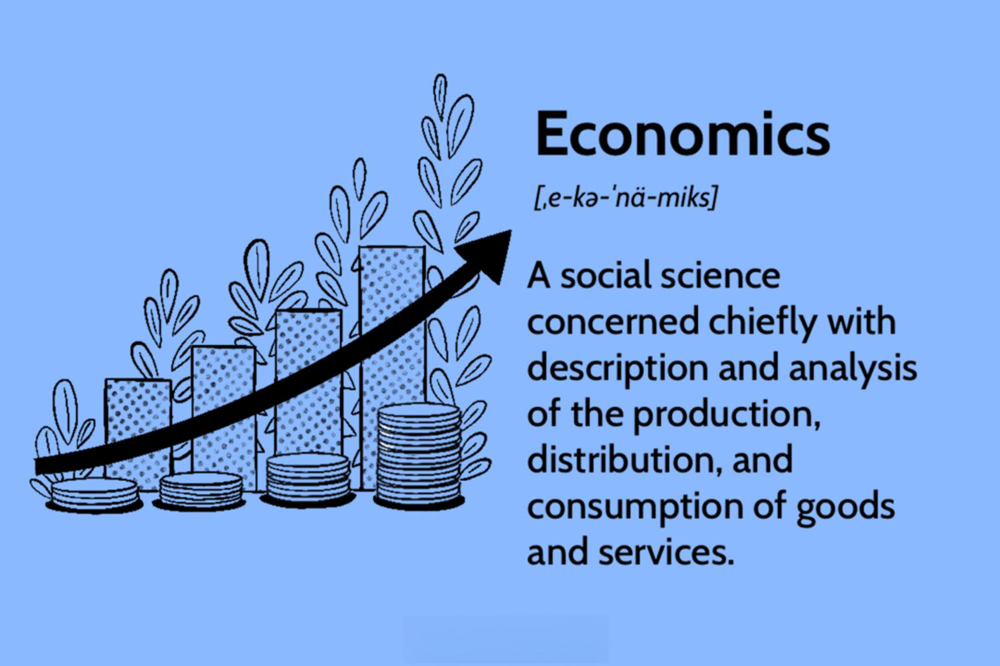

Economics, a discipline with roots tracing back to ancient civilizations, has evolved remarkably over the centuries, developing into a comprehensive science that examines how individuals, businesses, and governments allocate resources. At its core, economics provides the theoretical framework needed to analyze everything from micro-level decisions concerning scarcity and choices, to macro-level phenomena that affect national and global financial stability. Distinguished branches like microeconomics and macroeconomics allow for an understanding of consumer behavior, production choices, and broader economic policies, respectively, enabling coherent interpretations of diverse economic activities.

Economic theory serves as the backbone for understanding financial markets by offering insights into how these markets operate under varying conditions. Economic theories such as classical economics, which emphasizes the notion of market efficiencies, and Keynesian economics, which highlights the role of government intervention, are indispensable in assessing financial stability and market dynamics. These theories aid analysts in predicting market trends, shaping investment strategies, and informing fiscal policies.

In parallel, the financial industry has witnessed the burgeoning influence of algorithmic trading, a technological innovation designed to enhance trading efficiency through automation. Algorithmic trading employs computer algorithms to execute trades at speeds and frequencies unimaginable to human traders. It leverages advancements in computing power, data analytics, and network connectivity to optimize trading strategies, making it an integral part of modern finance.

The relationship between economic theory and algorithmic trading is inherently intertwined. Economic indicators and macroeconomic data serve as critical inputs for developing sophisticated trading algorithms. These algorithms, in turn, can analyze vast datasets to identify patterns and trends, leading to predictions about market movements and economic fluctuations. As a result, the fusion of robust economic theory with cutting-edge algorithmic technologies presents novel opportunities for comprehensive market understanding and strategic asset management.

This article aims to explore the intersection of economic theory and algorithmic trading, providing readers with a foundational understanding of both fields. It will illustrate how economic principles inform algorithmic strategies, showcase real-world applications, and discuss future trends at this dynamic juncture of economics and technology. Through this exploration, readers will gain insights into how the integration of these disciplines is reshaping financial markets and advising decision-making processes in an ever-evolving economic landscape.

## Table of Contents

## The Foundations of Economics as a Science

Economics is defined as the social science concerned with the production, distribution, and consumption of goods and services. It addresses how societies allocate scarce resources to meet varying needs and desires. The discipline is traditionally divided into two main branches: microeconomics and macroeconomics. Microeconomics focuses on individual [agents](/wiki/agents), such as households and businesses, and their interactions in markets. It examines how these actors make decisions regarding resource allocation, pricing, and consumption. Macroeconomics, on the other hand, explores the aggregate behavior of the economy, examining large-scale economic phenomena such as inflation, unemployment, and economic growth.

The scientific principles that underpin economic analysis and modeling are grounded in the development of theories and models that are capable of explaining observed economic behaviors. These principles are often built on assumptions about human behavior, such as rationality and self-interest, and deploy mathematical tools to formalize complex relationships. For instance, concepts such as supply and demand, consumer behavior, and market equilibrium are fundamental to economic modeling.

Notable economists have significantly shaped the science of economics through their contributions. Figures like Adam Smith, often regarded as the father of modern economics, introduced foundational concepts such as the division of labor and the 'invisible hand' in markets. David Ricardo developed theories of comparative advantage, which still influence trade policy today. Karl Marx provided critical insights into capitalistic systems and labor theory, while John Maynard Keynes revolutionized macroeconomics with his ideas on government intervention and fiscal policy in mitigating economic downturns. More recently, economists like Milton Friedman and Paul Krugman have furthered the development of monetary policy and international economics, respectively.

Economists use empirical data to validate theories and models, employing statistical methods and econometric tools to test hypotheses and refine theoretical frameworks. This reliance on data ensures that economic models are relevant and capable of predicting real-world outcomes. For example, regression analysis is extensively used to identify relationships between economic variables, such as income and consumption patterns.

The role of economics in shaping public policy and business strategies is profound. Policymakers use economic principles to design fiscal and monetary policies that are aimed at stabilizing economies, promoting growth, and enhancing welfare. On a corporate level, businesses utilize economic analysis to inform strategic decisions, such as pricing, market expansion, and investment. Understanding economic cycles, consumer behavior, and competitive dynamics enables firms to adapt and thrive within the ever-evolving marketplace.

Overall, economics as a science provides crucial insights into how societies function and evolve, equipping governments and businesses with the analytical tools necessary to make informed decisions in an increasingly complex global environment.

## Economic Theory and its Application

Economic theory encompasses a vast array of concepts that help explain how economies function. Classical economic theory, first developed by economists like Adam Smith and David Ricardo, emphasizes the role of free markets in allocating resources efficiently through the invisible hand mechanism. This theory supports the idea that markets tend toward equilibrium where supply equals demand, and any deviations are self-correcting in competitive markets. An example of classical theory application is in analyzing the effects of price controls, which can lead to shortages or surpluses as they distort natural market signals.

Keynesian economics, proposed by John Maynard Keynes during the Great Depression, argues that aggregate demand is a pivotal driver of economic performance and that governments can intervene via fiscal and monetary policies to stabilize economies. This theory is applied in policy-making, such as using government spending to boost employment and stimulate growth during economic downturns. The Keynesian approach is also evident in central bank decisions to adjust interest rates to influence economic activity levels.

Modern Monetary Theory (MMT), a contemporary school of thought, posits that countries issuing their own currencies can never "run out" of money in the same way businesses or individuals can. MMT suggests that such governments can finance additional spending by printing money, provided that such actions don't lead to unacceptable inflation levels. This theory challenges conventional views on government deficits and has been considered in discussions about the fiscal capacity of governments to address social issues.

Economic indicators like GDP, unemployment rates, inflation, and consumer confidence indices play crucial roles in predicting market movements. For example, investors closely watch the Federal Reserve's meeting minutes and employment [statistics](/wiki/bayesian-statistics) to anticipate [interest rate](/wiki/interest-rate-trading-strategies) changes, which could affect bond yields and stock prices. These indicators provide concrete data points that inform decision-making processes, offering snapshots of economic health and future trends.

The integration of technology and data analytics into economics is reshaping contemporary economic theory. Advanced computational techniques and big data analysis enable economists and analysts to develop more sophisticated models that capture complex economic phenomena with greater accuracy. Tools such as [artificial intelligence](/wiki/ai-artificial-intelligence) and [machine learning](/wiki/machine-learning) help in identifying patterns and forecasting economic conditions, providing insights previously unattainable with traditional methods.

Despite these advancements, economic theorists face significant challenges in today's rapidly changing global environment. The interconnectedness of global economies means that localized economic shocks can have widespread repercussions, complicating predictive models. Climate change, technological disruption, and shifting geopolitical landscapes add layers of complexity to economic analysis and policy applications. Additionally, evolving economic paradigms, like those proposed by behavioral economics, challenge the assumption of rational actors, further complicating traditional theories.

Overall, while economic theories provide foundational frameworks for understanding and navigating financial systems, their application must continuously adapt to reflect new data, insights, and global contexts. As the world economy evolves, the dynamic nature of economic theory will remain critical in addressing the challenges and opportunities that arise.

## Algorithmic Trading: A New Frontier

Algorithmic trading refers to the utilization of computer algorithms to execute a sequence of instructions for trading stocks, currencies, or other financial instruments. The automation process is designed to generate profits at speeds and frequencies that are impossible for a human trader. In the financial sector, [algorithmic trading](/wiki/algorithmic-trading) has become an integral component due to its ability to handle complex variables and vast amounts of data with precision.

Algorithmic trading has evolved significantly since its inception. Initially, trading was conducted manually, with brokers using telephones and papers to record transactions. The transition to algorithmic trading began in the 1970s when stock exchanges started introducing electronic trading systems. By the late 1980s and early 1990s, computational trading strategies had emerged on Wall Street, driven largely by advancements in technology and communications. This marked the beginning of high-frequency trading ([HFT](/wiki/high-frequency-trading-strategies)), where algorithms could perform trades in milliseconds.

The technical foundations of algorithmic trading are built upon high-frequency trading, machine learning, and big data. High-frequency trading, a subset of algorithmic trading, relies on supercomputers to transact a large number of orders at incredibly high speeds. These systems leverage co-location and proximity hosting to reduce latency.

Machine learning and big data analytics play crucial roles in algorithmic trading strategies. Machine learning algorithms process historical market data to identify patterns, predict price movements, and optimize trading strategies. They can adapt in real-time to new data, improving trading decisions. Big data, characterized by its [volume](/wiki/volume-trading-strategy), velocity, and variety, provides the raw information necessary for these algorithms to simulate and refine strategies continually.

The advantages of using algorithms in trading are manifold. Primarily, algorithms execute trades at much higher speeds and with greater efficiency than human traders. They reduce the emotional bias associated with manual trading and ensure precision in implementing complex trading strategies. Additionally, algorithmic trading can handle high-frequency data sets and market variables beyond human capacity, which allows it to capitalize on [arbitrage](/wiki/arbitrage) opportunities that emerge from fleeting market inefficiencies.

However, algorithmic trading is not without ethical considerations and regulatory challenges. The velocity and volume of transactions facilitated by high-frequency algorithms can lead to increased market [volatility](/wiki/volatility-trading-strategies) and systemic risk. This raises concerns about market fairness, particularly when algorithms exacerbate rapid selling and buying in cases of flash crashes. Furthermore, there are concerns about the potential misuse of predatory algorithms designed to manipulate market conditions deliberately.

Regulatory bodies across the globe, such as the U.S. Securities and Exchange Commission (SEC) and the European Securities and Markets Authority (ESMA), have imposed regulations to mitigate such risks. These include transparency requirements, risk management controls, and circuit breakers to curb extreme market volatility.

In conclusion, algorithmic trading represents a dynamic and rapidly advancing field within the financial sector. While offering significant improvements in trading efficiency and precision, it also poses ethical and regulatory challenges that the industry must address to ensure stable and equitable market conditions.

## Integrating Economic Theory and Algorithmic Trading

Economic theories provide a valuable foundation for developing sophisticated algorithmic trading strategies. These theories offer insights into market behaviors, price dynamics, and investor psychology, all of which can be leveraged to construct algorithms that predict and capitalize on market movements. Classical and Keynesian economic theories, for example, elucidate the demand-supply mechanics and the impact of monetary policy, respectively, which can guide the formulation of [quantitative trading](/wiki/quantitative-trading) strategies. Modern monetary theories also contribute by highlighting the relationship between government fiscal policies, inflation, and currency valuation, affecting exchange rate strategies.

Examples of trading algorithms integrating economic indicators often involve the utilization of data such as interest rates, inflation figures, and employment statistics. For instance, if an algorithm detects a pattern where rising employment rates are followed by increased consumer spending and bullish market trends, it can be programmed to execute buy orders when employment data shows a positive trend. Similarly, macroeconomic indicators like GDP growth rates or Purchasing Managers' Index (PMI) are often employed as signals within these algorithms.

Macroeconomic data plays a vital role in shaping such trading strategies. Data-driven models can predict market trajectories by statistically analyzing historical macroeconomic information, adjusting forecasts for future economic conditions. Algorithms often incorporate econometric models to process this data, identifying potential opportunities or risks. For example, using a vector autoregression (VAR) model, traders can quantify the impact of changes in macroeconomic variables on stock performance, thereby enhancing the algorithm’s decision-making capabilities.

Case studies of economic downturn predictions through algorithmic analysis demonstrate the practical application of these theories. During the 2008 financial crisis, firms with access to advanced algorithmic systems that analyzed credit default swaps (CDS) and other debt instruments were able to predict the downturn earlier than traditional methods. These algorithms systematically processed vast amounts of financial data to forecast risks associated with sub-prime mortgages, thus allowing preemptive adjustments to investment portfolios.

Looking ahead, the fusion of economic theory and algorithmic trading is expected to intensify. As computational power and data analytics technology progress, algorithms will likely become even more adaptive and predictive, incorporating real-time global economic data and machine learning models. Innovations in artificial intelligence could further enable these algorithms to process complex economic signals, facilitating more accurate market predictions and efficient trade executions.

This ongoing integration suggests a future where economic theory not only guides but also significantly enhances the precision of algorithmic trading systems. As these technologies evolve, they promise to transform financial markets, encouraging a cross-disciplinary approach that intertwines economics, data science, and algorithmic innovation to generate more holistic trading solutions.

## Conclusion

Understanding economic science and theory is crucial for navigating trading practices effectively. Economic theories, which provide insights into how markets function and the factors influencing economic decisions, form the basis of informed trading strategies. These theories help traders anticipate market movements, assess risk, and make investment decisions that are aligned with broader economic trends. By integrating economic principles into trading, participants can better forecast trends and adapt to changing market conditions, thus enhancing their decision-making processes.

Algorithmic trading has transformed modern financial markets with its capacity to analyze vast datasets and execute trades with unprecedented speed and accuracy. This advancement facilitates a more efficient market, reducing transaction costs and narrowing bid-ask spreads. The precision offered by algorithmic trading, combined with the ability to process real-time data, empowers traders to capitalize on fleeting opportunities that might be missed by human traders.

To further leverage these advantages, there is a growing need for economists and traders to pursue interdisciplinary approaches. Combining economic theory with data science, technology, and financial expertise will allow for the development of more sophisticated trading algorithms and models. As machine learning and artificial intelligence continue to advance, there will be greater opportunities to refine these models using predictive analytics based on economic indicators.

Looking ahead, the integration of economic theory and algorithmic trading is poised to reshape financial markets significantly. Markets are expected to become more efficient and responsive to global economic dynamics as new technologies enable richer analysis of macroeconomic data. This ongoing evolution will likely increase market accessibility and democratize trading opportunities, fostering a more inclusive financial ecosystem.

As economic theory and algorithmic trading converge, the future will see enhanced collaborations between economists, data scientists, and financial experts. This synergy will spur innovation, ushering in a new era of trading that is deeply informed by economic insights and driven by technological prowess. The continuous evolution of these fields promises to redefine trading strategies and, ultimately, the structure of financial markets themselves.

## References & Further Reading

[1]: Smith, Adam. (1776). ["An Inquiry into the Nature and Causes of the Wealth of Nations."](https://archive.org/details/inquiryintonatur01smit_0/) 

[2]: Keynes, John Maynard. (1936). ["The General Theory of Employment, Interest, and Money."](https://link.springer.com/book/10.1007/978-3-319-70344-2)

[3]: Friedman, Milton. (1962). ["Capitalism and Freedom."](https://en.wikipedia.org/wiki/Capitalism_and_Freedom)

[4]: Lopez de Prado, Marcos. (2018). ["Advances in Financial Machine Learning."](https://books.google.com/books/about/Advances_in_Financial_Machine_Learning.html?id=oU9KDwAAQBAJ)

[5]: Chan, Ernest P. (2008). ["Quantitative Trading: How to Build Your Own Algorithmic Trading Business."](https://github.com/ftvision/quant_trading_echan_book)

[6]: Jansen, Stefan. (2020). ["Machine Learning for Algorithmic Trading: Predictive models to extract signals from market and alternative data for systematic trading strategies with Python."](https://www.amazon.com/Machine-Learning-Algorithmic-Trading-alternative/dp/1839217715)

[7]: Aronson, David R. (2006). ["Evidence-Based Technical Analysis: Applying the Scientific Method and Statistical Inference to Trading Signals."](https://onlinelibrary.wiley.com/doi/book/10.1002/9781118268315)