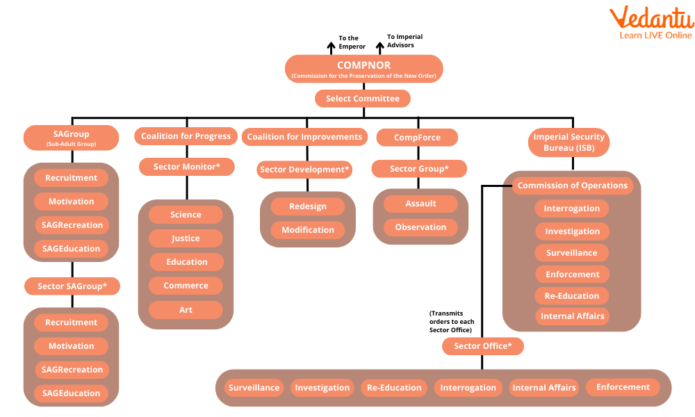

## Table of Contents

## What is the Galactic Empire in Star Wars?

The Galactic Empire is a big, bad government in the Star Wars movies. It is run by Emperor Palpatine, who is also called Darth Sidious. He is a very powerful and evil person who wants to control everything. The Empire uses a lot of soldiers called stormtroopers and big spaceships to keep everyone in line. They also have a scary weapon called the Death Star, which can destroy whole planets.

The Empire started after Palpatine tricked everyone and took over the good government called the Galactic Republic. He turned it into the Empire and made himself the Emperor. The Empire is mean to people and doesn't let them have freedom. A lot of people in the Star Wars stories fight against the Empire because they want to be free. The main group that fights them is called the Rebel Alliance.

## How is the economy of the Galactic Empire structured?

The economy of the Galactic Empire is very big and spread out across many planets. It is controlled tightly by the Empire, which means the Emperor and his people decide how money and resources are used. The Empire makes sure it gets a lot of money from taxes and by taking over other planets' resources. They use this money to build their big army and scary weapons like the Death Star. The Empire doesn't let people trade freely because they want to control everything.

Life for regular people in the Empire can be hard. The Empire takes a lot of their money and doesn't let them start their own businesses easily. Many people have to work in jobs that help the Empire, like making weapons or working on big ships. Because the Empire controls so much, it can be tough for people to make their own money or live the way they want. This makes a lot of people unhappy and some of them join groups like the Rebel Alliance to fight back.

## What are the main sources of income for the Galactic Empire?

The Galactic Empire gets most of its money from taxes. It makes everyone pay a lot of taxes on things like what they earn, what they buy, and even what they own. The Empire also takes over planets and their resources, like minerals and food. They sell these resources or use them to build things like spaceships and weapons. This way, the Empire can keep its army strong and build big projects like the Death Star.

Another big source of income for the Empire comes from controlling trade. They have strict rules about what can be bought and sold, and they take a cut of every deal. This means that businesses have to pay the Empire to do anything. The Empire also uses its power to make sure that it gets the best deals and the most money from trade. By controlling everything, the Empire makes sure it has enough money to stay in charge and keep everyone else under control.

## How does the Galactic Empire manage its resources?

The Galactic Empire manages its resources by taking control of them. They take over planets and use their minerals, food, and other things to help the Empire grow stronger. The Empire decides who gets to use these resources and makes sure they are used to build things like spaceships and weapons. They don't let people use resources freely because they want to keep everything under their control. This means the Empire can make sure it always has what it needs, even if it makes life harder for regular people.

The Empire also uses its power to control how resources are traded. They set strict rules about what can be bought and sold, and they take a part of every trade to make more money. This way, the Empire can keep track of everything and make sure they get the most out of every deal. By managing resources this way, the Empire keeps itself strong and powerful, even if it means people have less freedom and fewer choices about how to live their lives.

## What role does trade play in the economy of the Galactic Empire?

Trade is very important for the Galactic Empire's economy. The Empire controls trade tightly, making sure they get a part of every deal. They set strict rules about what can be bought and sold, and they take money from every trade. This helps the Empire make a lot of money, which they use to build their army and big projects like the Death Star. By controlling trade, the Empire can keep track of everything and make sure they always get the best deals.

The way the Empire controls trade also affects regular people. Because the Empire takes money from every trade, it can be hard for people to make their own money or start businesses. The Empire doesn't let people trade freely, so people have fewer choices about what they can buy and sell. This makes life harder for many people and can make them unhappy with the Empire. But for the Empire, controlling trade is a big way to stay strong and powerful.

## How does the Galactic Empire regulate its currency?

The Galactic Empire controls its money very tightly. They use a currency called credits, which is the main money used across the galaxy. The Empire makes sure that they are the only ones who can make new credits, so they can decide how much money is out there. By controlling the money, the Empire can keep the economy stable and make sure they always have enough money for their big projects and army.

The Empire also watches how people use credits very closely. They have strict rules about how much money people can have and what they can spend it on. This helps the Empire stop people from doing things they don't like, like trading without permission or starting their own businesses. By controlling the money, the Empire keeps everyone under their control and makes sure they stay in power.

## What economic policies does the Galactic Empire implement to maintain control?

The Galactic Empire uses strict economic policies to keep control over everyone. They take a lot of money from people through high taxes on what they earn, buy, and own. This money helps the Empire build big weapons like the Death Star and keep their army strong. The Empire also takes over planets and their resources, like minerals and food. They use these resources to make more weapons and spaceships, which helps them stay powerful.

The Empire also controls trade tightly. They set strict rules about what can be bought and sold and take a part of every deal. This way, they can keep track of everything and make sure they get the most money from every trade. By controlling trade, the Empire makes it hard for people to start their own businesses or make their own money. This keeps people from having too much freedom and makes them rely on the Empire.

The Empire also controls the money, called credits, very closely. They are the only ones who can make new credits, so they decide how much money is out there. They watch how people use credits and have strict rules about how much money people can have and what they can spend it on. By controlling the money, the Empire keeps the economy stable and makes sure they always have enough money to stay in power.

## How does the Galactic Empire handle economic inequality among its planets?

The Galactic Empire doesn't do much to help with economic inequality among its planets. They take a lot of resources from some planets and use them to make the Empire stronger, but this makes life harder for the people on those planets. Some planets have more money and resources than others, but the Empire doesn't try to make things fair. Instead, they use their power to keep control and make sure they get what they need, even if it means some planets stay poor.

This way of handling things makes a big difference between rich and poor planets. The Empire takes taxes and resources from all planets, but they spend most of it on their army and big projects. This means that planets that are already struggling don't get help to get better. People on these planets might join groups like the Rebel Alliance because they are unhappy with how the Empire treats them. The Empire's focus is on staying in power, not on making life better for everyone.

## What are the economic impacts of the Galactic Empire's military expenditures?

The Galactic Empire spends a lot of money on its army and big weapons like the Death Star. This means they take a lot of money from people through taxes and by taking over planets' resources. When the Empire uses so much money for the military, there is less money left for other things that could help people, like schools, hospitals, and fixing roads. This makes life harder for regular people because they have to pay high taxes but don't see much help from the Empire.

The big military spending also makes the economy focus a lot on making weapons and spaceships. Many people have to work in jobs that help the military, like building weapons or working on big ships. This can make it hard for people to start their own businesses or find other kinds of work. Because the Empire controls so much, it can be tough for the economy to grow in other ways. This makes some planets richer, where the military work happens, but leaves others poorer and struggling.

## How does the Galactic Empire's economy compare to that of the Rebel Alliance?

The Galactic Empire's economy is big and strong because they control a lot of planets and resources. They take money from people through high taxes and use it to build a huge army and scary weapons like the Death Star. The Empire also controls trade and money tightly, making sure they get a part of every deal and can decide how much money is out there. This helps them stay in power, but it makes life hard for regular people because they have to pay a lot and don't get much help from the Empire.

The Rebel Alliance, on the other hand, doesn't have as much money or resources. They fight against the Empire and want to help people have more freedom. The Rebel Alliance has to find ways to get money and resources without controlling planets like the Empire does. They might get help from people who don't like the Empire, but it's hard for them to have a big, strong economy like the Empire. This means the Rebel Alliance has to be smart and careful with what they have, while the Empire can use its big economy to stay in control.

## What are the long-term economic effects of the Galactic Empire's rule on the galaxy?

The Galactic Empire's rule has big, long-lasting effects on the galaxy's economy. Because the Empire takes so much money through high taxes and controls all the resources, many planets stay poor and struggle. The Empire spends most of its money on the military, building weapons and spaceships instead of helping people with schools, hospitals, and roads. This means that over time, the gap between rich and poor planets gets bigger. The rich planets, where the military work happens, get more money and resources, while the poor planets don't get help to grow and improve.

Over many years, the way the Empire controls trade and money also hurts the galaxy's economy. The strict rules about what can be bought and sold make it hard for people to start their own businesses or make their own money. This stops the economy from growing in new ways and keeps people from having more freedom. When the Empire finally falls, the galaxy might have a hard time fixing all the problems the Empire caused. It could take a long time for the economy to recover and for people to start living better lives again.

## How do economic theories from our world apply to the economic system of the Galactic Empire?

The Galactic Empire's economy can be looked at through different economic theories from our world. One theory that fits well is central planning, where the government controls everything. The Empire decides how money and resources are used, just like in a centrally planned economy. They take a lot of taxes and control trade tightly, which is similar to how some governments in our world have tried to control their economies. This can make the economy stable but often leads to less freedom and fewer choices for people.

Another theory that helps explain the Empire's economy is mercantilism. This is when a government tries to get as much money and resources as it can, often by taking over other places. The Empire does this by taking over planets and using their resources to build weapons and spaceships. They also control trade to make sure they get the most money from every deal. This focus on getting richer and more powerful is a lot like what mercantilist countries in our world have done, but it can lead to big differences between rich and poor, just like in the Empire.

## References & Further Reading

[1]: ["Advances in Financial Machine Learning"](https://www.amazon.com/Advances-Financial-Machine-Learning-Marcos/dp/1119482089) by Marcos Lopez de Prado

[2]: Bergstra, J., Bardenet, R., Bengio, Y., & Kégl, B. (2011). ["Algorithms for Hyper-Parameter Optimization."](https://dl.acm.org/doi/10.5555/2986459.2986743) Advances in Neural Information Processing Systems 24.

[3]: ["Quantitative Trading: How to Build Your Own Algorithmic Trading Business"](https://www.amazon.com/Quantitative-Trading-Build-Algorithmic-Business/dp/1119800064) by Ernest P. Chan

[4]: ["Machine Learning for Algorithmic Trading"](https://github.com/stefan-jansen/machine-learning-for-trading) by Stefan Jansen

[5]: ["Evidence-Based Technical Analysis: Applying the Scientific Method and Statistical Inference to Trading Signals"](https://www.amazon.com/Evidence-Based-Technical-Analysis-Scientific-Statistical/dp/0470008741) by David Aronson