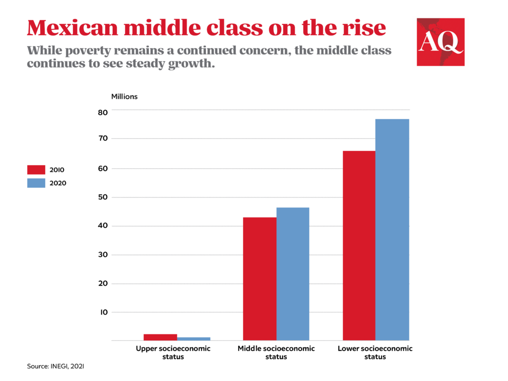

The dynamics of the middle class in Mexico reflect a substantial part of the nation's economic structure, offering insights into broader economic trends. Historically, the middle class in Mexico has been pivotal in shaping economic policies and driving internal consumption, thereby fuelling growth across various sectors. The economic trajectory of this demographic group offers a salient view of not only domestic progress but also global market influences.

This article explores the intersection of economics, the growth of the middle class in Mexico, and the impact of algorithmic trading. Understanding these intersections reveals how domestic and global changes affect economic participation. The rise of Mexico's middle class, driven by economic reforms and globalization, has catalyzed substantial shifts in consumption patterns and investment behaviors. This burgeoning middle class is increasingly engaging in financial markets, supported by enhanced access to information and technology.



On the technological frontier, algorithmic trading has emerged as a transformative force within financial markets. Defined by the use of complex algorithms to automatically execute trades, this approach leverages high-speed computations to optimize trading outcomes. Algorithmic trading reduces transaction costs and increases market efficiency, encouraging broader participation from different economic classes. As such, it opens new vistas for investment and wealth accumulation, which can be particularly beneficial for Mexico's emerging middle class.

The economic landscape of Mexico presents a roadmap to understanding the opportunities and challenges faced by the middle class. Key factors include the integration of Mexico into global trade networks and the impact of international policies. The implementation of the North American Free Trade Agreement (NAFTA) and its successor, the United States-Mexico-Canada Agreement (USMCA), have fundamentally redefined Mexico's economic environment, offering new opportunities for economic participation.

Algorithmic trading, with its expanding role, adds a new dimension to financial engagement. As these technologies lower barriers for market entry, middle-class individuals find new avenues for economic upliftment. However, this also introduces new challenges related to market volatility and the need for financial literacy. Consequently, strategic policy interventions and educational initiatives are necessary to ensure that such technologies benefit the middle class sustainably.

In summary, Mexico's economic evolution, characterized by a growing middle class and increasing technological integration in financial markets, presents both opportunities and challenges. By understanding these dynamics, stakeholders can better support inclusive growth and sustainable economic structures.

## Table of Contents

## Economic Overview of Mexico’s Middle Class

Mexico holds a notable position in the global economy with the 15th-largest nominal GDP, a status bolstered significantly by its involvement in the North American Free Trade Agreement (NAFTA). Since its inception in 1994, NAFTA has been a pivotal driver of economic transformations within the country, facilitating increased trade flows and foreign direct investment. This integration into a North American free trade zone catalyzed growth in various sectors, particularly in manufacturing.

The growth of Mexico's middle class is closely aligned with these economic shifts. Post-NAFTA, Mexico has experienced substantial improvements in economic livelihood, reflected in enhanced income stability and increased consumer spending power among middle-income households. Economic policies introduced in the subsequent years have further leveraged these opportunities, focusing on stabilizing the macroeconomic environment and fostering equitable growth.

Industries such as electronics and automobile manufacturing have been fundamental to this expansion. Mexico has become a critical hub for manufacturing, notably serving as a key supplier in the supply chains of multinational corporations. The automobile industry, comprising major car manufacturers, has created numerous employment opportunities, contributing significantly to the elevation of income levels. Similarly, the electronics sector has experienced robust growth, positioning Mexico as a leading exporter in the region. These industries are not only crucial for job creation but also for driving technological advancement and skill acquisition among the workforce.

However, despite the progress made, the size of Mexico's middle class remains relatively smaller compared to those in other member countries of the Organisation for Economic Co-operation and Development (OECD). While the percentage of the population categorized as middle class has expanded, many households are still vulnerable to slipping back into poverty due to economic shocks or structural inequalities.

Looking forward, there is optimism about the future growth of the middle class in Mexico. Continuous economic reforms, along with initiatives aimed at improving infrastructure, education, and healthcare, are expected to consolidate and expand this demographic group. These efforts are crucial for ensuring that the economic benefits reach a broader segment of the population, enhancing Mexico's overall socio-economic fabric and reducing disparities.

By sustaining and advancing such economic strategies, and by harnessing the potential of key industries, Mexico is poised to amplify the size and prosperity of its middle class, which in return, could bolster its national and global economic standing.

## Algorithmic Trading and Economic Participation

Algorithmic trading represents a significant evolution in financial market participation, leveraging advanced computing to execute market transactions with speed and precision that far surpasses human capability. This technology uses pre-programmed instructions, trading strategies, and algorithms to automate the buying and selling of financial instruments, aiming to optimize profits and reduce risks. The rapid growth of [algorithmic trading](/wiki/algorithmic-trading) has been facilitated by improvements in computational hardware, sophisticated software, and access to expansive financial databases.

The central advantage of algorithmic trading is its ability to lower barriers to market entry. Traditionally, financial markets were dominated by large institutional investors due to the complexity and resources required. However, technological advancements have democratized access, allowing middle-class individuals to participate in financial markets through online trading platforms. These platforms often offer algorithmic tools that enable users to compete on more even footing with larger players.

Opportunities associated with algorithmic trading for the middle class include the ability to participate in markets with minimal manual intervention and to execute strategies that capitalize on minute market efficiencies. For example, [arbitrage](/wiki/arbitrage) opportunities—where traders exploit price discrepancies for the same asset in different markets—can be detected and acted upon in real-time by algorithms designed for such purposes. Furthermore, these algorithms can conduct [backtesting](/wiki/backtesting), a process of testing trading strategies on historical data to evaluate their effectiveness before deploying them in live markets. An example of simple backtesting in Python might look like this:

```python
import pandas as pd

# Sample historical data
historical_data = {'Date': ['2023-01-01', '2023-01-02', '2023-01-03'],
                   'Price': [100, 105, 102]}

df = pd.DataFrame(historical_data)

# Simple moving average strategy
df['SMA'] = df['Price'].rolling(window=2).mean()

# Strategy signals
df['Signal'] = 0
df.loc[df['Price'] > df['SMA'], 'Signal'] = 1  # Buy signal
df.loc[df['Price'] < df['SMA'], 'Signal'] = -1 # Sell signal

print(df)
```

Despite these advantages, algorithmic trading also introduces challenges, primarily in market [volatility](/wiki/volatility-trading-strategies) and the need for substantial financial literacy. Rapid algorithm-driven transactions can exacerbate market swings, leading to scenarios where prices experience significant and sudden changes, sometimes resulting in flash crashes. Additionally, the complexity of algorithms requires traders to have a solid understanding of both technical concepts and financial markets. Without adequate knowledge, users may misinterpret signals or fail to recognize potential risks, which could lead to significant financial losses.

In conclusion, algorithmic trading reshapes economic participation by enabling middle-class individuals to access and engage with financial markets more effectively. However, this also necessitates an emphasis on developing financial literacy to ensure participants can navigate and benefit from these opportunities responsibly.

## Opportunities for the Middle Class through Algorithmic Trading

Accessibility to trading platforms and algorithmic tools has opened new avenues for middle-class investors in Mexico, offering significant opportunities for wealth generation. Traditionally, the financial markets were dominated by institutional investors who had the resources and expertise to exploit market inefficiencies. However, the advancement of algorithmic trading technologies has initiated a democratization process, potentially leveling the playing field between institutional investors and individual retail investors.

Algorithmic trading involves the use of computer algorithms to execute trades at speeds and frequencies unattainable for human traders. This capability allows for enhanced decision-making processes based on large datasets and complex mathematical models. As a result, individual investors who traditionally faced barriers to entry can now access sophisticated trading strategies and tools.

The increased accessibility to algorithmic trading platforms and tools can enable Mexico's middle class to participate more actively in capital markets. For instance, platforms like MetaTrader and [Interactive Brokers](/wiki/interactive-brokers-api) provide retail investors with access to algorithmic trading functionalities that were once exclusive to professionals. These platforms commonly offer backtesting features, allowing users to test trading strategies against historical data to evaluate their potential effectiveness.

In addition, this democratization extends the benefits of high-frequency trading techniques, which can capitalize on tiny price movements, to a broader audience. For example, Python libraries such as Pandas and NumPy allow middle-class investors to build and optimize their own trading algorithms using historical financial data.

It is essential to note that while algorithmic trading offers significant opportunities for the middle class, it also requires a certain level of technological and financial literacy to be effectively utilized. Therefore, educational resources and support systems are crucial in ensuring that middle-class investors can leverage these technologies responsibly and to their fullest potential.

By engaging more actively in capital markets through algorithmic trading, Mexico’s middle class can enhance their financial growth prospects. This engagement not only contributes to individual wealth generation but also supports broader economic development as more participants enter the financial market, increasing [liquidity](/wiki/liquidity-risk-premium) and promoting a more dynamic economic environment.

## Challenges and Risks of Algorithmic Trading

Algorithmic trading, while offering numerous advantages, comes with its own set of challenges and risks, particularly for individuals lacking a robust technical foundation in understanding trading algorithms. A prominent challenge is market volatility, which can significantly impact algorithmic trading strategies. Algorithms are often designed to capitalize on minute price movements at high frequencies, and unexpected market swings can lead to substantial losses. Traders, therefore, need to maintain a vigilant watch over algorithmic behavior and market conditions to prevent unwanted outcomes.

Consistent monitoring and comprehension of algorithmic modifications are crucial for effective risk management. Financial markets are dynamic, with continuous changes in regulations, market conditions, and available data. Algorithms need to adapt in real-time to these evolving parameters, demanding frequent updates and assessments of the algorithms' performance. A failure to do so could result in strategies becoming obsolete or ineffective, which might amplify exposure to risk.

Financial literacy and access to educational resources are essential to ensure the responsible use of trading technologies. Many individuals venturing into algorithmic trading do so with limited understanding, increasing the likelihood of critical mistakes. Comprehensive educational initiatives can significantly mitigate these risks by providing middle-class investors with the knowledge they need to understand both the potential rewards and inherent dangers of algorithmic trading. These resources should cover basics such as configuring algorithms, assessing performance, and understanding the implications of algorithmic trading decisions.

In summary, while algorithmic trading holds the potential to democratize financial markets, it necessitates a careful understanding of its risks. Building a solid foundation in financial literacy and staying informed about market dynamics are indispensable steps for any trader looking to navigate the complexities of algorithmic trading effectively.

## Impact on Mexico’s Economic Structures

Algorithmic trading is poised to significantly influence Mexico's economic structures by altering how financial markets function and impacting income distribution and class dynamics. This technology-driven approach to trading, which leverages algorithms and high-speed computing, has the potential to democratize financial market participation. For Mexico, a nation where economic disparities persist, the integration of algorithmic trading could lead to a more inclusive financial ecosystem.

The expansion of algorithmic trading requires regulatory frameworks that can adapt to the rapid changes within financial markets. Effective regulations can help mitigate risks associated with market volatility and ensure a fair trading environment. By providing educational support, the government and financial institutions can empower the middle class to engage more confidently and competently in markets traditionally dominated by institutional investors.

Increased access to algorithmic trading tools levels the field, allowing middle-class investors to participate meaningfully in financial markets. This participation could enhance their economic agency, contributing to wealth accumulation and potential upward mobility. Engagement in capital markets enables the middle class to diversify income sources, invest in different asset classes, and manage risks more effectively.

For broader economic stability, it is essential to foster a culture of financial literacy that embraces the nuances of algorithmic trading. Educating investors about the benefits and risks associated with these trading methods is critical. By doing so, individuals can make informed decisions and potentially mitigate adverse effects related to market swings and algorithmic decisions.

In conclusion, algorithmic trading holds transformative potential for Mexico's economic landscape, particularly for its middle class. With appropriate regulatory measures and educational initiatives, algorithmic trading could not only redistribute economic opportunities but also strengthen economic resilience and growth, fostering more equitable participation across all income levels.

## Conclusion

The growth of Mexico's middle class and the rise of algorithmic trading are closely linked phenomena that significantly shape economic stratification. The expansion of the middle class in Mexico has been facilitated by economic reforms and global trade agreements, such as NAFTA, which have spurred industrial growth and job creation. This newly empowered middle class is increasingly engaging with complex financial markets, with algorithmic trading playing an essential role in this interaction.

Algorithmic trading, by automating market transactions, offers a more accessible pathway for middle-class investors to participate in financial markets. This accessibility creates opportunities for wealth generation, allowing individuals to harness market efficiencies that were once the preserve of institutional investors. However, this potential is not without its challenges. The sophisticated nature of algorithmic systems can lead to increased market volatility, posing risks for investors lacking in-depth financial literacy or robust risk management strategies.

Strategic policy interventions are critical in addressing these challenges. Regulatory frameworks must evolve to safeguard against market manipulation and systemic risks inherent in high-frequency trading environments. Additionally, promoting financial literacy is essential to equip the middle class with the knowledge required to utilize algorithmic trading responsibly and effectively. Educational initiatives should focus on improving understanding of financial markets and strategies to mitigate risks associated with algorithmic investments.

Ensuring inclusive growth and sustainable economic structures involves a multifaceted approach. Policymakers should aim to create an environment where the benefits of algorithmic trading can be harnessed for the broader population, thereby enhancing economic stability and mobility within the middle class. By balancing the need for innovation with the imperative for stability and equity, Mexico can strive towards a more robust and inclusive economy that benefits all its citizens.

## References & Further Reading

Articles and studies from reputable sources provide valuable insights into the dynamics surrounding Mexico's middle class and the evolving role of algorithmic trading. Sources such as Investopedia offer foundational knowledge on financial concepts and trading mechanisms, beneficial for understanding the basics of algorithmic trading. World Population Review delivers statistical insights and demographic data crucial for analyzing the middle class's growth within Mexico. Pew Research Center's reports add depth to socio-economic analyses by highlighting trends and changes in income distribution.

Economic reports and data from Mexican government publications, such as the Instituto Nacional de Estadística y Geografía (INEGI), provide authoritative information regarding Mexico's economic conditions and middle-class status. Additionally, reports from international bodies like the International Monetary Fund (IMF) and the World Bank offer a global perspective, comparing Mexico's economic progress and challenges within broader international contexts.

For a more specialized understanding, [books](/wiki/algo-trading-books) and research papers focusing on algorithmic trading and economic analysis are recommended. Texts like "Algorithmic Trading: Winning Strategies and Their Rationale" by Ernie Chan provide technical insights and practical strategies applicable to financial markets. Economic analyses can be further explored through journals such as the "Journal of Economic Perspectives," which frequently publish studies related to market dynamics and economic policies that affect middle-class segments in various countries, including Mexico.

These resources collectively support a comprehensive understanding of how Mexico's middle class and economic frameworks interact and evolve amidst the integration of advanced trading technologies.

