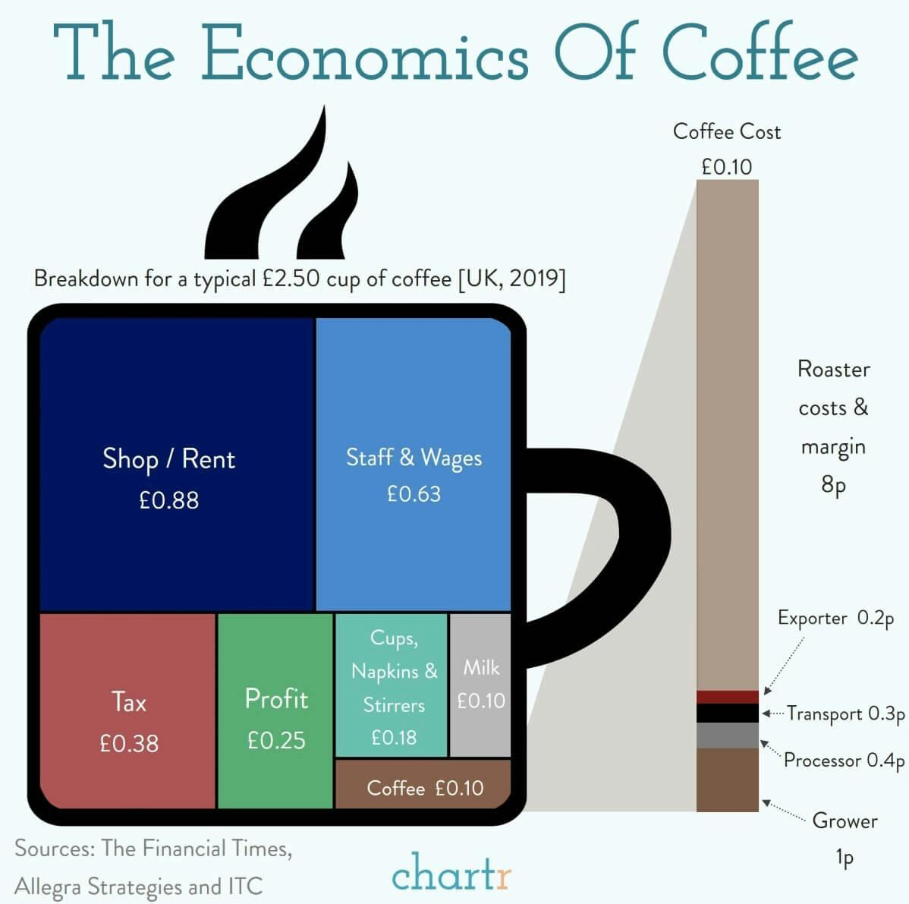

## Table of Contents

## What are the basic factors that influence coffee prices?

Coffee prices are influenced by several key factors. One of the main factors is the cost of production, which includes the expenses farmers face when growing and harvesting coffee beans. This can be affected by things like the price of labor, fertilizers, and other farming supplies. Another important factor is the global supply and demand for coffee. If there is a high demand for coffee but the supply is low, prices tend to go up. On the other hand, if there is more coffee available than people want to buy, prices can go down.

Weather conditions also play a big role in coffee prices. Coffee plants need specific weather to grow well, and if there are problems like droughts or heavy rains, it can hurt the coffee crop and reduce the amount of coffee available. This can cause prices to increase because there is less coffee to go around. Additionally, economic factors such as currency exchange rates can affect coffee prices. If the currency of a country that produces a lot of coffee becomes weaker, it can make their coffee cheaper for other countries to buy, which can influence global coffee prices.

Lastly, market speculation and trends can impact coffee prices. Traders and investors often buy and sell coffee futures, which are contracts to buy or sell coffee at a future date. Their actions can cause prices to go up or down based on what they think will happen in the market. Also, changes in consumer preferences, like a growing interest in specialty or organic coffee, can influence how much people are willing to pay for different types of coffee. All these factors together determine the price of coffee that we see in stores.

## How does the global supply and demand for coffee affect its pricing?

The global supply and demand for coffee plays a big role in deciding its price. When there is more coffee available than people want to buy, the price goes down. This happens because sellers need to lower the price to sell all their coffee. On the other hand, if there is not enough coffee to meet the demand, the price goes up. People are willing to pay more when coffee is hard to find.

For example, if a country that grows a lot of coffee has a bad harvest because of bad weather, there will be less coffee available. This can make the price go up because there is more demand than supply. Also, if more people around the world start drinking coffee, the demand goes up. If the supply doesn't increase to match this demand, the price will rise. So, the balance between how much coffee is available and how much people want to buy it is very important in setting the price.

## What role do coffee futures and commodity markets play in coffee pricing?

Coffee futures and commodity markets are important because they help people predict and set coffee prices. Coffee futures are agreements to buy or sell coffee at a certain price in the future. Traders and companies use these futures to protect themselves from big price changes. If they think the price of coffee will go up, they can buy futures now at a lower price. If they think the price will go down, they might sell futures now at a higher price. This trading can make the price of coffee go up or down based on what people think will happen.

The commodity market is where these futures are traded. It's like a big marketplace where people from all over the world can buy and sell coffee. The prices in this market can affect the price of coffee that we see in stores. If a lot of people are buying coffee futures because they think the price will go up, the price of coffee might go up too. On the other hand, if many people are selling futures because they think the price will go down, the price of coffee might go down. So, what happens in the commodity market can have a big impact on how much we pay for our coffee.

## How do production costs, such as labor and land, impact the price of coffee?

Production costs like labor and land have a big impact on the price of coffee. When it costs more to grow and pick coffee beans, the price of coffee goes up. For example, if farmers have to pay more for workers to harvest the coffee or if the price of land where coffee is grown increases, they need to charge more for their coffee to make a profit. This means that the cost of coffee in stores can go up too because the farmers and companies that buy from them pass these higher costs onto the consumers.

Also, the type of coffee can affect how much it costs to produce. Some types of coffee need more care and work, which can make the price go up. For example, specialty or organic coffee often needs special farming methods and more labor, so it costs more to grow. These higher production costs are then reflected in the price that people pay for these types of coffee. So, when you see a higher price for your coffee, part of that might be because it cost more to produce.

## What is the impact of climate change on coffee pricing?

Climate change can make coffee prices go up. This happens because coffee plants need special weather to grow well. If the weather changes a lot because of climate change, it can hurt the coffee plants. For example, if it gets too hot or there are more storms, the coffee plants might not grow as well. This means there will be less coffee to sell, and when there is less coffee, the price goes up because people still want to buy it.

Farmers also have to spend more money to protect their coffee plants from bad weather. They might need to use more water or special chemicals to help the plants grow. These extra costs make it more expensive for them to grow coffee, so they have to charge more for it. When farmers charge more, the price of coffee in stores goes up too. So, climate change can make coffee more expensive in two ways: by making less coffee available and by making it cost more to grow.

## How do different coffee processing methods affect the final price of coffee?

Different ways of processing coffee can change how much it costs. There are three main ways to process coffee: the dry method, the wet method, and the semi-washed method. The dry method is the oldest and cheapest way. It's when coffee cherries are left to dry in the sun and then the beans are taken out. Because it's simple and doesn't need a lot of machines, it usually makes the coffee cheaper. The wet method, also called washed, needs more water and machines. It makes the coffee taste cleaner and better, but it costs more to do. So, coffee processed this way is usually more expensive. The semi-washed method is a mix of the two, and its cost is somewhere in between.

The cost of processing can also depend on where the coffee is grown. In places where water is hard to get, using the wet method can make the price go up a lot. Also, some countries might have rules about how coffee can be processed, which can change the cost. For example, if a country says all coffee has to be processed in a certain way, it might make the price go up if that way is more expensive. So, the way coffee is processed can make a big difference in how much it costs, and it's not just about the method itself but also where and how it's done.

## What are the effects of trade policies and tariffs on coffee pricing?

Trade policies and tariffs can change how much coffee costs. When a country puts a tax, called a tariff, on coffee that comes from other countries, it makes that coffee more expensive. This can happen because the country wants to help its own coffee farmers by making foreign coffee cost more. If the tariff is high, it might make people buy more coffee from their own country, which could make the price of coffee go up if there isn't enough coffee to go around.

Also, trade policies can affect coffee prices by making it harder or easier for coffee to move between countries. If two countries have a good trade deal, it can make coffee cheaper because there are no big taxes or rules stopping it from being sold. But if there are a lot of rules or if countries can't agree on trade, it can make coffee more expensive because it's harder to get it from one place to another. So, how countries work together on trade can make a big difference in how much we pay for coffee.

## How does the concentration of market power among coffee roasters and retailers influence coffee prices?

When a few big coffee roasters and retailers have a lot of power in the market, it can affect how much coffee costs. These big companies can decide how much to pay farmers for their coffee beans. If they have a lot of power, they might pay less to farmers, which means they can sell the coffee for less money too. But sometimes, they might also keep the price high even if they pay less for the beans, so they can make more profit. This can make it hard for smaller coffee sellers to compete because they can't buy beans as cheaply or sell coffee at the same low prices.

Also, when big companies control a lot of the market, they can influence how much coffee costs in stores. They can set the prices and decide how much to charge customers. If there are only a few big companies, they might agree to keep prices high, which means people have to pay more for coffee. But if there are many smaller companies, they might have to lower prices to get people to buy from them instead of the big companies. So, the power of big roasters and retailers can make coffee prices go up or down depending on what they decide to do.

## What is the role of Fair Trade and other certification schemes in coffee pricing?

Fair Trade and other certification schemes help make sure that coffee farmers get paid fairly for their work. These programs set rules that companies have to follow, like paying farmers a minimum price for their coffee. This minimum price is often higher than what farmers would get without the certification. So, when you buy Fair Trade coffee, you know that the farmers got a fair price for their beans. This can make the coffee a bit more expensive, but it helps support the farmers and their communities.

Other certifications, like organic or Rainforest Alliance, also affect coffee prices. These certifications show that the coffee was grown in a way that is good for the environment or follows certain farming practices. It costs more for farmers to meet these standards, so the coffee they sell under these labels is usually more expensive. But people who care about the environment or want to support sustainable farming might be willing to pay more for this coffee. So, these certifications can make coffee prices go up, but they also help make sure that coffee is grown in ways that are good for the planet and the people who grow it.

## How do consumer preferences and trends impact the pricing of different types of coffee?

Consumer preferences and trends play a big role in how much different types of coffee cost. When more people want a certain kind of coffee, like specialty or organic, the demand goes up. If the supply doesn't increase to match this demand, the price of that coffee can go up too. For example, if more people start drinking cold brew coffee, the price of cold brew might go up because it's harder to find. Also, if people start caring more about where their coffee comes from or how it's grown, they might be willing to pay more for coffee that meets those standards.

Trends can also make some types of coffee more popular and expensive. For instance, if a new coffee drink becomes a big hit on social media, like a fancy latte with special flavors, more people might want to try it. This can drive up the price because everyone wants to buy it. On the other hand, if people start drinking less of a certain type of coffee, like instant coffee, the price might go down because there's less demand. So, what people like and want to buy can really change how much different kinds of coffee cost.

## What are the economic implications of vertical integration in the coffee industry on pricing?

Vertical integration in the coffee industry happens when one company controls different parts of the coffee business, like growing, processing, roasting, and selling coffee. When a company is vertically integrated, it can save money by doing everything itself instead of buying from other companies. This can make the price of coffee go down because the company doesn't have to pay as much for each step. But, if the company is big and has a lot of power, it might keep the price high to make more money, even if it costs less to make the coffee.

This control can also affect smaller coffee businesses. If a big, vertically integrated company can sell coffee cheaper because it saves money, smaller companies might have a hard time competing. They might have to charge more for their coffee because they can't buy beans or process them as cheaply. This can make the price of coffee from smaller companies go up. So, vertical integration can make coffee prices go down if big companies lower their prices, but it can also make prices go up if they keep prices high or if it makes it harder for smaller companies to compete.

## How can econometric models be used to predict future coffee price trends?

Econometric models are tools that help us understand and predict how coffee prices might change in the future. These models use math and [statistics](/wiki/bayesian-statistics) to look at past data on things like weather, production costs, and how much people want to buy coffee. By studying this data, the models can find patterns and figure out how different factors affect coffee prices. For example, if the model sees that bad weather in the past made coffee prices go up, it can use that information to predict what might happen if bad weather happens again.

Using these models, people can make better guesses about what coffee prices will do next. This is helpful for farmers who need to plan what to grow, for companies that buy and sell coffee, and even for people who just want to know if their favorite coffee will cost more or less soon. By putting all the important information into the model, like changes in trade policies or new trends in what people like to drink, the model can give a good idea of where coffee prices are headed. This way, everyone in the coffee business can make smarter choices and be ready for what might happen.

## References & Further Reading

[1]: International Coffee Organization. (n.d.). ["Coffee Production."](https://ico.org/what-we-do/world-coffee-statistics-database/)

[2]: Samper, L. F., & Quiñones-Ruiz, X. F. (2017). ["Towards a Balanced Sustainability Vision for the Coffee Industry."](https://www.mdpi.com/2079-9276/6/2/17) Resources, Conservation and Recycling, 125, 148-164.

[3]: Bacon, C. M. (2005). ["Confronting the Coffee Crisis: Can Fair Trade, Organic, and Specialty Coffees Reduce Small-Scale Farmer Vulnerability in Northern Nicaragua?"](https://www.sciencedirect.com/science/article/pii/S0305750X04002062) World Development, 33(3), 497-511.

[4]: Ponte, S. (2004). ["Standards and Sustainability Trade: The Case of 'Fair Trade' Coffee."](https://www.semanticscholar.org/paper/Standards-as-a-new-form-of-social-contract-in-the-Giovannucci-Ponte/36c43fea15befba3a02dd3d362dd63847daeea5e) Journal of Business Ethics, 53(1-2), 135-146.