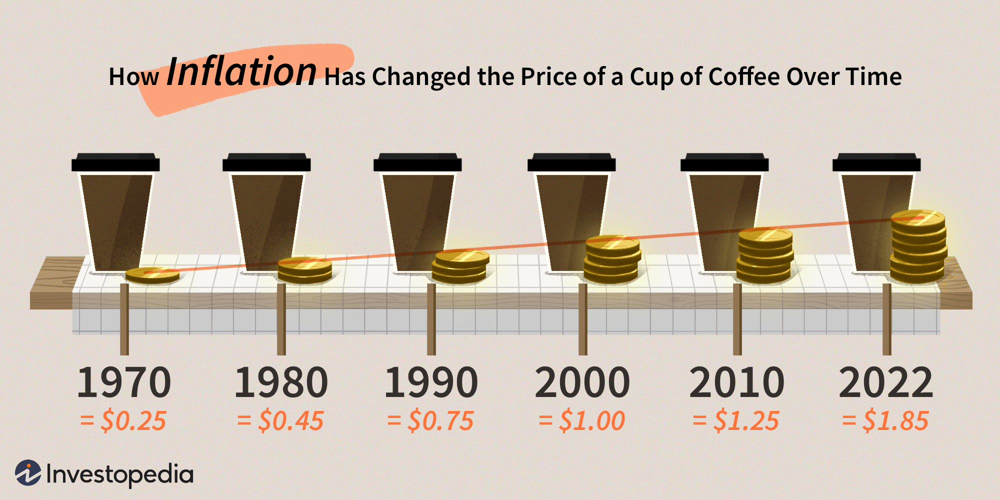

Coffee is not just a ubiquitous beverage; it is a cornerstone of global trade with profound economic significance. As a leading agricultural export, coffee ranks high among the world's most traded commodities, trailing only behind crude oil in terms of international trade value. This broad market presence is shaped by a complex web of cultivation practices, market forces, and trading mechanisms, all of which converge to determine the final price of coffee enjoyed by consumers worldwide.

The pricing of coffee is influenced by a cascade of variables, beginning at the cultivation stage and extending through to retail. Factors such as weather volatility, which can affect crop yields, the emergence of plant diseases, and the cost of labor, all play foundational roles in shaping the supply side of the equation. On the demand side, consumer preferences and economic conditions further steer pricing trends, with shifts toward specialty or ethically sourced variants impacting overall market dynamics.

Contemporary coffee trading has increasingly integrated advanced technological strategies. Notably, algorithmic trading now plays a pivotal role in the coffee market, employing sophisticated algorithms to execute trades based on real-time data analysis. This method has introduced both opportunities and challenges within traditional markets, potentially leading to increased price volatility and altering market liquidity.

Understanding the multifaceted economic forces at play is crucial for all stakeholders, from smallholder farmers grappling with price fluctuations to investors navigating market trends. As these forces evolve, informed decision-making remains key to capitalizing on opportunities and mitigating risks inherent in the coffee industry. This examination into coffee economics and the effects of modern trading practices provides a pathway to better grasp the nuances of this dynamic sector.

## Table of Contents

## The Global Coffee Market: An Overview

Coffee is one of the most traded commodities worldwide, second only to crude oil in terms of value, with a complex and dynamic market structure that involves numerous stakeholders. The global coffee market is significantly influenced by a range of factors, including climate change, production costs, and consumer demand, which collectively shape the industry's economic landscape.

Key players in the coffee industry include several major coffee-producing countries, with Brazil, Vietnam, and Colombia leading the charts. Brazil is the largest producer and exporter of coffee, benefiting from its favorable climate and large agricultural areas dedicated to coffee cultivation. Vietnam, known for its robusta coffee, has rapidly increased its production capabilities in recent decades, contributing to its position as the second-largest producer. Colombia, famous for its high-quality arabica beans, continues to be a vital player in the coffee market despite challenges such as volatile weather conditions and disease outbreaks affecting production.

Importers and exporters play critical roles in shaping global coffee trade flows. Countries like the United States, Germany, and Italy are among the largest importers, driven by high consumer demand for both specialty and conventional coffee products. These importing nations have established sophisticated supply chains to ensure the consistent availability of coffee products in their markets. Exporters, on the other hand, face the challenge of meeting quality and quantity demands while navigating changing economic conditions and trade policies.

Understanding the market structure of coffee requires an appreciation of the intricate interplay between these producing and consuming regions. The global coffee market is not only impacted by traditional supply and demand dynamics but also by broader economic and environmental trends. Climate change poses significant risks to coffee cultivation, as alterations in temperature and precipitation patterns can affect crop yields and quality. Consequently, producers must innovate and adapt to sustain their output and economic viability.

Consumer demand is another pivotal component driving the global coffee market. The rise of specialty coffee and increasing consumer awareness regarding sustainability have prompted shifts in market dynamics. Consumers now seek ethically sourced coffee, prompting producers and traders to emphasize fair trade and sustainable practices. This trend has introduced new pricing models and trading mechanisms aimed at ensuring fair compensation for producers, particularly smallholder farmers who are most vulnerable to market fluctuations.

Foreshadowing the future of the coffee market involves considering how these elements—production, trade, environmental factors, and evolving consumer preferences—will continue to interact and transform the industry. By comprehending the existing market structure, stakeholders can better navigate the complexities of coffee economics and position themselves strategically in this ever-evolving global landscape.

## Factors Influencing Coffee Pricing

Coffee prices are affected by a wide range of factors that shape the supply and demand dynamics in the market. Foremost among these influences are weather conditions. Coffee cultivation is heavily dependent on specific climatic conditions, and anomalies such as droughts, frosts, or excessive rainfall can reduce yield, leading to supply constraints. For instance, Brazil, the largest coffee producer, often experiences weather fluctuations that impact global prices. A severe frost in Brazilian coffee-growing regions can drastically reduce output, causing prices to rise due to diminished supply.

Disease outbreaks also play a critical role. Coffee rust, a fungal disease that affects coffee plants, has historically led to significant yield losses. This directly affects supply levels, creating pressures that drive up prices. The susceptibility of coffee crops to pests and diseases necessitates constant monitoring and management, which adds to production costs and can influence market prices.

Labor costs are another important [factor](/wiki/factor-investing). Coffee harvesting is labor-intensive, and changes in labor costs can affect the final price of coffee. In many coffee-producing countries, labor markets are influenced by local economic conditions, migration patterns, and government policies, which in turn impact the cost of production.

Technological advancements in farming and processing have the potential to enhance production efficiency and reduce costs. Innovations such as automated sorting systems, precision agriculture, and improved processing techniques can lead to higher yields and better quality coffee. These advancements help stabilize supply and can mitigate the impact of other price-influencing factors.

Consumer trends are also crucial in shaping coffee prices. The rise of specialty coffee exemplifies a shift in consumer preferences that impacts market dynamics. As demand for premium and ethically sourced coffee grows, prices can be influenced by the perceived quality and sustainability practices of producers.

Global economic conditions and currency fluctuations further complicate coffee pricing. As coffee is traded globally, variations in exchange rates can significantly affect the prices paid by importers and exporters. For instance, a weaker currency in a major producing country makes coffee cheaper for foreign buyers, potentially increasing demand. Conversely, economic recessions in key consuming markets can reduce demand, affecting prices.

In summary, coffee pricing is influenced by a combination of environmental, economic, and social factors. The interplay between these elements determines the fluctuating prices observed in the global coffee market. Understanding these complex dynamics is essential for stakeholders looking to navigate the coffee industry's challenges and opportunities effectively.

## Algorithmic Trading in Coffee Markets

Algorithmic trading has gained prominence in financial markets by integrating sophisticated algorithms to manage and execute trades on the basis of market signals and data-driven patterns. In the context of coffee markets, this type of trading is increasingly influential. The ability to process and analyze vast amounts of data with speed and precision allows traders to detect subtle price indicators that might be missed by human traders.

Algorithmic traders employ models that utilize a combination of historical data, current market conditions, and predictive analytics to forecast price movements in coffee. By leveraging these models, they can execute a large [volume](/wiki/volume-trading-strategy) of trades automatically as soon as the system identifies profitable opportunities. This is typically achieved using predetermined parameters and conditions encoded within the algorithms, which respond instantaneously to electronic market signals.

The implementation of [algorithmic trading](/wiki/algorithmic-trading) in coffee markets impacts both price [volatility](/wiki/volatility-trading-strategies) and market [liquidity](/wiki/liquidity-risk-premium). On one hand, algorithmic trading can enhance liquidity by ensuring that there is always a participant ready to buy or sell at near-market prices. This can potentially lead to greater price stability in the short term as the algorithms moderate supply and demand imbalances. On the other hand, the speed and automation of these systems can exacerbate price swings in cases where many algorithms react similarly to new information, amplifying volume and volatility.

For traditional participants in the coffee market, such as face-to-face traders and brokers, algorithmic trading presents both opportunities and challenges. It provides a more efficient means of trade execution and a better understanding of market trends; however, it also necessitates significant investments in technology and expertise to compete effectively against highly automated trading systems.

Moreover, algorithmic trading can bring faster price adjustments due to the rapid processing of new data points and changes in market conditions. The ability to anticipate and react to market trends more swiftly than human traders could potentially lead to more accurately priced coffee contracts and stocks. However, reliance on algorithms also poses risks, such as overfitting to historical data or malfunction during unprecedented market movements, which could lead to significant financial losses or market disruptions.

In conclusion, while algorithmic trading opens up new trading strategies and efficiencies in the coffee markets, its introduction brings about both innovative opportunities and noteworthy challenges. As this modern trading strategy evolves, its impact on long-term coffee pricing trends will continue to be an area of significant interest to all market participants.

## The Impact of Coffee Economics on Farmers

Global coffee prices experience fluctuations due to a variety of factors, and the impact of these fluctuations is most directly felt by smallholder farmers. These farmers, typically operating on less than five hectares of land, produce about 70% of the world’s coffee [1]. The economics of coffee production have profound effects on their livelihoods and economic stability.

### Smallholder Farmers and Economic Pressures

Coffee economics on the ground reveal a stark reality for many smallholder farmers. Price volatility can lead to unstable incomes, exacerbating poverty and making it difficult to invest in farming improvements [2]. Many farmers remain trapped in a cycle of poverty due to low coffee prices and limited access to credit. The global market price for coffee often does not reflect the cost of sustainable production, leaving farmers with thin margins.

### Fair Trade and Sustainable Practices

Fair trade initiatives have emerged as a means to counteract these challenges by ensuring farmers receive a minimum price for their coffee that covers the costs of sustainable production. Fair trade certification also provides a premium that farmers can invest in community or farm development projects. The introduction of sustainable practices, such as organic farming or agroforestry systems, is not only environmentally beneficial but can also lead to price premiums that improve farmer incomes [3].

### Better Pricing Models

Efforts to establish better pricing models focus on increasing transparency and traceability within the supply chain. Direct trade, which involves building closer relationships between farmers and buyers, can lead to better prices and more predictable demand. Additionally, some cooperatives and farmer organizations negotiate collectively to enhance their bargaining power against larger traders and buyers, aiming for more equitable prices.

### Technological Implementations and Risk Mitigation

Technological advancements play a critical role in helping farmers mitigate risks and stabilize incomes. Mobile technology can provide farmers with up-to-date market prices and weather forecasts, helping them make informed decisions about when to sell their coffee or take protective measures against adverse weather. Investment in technology for improving yield, such as enhanced processing methods or disease-resistant plant varieties, also contributes to reducing production costs and increasing profitability.

### Role of Industry Organizations

Industry organizations and non-governmental organizations (NGOs) strive to promote equitable distribution of economic benefits across the coffee supply chain. Initiatives like the World Coffee Producers Forum advocate for policy changes and support mechanisms that aim to ensure economic sustainability for farmers. Partnerships between industry stakeholders can lead to the development of programs that focus on capacity building and access to financial services for farmers, contributing to an overall enhancement of their economic resilience [4].

In conclusion, while coffee economics on a global scale presents numerous challenges for smallholder farmers, there are also significant opportunities to introduce fairer and more sustainable practices. By leveraging technology and fostering collaborative efforts across the supply chain, it is possible to empower farmers and improve their economic conditions, ensuring a more equitable and sustainable coffee industry.

### References
1. International Coffee Organization. (n.d.). Coffee Production. Retrieved from https://www.ico.org/
2. Samper, L. F., & Quiñones-Ruiz, X. F. (2017). Towards a Balanced Sustainability Vision for the Coffee Industry. Resources, Conservation and Recycling, 125, 148-164.
3. Bacon, C. M. (2005). Confronting the Coffee Crisis: Can Fair Trade, Organic, and Specialty Coffees Reduce Small-Scale Farmer Vulnerability in Northern Nicaragua? World Development, 33(3), 497-511.
4. Ponte, S. (2004). Standards and Sustainability Trade: The Case of “Fair Trade” Coffee. Journal of Business Ethics, 53(1-2), 135-146.

## Conclusion

As we have explored, coffee pricing and economics involve a complex combination of factors, each contributing uniquely to the final cost experienced by consumers worldwide. The emergence of algorithmic trading marks an important development, reshaping traditional coffee markets by increasing the speed and efficiency of price adjustments through automated systems. This modern approach can lead to increased market volatility and liquidity, which both producers and traders must adapt to.

For stakeholders, this evolution presents both challenges and opportunities. Producers must grapple with the realities of fluctuating prices influenced by these advanced trading techniques, while traders may benefit from more dynamic pricing strategies and enhanced market intelligence. As technology continues to advance and integrate into global financial systems, coffee markets will likely see greater transformations.

Looking ahead, the landscape of coffee pricing is poised to evolve further, driven by technological developments, geopolitical shifts, and changing consumer preferences. These forces will undoubtedly alter the supply chain dynamics, impacting various aspects of production and trade. The influence of climate change on coffee availability and quality, as well as the growing consumer demand for sustainably sourced and specialty coffee, will be particularly pivotal.

Understanding the multifaceted nature of coffee economics, including price-setting mechanisms and the role of algorithmic trading, is crucial for making informed decisions. Industry participants who can navigate these complexities and adapt to new trends will be better positioned to thrive in this dynamic sector. As the global market continues to evolve, a comprehensive grasp of these economic principles will be essential for success and sustainability in the coffee industry.

## References & Further Reading

[1]: International Coffee Organization. (n.d.). ["Coffee Production."](https://ico.org/what-we-do/world-coffee-statistics-database/)

[2]: Samper, L. F., & Quiñones-Ruiz, X. F. (2017). ["Towards a Balanced Sustainability Vision for the Coffee Industry."](https://www.mdpi.com/2079-9276/6/2/17) Resources, Conservation and Recycling, 125, 148-164.

[3]: Bacon, C. M. (2005). ["Confronting the Coffee Crisis: Can Fair Trade, Organic, and Specialty Coffees Reduce Small-Scale Farmer Vulnerability in Northern Nicaragua?"](https://www.sciencedirect.com/science/article/pii/S0305750X04002062) World Development, 33(3), 497-511.

[4]: Ponte, S. (2004). ["Standards and Sustainability Trade: The Case of 'Fair Trade' Coffee."](https://www.semanticscholar.org/paper/Standards-as-a-new-form-of-social-contract-in-the-Giovannucci-Ponte/36c43fea15befba3a02dd3d362dd63847daeea5e) Journal of Business Ethics, 53(1-2), 135-146.