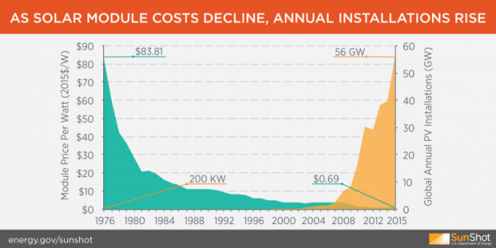

## Table of Contents

## What is solar energy and how is it harnessed?

Solar energy is the energy that comes from the sun. It is a clean and renewable source of energy, which means it can be used over and over again without running out. The sun sends out a huge amount of energy every day, and we can capture some of this energy to use for things like heating our homes, making electricity, and even running cars.

To harness solar energy, people use devices called solar panels. These panels are made up of many small solar cells that turn sunlight into electricity. When sunlight hits the solar cells, it creates an electric current. This electricity can then be used right away or stored in batteries for later use. Solar panels are often placed on rooftops or in large fields where they can get a lot of sunlight. This way, we can use the sun's energy to power our lives in a way that is good for the environment.

## How does solar energy contribute to the economy?

Solar energy helps the economy by creating jobs. When people build solar panels, install them, and maintain them, they need workers. This means more jobs for people in the community. Also, when a country uses more solar energy, it doesn't have to buy as much fuel from other countries. This can save money and make the country's economy stronger.

Solar energy can also bring money into local areas. For example, if a town has a big solar farm, it can sell the electricity it makes to other places. This can bring in extra money for the town. Plus, when people and businesses use solar energy, they often pay less for electricity over time. This means they have more money to spend on other things, which helps the economy grow.

## What are the initial costs associated with installing solar panels?

The initial cost of installing solar panels can be high. You need to buy the solar panels themselves, which can cost a lot of money. You also need to pay for other things like inverters, which change the electricity from the panels into a form you can use in your home, and batteries if you want to store the energy. On top of that, you need to hire someone to install the panels on your roof or in your yard, and this labor can add to the cost.

There are also some extra costs to think about. You might need to get special permits from your local government to put up the panels, and these can cost money too. Sometimes, you need to make changes to your roof or electrical system to make sure the panels work well, and this can add to the total cost. Even though the initial costs are high, many people find that they save money over time because they don't have to pay as much for electricity from the power company.

## What are the long-term financial benefits of using solar energy?

Over time, using solar energy can save you a lot of money. Once you pay for the solar panels and have them installed, the energy they make is free. This means you don't have to pay as much for electricity from the power company. The savings add up over the years, and many people find that they make back the money they spent on the panels in about 5 to 10 years. After that, the energy is almost like getting it for free.

Solar panels also last a long time, usually about 25 to 30 years. This means you can enjoy the savings for many years without having to spend more money on new panels. Plus, some places let you sell extra energy you make back to the power company. This can bring in extra money and make the savings even better. In the end, using solar energy can help you save a lot of money over the long run.

## How do government incentives and subsidies affect the economics of solar energy?

Government incentives and subsidies can make solar energy a lot cheaper for people to use. Many countries and local governments offer money back or tax breaks if you put solar panels on your home or business. This can help pay for the high cost of buying and installing the panels. For example, some places give you money back for each kilowatt-hour of solar energy you make, which can add up over time. These incentives make it easier for more people to switch to solar energy, even if they don't have a lot of money to start with.

These government programs also help the economy grow. When more people use solar energy, it creates more jobs for people who make and install solar panels. This can help the local economy get stronger. Plus, when people save money on their energy bills because of solar panels, they have more money to spend on other things. This can help businesses in the area do better. So, government incentives and subsidies not only help people save money on solar energy but also help the whole economy.

## What is the levelized cost of energy (LCOE) for solar power compared to traditional energy sources?

The levelized cost of energy (LCOE) is a way to figure out how much it costs to make energy over the whole life of a power plant. For solar power, the LCOE has been going down a lot in recent years. This means that solar energy is becoming cheaper to use compared to other kinds of energy. The LCOE for solar power can be different depending on where you live, but it's often less than the cost of making energy from coal or natural gas. This is good news because it means more people can use solar energy without it costing too much.

Traditional energy sources like coal, natural gas, and nuclear power have been around for a long time, and their LCOE can be higher than solar power's. For coal and natural gas, you have to keep buying fuel to make the energy, which can make the cost go up over time. Nuclear power plants are very expensive to build and take care of, so their LCOE can be high too. As solar panels get cheaper and better at making energy, solar power's LCOE keeps getting lower. This makes solar energy a more and more attractive choice for people who want to save money on their energy bills.

## How does the scalability of solar energy projects impact their economic viability?

The scalability of solar energy projects means that they can be made bigger or smaller depending on what people need. This is good for the economy because it lets people and businesses choose the right size of solar project for them. If you just want to power your home, you can put a few solar panels on your roof. But if you want to power a whole town, you can build a big solar farm. This flexibility makes solar energy more useful and helps more people use it, which can create jobs and save money on energy bills.

When solar projects get bigger, they can become even more cost-effective. Big solar farms can make a lot of energy at once, which can lower the cost per unit of energy. This means that the more solar panels you have, the cheaper the energy can be. This is good for the economy because it makes solar energy a competitive choice compared to other kinds of energy. As more people and businesses use solar energy, it helps the economy grow by creating jobs and saving money on energy costs.

## What role does solar energy play in job creation and economic development?

Solar energy helps create a lot of jobs. When people build solar panels, they need workers to make the panels, install them, and take care of them. This means more jobs for people in the community. Also, when a country uses more solar energy, it doesn't have to buy as much fuel from other countries. This can save money and make the country's economy stronger. As more solar projects get built, more jobs are created, which helps the economy grow.

Solar energy can also bring money into local areas. For example, if a town has a big solar farm, it can sell the electricity it makes to other places. This can bring in extra money for the town. Plus, when people and businesses use solar energy, they often pay less for electricity over time. This means they have more money to spend on other things, which helps the economy grow. So, solar energy not only creates jobs but also helps local economies by saving money and bringing in new income.

## How do advancements in solar technology influence the cost-effectiveness of solar energy?

Advancements in solar technology have made solar energy much more cost-effective. Scientists and engineers have found ways to make solar panels cheaper and better at turning sunlight into electricity. For example, they use less expensive materials and new ways to make the panels. This means that the cost of buying solar panels has gone down a lot over the years. Also, new technology helps solar panels last longer and work better, which saves even more money over time.

These improvements have made solar energy a better choice compared to other kinds of energy. When solar panels are cheaper and more efficient, more people can use them. This means more people can save money on their energy bills. Plus, when more people use solar energy, it helps create jobs and grow the economy. So, the advancements in solar technology not only make solar energy more affordable but also help the economy in big ways.

## What are the economic challenges and barriers to widespread adoption of solar energy?

There are some big challenges that make it hard for a lot of people to start using solar energy. The first big challenge is the high cost of getting started. Buying and setting up solar panels can be expensive, and not everyone has the money to do it right away. Even though the cost of solar panels has gone down a lot, it can still be a lot of money to spend all at once. Another challenge is that the sun doesn't shine all the time. You need a way to store the energy or get it from somewhere else when it's dark or cloudy, and that can add to the cost.

There are also some other barriers that can make it hard to use solar energy everywhere. For example, some places don't have good rules or help from the government to make solar energy easier to use. This means that people might not get the money back or tax breaks that could help them afford solar panels. Also, some people might not know a lot about solar energy or how it can help them save money. This can make them less likely to try it. So, even though solar energy has a lot of good things about it, these challenges and barriers can make it hard for everyone to use it.

## How does the integration of solar energy into the grid affect electricity market dynamics?

When solar energy gets added to the electricity grid, it changes how the electricity market works. Solar power can make a lot of electricity during the day when the sun is shining. This means there can be more electricity available at certain times, which can make the price of electricity go down during those times. But when the sun goes down, there might not be as much solar power, so the price of electricity can go up. This can make the electricity market more up and down, with prices changing a lot throughout the day.

To deal with these changes, the people who run the grid need to find ways to balance the electricity supply. They might use batteries to store extra solar power during the day and use it at night. Or they might use other kinds of power plants that can start up quickly to make more electricity when the sun isn't shining. This can make the electricity market more complicated, but it also gives people more choices for where they get their electricity. In the end, adding solar energy to the grid can help make the electricity market more flexible and maybe even cheaper for everyone.

## What are the future economic projections for solar energy in terms of market growth and cost reduction?

The future looks bright for solar energy. Experts think that the solar energy market will keep growing a lot in the coming years. More and more people and businesses are using solar power because it's getting cheaper and better. By 2050, some people think that solar energy could be the biggest source of electricity in the world. This growth is good for the economy because it creates jobs and helps countries save money on energy.

The cost of solar energy is also expected to keep going down. Scientists and engineers are working on new ways to make solar panels even cheaper and more efficient. This means that in the future, more people will be able to afford solar energy. As the cost goes down, solar power will become a better choice compared to other kinds of energy like coal and natural gas. This will help more people save money on their energy bills and make the economy stronger.

## What are the Economics of Solar Power?

The cost of solar power has seen a remarkable decrease over the past few decades, positioning it as a cost-competitive alternative to traditional energy sources in several regions worldwide. This price reduction is attributed to numerous factors, with government interventions, technological innovations, and market dynamics playing pivotal roles.

Government incentives have significantly accelerated the adoption of solar technologies by reducing initial capital requirements. Programs such as tax credits and direct subsidies lower the financial burden on consumers and companies, making solar installations more economically feasible. In the United States, for example, the federal Investment Tax Credit (ITC) allows for a deduction of a significant percentage of solar installation costs, which has spurred significant growth in the industry's infrastructure and capacity.

Technological advancements are another critical driver in reducing costs. The evolution of solar photovoltaic (PV) technology has led to enhanced efficiencies and reduced material costs, particularly with the development of thin-film panels and the improvement of crystalline silicon technologies. These innovations have contributed to a substantial drop in the cost per watt of solar power generated, making solar energy accessible to a broader market. 

Economies of scale further contribute to cost reduction. As solar adoption increases and production capacities expand, manufacturers benefit from reduced per-unit costs, a phenomenon often described by the learning curve effect. This effect can be mathematically represented by:

$$
C_n = C_1 \times n^{-\lambda}
$$

Where:
- $C_n$ is the cost per unit at quantity $n$
- $C_1$ is the initial cost per unit
- $n$ is the cumulative volume produced
- $\lambda$ is the learning rate coefficient

A lower learning rate coefficient indicates a faster reduction in costs as production scales, highlighting the importance of market growth in cost competitiveness.

In addition to falling costs, solar power provides the strategic advantage of energy independence. By harnessing an indigenous and inexhaustible energy source, nations and communities can reduce their reliance on imported fossil fuels, shielding themselves from volatile global energy markets and potential supply disruptions. This potential for stability is particularly appealing in an era characterized by fluctuating fossil fuel prices and geopolitical tensions.

Overall, the economic viability of solar power is a function of supportive government policies, technological progress, and the benefits associated with scale and energy security. This multifaceted approach has made solar energy an increasingly attractive option for both consumers and investors, setting the stage for its continued growth in the global energy portfolio.

## References & Further Reading

[1]: IRENA (2020). ["Renewable Power Generation Costs in 2019."](https://www.irena.org/publications/2020/Jun/Renewable-Power-Costs-in-2019) International Renewable Energy Agency.

[2]: Fraunhofer ISE (2022). ["Photovoltaics Report."](https://www.ise.fraunhofer.de/en/publications/studies/photovoltaics-report.html) Fraunhofer Institute for Solar Energy Systems.

[3]: Bunn, D. W., & Martoccia, M. (2005). ["Transmission market designs and trade in electric power."](https://www.semanticscholar.org/paper/The-Efficiency-of-Network-Transmission-Rightsas-on-Bunn-Martoccia/dd5c687bd3af36a916061a863fc1decca3c0ef65) The Journal of Energy Markets.

[4]: Sholl, D. S., & Steckel, J. A. (2011). ["Density Functional Theory: A Practical Introduction."](https://onlinelibrary.wiley.com/doi/book/10.1002/9780470447710) John Wiley & Sons.

[5]: ["Algorithmic Trading: Winning Strategies and Their Rationale"](https://www.amazon.com/Algorithmic-Trading-Winning-Strategies-Rationale-ebook/dp/B00CY5HC0U) by Ernie Chan