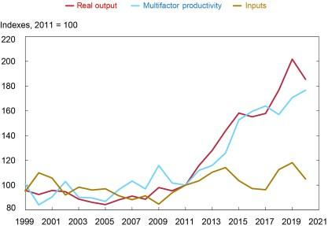

The oil industry remains a cornerstone of the global energy landscape, accounting for a significant portion of the world's energy supply and driving the economic engines of numerous nations. As of 2023, oil contributes to approximately 31% of global energy consumption, making it a key resource alongside coal, natural gas, and renewable sources. Its pervasive influence extends beyond energy provision, underpinning the transportation systems, industrial operations, and chemical productions that form the backbone of modern economies.

This article focuses on two critical aspects of the oil sector: the economic impacts of oil extraction and the role of algorithmic trading in shaping the dynamics of the industry. Oil extraction involves a complex interplay of geological, technological, and economic variables. With diverse oil types and deposits scattered globally, extraction costs vary widely depending on factors such as depth, location, and technological capability. These variations significantly influence production decisions and economic outcomes for oil-producing entities.



In contrast, modern trading mechanisms are undergoing significant transformation due to the rise of algorithmic trading. This sophisticated approach employs automated systems and data analytics to execute trades at speeds and volumes beyond human capabilities. Algorithmic trading is reshaping how energy markets operate, enhancing efficiency and liquidity while posing unique challenges related to market manipulation and volatility.

At the intersection of these domains lies an intricate relationship: the processes of oil extraction are becoming increasingly intertwined with algorithmic trading mechanisms. As the industry advances, the integration of real-time data feeds from extraction sites with analytical trading algorithms presents opportunities for optimized decision-making and enhanced market responsiveness. This convergence underscores the necessity for oil companies and traders alike to adapt to technological advancements and evolving regulatory frameworks to sustain competitiveness and stability in the market.

## Table of Contents

## Economic Impact of Oil Extraction Process

The extraction of oil significantly impacts the global economy, primarily due to the inherent variability of oil types and deposits. Each oil reservoir presents unique characteristics including differing chemical compositions, depths, and pressures, which directly influence the costs associated with extraction. Heavy crude oil, for example, is more expensive to extract and process than light crude due to its higher viscosity and sulfur content. This variability necessitates diverse extraction techniques and technologies and can result in fluctuating economic outputs depending on the quality and type of oil extracted.

Environmental and technological challenges further compound the complexities of the oil extraction process. Environmental concerns include the risk of oil spills, greenhouse gas emissions, and the disruption of local ecosystems. The technological challenges stem from the need to constantly evolve extraction methods to adapt to more difficult-to-reach deposits, as shallow, easily accessible sources are increasingly depleted. Innovations such as hydraulic fracturing and deep-water drilling have extended the lifespan of the oil industry but also increased operational risks and costs.

The concept of a moving profit point is central to understanding the profitability of oil extraction. This profit point is influenced by advancements in technology and the changing quality of available deposits. As new technologies lower extraction costs or make previously unviable reserves accessible, the profit point shifts, sometimes making it economically viable to exploit lower-quality deposits. However, this also means that as technology improves, the industry may face diminishing returns from established operations, necessitating continual investment in innovation.

Uneconomic production practices have significant long-term implications for the oil market. These practices often arise when operators choose to extract oil despite not covering their costs, driven by contractual obligations, government mandates, or efforts to maintain market share. While such practices might offer short-term benefits, they can lead to oversupply, depress market prices, and generate financial strain on companies. Over time, prolonged uneconomic extraction can destabilize markets, leading to reduced investments and impairing the industry's capacity to respond to future energy needs.

Thus, the economic impact of oil extraction is shaped by a complex interplay of geological, technological, environmental, and market factors. These dynamics demand continuous adaptation and strategic decision-making from industry stakeholders to maintain economic viability.

## Algorithmic Trading in the Oil Industry

Algorithmic trading, often referred to as algo trading, represents a paradigm shift in energy markets, particularly within the oil industry. This sophisticated trading method utilizes powerful algorithms to automate trading decisions, allowing traders to execute high-frequency transactions with precision and speed that were previously unattainable by human traders. The introduction of [algorithmic trading](/wiki/algorithmic-trading) has not only increased the efficiency of trading operations but has also introduced a new level of complexity to market dynamics.

## to Algorithmic Trading

Algorithmic trading involves using computers programmed with specific instructions to place trades at speeds and frequencies that are impossible for a human trader. These algorithms can process vast amounts of market data and execute trades based on predefined criteria, including timing, price, and market conditions. The primary advantage of algo trading is its ability to analyze numerous trading opportunities across various markets in seconds, thereby ensuring optimal returns on investment.

#### Key Strategies in Algorithmic Trading

1. **Statistical Arbitrage**: This strategy involves identifying price inefficiencies in related financial instruments. Traders exploit short-term price discrepancies between oil futures and spot prices to generate profits. Statistical models assess historical correlations and price movements to predict future price levels. The execution of these trades is automated to capitalize on minute-by-minute market fluctuations.

2. **Momentum Trading**: Algorithms are also used to engage in momentum trading, where the trading decisions are based on the strength of recent price trends. In the oil industry, these algorithms detect the persistence of a certain price movement and automatically trigger buy or sell orders in the direction of the trend, aiming to profit from ongoing market momentum.

3. **Machine Learning Models**: Machine learning (ML) applications have taken algorithmic trading to new heights by enabling models to learn from historical data and improve trading strategies over time. Machine learning algorithms adapt to new data inputs, refine predictions, and optimize trading decisions without explicit programming instructions.

#### Leveraging Data Analytics

Algorithmic trading relies heavily on data analytics for refined decision-making processes. Massive datasets encompassing historical price data, market sentiment indicators, global oil inventories, geopolitical developments, and other relevant metrics are processed through advanced analytical models. This approach facilitates the identification of patterns and trends that are not immediately discernible through conventional analysis.

Python, one of the most widely used programming languages in data science, plays a vital role in implementing algorithmic trading systems. Here is a basic example of whether a moving average crossover strategy could be employed in a trading algorithm using Python:

```python
import pandas as pd

# Load historical price data for analysis
data = pd.read_csv('oil_prices.csv')

# Calculate short-term and long-term moving averages
data['Short_MA'] = data['Price'].rolling(window=5).mean()
data['Long_MA'] = data['Price'].rolling(window=20).mean()

# Generate trading signals
data['Signal'] = 0
data.loc[data['Short_MA'] > data['Long_MA'], 'Signal'] = 1 # Buy
data.loc[data['Short_MA'] < data['Long_MA'], 'Signal'] = -1 # Sell

# Display the final data with signals
print(data)
```

This code snippet demonstrates the simplicity and effectiveness of using Python for implementing a simple moving average crossover strategy, which can serve as a foundation for more complex algorithmic systems.

Overall, algorithmic trading has transformed the landscape of the oil industry by enabling traders to perform transactions based on quantitative analysis rather than speculative judgment. This shift not only enhances market [liquidity](/wiki/liquidity-risk-premium) and pricing efficiency but also presents challenges such as increased market [volatility](/wiki/volatility-trading-strategies) and regulatory scrutiny, necessitating advanced risk management strategies and robust oversight.

## Impacts and Trends of Algo Trading in Energy Markets

Algorithmic trading has significantly influenced energy markets, particularly within the oil industry, by optimizing trading strategies and managing risks more efficiently than traditional methods. The advantages of these algorithmic systems are evident in several key areas, each contributing to their growing adoption and refinement.

Firstly, algorithmic trading enhances risk management capabilities. By utilizing complex algorithms that process vast amounts of market data, traders can quickly identify and respond to market fluctuations. This rapid processing power enables traders to hedge positions effectively and adapt to volatile market conditions, minimizing potential losses.

Optimizing trading strategies is another crucial advantage. Algorithms employ techniques such as statistical [arbitrage](/wiki/arbitrage), [momentum](/wiki/momentum) trading, and [machine learning](/wiki/machine-learning) (ML) models to discern patterns and predict future market movements. These methods allow for more accurate positioning, thereby maximizing potential profits. For instance, machine learning models can analyze historical data to forecast price trends, offering traders a strategic edge.

Despite its benefits, algorithmic trading poses challenges, with market manipulation being a primary concern. High-frequency trading ([HFT](/wiki/high-frequency-trading-strategies)), a subset of algorithmic trading, can sometimes distort market prices through practices like quote stuffing or layering. These actions can mislead other traders, creating artificial demand or supply and leading to unfair trading environments.

Addressing these challenges requires robust regulatory oversight. Regulatory bodies play a pivotal role in maintaining market fairness and integrity by enforcing stringent rules and monitoring trading activities. They ensure that algorithmic trading does not exploit market weaknesses but instead contributes to overall market efficiency. Regulatory frameworks, such as the European Union's Markets in Financial Instruments Directive II (MiFID II), are designed to enhance transparency and accountability in algorithmic trading activities.

In conclusion, while algorithmic trading offers significant advantages in managing risks and optimizing strategies within energy markets, it also presents challenges that necessitate careful regulatory oversight. Balancing innovation with fair trading practices remains essential to harness the full potential of algorithmic systems in the oil industry.

## Convergence of Oil Extraction and Algo Trading

The convergence of traditional oil reserve management and algorithmic trading represents a pivotal evolution in the oil industry, driven by advancements in technology and data analytics. As the oil market grapples with fluctuating demand, geopolitical tensions, and varying extraction costs, integrating algorithmic trading has become indispensable for optimizing operations and profitability.

Algorithmic trading systems, enhanced by Artificial Intelligence (AI) and Machine Learning (ML), offer numerous benefits in the oil industry. These technologies process vast amounts of market data and identify patterns that human traders might miss, thereby aiding in developing predictive models and trading strategies. AI and ML algorithms can analyze historical data and adapt to market changes, providing insights into price movements and the optimal times for buying or selling oil assets. This capability can result in higher returns and reduced risk exposure for stakeholders.

A practical example of this integration is the application of machine learning models to predict the price of [crude oil](/wiki/crude-oil) based on factors like supply and demand fluctuations, geopolitical events, and technological advancements. Python, a prevalent programming language in data analytics, can be used to implement such models. Below is a simple illustration of a linear regression model using Python to predict oil prices:

```python
import pandas as pd
from sklearn.model_selection import train_test_split
from sklearn.linear_model import LinearRegression

# Load dataset
data = pd.read_csv('oil_market_data.csv')

# Select features and target variable
X = data[['supply_level', 'demand_level', 'geopolitical_index']]
y = data['oil_price']

# Split the dataset into training and testing sets
X_train, X_test, y_train, y_test = train_test_split(X, y, test_size=0.2, random_state=42)

# Initialize linear regression model
model = LinearRegression()

# Fit the model
model.fit(X_train, y_train)

# Predict oil prices
predictions = model.predict(X_test)
```

Looking ahead, the interdependence between oil management and trading technologies is expected to grow. AI-driven systems will likely expand beyond mere trading purposes, encompassing broader aspects of the oil extraction process, such as predictive maintenance of oil rigs and smart resource allocation. Advanced sensor technologies and IoT devices implemented on extraction sites can feed real-time data into machine learning algorithms that continuously optimize operations and reduce downtimes.

The future landscape of oil management will increasingly rely on AI and ML to enhance decision-making, streamline processes, and mitigate risks. The ongoing fusion of traditional oil practices with cutting-edge trading technologies promises to revolutionize how resources are managed and traded, paving the way for a more efficient and resilient energy sector.

## Conclusion

The oil and energy sector is at a pivotal juncture, where traditional resource management must seamlessly integrate with cutting-edge trading strategies to ensure long-term sustainability and profitability. As technology continues to transform every aspect of the industry, it is imperative for stakeholders—including oil producers, traders, and policymakers—to embrace technological innovations and adapt to evolving regulatory frameworks.

Balancing resource management with innovative trading strategies involves optimizing both the extraction and trading processes. On one hand, effective resource management requires careful consideration of extraction costs, environmental impacts, and technological advancements to ensure profitable and sustainable operations. On the other hand, algorithmic trading strategies provide opportunities to leverage data analytics for enhanced decision-making, risk management, and strategy optimization. This dual approach is essential to maintaining competitive advantage and navigating the complexities of global energy markets.

The continued integration of [artificial intelligence](/wiki/ai-artificial-intelligence) (AI) and machine learning (ML) into trading systems offers unprecedented potential to enhance the precision and efficiency of market operations. By utilizing vast datasets and employing sophisticated algorithms, traders can identify patterns and trends that would be imperceptible through traditional methods, thereby gaining a significant edge in strategy development and execution.

As the oil and energy sector evolves, regulatory oversight will play a crucial role in ensuring market fairness and integrity. This necessitates a proactive approach, where stakeholders work collaboratively with regulatory bodies to establish frameworks that address the challenges associated with technological advancements, such as market manipulation risks and data privacy concerns.

In conclusion, the convergence of resource management and innovative trading strategies is not merely a response to current market demands but a fundamental shift that will shape the future landscape of the oil and energy sector. Stakeholders must be agile in adopting new technologies and regulatory practices to harness the full potential of these advancements. The transformative impact of technology not only promises enhanced efficiency and profitability but also contributes to the sustainable development of global energy resources.

## References & Further Reading

[1]: [BP Statistical Review of World Energy 2023](https://www.energyinst.org/statistical-review)

[2]: Barbier, E. B. (2011). ["The policy challenges for green and equitable recovery."](https://onlinelibrary.wiley.com/doi/abs/10.1111/j.1477-8947.2011.01397.x) Oxford Review of Economic Policy, 26(1), 473-492.

[3]: Katz, J. O., & McCormick, D. L. (2000). ["The Encyclopedia of Trading Strategies"](https://www.amazon.com/Encyclopedia-Trading-Strategies-Jeffrey-Ph-D/dp/0070580995) McGraw-Hill.

[4]: Domanski, D., & Heath, A. (2007). ["Financial investors and commodity markets."](https://www.bis.org/publ/qtrpdf/r_qt0703g.pdf) BIS quarterly review.

[5]: Schmidt, R., Petropoulos, F., & Daniilidis, S. (2018). ["Historical volatility in the crude oil market under alternative scenarios of fuel tax reform."](https://www.econstor.eu/handle/10419/207769) Energy Economics, 75, 324-336. 

[6]: Meyer, D., & Dutta, K. (2022). ["Algorithmic Trading and Price Dynamics."](https://link.aps.org/doi/10.1103/PhysRevD.110.115040) Journal of Financial Markets.