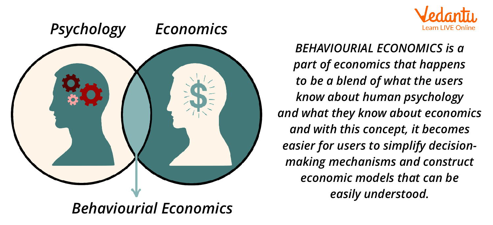

## Table of Contents

## What is economics and why is it important to study human action and behavior?

Economics is the study of how people use resources to meet their needs and wants. It looks at how individuals, businesses, and governments make choices about what to produce, how to produce it, and who gets to consume it. Economics helps us understand why people make the decisions they do and how these decisions affect the overall economy.

Studying human action and behavior is important in economics because it helps explain why people make certain choices. By understanding what motivates people, economists can predict how people will react to changes in prices, policies, or other economic factors. This understanding can lead to better economic policies and help improve the well-being of society. For example, knowing why people save or spend money can help governments create policies that encourage saving or stimulate spending when needed.

## How do economists define human action in the context of economic theory?

Economists define human action as the purposeful behavior of individuals to achieve their goals. In the context of economic theory, this means that people make choices based on what they want and the resources they have. For example, if someone wants to buy a new phone, they will consider their budget and the prices of different phones before making a decision.

Understanding human action is key to economic theory because it helps explain how markets work. When people act to fulfill their desires, they create demand for goods and services. This demand, along with the supply of goods and services, determines prices and helps allocate resources efficiently. By studying human action, economists can better understand and predict economic outcomes, which is important for creating effective economic policies.

## What are the basic principles of human behavior that economics seeks to understand?

Economics tries to understand some basic ideas about how people behave. One big idea is that people want to make themselves as happy as possible. They do this by choosing things that they think will make them feel good. For example, if someone is hungry, they might choose to buy food because it will make them feel better. Economists call this "maximizing utility," which just means trying to get the most happiness or satisfaction from what you have.

Another important idea is that people have to make choices because they can't have everything they want. This is because resources are limited. So, people have to decide what they want more and what they can do without. Economists call this "scarcity" and "opportunity cost." Opportunity cost is what you give up when you choose one thing over another. For example, if you spend your money on a movie ticket, you can't use that same money to buy a book. Understanding these choices helps economists see how people use resources and make decisions.

## Can you explain the concept of rational choice theory in economics?

Rational choice theory is a big idea in economics that says people make decisions by thinking about what will make them happiest. They look at all their choices and pick the one that they think will give them the best result. For example, if you're deciding whether to buy a new jacket or save your money, you'll think about how much you want the jacket and how much you want to save. If you think the jacket will make you happier than saving, you'll buy it.

This theory assumes that people have all the information they need to make good choices and that they think carefully about the future. But in real life, people don't always have all the information, and sometimes they make quick decisions without thinking too much. Even so, rational choice theory helps economists understand how people might behave in different situations and how they might react to changes in prices or policies.

## How does the study of human behavior influence economic policy making?

The study of human behavior is very important for making good economic policies. When people who make policies understand why people do what they do, they can create rules and programs that work better. For example, if they know that people like to save money when they get a tax break, they might make a policy that gives people a tax break to encourage saving. This can help the economy grow because more saving can lead to more investment.

Understanding how people make choices also helps policy makers predict how people will react to new policies. If a new law changes the price of something, knowing how people will respond can help decide if the policy is a good idea. For instance, if raising the price of cigarettes makes fewer people smoke, then a policy to increase cigarette taxes might be used to improve public health. By looking at human behavior, policy makers can make smarter choices that help everyone.

## What role does psychology play in the field of behavioral economics?

Psychology is really important in behavioral economics because it helps us understand why people sometimes make choices that don't seem to make sense. Behavioral economics looks at how people actually behave, not just how they should behave according to traditional economics. Psychology helps explain why people might choose something that doesn't give them the most happiness or the best result. For example, people might buy things they don't need just because they see a sale, even if they can't really afford it. This is called "irrational behavior," and psychology helps us understand why it happens.

By using ideas from psychology, behavioral economists can see patterns in how people make decisions. They look at things like how people feel about losing money compared to gaining money, which is called "loss aversion." People feel the pain of losing money much more than the joy of gaining the same amount. This understanding helps create better economic policies and ways to help people make better choices. For instance, if people tend to save more when they see how much they've saved over time, then policies can be made to show people their savings progress regularly. Psychology gives behavioral economics the tools to make sense of human behavior and improve how economic systems work.

## How do economic incentives affect human behavior and decision-making?

Economic incentives are rewards or penalties that can change how people act. They can be things like money, discounts, or even just feeling good about doing something. When people see an incentive, they might choose to do things they wouldn't normally do. For example, if a store offers a big discount on a product, more people will buy it because they want to save money. This shows how incentives can make people change their behavior to get a reward.

Incentives can also make people work harder or do things in a different way. If a company offers a bonus for meeting a sales goal, employees might try harder to sell more. On the other hand, if there's a penalty for not doing something, like a fine for breaking a rule, people might avoid doing that thing to not lose money. Understanding how incentives affect behavior helps economists and policy makers create rules and programs that encourage people to make choices that are good for everyone.

## What are some common biases and heuristics that impact economic decisions?

People often make economic decisions based on shortcuts in their thinking, called heuristics, and these can lead to mistakes or biases. One common heuristic is the availability heuristic, where people judge the likelihood of something based on how easily they can think of examples. For instance, if someone hears a lot about a certain stock doing well, they might think it's a good investment without doing more research. This can lead to overconfidence and bad investment choices. Another bias is loss aversion, where people feel the pain of losing money much more than the joy of gaining the same amount. This can make them avoid risks, even when taking a risk might be the smarter choice.

Another common bias is the anchoring effect, where people rely too much on the first piece of information they get. If a store first shows a high price for an item and then offers a discount, people might think they're getting a good deal, even if the final price is still high. Confirmation bias also plays a big role, where people look for information that supports what they already believe and ignore information that doesn't. This can lead to poor decision-making, like sticking with a failing investment because they only pay attention to positive news about it. Understanding these biases and heuristics helps economists and individuals make better economic choices.

## How does the study of game theory relate to human action and behavior in economics?

Game theory is a way to study how people make choices when what they decide depends on what others do. It's like playing a game where everyone is trying to win, but what you do affects what others can do, and what they do affects you. In economics, game theory helps us understand how people act in situations like buying and selling things, or making business deals. For example, when two companies are deciding whether to lower their prices, they need to think about what the other company might do. If one company lowers its prices and the other doesn't, the first company might get more customers but less profit per sale. Game theory helps economists figure out the best strategies for these kinds of situations.

By using game theory, economists can predict how people will behave in different economic situations. It helps explain why people might work together or compete, and how they might try to trick each other or make deals. For instance, in a game where people can choose to cooperate or not, game theory shows that if everyone works together, they might all be better off. But if someone thinks they can do better by not cooperating, they might choose to go it alone, even if it hurts everyone in the end. Understanding these patterns helps economists create better rules and policies that encourage people to make choices that are good for everyone.

## What are the differences between traditional economics and behavioral economics in analyzing human behavior?

Traditional economics and behavioral economics both try to understand how people make choices, but they look at it in different ways. Traditional economics, sometimes called neoclassical economics, assumes that people always make choices that make them as happy as possible. It believes people have all the information they need and always think carefully about their choices. This idea is called rational choice theory. For example, if someone is deciding whether to buy a new car or keep their old one, traditional economics says they'll look at all the costs and benefits and choose what's best for them.

Behavioral economics, on the other hand, says that people don't always make perfect choices. It looks at how people actually behave, not just how they should behave. Behavioral economists use ideas from psychology to understand why people sometimes make mistakes or choose things that don't make them as happy as they could be. They study things like how people feel about losing money compared to gaining money, or how people might be influenced by what others are doing. For example, if a store puts a sale sign on a product, people might buy it even if they don't really need it, just because they see the sale. By understanding these behaviors, behavioral economics helps create better ways to help people make smarter choices.

## How can advanced econometric models be used to predict human behavior in economic contexts?

Advanced econometric models are like super smart math tools that help economists predict how people will act in different economic situations. They use a lot of data and special math formulas to find patterns in how people make choices. For example, if economists want to know how people might react to a new tax, they can use these models to look at how people have reacted to taxes in the past. By putting in all the numbers and information, the model can guess what people might do next time.

These models are really helpful because they can take into account many different things at once. They can look at things like people's incomes, how much they like certain products, and even how they feel about losing or gaining money. By understanding all these factors, econometric models can make better guesses about what people will do. This helps businesses and governments make plans and policies that work better for everyone.

## What are the latest research findings on the neurological basis of economic decision-making?

Recent research in neuroeconomics has shown that our brains use special areas to make economic decisions. Scientists use machines like MRIs to see which parts of the brain light up when people are choosing things. They found that the prefrontal cortex, which is like the brain's boss, helps us think about the future and weigh different choices. Another part, the amygdala, deals with feelings like fear and excitement, and it can make us choose things quickly without thinking too much. This helps explain why sometimes people make choices that don't seem to make sense, like buying something on a whim.

Studies also show that chemicals in our brain, like dopamine, play a big role in how we make economic decisions. Dopamine makes us feel good, and it can push us to take risks or go after rewards. For example, if someone gets a thrill from gambling, it might be because their brain is releasing a lot of dopamine. Understanding these brain chemicals can help economists and psychologists figure out why people act the way they do in economic situations. This knowledge can lead to better ways to help people make smarter choices, like designing policies that take into account how our brains work.

## References & Further Reading

[1]: Kahneman, D., & Tversky, A. (1979). ["Prospect Theory: An Analysis of Decision under Risk."](http://web.mit.edu/curhan/www/docs/Articles/15341_Readings/Behavioral_Decision_Theory/Kahneman_Tversky_1979_Prospect_theory.pdf) Econometrica, 47(2), 263-291.

[2]: Thaler, R. H. (2015). ["Misbehaving: The Making of Behavioral Economics."](https://psycnet.apa.org/record/2015-22902-000) W. W. Norton & Company.

[3]: Lo, A. W. (2004). ["The Adaptive Markets Hypothesis: Market Efficiency from an Evolutionary Perspective."](https://papers.ssrn.com/sol3/papers.cfm?abstract_id=602222) The Journal of Portfolio Management, 30(5), 15-29.

[4]: Barberis, N., & Thaler, R. (2003). ["A Survey of Behavioral Finance."](https://www.nber.org/papers/w9222) Handbook of the Economics of Finance.

[5]: Hersh Shefrin (2000). ["Beyond Greed and Fear: Understanding Behavioral Finance and the Psychology of Investing."](https://academic.oup.com/book/27607) Harvard Business Review Press.