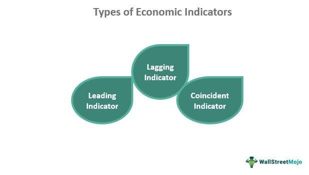

Economic systems, economic indicators, and algorithmic trading are pivotal components in comprehending and navigating the modern economic landscape. An economic system refers to the organized manner in which a society allocates resources and distributes goods and services across its populace. Predominant systems include capitalism, characterized by private ownership and market-driven decisions; socialism, which emphasizes public ownership and egalitarian distribution; and mixed economies that blend elements of both. These systems fundamentally influence the production, distribution, and consumption dynamics within a society.

Economic indicators are statistical metrics that reflect the economic performance of a country, enabling analysts to assess the health, stability, and growth potential of an economy. Key indicators include Gross Domestic Product (GDP), which measures the total value of goods and services produced; the inflation rate, which monitors the rate of price increase in the economy; and the unemployment rate, which quantifies the percentage of the labor force that is jobless. These indicators provide crucial insights for stakeholders, ranging from government policymakers devising fiscal policies to businesses strategizing resource allocations.



Algorithmic trading, on the other hand, represents the application of complex algorithms to execute trades in financial markets. The rise of algorithmic trading has transformed the landscape of financial markets by promoting speed and efficiency while minimizing human errors. Traders implement algorithmic strategies that analyze vast datasets, including economic indicators, to make informed, rapid trading decisions. This integration highlights the substantial interconnections between economic systems and market operations, underscoring the critical role of economic indicators in formulating trading strategies.

Understanding these elements is essential not only for economists and policymakers but also for individuals and businesses navigating the global economy. Data-driven decision-making has become indispensable in fostering economic development and ensuring responsive policy measures. Accurate interpretation of economic indicators enables astute financial planning and risk management, enhancing economic resilience.

This article aims to elucidate the interdependencies between economic systems, indicators, and algorithmic trading. It will explore the foundational role of economic systems in societal functioning, the importance of economic indicators in assessing economic health, the transformative impact of algorithmic trading in financial markets, and the synthesis of these components in shaping modern economic practices. The emphasis on data-driven decision-making will be a recurring theme, underscoring its significance in achieving sustainable economic success.

## Table of Contents

## Understanding Economic Systems

Economic systems are frameworks within which societies organize the production, distribution, and consumption of goods and services. These systems are integral to understanding how societies allocate resources and make economic decisions. They dictate the methods by which economic activities are structured and the extent to which government intervention is present in these processes.

There are several primary types of economic systems, each with distinct characteristics and methods of operation. Capitalism, socialism, and mixed economies are the most prevalent.

**Capitalism** is an economic system characterized by private ownership of the means of production and a market-based allocation of resources. In this system, decisions regarding supply, demand, prices, and investments are primarily driven by individual actors interacting within a free market. The United States is a prime example of a capitalist economy, where the market largely determines economic outcomes and government intervention is relatively limited.

**Socialism** is defined by the collective or state ownership of the means of production. Economic activities are organized through centralized planning, with the government playing a significant role in regulating and directing resources and efforts towards achieving social and economic equality. Countries such as Cuba and North Korea exemplify socialistic economic structures, although they vary considerably in their specific approaches to implementing socialism.

**Mixed economies** incorporate elements from both capitalism and socialism, allowing for both private enterprise and significant government intervention and regulation. These economies aim to balance the benefits of a market-driven economy with social welfare support systems. Nations like Sweden and France operate under mixed economies, providing room for private business alongside substantial public welfare institutions.

Economic systems profoundly influence how societies manage the allocation of resources, impacting production, distribution, and consumption. The system adopted by a country determines how goods and services are produced, who receives them, and how equitable the distribution is. For instance, in a capitalist system, production is largely profit-driven, leading to innovation and efficiency aimed at maximizing returns. Conversely, socialist systems might focus on equitable distribution, potentially at the cost of reduced incentives for efficiency and innovation.

Innovation and efficiency are largely shaped by the economic system in place. Capitalist economies often foster higher levels of innovation due to competitive markets and profit motives encouraging new ideas and technologies. In contrast, socialist economies may prioritize stability and equality, which can result in slower technological advancement. Mixed economies strive to harness the benefits of both systems, promoting innovation through market mechanisms while ensuring social welfare through state intervention.

Understanding different economic systems and their implications is crucial in evaluating how countries function and develop economically. It also aids in understanding the varied approaches nations take in addressing economic challenges, managing resources, and promoting growth and development.

## Key Economic Indicators

Economic indicators are statistical metrics used to gauge the economic performance of a country or region. These indicators are crucial for analyzing economic trends, assessing the overall health of the economy, and guiding decision-making for businesses, policymakers, and investors. Understanding these indicators is essential for predicting economic stability and growth, as well as for formulating effective monetary and fiscal policies.

Gross Domestic Product (GDP) represents the total monetary value of all goods and services produced within a country over a specific period, typically measured annually or quarterly. GDP is a key indicator of economic activity and is used to compare economic performance across different countries or time periods. It can be divided into components such as consumption, investment, government spending, and net exports. Monitoring changes in GDP helps stakeholders understand whether an economy is expanding or contracting, influencing decisions related to investments and policy adjustments.

The inflation rate measures the rate at which the general level of prices for goods and services is rising, and subsequently, the purchasing power of currency is falling. It's typically calculated using the Consumer Price Index (CPI) or Producer Price Index (PPI). Inflation can impact various economic stakeholders differently; for example, it can erode purchasing power for consumers while affecting the cost structures and pricing strategies of businesses. Central banks often use inflation as a key indicator when setting interest rates to control economic activity.

The unemployment rate indicates the percentage of the labor force that is jobless and actively seeking employment. It provides insights into the labor market's health and is a critical [factor](/wiki/factor-investing) in assessing economic stability. A high unemployment rate suggests economic distress, leading to decreased consumer spending and potentially slower economic growth. Consequently, governments may implement policies to stimulate job creation and support economic recovery.

In addition to these primary indicators, other metrics such as the balance of trade, interest rates, and consumer confidence indexes play significant roles in analyzing economic conditions. Each indicator provides unique insights into different aspects of the economy, helping stakeholders make informed decisions.

Economic indicators are integral to shaping monetary and fiscal policies. For instance, central banks may adjust interest rates in response to rising inflation or stagnating GDP to either stimulate or cool down the economy. Similarly, governments might modify taxation and spending policies based on unemployment data to encourage growth or manage deficits.

By analyzing economic indicators, stakeholders gain a clearer understanding of current economic conditions, enabling them to anticipate potential challenges and opportunities. This knowledge is fundamental to crafting strategies that foster economic resilience and growth in an ever-changing global landscape.

## The Rise of Algorithmic Trading

Algorithmic trading refers to the use of computer algorithms to automatically execute trades in financial markets. This method has transformed trading by allowing high-frequency and large-scale transactions that human traders could not perform manually. The evolution of [algorithmic trading](/wiki/algorithmic-trading) can be traced back to the late 20th century when electronic communication networks (ECNs) first appeared, simplifying trade execution and reducing transaction costs. Over the years, algorithmic trading has grown substantially with advancements in technology, becoming a dominant force in global financial markets.

At its core, algorithmic trading involves using complex mathematical models and formulas to analyze market data and execute trades based on pre-defined criteria. Algorithms can process vast amounts of data much faster than humans, enabling traders to capitalize on fleeting market opportunities. For example, a simple moving average algorithm might buy a stock if its short-term moving average exceeds the long-term moving average, and sell if the opposite occurs. In Python, this logic might look like:

```python
def moving_average(data, window_size):
    return data.rolling(window=window_size).mean()

short_term_avg = moving_average(stock_data, 20)
long_term_avg = moving_average(stock_data, 50)

buy_signals = short_term_avg > long_term_avg
sell_signals = short_term_avg < long_term_avg
```

Algorithmic trading offers several notable benefits. It significantly increases the speed of trade execution, ensuring that orders are placed at optimal prices. It enhances efficiency as algorithms can simultaneously monitor and analyze multiple markets and securities, which would be impossible for a human trader. Additionally, it minimizes human error and emotional biases, potentially improving decision-making outcomes.

However, algorithmic trading is not without challenges and risks. One primary concern is the potential for system errors or bugs that can lead to significant financial losses. The infamous 'flash crash' of May 6, 2010, highlighted how errant algorithms could contribute to extreme market [volatility](/wiki/volatility-trading-strategies). Algorithmic strategies may also be exploited by others, and high-frequency trading can create an unfair advantage, allowing some traders to benefit from minute price disparities.

The impact of algorithmic trading on market volatility and [liquidity](/wiki/liquidity-risk-premium) is nuanced. On one hand, algorithmic trading can enhance liquidity by providing a continuous stream of buy and sell orders, thereby narrowing bid-ask spreads. Conversely, it can increase volatility, as seen in "flash crashes" where rapid, algorithm-driven trades exacerbate price swings. The overall effect of algorithmic trading on markets continues to be a subject of rigorous debate among economists and policymakers.

## How Economic Indicators Influence Algorithmic Trading

Economic indicators play a crucial role in informing and shaping algorithmic trading strategies. These indicators, which include metrics such as Gross Domestic Product (GDP), unemployment rate, and inflation rate, provide vital insights into the macroeconomic environment. Algorithmic traders integrate this data into their systems to make informed decisions about buying and selling financial instruments.

Traders incorporate macroeconomic data into their algorithms by coding specific criteria based on economic indicators. For example, a trader might develop an algorithm that buys stocks when GDP growth exceeds a certain threshold, indicating a robust economy, and sells when unemployment rises above a particular level, suggesting potential economic slowdown. These algorithms rely on data feeds that deliver real-time or near-real-time economic data, enabling them to react swiftly to changing conditions.

Several case studies highlight the successful use of economic indicators in algorithmic trading. For instance, during periods of quantitative easing by central banks, algorithms that were programmed to detect shifts in interest rates and respond accordingly have yielded significant profits. This highlights the advantage of algorithmic systems in processing vast amounts of data quickly, enabling traders to capitalize on opportunities that arise from economic policy changes.

The predictive power of economic indicators for market movements can be assessed by measuring their historical correlation with asset prices. While indicators such as interest rates and inflation might directly influence bond prices, others like consumer confidence indices may have a more indirect effect on equity markets. Statistical techniques, including regression analysis and [machine learning](/wiki/machine-learning) models, are employed to quantify these relationships and enhance the accuracy of trading models.

Continuous adaptation of algorithms to economic changes is vital. Economic conditions are dynamic, and the relationships between indicators and market movements can shift due to factors like technological advancements or geopolitical events. Traders must regularly update their algorithms with new data and adjust their models to maintain or improve performance. This might involve recalibrating thresholds or learning new patterns through machine learning techniques.

Python, for example, is widely used for developing and testing trading algorithms due to its robust libraries for data analysis and machine learning. A simple Python snippet to integrate GDP data into a trading strategy could look like this:

```python
import pandas as pd

# Example function to make a trade decision based on GDP data
def make_trade_decision(gdp_growth):
    if gdp_growth > 3.0:  # Assuming 3.0 as a threshold for strong economic growth
        return 'Buy'
    elif gdp_growth < 1.0:  # Assuming 1.0 as a threshold for economic contraction
        return 'Sell'
    else:
        return 'Hold'

# Example GDP data
gdp_data = pd.Series([2.5, 3.2, 0.9, 1.5, 3.5])
decisions = gdp_data.apply(make_trade_decision)

print(decisions)
```

This code shows a simple decision-making process where the trading decision is made based on GDP growth data. With AI and machine learning advancements, such models can now be trained on vast datasets to recognize complex patterns, offering a sophisticated edge to traders. These systems continuously learn and adapt, which is essential for optimizing performance in the ever-evolving economic landscape.

## The Future of Economics and Trading

The future landscape of economics and trading is poised for significant transformation due to advancements in technology and data analysis. Artificial intelligence (AI) and machine learning (ML) are at the forefront of this evolution, offering the potential to revolutionize the way economic data is analyzed and trading decisions are made. Through the application of AI, vast datasets can be processed with unprecedented speed and accuracy, revealing patterns and insights that were previously unattainable. Machine learning models, such as neural networks and decision trees, facilitate the automation of complex analyses, which can lead to more informed predictions and strategies in the financial markets.

The integration of real-time economic data into trading platforms further enhances the capabilities of algorithmic trading. By utilizing data streams from diverse sources, including market data, news, social media sentiment, and macroeconomic indicators, traders can achieve a more comprehensive understanding of market dynamics. This integration supports the development of adaptive algorithms that can react swiftly to market changes, optimizing trading strategies and improving outcomes. Python's libraries such as `pandas` and `numpy` are often employed to handle data streams, while frameworks like TensorFlow and PyTorch enable the deployment of [deep learning](/wiki/deep-learning) models in trading algorithms.

However, the rapid pace of technological innovation brings with it ethical and regulatory challenges. The use of sophisticated algorithms raises concerns regarding market fairness and the potential for systemic risks. Flash crashes, as experienced in past incidents, highlight the vulnerability of markets to algorithmic malfunctions. Regulatory bodies face the challenge of crafting policies that ensure transparency and accountability while fostering innovation. Establishing clear guidelines on the use of AI and machine learning in trading is essential to mitigate risks and ensure market stability.

In response to these advancements, there is a growing need for education and training. Professionals in the fields of economics and finance must acquire new skills to adapt to the changing landscape. This includes understanding the principles of AI and machine learning, as well as developing competencies in data analysis, programming, and quantitative methods. Academic institutions and professional organizations are increasingly offering courses and certifications to equip individuals with the necessary knowledge to thrive in a technology-driven financial environment.

The convergence of economics, data science, and technology signifies a transformative period for global markets. By harnessing the power of AI and real-time data, traders and economists can unlock new opportunities and address emerging challenges, shaping the future of the economic and trading systems with informed, data-driven decisions.

## Conclusion

The interconnections between economic systems, indicators, and algorithmic trading are integral to comprehending the global economy's dynamics. Economic systems define the framework within which economies operate, influencing how resources are allocated and how trade is conducted. Indicators such as GDP, inflation, and unemployment rates provide critical insights into an economy's health and stability, guiding both public and private sector decision-making. Algorithmic trading leverages these indicators, using them as signals to execute trades rapidly and efficiently.

Informed decision-making, grounded in comprehensive data analysis, is paramount to economic success. As the complexity of global markets increases, stakeholders—ranging from individual investors to large corporations and policymakers—must continuously refine their strategies. The integration of vast datasets, economic theories, and cutting-edge computational techniques fosters more precise and informed decision-making processes, enhancing economic outcomes.

Continuous learning and adaptation to technological advancements and economic shifts are essential. Algorithmic trading illustrates the profound impact technology has on traditional practices, transforming how trading is conducted and how markets respond to economic stimuli. Artificial intelligence and machine learning can enhance the predictive capabilities of trading systems, necessitating up-to-date knowledge and skills to effectively harness these tools.

The confluence of economic understanding with algorithmic trading holds transformative potential. By converging economic indicators with sophisticated algorithmic strategies, market participants can anticipate and react to changes with unprecedented speed and accuracy. This synergy can contribute to more stable and efficient markets, though it also poses challenges such as increased volatility and ethical concerns.

As these trends evolve, they will inevitably shape the future of global economies. Embracing these changes requires a commitment to ongoing education and an appreciation of their complex interplay. By aligning economic systems, indicators, and algorithmic trading strategies, stakeholders can better navigate the uncertainties of modern economic landscapes and contribute to sustainable economic growth.

## References & Further Reading

[1]: Samuelson, P. A., & Nordhaus, W. D. (2009). ["Economics"](https://books.google.com/books/about/EBOOK_Economics.html?id=rMovEAAAQBAJ). McGraw-Hill Education.

[2]: Mankiw, N. G. (2020). ["Principles of Economics"](https://books.google.com/books/about/Principles_of_Economics.html?id=KQfFDwAAQBAJ). Cengage Learning.

[3]: Ang, A. (2014). ["Asset Management: A Systematic Approach to Factor Investing"](https://archive.org/details/assetmanagements0000anga). Oxford University Press.

[4]: Lopez de Prado, M. (2018). ["Advances in Financial Machine Learning"](https://books.google.com/books/about/Advances_in_Financial_Machine_Learning.html?id=oU9KDwAAQBAJ). Wiley.

[5]: Chan, E. P. (2013). ["Algorithmic Trading: Winning Strategies and Their Rationale"](https://github.com/ftvision/quant_trading_echan_book). Wiley.

[6]: Hull, J. C. (2015). ["Options, Futures, and Other Derivatives"](https://www.semanticscholar.org/paper/Options%2C-Futures%2C-and-Other-Derivatives-Hull/89bdee500c8623864fc9eb7a471546aa713acc44). Pearson.