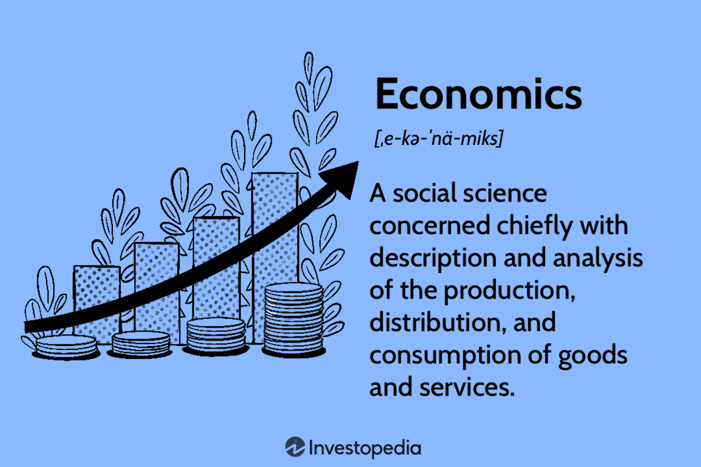

## Table of Contents

## What is economics?

Economics is a social science that studies how people use resources to meet their needs and wants. It looks at how individuals, businesses, governments, and other groups make choices about what to produce, how to produce it, and who gets to use what is produced. At its core, economics is about making decisions in a world where resources like time, money, and natural materials are limited.

One key idea in economics is the concept of supply and demand. This idea helps explain how the price of goods and services is determined in a market. When many people want something and there is not much of it available, the price tends to go up. On the other hand, if there is a lot of something and not many people want it, the price will usually go down. Economists use this and other theories to understand and predict economic behavior and to help make better decisions about economic policy.

## What are the main types of economics?

There are two main types of economics: microeconomics and macroeconomics. Microeconomics looks at the behavior of individuals and businesses. It focuses on things like how people decide what to buy, how businesses choose what to produce, and how prices are set. It's like looking at the small parts of the economy to understand how they work together.

Macroeconomics, on the other hand, looks at the economy as a whole. It studies big things like the total amount of goods and services produced in a country, the overall level of prices, and the rates of unemployment and inflation. Macroeconomics helps us understand how the whole economy is doing and how government policies can affect it.

Besides these two, there is also a type called behavioral economics. This type mixes economics with psychology to understand why people sometimes make choices that don't seem to make sense. It looks at how emotions, habits, and other human factors influence economic decisions.

## How do microeconomics and macroeconomics differ?

Microeconomics and macroeconomics are two big parts of economics, but they look at different things. Microeconomics is all about the small pieces of the economy. It looks at how people and businesses make choices. For example, it might study why someone decides to buy a certain type of bread or how a store decides what price to charge for it. Microeconomics helps us understand how these little decisions add up to affect the whole economy.

Macroeconomics, on the other hand, takes a step back to look at the big picture. It studies things like the total amount of money a country makes, how many people are out of work, and how fast prices are going up. Macroeconomists try to figure out how the whole economy is doing and how things like government spending or taxes can change it. It's like looking at the economy from high up in the sky, instead of down on the ground.

Both microeconomics and macroeconomics are important. They help us understand different parts of the economy and how they work together. Microeconomics shows us the building blocks, while macroeconomics shows us the overall structure. By studying both, we can get a better idea of how the economy works and how to make it better.

## What are key economic indicators and why are they important?

Key economic indicators are important pieces of information that help us understand how an economy is doing. They include things like the Gross Domestic Product (GDP), which tells us the total value of all goods and services produced in a country. Another important indicator is the unemployment rate, which shows the percentage of people who want to work but can't find a job. There's also the inflation rate, which measures how quickly prices are going up. These indicators give us a quick snapshot of the economy's health and help us see if it's growing or shrinking.

These indicators are important because they help people make better decisions. For example, if the GDP is growing, it might mean that businesses are doing well and people are spending more money. This could be a good time for someone to start a new business or invest in the stock market. On the other hand, if the unemployment rate is high, it might mean that the economy is struggling, and people might want to be more careful with their money. By keeping an eye on these indicators, governments, businesses, and individuals can plan for the future and try to make the economy better.

## How is Gross Domestic Product (GDP) calculated and what does it measure?

Gross Domestic Product, or GDP, is a way to measure how much a country's economy is producing. It adds up the total value of all the goods and services made within a country's borders in a certain amount of time, usually a year or a quarter. There are three main ways to calculate GDP: the expenditure approach, the income approach, and the production approach. The expenditure approach adds up all the spending in the economy, including what consumers, businesses, the government, and other countries spend on goods and services. The income approach adds up all the income earned by everyone in the country, like wages, profits, and taxes minus subsidies. The production approach adds up the value of everything produced, taking away the cost of the things used to make them.

GDP is important because it tells us how well an economy is doing. If the GDP is growing, it usually means the economy is getting bigger and people are producing and buying more things. This can be a sign of a healthy economy. On the other hand, if the GDP is shrinking, it might mean the economy is struggling, and fewer goods and services are being made and sold. By looking at GDP, governments, businesses, and people can make better decisions about things like spending, saving, and investing. It helps everyone understand the overall health of the economy and plan for the future.

## What are inflation and deflation, and how do they impact the economy?

Inflation is when the prices of things we buy go up over time. It means that the money we have doesn't buy as much as it used to. For example, if a loaf of bread cost $1 last year and now it costs $1.10, that's inflation. A little bit of inflation is normal and can be good for the economy because it encourages people to spend money instead of saving it. But if inflation gets too high, it can be bad. It makes it hard for people to afford things, and it can make the economy unstable.

Deflation is the opposite of inflation. It's when the prices of things go down over time. While this might sound good because it means things are cheaper, it can actually be bad for the economy. When prices are falling, people might wait to buy things because they think prices will be even lower later. This can slow down the economy because businesses sell less and might have to cut jobs. Both inflation and deflation are important to watch because they show how healthy the economy is and help guide decisions about money and spending.

## What are the different economic systems and how do they function?

There are several different economic systems that countries can use, and they all work in different ways. The main ones are traditional, command, market, and mixed economies. A traditional economy is based on customs and traditions, where people do the same jobs their families have always done. It's common in rural or less developed areas. A command economy is controlled by the government, which decides what to produce, how much to produce, and how to distribute goods and services. This type of economy is often found in countries with communist or socialist governments. A market economy, on the other hand, relies on people and businesses making their own decisions. Prices and what gets produced are decided by supply and demand, without much government control. A mixed economy is a mix of the command and market systems, where the government and private businesses both play a role in the economy.

Each of these economic systems has its own way of working and its own benefits and challenges. In a traditional economy, the focus is on meeting the basic needs of the community, but it can be slow to change and might not be good at using new technology. Command economies can make sure everyone gets what they need, but they can also lead to less choice and innovation because the government makes all the decisions. Market economies are good at creating wealth and giving people choices, but they can also lead to big differences between rich and poor people. Mixed economies try to balance the benefits of both command and market systems, but finding the right balance can be hard. Understanding these different systems helps us see how different countries manage their economies and what might work best in different situations.

## How do capitalism and socialism differ in their approach to resource allocation?

Capitalism and socialism have different ways of deciding how to use resources. In capitalism, resources are mostly controlled by private people and businesses. They decide what to make and how much to charge based on what people want to buy. If a lot of people want something, businesses will make more of it and might charge more money. This system can lead to a lot of new ideas and choices for people, but it can also mean that some people get a lot more money and resources than others.

In socialism, the government has a bigger role in deciding how to use resources. The idea is to make sure everyone gets what they need, not just what they can afford. The government might own big businesses and decide what to make and how to share it among people. This can help make things more equal and make sure everyone has enough, but it can also mean fewer choices and less motivation for people to start new businesses or come up with new ideas. Both systems have their own ways of trying to make the best use of resources, but they do it in very different ways.

## What role do government policies play in shaping economic systems?

Government policies are really important in shaping how an economy works. They can decide things like how much tax people have to pay, how much money the government spends, and what rules businesses have to follow. For example, if the government wants to help the economy grow, it might lower taxes so people have more money to spend. Or it might spend more money on things like building roads or schools, which can create jobs and help businesses. These kinds of policies can make a big difference in whether an economy is more like a market system, where businesses and people make most of the decisions, or more like a command system, where the government has more control.

Different countries use different kinds of policies to shape their economies. In a country with a market economy, the government might focus on making sure businesses can compete fairly and that people can start new businesses easily. They might also have policies to help people who don't have a lot of money, like giving them money or helping them find jobs. In a country with a more socialist economy, the government might own big businesses and use policies to make sure everyone gets what they need. By choosing the right policies, governments can help make their economies work better and make life better for their people.

## How do international trade and globalization affect economic systems?

International trade and globalization can change how economies work by letting countries buy and sell things with each other. When countries trade, they can get things they can't make themselves or things that are cheaper from other places. This can help businesses grow and give people more choices of things to buy. But it can also make it hard for some businesses at home if they have to compete with cheaper products from other countries. Governments often make rules about trade, like setting taxes on imports or making agreements with other countries, to try to make trade fair and help their own economy.

Globalization also means that money, ideas, and people can move more easily around the world. This can help spread new technology and ways of doing things, which can make economies grow faster. For example, a new way of making cars in one country can help car makers in another country make better cars. But globalization can also make economies more connected, so if one country's economy has problems, it can affect other countries too. This can make it harder for governments to control their own economies, but it can also give them more chances to work together and help each other grow.

## What advanced economic theories should experts be familiar with?

Experts in economics should understand theories like Keynesian economics, which focuses on how government spending and taxes can help control the economy. John Maynard Keynes, the founder of this theory, believed that during bad economic times, the government should spend more money to help people and businesses. This can create jobs and make people spend more, which helps the economy grow. Keynesian economics is important because it shows how government actions can make a big difference in the economy, especially when things are not going well.

Another important theory is the neoclassical economics, which looks at how people make choices based on what they want and what they can afford. This theory uses ideas like supply and demand to explain how prices are set and how the economy works in the long run. Neoclassical economists believe that markets usually work well on their own, without much help from the government. Understanding neoclassical economics helps experts see how individual choices add up to affect the whole economy.

Experts should also know about game theory, which studies how people make decisions when they have to think about what others will do. This theory is used a lot in economics to understand things like why companies might work together or compete, and how countries might make trade deals. Game theory helps experts predict how different choices will affect the economy and how people might react to different situations.

## How can econometric models be used to forecast economic trends?

Econometric models are like special tools that economists use to predict what might happen in the economy. They use math and [statistics](/wiki/bayesian-statistics) to look at past data and find patterns. For example, they might look at how the unemployment rate has changed in the past and see if it goes up or down when certain things happen, like when the government changes taxes. By understanding these patterns, economists can make guesses about what might happen next. They can say things like, "If the government raises taxes, we might see more people out of work."

These models are really helpful for making decisions. Governments use them to plan their spending and taxes, and businesses use them to decide where to invest their money. For instance, if an econometric model predicts that people will have more money to spend in the future, a business might decide to open new stores or make more products. But, it's important to remember that these models are not perfect. They are based on what happened in the past, and the future can be different. So, economists always need to keep checking their models and updating them with new information to make sure their predictions are as good as possible.

## References & Further Reading

[1]: Samuelson, P. A., & Nordhaus, W. D. (2009). ["Economics"](https://books.google.com/books/about/EBOOK_Economics.html?id=rMovEAAAQBAJ). McGraw-Hill Education.

[2]: Mankiw, N. G. (2020). ["Principles of Economics"](https://books.google.com/books/about/Principles_of_Economics.html?id=KQfFDwAAQBAJ). Cengage Learning.

[3]: Ang, A. (2014). ["Asset Management: A Systematic Approach to Factor Investing"](https://archive.org/details/assetmanagements0000anga). Oxford University Press.

[4]: Lopez de Prado, M. (2018). ["Advances in Financial Machine Learning"](https://books.google.com/books/about/Advances_in_Financial_Machine_Learning.html?id=oU9KDwAAQBAJ). Wiley.

[5]: Chan, E. P. (2013). ["Algorithmic Trading: Winning Strategies and Their Rationale"](https://github.com/ftvision/quant_trading_echan_book). Wiley.

[6]: Hull, J. C. (2015). ["Options, Futures, and Other Derivatives"](https://www.semanticscholar.org/paper/Options%2C-Futures%2C-and-Other-Derivatives-Hull/89bdee500c8623864fc9eb7a471546aa713acc44). Pearson.