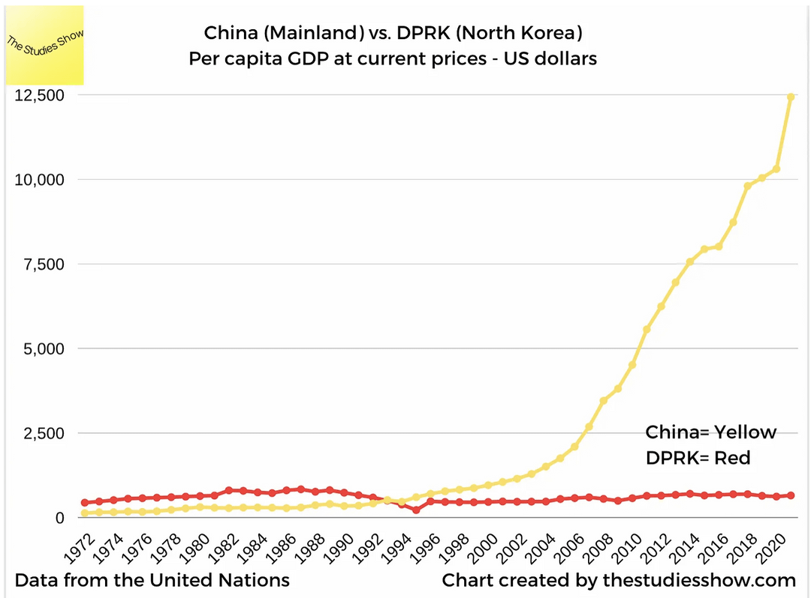

## Table of Contents

## What are the basic economic systems of China, Cuba, and North Korea?

China, Cuba, and North Korea all have economic systems that are influenced by socialism and communism, but each country has its own unique approach. China has a mixed economy, often referred to as "socialism with Chinese characteristics." This means that while the government still controls key sectors like banking and energy, it also allows for private businesses and foreign investment. This blend has helped China become one of the world's largest economies. On the other hand, Cuba has a more centrally planned economy, where the government owns most businesses and controls the distribution of resources. However, in recent years, Cuba has started to allow some small private enterprises, showing signs of gradual economic reform.

North Korea, on the other hand, has a highly centralized and planned economy where the government has almost total control over all economic activities. The state owns all businesses, and the economy is heavily focused on military spending and self-reliance. This has resulted in limited economic growth and widespread poverty. Unlike China and Cuba, North Korea has shown little interest in opening up its economy to private businesses or foreign investment. Each of these countries' economic systems reflects their political ideologies and historical development, leading to different levels of economic freedom and prosperity.

## How do these countries' governments control their economies?

In China, the government controls the economy through a mix of state ownership and market-oriented reforms. The government owns big companies in important areas like banking, energy, and transportation. But it also lets private businesses and foreign companies operate. The government makes rules and plans to guide the economy, like setting goals for growth and managing money supply. This mix has helped China grow a lot and become a big player in the world economy.

Cuba's government has a lot of control over the economy too, but it's more strict. The government owns most businesses and decides how resources are used. It plans what will be produced and how it will be shared among people. In recent years, Cuba has started to allow small private businesses, but the government still has the final say on big economic decisions. This tight control means the economy doesn't grow as fast as some other countries.

In North Korea, the government has almost complete control over the economy. It owns all businesses and decides everything about what is made and how it's shared. The economy focuses a lot on the military and being self-reliant. The government doesn't allow private businesses or much trade with other countries. This strict control has kept North Korea poor and isolated from the rest of the world.

## What are the main industries in China, Cuba, and North Korea?

In China, the main industries are manufacturing, technology, and services. China makes a lot of things like electronics, clothes, and cars. It's also becoming a leader in technology, with companies making smartphones, computers, and even electric cars. Services like banking, tourism, and online shopping are also big in China. The government helps these industries grow by investing in them and making rules to help them succeed.

Cuba's main industries are tourism, sugar, tobacco, and healthcare. A lot of people visit Cuba for its beautiful beaches and old cities. Sugar and tobacco have been important for a long time, and Cuba is famous for its cigars. Healthcare is also big in Cuba, with the country known for its doctors and medical research. The government controls these industries and decides how they work.

In North Korea, the main industries are mining, military, and agriculture. North Korea has a lot of minerals like coal and iron, which it mines. The military is very important, and a lot of the country's resources go to making weapons and supporting the army. Agriculture is also key, with people growing food to feed the country. The government tightly controls all these industries and doesn't let private businesses operate.

## How have historical events shaped the economies of these three countries?

China's economy was shaped a lot by its history. In the 1940s, after a long war, the Communist Party took over and started to build a socialist economy. They took control of businesses and farms, and the government decided everything. But in the late 1970s, leader Deng Xiaoping started big changes. He opened up the economy to let private businesses grow and foreign companies come in. This helped China grow very fast and become a big economy. The government still controls important parts, but letting in more business has made a huge difference.

Cuba's economy was also changed by big events. After the 1959 revolution, Fidel Castro and his group took over and made a socialist economy. The government took control of businesses and farms, and it decided what to make and how to share it. Cuba got a lot of help from the Soviet Union, but when the Soviet Union fell apart in the 1990s, Cuba had a hard time. It started to let in some small private businesses to help the economy. Even now, the government still controls most things, but those changes have helped a bit.

North Korea's economy was shaped by its history too. After the Korean War in the 1950s, the country was divided, and North Korea became a strict socialist state. The government took over everything and focused a lot on the military and being self-reliant. They didn't want help from other countries and kept their economy closed off. This made it hard for the economy to grow, and the country stayed poor. Even today, the government still controls everything tightly, and the economy hasn't changed much.

## What is the role of state-owned enterprises in these economies?

In China, state-owned enterprises (SOEs) play a big role in the economy. They control important industries like banking, energy, and transportation. The government uses these SOEs to make sure these key areas run well and help the country grow. But China also lets private businesses work and foreign companies come in. This mix helps the economy grow a lot. The government can guide the economy by controlling the SOEs and making rules for everyone else.

In Cuba, state-owned enterprises are very important too. The government owns most businesses and decides what they do. This includes things like making sugar and tobacco, and running healthcare. The government plans everything and makes sure resources are shared how they want. In recent years, Cuba started to let some small private businesses work, but the SOEs still control most of the economy. This helps the government keep a tight hold on things.

In North Korea, state-owned enterprises run everything. The government owns all businesses and decides what they make and how it's shared. This includes mining, military stuff, and farming. The government doesn't let private businesses work and doesn't want much help from other countries. This tight control makes it hard for the economy to grow, and the country stays poor. The SOEs are a big reason why the economy is so closed off.

## How do China, Cuba, and North Korea engage in international trade?

China does a lot of international trade. It sells things like electronics, clothes, and cars to other countries. It also buys things it needs, like oil and food. China is part of the World Trade Organization, which helps it trade with many countries. The government controls a lot of this trade, but it also lets private businesses and foreign companies trade too. This has helped China become one of the biggest trading countries in the world.

Cuba also trades with other countries, but not as much as China. It sells things like sugar, tobacco, and some medical services. It buys things it needs, like food and oil. Cuba used to get a lot of help from the Soviet Union, but when that ended, it had to find new trading partners. Now, it trades with countries like Venezuela and some in Europe. The government controls most of this trade and doesn't let in many private businesses.

North Korea trades less than China and Cuba. It sells things like minerals and seafood. It buys things it needs, like food and oil. North Korea doesn't have many trading partners because it's very closed off. It trades mostly with China and sometimes with Russia. The government controls all of this trade and doesn't let private businesses do it. This makes it hard for North Korea to grow its economy through trade.

## What are the key economic reforms implemented in these countries in recent decades?

In recent decades, China has made big changes to its economy. It started in the late 1970s when Deng Xiaoping opened up the economy. He let private businesses grow and foreign companies come in. This helped China grow very fast. The government still controls important parts like banking and energy, but it also makes rules to help private businesses. China joined the World Trade Organization in 2001, which helped it trade more with other countries. These changes have made China one of the biggest economies in the world.

Cuba has also made some changes to its economy in recent years. After the Soviet Union fell apart in the 1990s, Cuba had a hard time. It started to let some small private businesses work to help the economy. This included things like restaurants and shops. The government still controls most businesses and decides what to make and how to share it. But these small changes have helped a bit. Cuba has also tried to trade more with other countries to get what it needs.

North Korea has made very few changes to its economy. It stays very closed off and the government controls everything. In the 2000s, it did try some small changes, like letting some markets work. But these changes were small and didn't last long. The government still owns all businesses and decides what they make and how it's shared. North Korea doesn't trade much with other countries and stays poor. The few changes it tried didn't make a big difference.

## How do these economies compare in terms of GDP growth and per capita income?

China has seen very fast GDP growth in recent decades. Its economy has grown a lot because of the changes it made to let private businesses and foreign companies work. This has helped China become one of the biggest economies in the world. China's per capita income has also gone up a lot, but it's still not as high as in some rich countries. People in China are getting richer, but there's still a big difference between rich and poor.

Cuba's GDP growth has been slower than China's. The government still controls most businesses, which makes it hard for the economy to grow fast. Cuba's per capita income is much lower than China's. People in Cuba don't make as much money as people in China. The small changes Cuba made to let some private businesses work have helped a bit, but not enough to make a big difference.

North Korea's GDP growth has been very slow, and its per capita income is the lowest of these three countries. The government controls everything and doesn't let private businesses work. This makes it hard for the economy to grow. North Korea doesn't trade much with other countries, which also keeps it poor. People in North Korea make much less money than people in China and Cuba.

## What are the major challenges facing the economies of China, Cuba, and North Korea?

China's economy is growing fast, but it faces some big challenges. One problem is that the country has a lot of debt. This means it borrowed a lot of money to grow, and now it has to pay it back. Another challenge is that the population is getting older. This means fewer people are working and more people need help from the government. Also, the difference between rich and poor people in China is very big. This can cause problems and make it hard for everyone to feel good about the country's growth.

Cuba's economy has its own set of challenges. The government controls most businesses, which makes it hard for the economy to grow fast. Cuba also has a hard time getting what it needs from other countries because of trade restrictions. These restrictions come from the United States and make it hard for Cuba to buy and sell things. Another problem is that many young people want to leave Cuba to find better jobs in other countries. This means fewer people are working and helping the economy grow.

North Korea's economy faces the biggest challenges of these three countries. The government controls everything and doesn't let private businesses work. This makes it very hard for the economy to grow. North Korea doesn't trade much with other countries, which keeps it poor. The country also spends a lot of money on the military instead of helping people. This means many people in North Korea are very poor and don't have enough food or other things they need.

## How do these countries manage their currency and monetary policies?

China manages its currency, called the yuan, very carefully. The government sets rules to control how much the yuan is worth compared to other money. This helps China sell things to other countries more easily. The government also makes rules about how much money is in the country. It does this by deciding how much banks can lend and how much interest they charge. This helps keep the economy growing without too much inflation. But it's hard because China has a lot of debt, and the government has to be careful not to let the economy grow too fast or too slow.

Cuba's government controls its currency too. It has two kinds of money: the Cuban peso for people in Cuba and the convertible peso for tourists and some businesses. The government decides how much these are worth and how much money is in the country. It's hard for Cuba because it doesn't trade a lot with other countries, especially the United States. This makes it tough to get what it needs and keep the economy growing. The government tries to help by making rules about how much banks can lend and how much interest they charge, but it's still a challenge.

North Korea's government has tight control over its currency, called the won. The government decides how much the won is worth and how much money is in the country. It doesn't let people use other countries' money much. North Korea doesn't trade a lot with other countries, which makes it hard to keep the economy growing. The government makes rules about how much banks can lend and how much interest they charge, but it's very hard because the country is poor and spends a lot on the military. This means there's not much money left to help people and keep the economy going.

## What impact do sanctions and international relations have on the economies of Cuba and North Korea?

Sanctions and international relations have a big impact on Cuba's economy. The United States has put sanctions on Cuba for a long time. These sanctions make it hard for Cuba to buy and sell things with other countries. It's tough for Cuba to get what it needs, like food and medicine. The sanctions also scare away businesses that might want to work with Cuba. This makes it hard for the economy to grow. Cuba tries to trade with other countries like Venezuela and some in Europe, but it's not enough to make a big difference.

North Korea's economy is also affected a lot by sanctions and international relations. Many countries, including the United States, have put sanctions on North Korea because of its nuclear weapons. These sanctions make it very hard for North Korea to trade with other countries. It can't sell things like minerals and seafood easily, and it's tough to buy what it needs, like food and oil. North Korea mostly trades with China and sometimes with Russia, but the sanctions make everything harder. This keeps the economy poor and makes life hard for people in North Korea.

## How do technological advancements and innovation influence the economic development of China, Cuba, and North Korea?

China has used technology and innovation a lot to help its economy grow. It makes things like smartphones, computers, and electric cars. The government helps by investing in technology and making rules to help these businesses grow. This has made China a big player in the world of technology. People in China also use technology a lot in their daily lives, like shopping online and using apps for everything. This helps the economy because it creates new jobs and makes businesses more efficient. But China still needs to keep up with new technology to stay ahead.

Cuba has not used technology and innovation as much as China. The government controls most businesses, which makes it hard for new ideas to grow. But Cuba is known for its healthcare and medical research, which is a kind of innovation. The government tries to use this to help the economy, but it's not enough to make a big difference. Cuba also has a hard time getting new technology because of the sanctions from the United States. This makes it tough for businesses to grow and for the economy to keep up with other countries.

North Korea uses technology and innovation the least out of these three countries. The government controls everything and doesn't let private businesses work, which makes it hard for new ideas to happen. North Korea focuses a lot on the military, so it spends money on things like weapons instead of new technology. The country also has a hard time getting new technology because of the sanctions from many countries. This keeps the economy poor and makes it hard for people to use technology in their daily lives.

## References & Further Reading

[1]: Frank, R. (2019). ["Cuba's Tourism Sector: An Overview and Impact on the Economy."](https://www.researchgate.net/publication/333826905_Tourism_Research_in_Cuba_Gaps_in_Knowledge_and_Challenges_for_Sustainable_Tourism) *Journal of Latin American Studies*.

[2]: Zhu, T., & Kotz, D. M. (2011). ["The Dependence of China's Economic Growth on Exports and Investment."](https://journals.sagepub.com/doi/abs/10.1177/0486613410383951) *Review of World Economics*.

[3]: Haggard, S., & Noland, M. (2012). ["The Microeconomics of North Korea."](https://www.jstor.org/stable/26912711) *World Politics*.

[4]: Huang, Y. (2010). ["Debating China's Economic Growth: The Beijing Consensus or the Washington Consensus?"](https://www.jstor.org/stable/pdf/25682397) *Development Policy Review*.

[5]: Guevara, E. (1965). ["Man and Socialism in Cuba."](https://www.marxists.org/archive/guevara/1965/03/man-socialism.htm) *Marcha*.

[6]: Kang, D. C. (2003). ["International Relations Theory and the Second Korean War."](https://www.comw.org/qdr/fulltext/03Kang.pdf) *International Organization*.