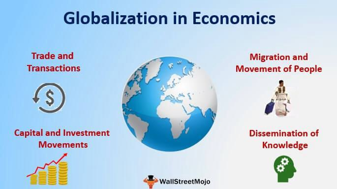

Globalization, economies of scale, economic growth, and algorithmic trading are distinct yet interconnected phenomena that collectively shape modern economies and influence business strategies worldwide. Globalization has fundamentally reshaped the economic landscape by removing trade barriers, promoting international collaboration, and fostering technology transfer, enabling businesses to expand their operations beyond national borders. This expansive reach contributes to economies of scale, where increased production results in lower per-unit costs, thus enhancing business efficiency. As companies leverage larger markets and diverse supply chains, they can optimize their production processes and spread fixed costs over a more extensive output.

The interaction between globalization and technological advancements, particularly algorithmic trading, has further amplified these effects. Algorithmic trading utilizes complex algorithms and high-speed data processing to make rapid trading decisions in financial markets. This technology enhances market efficiency by reducing transaction costs and increasing liquidity, thereby supporting economic growth. However, the interconnectedness of these factors also presents significant challenges. Global markets face heightened volatility, partly due to the rapid pace and scale at which algorithmic trading operations occur, which can lead to significant market fluctuations.

Moreover, while globalization and economies of scale can drive economic growth, they can also exacerbate economic disparities. The benefits are not uniformly distributed, leading to economic and social disparities across different regions and sectors. Businesses, therefore, must navigate these complexities by adopting strategies that balance efficiency with agility, ensuring not only profitability but also resilience in a rapidly changing global environment.

As the global economy continues to evolve, businesses are increasingly called upon to adopt sustainable growth strategies. By embracing technological advancements while implementing robust risk management frameworks, companies can thrive in this dynamic landscape. Understanding these interactions is crucial for crafting effective strategies that harness the opportunities presented by globalization and technology, while also managing the inherent risks and challenges.

## Table of Contents

## Understanding Economies of Scale in a Globalized World

Economies of scale are a fundamental aspect of modern business operations, characterized by the cost advantages that companies experience as they increase their production levels. The primary mechanism through which these advantages manifest is the reduction in per-unit production costs. As firms expand production, they benefit from spreading their fixed costs—such as investment in infrastructure and technology—over a larger number of units, thereby reducing the average cost per unit.

Globalization significantly enhances the potential for economies of scale by expanding market reach and facilitating access to more efficient supply chains. It allows companies to tap into a larger consumer base and optimize their production processes across borders. This international integration enables firms to access cheaper raw materials, labor, and components, reducing production costs and encouraging specialization. For example, a company might produce components in a country where materials and labor are inexpensive and assemble the final product closer to its market, capitalizing on both local advantages and global distribution efficiency.

The synergy between globalization and economies of scale promotes economic growth by intensifying competition and fostering innovation. As companies strive to capture more significant market segments, they are driven to enhance product quality and invest in research and development. This competitive environment pushes businesses to innovate continuously, leading to advancements in technology and processes that benefit consumers through superior products and services at lower prices.

While economies of scale offer businesses substantial benefits, they also present challenges, particularly concerning the potential for diminishing returns and diseconomies of scale. As companies grow and expand operations across diverse geographies without optimizing their processes, they may encounter inefficiencies. These can arise from managerial complexities, communication barriers, and logistical constraints, resulting in increased average costs. Further expansion might lead to oversaturation of markets and resource misallocation, harming the very efficiencies that companies sought to achieve.

In conclusion, understanding the dynamics of economies of scale in the context of globalization is crucial for businesses aiming to optimize their operations and maintain competitive advantage. By efficiently managing production and leveraging global integration, firms can realize substantial cost savings and drive economic growth, though they must remain vigilant to avoid the pitfalls associated with over-expansion.

## The Role of Algorithmic Trading in Economic Growth and Efficiency

Algorithmic trading, which involves using computer algorithms to execute trades based on predetermined criteria, represents a significant evolution in the operation of financial markets. By automating the trading process, [algorithmic trading](/wiki/algorithmic-trading) improves market efficiency, lowers transaction costs, and enhances [liquidity](/wiki/liquidity-risk-premium). These improvements arise from the capability of algorithms to analyze vast amounts of data and execute trades at speeds much faster than human traders could achieve. The reduction in transaction costs is primarily due to the elimination of manual errors and the high-speed execution that allows traders to capitalize on fleeting market opportunities.

Furthermore, algorithmic trading contributes to the stabilization of financial markets by providing a constant source of liquidity. This liquidity is crucial for absorbing price shocks and maintaining orderly market conditions. As a result, capital costs can be lower, since investors are often rewarded with reduced risk premiums when markets are perceived as stable and efficient. This efficiency aligns with the fundamental principles of market economics, where increased liquidity generally corresponds to narrower bid-ask spreads and more robust price discovery mechanisms.

However, the integration of algorithmic trading into financial systems is accompanied by several challenges. One major concern is that algorithms, if not properly designed, can exacerbate market [volatility](/wiki/volatility-trading-strategies). For example, during periods of market stress, algorithmic strategies such as high-frequency trading might unintentionally trigger a cascade of rapid buy and sell orders, leading to significant price swings. This potential for increased volatility necessitates the implementation of sophisticated risk management strategies by businesses engaging in algorithmic trading.

Ethical concerns also emerge from the capability of algorithmic trading to manipulate market conditions. The speed and complexity of algorithms can sometimes lead to unfair advantages for firms with superior technology or resources, raising questions about market fairness. Moreover, instances of "flash crashes"—where markets plunge and recover within minutes—have underscored the susceptibility of financial systems to the unintended consequences of algorithmic trading.

To harness the efficiencies of algorithmic trading while minimizing its risks, businesses must implement comprehensive risk management frameworks. This includes stress-testing algorithms against a variety of market scenarios, deploying circuit breakers to prevent excessive volatility, and ensuring compliance with regulatory standards designed to maintain market integrity. Additionally, companies must continuously refine their algorithms to adapt to evolving market conditions and consumer behaviors.

In summary, algorithmic trading offers considerable potential benefits for economic growth and market efficiency by streamlining trading operations and fostering liquidity. However, these benefits are accompanied by challenges that require careful management. By striking a balance between leveraging technology and mitigating associated risks, businesses can optimize their financial operations within the framework of modern, automated market systems.

## Globalization’s Double-Edged Sword: Opportunities and Challenges

Globalization has significantly transformed the global landscape by opening up markets and enhancing productivity. However, it comes with its set of challenges. One of the primary economic issues is job displacement, where labor markets in certain sectors face upheaval as production moves to regions with lower costs. This shift often results in unemployment and economic instability in affected areas. Furthermore, globalization can exacerbate income disparity, as benefits tend to concentrate among skilled workers and capital owners, leaving unskilled labor behind.

To mitigate these impacts, companies can adopt strategies that leverage globalization for growth while concurrently addressing socio-economic repercussions. Initiatives such as job training programs can equip displaced workers with new skills tailored to the evolving market demands. Additionally, reshoring, or bringing back operations to the company's home country, can help alleviate some of the negative socio-economic impacts by creating jobs domestically.

Globalization plays a crucial role in diffusing technology and financial capital across borders. This dissemination facilitates productivity improvements worldwide, enabling countries to leapfrog stages of development through access to cutting-edge technologies and investments. Organizations benefit from increased efficiency and innovation, leading to enhanced competitive advantage.

Firms can optimize their globalization strategy by focusing on strategic resource allocation and fostering international partnerships. By aligning resources efficiently, companies can maximize productivity and profit while reducing costs. International partnerships offer access to new markets and resources, supporting sustainable growth. Through collaborative efforts, firms can share knowledge, technology, and expertise, effectively mitigating adverse effects associated with globalization, such as economic imbalances and inequality. 

These strategies not only enable companies to thrive in a globalized economy but also contribute positively to society by promoting inclusive economic growth.

## Strategies for Sustainable Growth amid Global Uncertainty

In the contemporary business environment defined by globalization and rapid technological changes, companies must adopt resilient and adaptable strategies to sustain growth while navigating uncertainties. These strategies need to address operational efficiency, market responsiveness, and corporate responsibility.

One of the primary strategies for sustainable growth is enhancing operational management to avoid diseconomies of scale. As businesses expand, maintaining an optimal operational scale is crucial to prevent inefficiencies that emerge from overly broad scaling. Continuous evaluation and optimization of production processes, supply chains, and employee allocation can help businesses maintain a lean and adaptable structure. Improved communication within and across international teams also aids in streamlining operations and ensuring swift adaptation to market demands.

Investing in technology is another crucial strategy. In a competitive global market, technology acts as a key enabler of efficiency and innovation. Companies that effectively integrate technology into their operations can improve product quality, reduce costs, and enhance customer experiences. For instance, using data analytics software can provide insights into consumer behaviors, enabling a company to tailor its products and marketing strategies accordingly.

Algorithmic trading, though primarily associated with financial markets, can be strategically utilized by companies to optimize financial operations. By automating trading processes based on algorithmically-driven insights, businesses can reduce transaction costs and improve market access. However, it is important to manage the inherent volatility risks associated with such technologies. This can be achieved by developing robust risk management frameworks that ensure these systems operate within pre-defined risk thresholds. Regular audits and updates to the underlying algorithms can further mitigate potential risks.

Continuous innovation and responsiveness to consumer behavior are essential for maintaining a competitive edge in the global market. Companies need to foster a culture of innovation, encouraging research and development activities that lead to new products and services. Staying attuned to consumer preferences and market trends enables businesses to adapt swiftly and effectively, ensuring their offerings remain relevant.

Finally, the integration of sustainability metrics and corporate social responsibility (CSR) initiatives positions companies to align growth with societal goals. In an age where consumers and investors are increasingly valuing ethical considerations, demonstrating a commitment to sustainable practices can enhance a company's reputation and appeal. Adoption of sustainability metrics allows businesses to track and improve their environmental and social impacts, while CSR initiatives can contribute to community engagement and positive brand perception.

In summary, to navigate the complexities of globalization and technology-driven change, companies must prioritize operational efficiency, technological investment, market innovation, and corporate responsibility. Building a strategy that balances these elements is critical to achieving sustainable growth amid uncertainty.

## Conclusion

Globalization, economies of scale, economic growth, and algorithmic trading form the intricate fabric of today's business environment. These elements, when understood in unison, provide businesses with the insight needed to develop robust strategies aimed at achieving sustainable growth and scalability. The profound effects of economic integration and technological advancement offer considerable benefits, such as improved efficiency, access to broader markets, and enhanced competitive advantages. However, these benefits necessitate meticulous management and strategic foresight to prevent and address associated challenges.

In this technological era, businesses must prioritize innovation and risk management while remaining committed to sustainability. Innovation drives progress and maintains a competitive edge, while robust risk management ensures that potential hazards do not undermine business stability. Moreover, embracing sustainability fosters not only environmental stewardship but also aligns with societal expectations, thus supporting long-term success.

To fully exploit the opportunities globalization and technology provide while overcoming their inherent challenges, businesses and policymakers must engage in ongoing research and adapt policies accordingly. This proactive approach ensures that economic growth is inclusive, benefiting not just individual companies, but society as a whole. The continuous evolution of these strategies is crucial for creating resilient economies capable of thriving in a rapidly changing global landscape.

## References & Further Reading

[1]: ["Capital in the Twenty-First Century"](https://www.hup.harvard.edu/books/9780674430006) by Thomas Piketty

[2]: Baldwin, R. (2016). ["The Great Convergence: Information Technology and the New Globalization."](https://www.jstor.org/stable/j.ctv24w655w) Harvard University Press.

[3]: ["The Wealth of Nations"](https://en.wikipedia.org/wiki/The_Wealth_of_Nations) by Adam Smith

[4]: Haldane, A. G. (2011). ["The Race to Zero."](https://www.bankofengland.co.uk/speech/2011/the-race-to-zero-speech-by-andy-haldane) Speech by the Executive Director at the International Economic Association Sixteenth World Congress in Beijing, China.

[5]: ["Firms, Contracts, and Financial Structure"](https://academic.oup.com/book/3631) by Oliver Hart

[6]: Acemoglu, Daron. (2002). ["Technical Change, Inequality, and the Labor Market"](https://www.aeaweb.org/articles?id=10.1257/0022051026976). Journal of Economic Literature, 40(1): 7-72.

[7]: Ghemawat, Pankaj. (2007). ["Redefining Global Strategy: Crossing Borders in a World Where Differences Still Matter."](https://www.hbsp.harvard.edu/product/10203-PDF-ENG) Harvard Business Review Press.