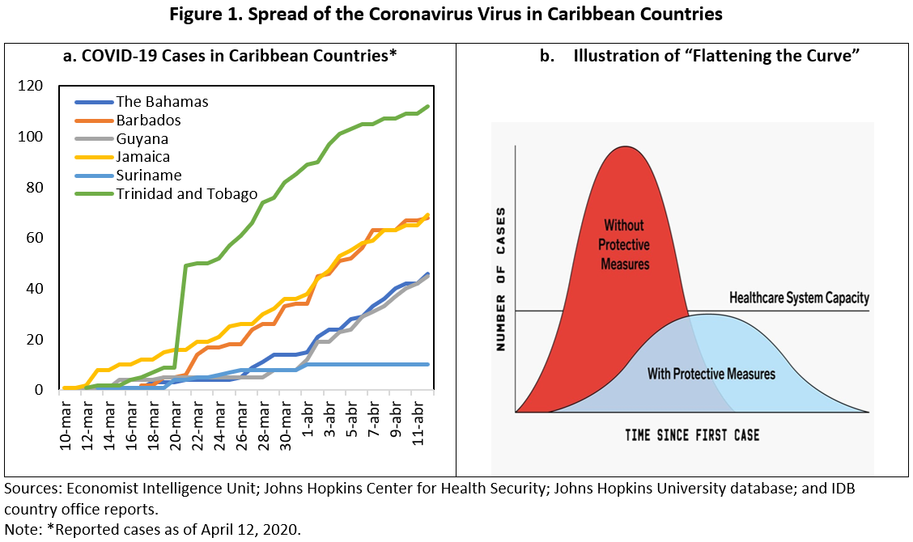

## Table of Contents

## What countries are included in the Caribbean region?

The Caribbean region includes many countries and territories. Some of the countries in the Caribbean are Cuba, Jamaica, Haiti, Dominican Republic, The Bahamas, and Barbados. These countries are known for their beautiful beaches and warm weather.

There are also smaller islands that are part of the Caribbean. These include Antigua and Barbuda, Dominica, Grenada, Saint Kitts and Nevis, Saint Lucia, Saint Vincent and the Grenadines, and Trinidad and Tobago. Each of these islands has its own unique culture and attractions.

In addition to these independent countries, the Caribbean region also includes territories like Puerto Rico, the U.S. Virgin Islands, and the British Virgin Islands. These territories are not independent countries but are still considered part of the Caribbean.

## What are the main economic activities in the Caribbean?

The main economic activities in the Caribbean revolve around tourism and agriculture. Tourism is very important because the Caribbean has beautiful beaches and warm weather. Many people from other countries come to visit and enjoy the sun, sea, and sand. This brings in a lot of money for hotels, restaurants, and other businesses that cater to tourists. Some popular tourist spots include Jamaica, the Bahamas, and Barbados.

Agriculture is also a key part of the Caribbean economy. Many islands grow crops like sugarcane, bananas, and coffee. These crops are often exported to other countries. Farming provides jobs for many people and helps to feed the local population. In some places, fishing is also important, with people catching fish and seafood to sell both locally and abroad.

In addition to tourism and agriculture, some Caribbean countries have other economic activities. For example, manufacturing and mining play a role in certain islands. Trinidad and Tobago, for instance, has a significant oil and gas industry. Services like banking and finance are also growing in places like the Bahamas and the Cayman Islands. Overall, the Caribbean economy is diverse, but tourism and agriculture remain the most widespread activities.

## How does tourism impact the economies of Caribbean countries?

Tourism is a big help to the economies of Caribbean countries. It brings in a lot of money because many people come to enjoy the beautiful beaches and warm weather. This money helps hotels, restaurants, and shops to do well. It also creates jobs for people who work in these places. When tourists spend money, it helps the whole economy grow. Countries like Jamaica, the Bahamas, and Barbados get a lot of their money from tourism.

But tourism can also cause problems. Sometimes, it can harm the environment because of too many people visiting. This can make the beaches and water less nice. Also, if a country relies too much on tourism, it can be risky. If fewer people come to visit, the economy can suffer. So, while tourism is good for bringing in money and creating jobs, it's important for Caribbean countries to take care of their environment and not depend only on tourists.

## What role does agriculture play in Caribbean economies?

Agriculture is very important for the economies of Caribbean countries. Many people in the Caribbean work on farms, growing crops like sugarcane, bananas, and coffee. These crops are sold to other countries, which brings in money. This money helps the local economy and gives jobs to many people. Farming also helps to feed the people who live in the Caribbean. Without agriculture, it would be hard for these countries to have enough food and money.

But agriculture in the Caribbean faces some challenges. The weather can be unpredictable, and sometimes there are big storms that can damage crops. Also, some countries rely a lot on just one or two crops, like sugarcane or bananas. If something happens to these crops, it can hurt the economy. So, while agriculture is a big help, it's important for Caribbean countries to try to grow different kinds of crops and find ways to protect their farms from bad weather.

## How significant is the service sector in the Caribbean?

The service sector is very important in the Caribbean. It includes things like tourism, banking, and other services that people need. Many Caribbean countries make a lot of money from tourists who come to enjoy the beaches and warm weather. This helps hotels, restaurants, and shops to do well. Also, some places like the Bahamas and the Cayman Islands have big banking and finance businesses. These services bring in money and create jobs for people who live there.

But the service sector can also have problems. If too many people rely on tourism, it can be risky. If fewer tourists come, the economy can suffer. Also, the service sector needs to be careful not to harm the environment. Too many tourists can damage the beautiful beaches and water. So, while the service sector is a big help to the Caribbean, it's important to find ways to keep it strong and protect the environment at the same time.

## What are the major challenges facing Caribbean economies?

Caribbean economies face many challenges. One big problem is that many countries rely a lot on tourism and agriculture. If fewer tourists come or if bad weather hurts the crops, it can cause big problems for the economy. This makes it hard for these countries to have steady money coming in. Also, some islands depend on just one or two crops, like sugarcane or bananas. If something goes wrong with these crops, it can hurt the whole economy.

Another challenge is the impact of natural disasters. Hurricanes and storms can cause a lot of damage to buildings, farms, and the environment. It can take a long time and a lot of money to fix everything. This makes it hard for the economy to grow and for people to feel safe. Climate change is making these storms even worse, which adds to the problem.

Lastly, the service sector, which includes things like banking and finance, also faces issues. While it brings in money and creates jobs, it can be risky if a country relies too much on it. If there are fewer tourists or if there are problems in the global economy, it can hurt the service sector. Also, too many tourists can harm the environment, which is a big problem for the Caribbean's beautiful beaches and water.

## How do Caribbean countries engage in international trade?

Caribbean countries engage in international trade by exporting goods like sugarcane, bananas, and coffee to other countries. These crops are important because they bring in money that helps the local economy. For example, Jamaica and the Dominican Republic are known for their sugarcane and bananas. They sell these to places like the United States and Europe. Some islands also export things like rum and tobacco. This trade helps create jobs and supports the people who live there.

In addition to exporting goods, Caribbean countries also import things they need. They buy food, machinery, and other products from countries like the United States, China, and Europe. This helps them get things they can't grow or make themselves. For example, they might import cars, electronics, and medicines. Trading with other countries is important for the Caribbean because it helps them have the things they need and also sell what they grow or make.

Some Caribbean countries also take part in international trade through services. Places like the Bahamas and the Cayman Islands have big banking and finance businesses. They provide services to people and companies from other countries. This brings in money and helps their economies grow. Overall, international trade is very important for Caribbean countries because it helps them earn money, create jobs, and get the things they need.

## What is the impact of natural disasters on Caribbean economies?

Natural disasters like hurricanes and storms have a big impact on Caribbean economies. These disasters can destroy buildings, farms, and roads. When this happens, it costs a lot of money to fix everything. People might lose their homes and jobs, which makes it hard for them to earn money. Farms can lose their crops, which means they can't sell them and make money. This can hurt the whole economy because it takes a long time to recover.

Climate change is making these natural disasters even worse. Storms are getting stronger and more frequent, which means the Caribbean faces more damage. This makes it harder for the economy to grow and for people to feel safe. Governments have to spend a lot of money to help people and rebuild after a disaster. This money could be used for other things like schools and hospitals. So, natural disasters are a big problem for Caribbean economies, and it's important to find ways to protect against them.

## How do remittances affect the economies of Caribbean countries?

Remittances are money that people who live and work in other countries send back to their families in the Caribbean. This money is very important for many families because it helps them pay for things like food, school, and medicine. In some Caribbean countries, remittances make up a big part of the money that comes into the economy. For example, in places like Haiti and Jamaica, remittances can be a big help to many people.

But remittances can also have some problems. If a country relies too much on money from other countries, it can be risky. If something happens and people can't send as much money home, it can hurt the economy. Also, if people depend a lot on remittances, they might not try to find jobs at home. This can make it harder for the local economy to grow. So, while remittances are a big help, it's important for Caribbean countries to find other ways to make money too.

## What economic policies have been implemented to foster growth in the Caribbean?

Caribbean countries have tried different economic policies to help their economies grow. One big policy is to make it easier for businesses to start and grow. They do this by making rules simpler and taxes lower. This can bring in more companies and create more jobs. Another policy is to invest in things like schools and roads. Better education and good roads can help people learn new skills and get to work easier. This can make the economy stronger.

Another important policy is to try to grow different kinds of crops and not just rely on one or two. This can help protect the economy if something goes wrong with one crop. Some countries also try to bring in more tourists by making their beaches and attractions better. This can bring in more money and create more jobs. But they need to be careful not to harm the environment while doing this.

Lastly, some Caribbean countries have policies to work with other countries. They make trade deals to sell their goods and buy things they need. This can help the economy grow by making it easier to trade. Also, some countries try to get more money from services like banking and finance. This can bring in more money and create more jobs. But it's important not to rely too much on just one thing, so they try to have a mix of different ways to make money.

## How does the Caribbean Community (CARICOM) influence regional economic development?

The Caribbean Community, or CARICOM, helps the countries in the Caribbean work together to make their economies stronger. They do this by making it easier for these countries to trade with each other. For example, they can sell their goods to other CARICOM countries without paying big taxes. This helps businesses grow and creates more jobs. CARICOM also helps countries work together on big projects, like building better roads and schools, which can help the whole region.

Another way CARICOM influences economic development is by helping countries talk to other parts of the world. They can make deals with countries outside the Caribbean to sell their goods and buy things they need. This can bring in more money and help the economy grow. CARICOM also works to make sure that all the countries in the region have a say in big decisions, so everyone can benefit. By working together, CARICOM helps make the Caribbean a stronger and more prosperous place.

## What are the prospects for sustainable economic development in the Caribbean?

The Caribbean has good chances for sustainable economic development if it focuses on balancing growth with taking care of the environment. Tourism is a big part of the economy, but it's important to make sure that too many tourists don't harm the beautiful beaches and water. By using eco-friendly practices, like building green hotels and protecting natural areas, the Caribbean can keep attracting visitors while keeping its environment healthy. Also, growing different kinds of crops instead of just relying on one or two can help protect the economy from bad weather and make farming more sustainable.

Another way to help the economy grow in a sustainable way is by investing in education and technology. If people in the Caribbean have better education, they can learn new skills and get better jobs. Using technology can also help businesses work better and reach more customers. This can create more jobs and make the economy stronger. Working together through groups like CARICOM can help the region share ideas and resources to make sustainable development easier. By focusing on these things, the Caribbean can have a strong and healthy economy for the future.

## References & Further Reading

[1]: Sweeney, J. (2021). ["The Economy of the Caribbean: Diversity Amidst Adversity."](https://scholar.google.com/citations?user=N-WE5KcAAAAJ) Journal of Latin American Studies, 53(1), 1-25.

[2]: Alleyne, D., & Francis, A. (2017). ["Economic Growth in the Caribbean: The Role of Diversification."](https://www.americanprogress.org/article/improving-public-safety-through-better-accountability-and-prevention/) United Nations ECLAC.

[3]: McLean, R. D., & Pontiff, J. (2016). ["Does Academic Research Destroy Stock Return Predictability?"](https://onlinelibrary.wiley.com/doi/abs/10.1111/jofi.12365) The Journal of Finance, 71(1), 5-32.

[4]: Lopez de Prado, M. (2018). ["Advances in Financial Machine Learning."](https://www.amazon.com/Advances-Financial-Machine-Learning-Marcos/dp/1119482089) Wiley Finance.

[5]: Beckford, G. (2020). ["Challenges and Opportunities of Financial Technology in the Caribbean."](https://www.researchgate.net/publication/347650380_Challenges_and_Trends_of_Financial_Technology_Fintech_A_Systematic_Literature_Review) Financial Stability Board.