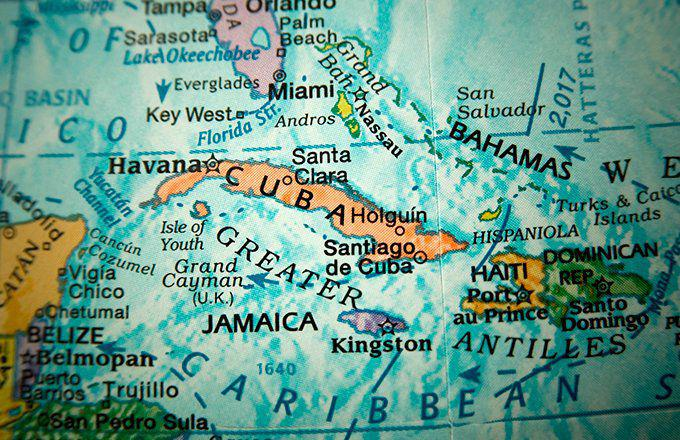

The Caribbean is a region celebrated for its breathtaking landscapes and vibrant cultures, attracting millions of tourists annually with its stunning beaches, lush rainforests, and rich historical heritage. This idyllic image, however, only scratches the surface of the Caribbean's economic significance. The region is home to several dynamic economies, each characterized by their unique blend of natural resources, strategic financial positioning, and capacity for innovation. Beyond tourism, which serves as a considerable economic driver, countries within the Caribbean are capitalizing on their diverse assets to foster growth and development.

The economic landscape of the Caribbean is marked by an impressive array of natural resources. Nations like Trinidad and Tobago have sustained their economies through extensive reserves of oil and natural gas, making them prominent figures in the petrochemical industry. Jamaica contributes substantially to global markets with its production of bauxite and alumina. Meanwhile, the Cayman Islands leverage their status as a global financial services hub, attracting international capital due to favorable tax policies.

A pivotal development in recent years is the introduction of algorithmic trading technologies within Caribbean financial markets. This advancement promises to transform the financial landscape by enhancing trading efficiency and decision-making processes. Countries with established stock exchanges, such as Jamaica, are beginning to integrate algorithmic trading strategies, positioning themselves to harness these technologies for economic advancement. 

As the Caribbean navigates through these economic channels, exploring its key economic players and their utilization of emergent technologies becomes imperative. This article aims to provide insight into the major economies of the Caribbean, how they interact with the burgeoning sphere of algorithmic trading, and the potential for future growth.

## Table of Contents

## Overview of Major Caribbean Economies

The Caribbean region encompasses a multitude of islands, each contributing to a mosaic of diverse economies. Among these, Trinidad and Tobago, Jamaica, and the Cayman Islands stand out as significant players, each with unique economic strengths.

Trinidad and Tobago are classified as a high-income country within the region, largely due to the prominence of its petrochemical industry, which significantly influences its Gross Domestic Product (GDP). The country capitalizes on its abundant oil and natural gas reserves, positioning itself as a critical supplier within the Caribbean and beyond. These natural resources form the backbone of its economy, underscoring the nation's reliance on energy exports as a primary economic driver.

Jamaica, known globally for its rich cultural contributions, including reggae music, is also a formidable force in the mining sector. It is a leading global producer of bauxite, a primary source of aluminum, which has entrenched itself as a cornerstone of the island's economy. The country's economic narrative is one of diversification, supported by sectors such as tourism and agriculture, reducing its historical dependence on a single industry. This multifaceted approach has augmented Jamaica's economic robustness, making it an attractive hub for investment.

The Cayman Islands distinguish themselves as a major financial services hub, recognized for their appealing tax policies, including a 0% tax rate on income and capital gains. This favorable fiscal environment has attracted a myriad of global financial institutions and individuals seeking efficient tax strategies, solidifying the islands' status as a key offshore financial center. Despite global challenges aimed at tax standardization, the Cayman Islands continue to play a crucial role in international finance.

An examination of these economies highlights their substantial reliance on natural resources, financial services, and international trade. Each country's economic structure exemplifies distinct strengths while contributing to the overall vitality of the Caribbean region. The intersection of these elements demonstrates the integral role of natural endowments and strategic economic policies in shaping the economic landscape of the Caribbean.

## Trinidad and Tobago: A Petrochemical Powerhouse

Trinidad and Tobago, a twin-island country located in the southern Caribbean, is recognized as a leading petrochemical powerhouse. Its robust economic framework is significantly supported by its vast reserves of oil and natural gas, which have propelled the country to achieve a high GDP per capita. These natural resources have been systematically harnessed to create a thriving energy sector that positions Trinidad and Tobago as a critical energy supplier within the Caribbean and beyond.

The discovery of oil in the early 20th century marked a turning point for Trinidad and Tobago, transforming it into a key energy hub. As of recent estimates, the country ranks amongst the top natural gas producers globally, a [factor](/wiki/factor-investing) that underpins its economic stability and growth. The petrochemical industry, encompassing production of ammonia, methanol, and urea, plays a vital role in the nation’s export portfolio, contributing substantially to foreign exchange earnings.

Trinidad and Tobago's membership in the Caribbean Community (CARICOM) underscores its strategic import in facilitating and enhancing intra-regional trade. As one of the most industrialized countries within CARICOM, Trinidad and Tobago is integral in providing energy resources and expertise, supporting the economic development of its Caribbean neighbors.

Over the past decade, the economic resilience of Trinidad and Tobago can be attributed to effective resource management strategies. The government's strategic initiatives on sustainability have involved optimizing the oil and gas sectors to counteract economic vulnerabilities associated with volatile global energy prices. Moreover, investments in downstream industries have added value to the country's natural resources, further strengthening its economic base.

The government's policies have consistently pushed for diversification within the energy sector, aiming to reduce dependency on volatile commodity markets and enhance economic stability. This is reinforced by a sustained focus on developing alternative energy sources and investing in infrastructure that supports these initiatives.

Overall, Trinidad and Tobago stands as a model for efficiently leveraging natural resources to build a thriving economy. Successes in resource management and strategic planning continue to facilitate its role as a pivotal economic player in the Caribbean.

## Jamaica: From Reggae to Minerals

Jamaica, an island nation celebrated globally for its rich cultural heritage, particularly its reggae music, extends its acclaim to the mining sector as a leading producer of bauxite. This mineral, a primary source of aluminum, plays a significant role in Jamaica's economy, positioning the nation among the top bauxite producers worldwide. The bauxite and alumina industry remains vital, contributing substantially to the country's GDP and employment.

The Jamaica Stock Exchange (JSE) has significantly enhanced the island's investment appeal since 2015. Marked by a steady performance, the JSE has been recognized internationally and named as one of the best-performing stock exchanges in the world. This upsurge is attributed to a proliferation of initial public offerings (IPOs), increased investor confidence, and robust economic fundamentals. The JSE's gains have attracted substantial foreign investment, solidifying its reputation as a lucrative investment destination.

Economic reforms backed by international financial entities have been pivotal in fostering growth across Jamaica's sectors. These reforms have focused on fiscal consolidation, reducing public debt, and regulatory improvements, which have strengthened the financial system. Diversification beyond mining into tourism, agriculture, and logistics has been essential for sustainable development. Tourism continues to be a cornerstone of the economy, drawing millions of visitors annually and generating significant revenue and employment.

Agriculture remains a critical sector, with continued foreign direct investment aiding modernization and expansion efforts. There is a growing focus on non-traditional exports such as coffee, cocoa, and tropical fruits, which are gaining traction in global markets.

Jamaica's strategic economic measures and diversification efforts, supported by global financial institutions, underpin its growth trajectory. Through judicious management of its natural resources and enhancement of its financial infrastructure, Jamaica continues to be an attractive hub for investment while sustaining its cultural and natural legacy.

## The Cayman Islands: A Financial Services Giant

The Cayman Islands, strategically located in the Western Caribbean Sea, have established a formidable reputation as a premier global financial services hub. Known for offering a 0% tax rate on income and capital gains, the Cayman Islands present an attractive environment for corporations and high-net-worth individuals aiming to optimize their tax positions. This tax-neutral foundation supports various financial activities, making the islands an epicenter for banking, hedge funds, and insurance sectors.

As of 2023, the Cayman Islands host over 10,000 mutual funds and hedge funds, managing an estimated $6 trillion in assets (Monetary Authority of the Cayman Islands). This vibrant fund management sector is supported by a sophisticated infrastructure, including approximately 90,000 registered companies and more than 600 banks and trust companies. Such dense financial activity can be attributed to a legal framework that emphasizes investor confidence and robust regulatory measures designed to balance flexibility with financial oversight.

Despite ongoing global efforts towards tax standardization, including initiatives by the Organization for Economic Co-operation and Development (OECD) to address tax haven concerns, the Cayman Islands maintain a critical role in offshore financial markets. This resilience is partly due to compliance with international standards for financial transparency, such as the Common Reporting Standard (CRS) and adherence to anti-money laundering (AML) protocols. These measures ensure the Cayman Islands remain competitive by instilling trust among global investors while preserving financial privacy—a crucial characteristic of offshore jurisdictions.

The economic structure of the Cayman Islands is heavily reliant on their financial services, which constitutes approximately 55% of GDP (Cayman Islands Economics and Statistics Office). This sector's substantial contribution underlines the islands' significance, despite their small size. Furthermore, the symbiotic relationship between legal expertise and financial acumen supports constant regulatory evolution, allowing the jurisdiction to adapt to the dynamic global economic landscape continually.

Looking forward, the Cayman Islands face the dual challenge of maintaining their competitive tax advantage while addressing growing international scrutiny regarding tax practices. Their ability to innovate within regulatory frameworks while preserving client confidentiality will be pivotal in maintaining their status as a leading financial services giant. The careful navigation of these aspects will be essential in upholding the islands' reputation as a jurisdiction of choice for financial services.

## Dominican Republic: Diverse Trade and Remittances

The Dominican Republic stands as the Caribbean's economic heavyweight, boasting the largest GDP in the region. This economic prowess is primarily driven by robust trade relations and substantial remittance inflows from abroad. The Dominican Republic's strategic trading partnerships with major economies, including the United States and China, play a significant role in augmenting its tourism revenues, which are a critical component of the country's GDP.

Trade between the Dominican Republic and the United States is particularly noteworthy, as the U.S. is one of the Dominican Republic's largest trading partners. This relationship is fortified through agreements such as the Dominican Republic-Central America Free Trade Agreement (CAFTA-DR), which facilitates free trade and enhances market access for both nations. Additionally, trade linkages with China have strengthened over time, reflecting the Dominican Republic's efforts to diversify its international trade portfolio.

Diversification of exports contributes to the Dominican Republic's economic resilience. The nation's export profile encompasses traditional agricultural products like sugar and cigars, along with a growing array of manufactured goods. Sugar, a staple of the Dominican agricultural sector, remains a crucial export commodity, despite fluctuations in global sugar prices. Cigars also represent a significant portion of exports, with the Dominican Republic known for producing some of the world's finest cigars, reinforcing its global market presence.

Remittance inflows further bolster the Dominican economy. As a vital source of foreign exchange, remittances alleviate poverty and support domestic consumption. The Dominican diaspora, particularly in the United States, sends billions of dollars back home annually, aiding economic stability and growth.

The symbiotic relationship between trade, remittances, and tourism underscores the Dominican Republic's economic landscape. Continuous investment in these sectors, along with strategic expansion into new markets, ensures that the Dominican Republic remains a key player in the Caribbean and a model of economic growth in the region.

## Algorithmic Trading in the Caribbean

Algorithmic trading is gaining traction within Caribbean financial markets, reflecting a global trend where computer algorithms are employed to make trading decisions at speeds and frequencies that far exceed human capabilities. This trading strategy is characterized by the use of complex mathematical formulas and lightning-fast market data analysis, enabling investors to execute orders more efficiently and with greater precision.

One of the main benefits of [algorithmic trading](/wiki/algorithmic-trading) is its ability to navigate market complexities. By utilizing historical financial data and real-time analytics, algorithms can predict trends and execute trades at optimal prices. This enhances decision-making for investors, allowing them to capitalize on market opportunities and mitigate potential losses. For instance, algorithms can swiftly analyze the impact of news events or sudden market shifts, adjusting strategies accordingly.

In Caribbean stock exchanges, such as the Jamaica Stock Exchange (JSE), algorithmic trading's influence is becoming increasingly prominent. The JSE, known for its robust performance, has been integrating new technologies to accommodate the growing interest in algorithmic strategies. This integration involves enhancing technical infrastructure to support high-frequency transactions and bolstering cybersecurity measures to protect against potential threats associated with automated trading systems.

Algorithmic trading also opens avenues for improved [liquidity](/wiki/liquidity-risk-premium) in Caribbean markets. By reducing transaction costs and minimizing market impact, algorithms enable smoother and more consistent trading flows. This is particularly beneficial for Caribbean markets that may face liquidity constraints due to their size and the relative infrequency of trades compared to larger global exchanges.

As algorithmic trading continues to expand in the Caribbean, both opportunities and challenges arise. On the one hand, the adoption of such advanced technologies can increase the region's competitiveness by attracting international investors seeking efficient market engagement. On the other hand, this necessitates regulatory advancements to ensure transparency, fair trade practices, and protection against market manipulation.

Overall, the rise of algorithmic trading in the Caribbean represents a significant evolution in the region's financial landscape. By embracing this technology, Caribbean markets can enhance operational efficiency, provide better trading experiences for investors, and potentially strengthen their positions in the global financial ecosystem.

## Opportunities and Challenges

Algorithmic trading presents significant potential for transforming Caribbean economies, yet the alignment of regulatory frameworks to protect investors is imperative. Many financial markets in the Caribbean have traditionally operated under regulatory systems designed for manual trading practices, which may not fully address the nuances of algorithmic trading. Algorithms can execute trades at high speeds and volumes, raising concerns about market stability and potential systemic risks. As such, Caribbean regulators must develop comprehensive policies that consider these unique attributes to ensure fairness and transparency.

One of the primary challenges of integrating algorithmic trading into the Caribbean financial markets is the development of robust technical infrastructure. Many Caribbean nations may not have the advanced technological frameworks necessary to support the high-frequency trading demands inherent in algorithmic systems. Investment in state-of-the-art trading platforms, data centers, and reliable network infrastructure is crucial. These components are essential to handle the rapid execution of trades and the vast amounts of data processed in algorithmic trading strategies.

Simultaneously, the cultivation of local talent is equally important. This involves creating educational and professional programs to raise a workforce skilled in fields such as quantitative finance, data science, and computer programming. A proficient talent pool can drive innovation in trading technologies and practices, helping Caribbean nations maintain competitiveness in global markets.

The convergence of finance and technology represents a critical growth opportunity for Caribbean economies. It introduces efficiencies and opens new markets for investors while promoting economic diversification beyond traditional sectors like tourism and primary commodities. Algorithmic trading, when properly regulated and supported by suitable infrastructure and talent, can significantly enhance market liquidity, reduce transaction costs, and provide investors with improved trading experiences.

Strategic planning and coordinated efforts among Caribbean nations to strengthen regulatory frameworks, infrastructure, and workforce capabilities are pivotal. These measures will allow the region to fully capitalize on the benefits of algorithmic trading, positioning Caribbean financial markets as resilient and forward-looking participants in the global economy.

## Conclusion

The Caribbean's economies are not only lush with cultural richness and natural resources but are also gaining traction as significant players in the global financial landscape. The integration of modern technologies, notably algorithmic trading, into the financial sectors of these island nations opens new avenues for economic growth and stability. As algorithmic trading continues to gain prominence, its ability to enhance market efficiency, increase trading speeds, and provide better decision-making tools can serve as a formidable catalyst for economic advancement.

Strategic planning is pivotal for Caribbean nations aiming to capitalize on these technological advancements. Investments in modern financial infrastructure, human capital development, and regulatory frameworks tailored to accommodate these innovations are crucial. Such strategic investments ensure that the potential advantages of algorithmic trading are fully harnessed, aligning with the broader economic objectives of these countries.

Moreover, embracing these technological changes can help Caribbean economies mitigate traditional vulnerabilities linked to global economic fluctuations, such as dependence on tourism and natural resources. By diversifying their economic portfolios through technology-driven financial strategies, Caribbean countries can achieve more stable and sustained economic growth trajectories. This proactive approach positions them not only as scenic tourist destinations but also as robust and innovative participants in the global economic arena, thus securing their economic futures amidst a rapidly evolving global landscape.

## References & Further Reading

[1]: Sweeney, J. (2021). ["The Economy of the Caribbean: Diversity Amidst Adversity."](https://scholar.google.com/citations?user=N-WE5KcAAAAJ) Journal of Latin American Studies, 53(1), 1-25.

[2]: Alleyne, D., & Francis, A. (2017). ["Economic Growth in the Caribbean: The Role of Diversification."](https://www.americanprogress.org/article/improving-public-safety-through-better-accountability-and-prevention/) United Nations ECLAC.

[3]: McLean, R. D., & Pontiff, J. (2016). ["Does Academic Research Destroy Stock Return Predictability?"](https://onlinelibrary.wiley.com/doi/abs/10.1111/jofi.12365) The Journal of Finance, 71(1), 5-32.

[4]: Lopez de Prado, M. (2018). ["Advances in Financial Machine Learning."](https://www.amazon.com/Advances-Financial-Machine-Learning-Marcos/dp/1119482089) Wiley Finance.

[5]: Beckford, G. (2020). ["Challenges and Opportunities of Financial Technology in the Caribbean."](https://www.researchgate.net/publication/347650380_Challenges_and_Trends_of_Financial_Technology_Fintech_A_Systematic_Literature_Review) Financial Stability Board.