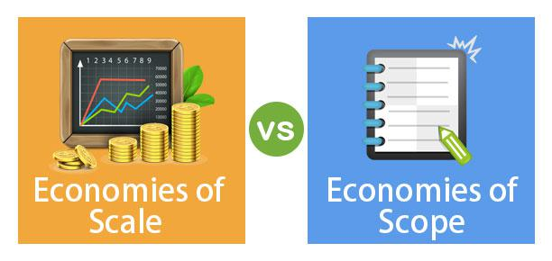

In today's competitive business environment, understanding strategic advantages such as economies of scale and economies of scope is crucial for gaining and maintaining a competitive edge. Economies of scale refer to the cost advantages that firms experience when production becomes efficient, as the cost per unit of output decreases with an increase in scale. This principle is fundamental for traditional industries where mass production and extensive distribution networks are key to reducing costs and increasing profitability.

Similarly, economies of scope occur when companies achieve cost efficiencies by producing a variety of goods together, sharing common processes or inputs. This diversification allows businesses to spread overhead costs across multiple products, enhancing operational efficiency and reducing risk exposure. These principles not only pertain to large-scale manufacturing but also revolutionize modern sectors such as algorithmic trading.



Algorithmic trading, a technology-driven sector, benefits significantly from economies of scale as trading firms can lower transaction costs through high-frequency trading and large-volume transactions. Additionally, economies of scope enable these firms to leverage shared technological platforms and data analytics across multiple asset classes and markets, optimizing their trading strategies and enhancing profitability. 

This article examines how these economic principles apply both to traditional business strategy and the advanced landscape of algorithmic trading, emphasizing their importance in navigating today's rapidly evolving markets.

## Table of Contents

## Understanding Economies of Scale

Economies of scale represent a fundamental concept in economic and business strategy, signifying the cost advantages that companies acquire by increasing their scale of operation. The principal benefit is that as a firm's production enlarges, the average cost per unit of output generally decreases. This phenomenon occurs due to the distribution of fixed costs over a larger quantity of goods, leading to a reduction in the variable cost component per unit. As businesses expand their production capacity, they can better optimize resource utilization, negotiate lower input costs through bulk purchasing, and improve production efficiency.

Mathematically, economies of scale can be described by the cost function $C(q)$, where $C$ represents the total cost and $q$ the quantity produced. As a firm increases $q$, the average cost $AC$, where $AC = \frac{C(q)}{q}$, tends to decrease. This decline in average cost underscores the competitive advantage enjoyed by large-scale producers.

In the manufacturing industry, for example, companies that produce automobiles can invest in highly specialized equipment that automates production lines. As the [volume](/wiki/volume-trading-strategy) of cars produced increases, the significant initial investment in machinery becomes more cost-effective, leading to a lower average cost per vehicle. Similarly, in the technology sector, as software companies scale up their user base, the cost of developing and maintaining the software is spread across more users, resulting in a reduced cost per user.

Retail giants like Walmart exemplify economies of scale by leveraging their extensive network to negotiate favorable terms with suppliers, thereby reducing the cost of goods sold. This allows them to offer competitive pricing, attracting more customers and further enhancing their market positioning.

To illustrate this concept further, consider the production of electronic devices. A company producing a small batch of gadgets might have significantly higher costs per unit due to setup and production line adjustments. However, as production scales up, these fixed costs are amortized over a larger number of units, thus reducing the overall cost per gadget.

Python can be used to model economies of scale with a simple simulation:

```python
import numpy as np
import matplotlib.pyplot as plt

# Define quantity range and cost formula
quantity = np.arange(1, 1001)
fixed_cost = 10000
variable_cost_per_unit = 5
total_cost = fixed_cost + variable_cost_per_unit * quantity
average_cost = total_cost / quantity

# Plotting the average cost curve
plt.figure(figsize=(10, 6))
plt.plot(quantity, average_cost, label='Average Cost per Unit')
plt.xlabel('Quantity Produced')
plt.ylabel('Average Cost')
plt.title('Economies of Scale')
plt.grid(True)
plt.legend()
plt.show()
```

In this code, as the quantity produced increases, the average cost per unit decreases, visually depicting economies of scale. Understanding these cost dynamics enables businesses to make informed strategic decisions about scaling operations, ultimately fostering a more competitive market presence.

## Exploring Economies of Scope

Economies of scope occur when a business can efficiently serve multiple markets with shared resources, thus reducing total production costs. Instead of focusing on large-scale production of a single product, a company leverages diversified offerings to optimize the use of its resources, cutting down the overall expenses associated with production and distribution.

A classic example of economies of scope can be observed in the operations of Procter & Gamble (P&G). This multinational consumer goods corporation produces a wide array of products such as cleaning [agents](/wiki/agents), personal care items, and health care goods. P&G exploits shared resources like distribution networks, marketing teams, and research and development departments to produce diverse products at lower incremental costs. By doing so, P&G spreads its fixed costs over various product lines, reducing the average cost per product.

Similarly, Amazon exemplifies the concept of economies of scope in the technology sector. Initially known as an online bookseller, Amazon expanded its offerings to include everything from electronics and apparel to cloud computing services through Amazon Web Services (AWS). The infrastructure and technology developed for its retail operations were adapted and expanded upon to provide cloud services, an entirely different product line. This strategic diversification allowed Amazon to utilize its extensive logistics and IT infrastructure across multiple segments, enhancing profitability without proportionate increases in costs.

Economies of scope can be formalized using the concept of cost functions. If $C(q_1, q_2)$ represents the total cost of producing quantities $q_1$ and $q_2$ of two different products, economies of scope exist if:

$$
C(q_1, 0) + C(0, q_2) > C(q_1, q_2)
$$

This inequality demonstrates that producing both products together is less costly than producing them separately.

For businesses, adopting economies of scope can involve strategic initiatives such as mergers, acquisitions, and joint ventures. Such strategies enable companies to share resources and capabilities, thus optimizing production processes across diverse offerings.

In conclusion, economies of scope present firms with a valuable strategic option to lower production costs and expand market reach. By using shared resources and capabilities efficiently, firms can enhance their competitiveness across multiple product lines without proportional increases in costs.

## Business Strategies Leveraging Economies

Leveraging economies of scale and scope is fundamental for businesses seeking competitive advantages in their industries. Economies of scale enable firms to reduce the cost per unit by increasing production, as larger volumes help spread fixed costs more broadly. Conversely, economies of scope allow companies to capitalize on cost efficiencies by diversifying their product lines or services, sharing resources across multiple outputs.

One prominent strategy for harnessing these economies is mergers and acquisitions (M&A). Through M&A, companies can rapidly expand their scale and scope by integrating the capabilities, resources, and markets of the acquired firms. For example, when a larger company acquires a smaller one, it can immediately enhance its production capabilities while reducing redundancy in operations and administrative functions. This integration helps spread costs and utilize shared resources more effectively, thereby achieving cost reductions.

Product diversification is another tactic, wherein businesses expand their product range to exploit shared production processes or inputs. By producing a wider variety of goods, firms can amortize their operational costs over multiple revenue streams. For instance, a car manufacturer might diversify into producing electric vehicles, utilizing the same industrial facilities and supply chains as those for traditional automobiles. This approach ensures that the fixed costs and research and development expenses are distributed over a larger number of products, optimizing overall resource utilization.

Technology integration forms a crucial component in realizing these economies. By adopting advanced technological solutions, businesses can streamline their processing and data management systems, leading to enhanced operational efficiencies. The deployment of integrated software platforms facilitates real-time data sharing across various departments, optimizing decision-making processes and reducing redundant efforts. An example of this can be seen in the implementation of enterprise resource planning (ERP) systems, which consolidate multiple business functions into a single platform, promoting cohesive operations.

In practice, a combination of these strategies can significantly enhance a company's ability to leverage economies of scale and scope. However, companies must carefully evaluate such strategies to ensure compatibility with their overarching business objectives and market conditions. While the potential benefits are substantial, thoughtful planning and execution are imperative to successfully capitalize on these economic principles.

## Algorithmic Trading and Economies

Algorithmic trading leverages economies of scale and scope to enhance operational efficiency and profitability. By utilizing shared technological platforms and extensive data analytics, trading firms can optimize their strategies across diverse market conditions. This optimization is primarily achieved through substantial investments in technology infrastructure that enables the processing of vast amounts of data and rapid execution of trades.

Economies of scale in [algorithmic trading](/wiki/algorithmic-trading) are evident when firms increase their volume of trades, which leads to a decrease in average costs per trade. This reduction is largely due to the fixed costs associated with infrastructure and software development being spread across a larger number of transactions. For instance, high-frequency trading firms often incur significant initial expenses for developing algorithms and securing high-speed connectivity. However, as the volume of transactions grows, these fixed costs become less burdensome on a per-trade basis. The following formula illustrates this concept:

$$
\text{Average Cost per Trade} = \frac{\text{Total Fixed Costs} + \text{Total Variable Costs}}{\text{Number of Trades}}
$$

As the number of trades increases, the impact of fixed costs diminishes, thereby lowering the average cost per trade.

Economies of scope arise in algorithmic trading when firms expand their trading activities across various asset classes using the same technological and analytical resources. By applying the same algorithms and data analytics to equities, [forex](/wiki/forex-system), commodities, and other financial instruments, firms can save on the costs associated with developing and maintaining separate systems for each market. This strategic diversification allows for cost-sharing and improved competitive positioning without a proportional increase in expenses.

A notable example is seen in the case of large investment banks and hedge funds, which have developed proprietary trading platforms capable of executing trades across multiple markets. These platforms utilize advanced [machine learning](/wiki/machine-learning) algorithms to analyze market trends and predict price movements, enabling them to execute effective trading strategies across different securities. As a result, these institutions can capitalize on market opportunities more efficiently than smaller firms with limited capabilities.

Moreover, leading firms in the algorithmic trading industry, such as Renaissance Technologies and Citadel, demonstrate the successful application of these economic principles. Renaissance Technologies, for instance, extensively uses quantitative models to analyze and execute trades, benefiting from its massive trade volumes and diversified market participation. Similarly, Citadel applies its technological prowess to trade a wide range of financial instruments, leveraging economies of scope to maintain competitive advantage while minimizing costs.

In summary, the application of economies of scale and scope in algorithmic trading not only enhances profitability but also fortifies the competitive position of trading firms in the global financial markets. Through strategic investments in technology and diversified market engagement, these firms can maximize efficiencies and achieve superior trade execution.

## Challenges and Considerations

While economies of scale and scope provide significant competitive advantages, they also present a variety of challenges that businesses must navigate carefully. These challenges often stem from integration complexity and regulatory compliance, both of which can pose significant obstacles to maximizing these economic benefits.

Integration complexity arises when companies attempt to scale their operations or diversify their product lines. Merging different processes, technologies, or cultures within an organization is inherently challenging. For instance, as businesses scale, they may face bottlenecks in their supply chains or encounter inefficiencies in production processes, potentially negating the cost benefits gained from increased scale. Additionally, the integration of new product lines or services, as seen in economies of scope, requires effective coordination and management to ensure that shared resources are utilized effectively. This complexity often necessitates robust project management and innovative technology solutions to streamline operations and maintain cost-effectiveness.

Regulatory compliance is another critical consideration when striving for economies of scale and scope. As businesses expand their market reach or diversify their offerings, they must adhere to various regulatory frameworks across different regions and sectors. This can include compliance with financial regulations, data protection laws, or industry-specific standards, each of which requires careful attention and resource allocation.

To address these challenges, companies must develop strategic plans that include risk management frameworks and compliance strategies. Effective risk management involves identifying potential risks associated with scaling or diversifying operations, such as over-reliance on specific suppliers or markets and developing contingency plans to mitigate these risks. Strategic planning also involves conducting thorough market and regulatory analyses to ensure compliance and avoid legal or financial repercussions.

In tech-driven industries like algorithmic trading, the challenges are further compounded by the need for advanced technological infrastructure and data analytics capabilities. Implementation of these strategies in such industries requires a forward-thinking approach that considers technological advancements and market dynamics. For instance, firms must invest in robust IT systems and data security measures to support scalable trading operations while ensuring regulatory compliance in highly regulated financial markets.

In summary, while economies of scale and scope provide pathways to cost reduction and competitive advantage, they require careful management of integration complexities and regulatory compliance. By strategically planning and addressing these challenges, businesses can sustainably implement these strategies across both traditional and tech-driven sectors, ensuring long-term success and adaptability in evolving markets.

## Conclusion

Economies of scale and scope present significant opportunities for organizations aiming to reduce operational costs and enhance their competitive edge. By leveraging these economic principles, businesses can achieve lower average costs per unit through increased production volume and efficiency, or through a diversified product and service portfolio that optimizes resource use.

In algorithmic trading, these strategies are particularly beneficial. Economies of scale allow trading firms to spread technological and personnel costs over a larger volume of transactions, leading to improved profit margins. Through automated trading systems and shared data analytics platforms, companies can achieve cost savings while maintaining high-speed, high-frequency trading operations across various markets. Economies of scope, on the other hand, enable trading firms to diversify their trading strategies and asset classes without proportionate increases in overhead, thereby capturing a more extensive market share and mitigating risks associated with portfolio concentration.

Looking forward, the adoption and integration of economies of scale and scope in both traditional and tech-driven sectors like algorithmic trading are anticipated to continue evolving. As technological advancements progress, organizations are expected to increasingly embrace these strategies. The future may witness an expansion in collaborative platforms enabling shared economies across industries, further reducing operational costs and enhancing adaptive capabilities. Moreover, with the ongoing digitization and globalization of markets, companies that strategically integrate these economic principles are likely to achieve superior performance and resilience in rapidly changing environments. As regulatory landscapes adjust in response to these shifts, effective management and compliance will become critical in sustaining these competitive advantages.

## References & Further Reading

[1]: Schumpeter, J. A. (1934). ["The Theory of Economic Development: An Inquiry into Profits, Capital, Credit, Interest, and the Business Cycle."](https://www.researchgate.net/publication/272398717_Schumpeter_JA_1934_2008_The_Theory_of_Economic_Development_An_Inquiry_into_Profits_Capital_Credit_Interest_and_the_Business_Cycle_New_Brunswick_USA_and_London_UK_Transaction_Publishers) Transaction Publishers.

[2]: Bain, J. S. (1956). ["Barriers to New Competition: Their Character and Consequences in Manufacturing Industries."](https://www.jstor.org/stable/1811245) Harvard University Press.

[3]: Lopez de Prado, M. (2018). ["Advances in Financial Machine Learning."](https://www.amazon.com/Advances-Financial-Machine-Learning-Marcos/dp/1119482089) Wiley.

[4]: Chandler, A. D. (1990). ["Scale and Scope: The Dynamics of Industrial Capitalism."](https://www.jstor.org/stable/j.ctvjz80xq) Harvard University Press.

[5]: Aronson, D. (2006). ["Evidence-Based Technical Analysis: Applying the Scientific Method and Statistical Inference to Trading Signals."](https://www.amazon.com/Evidence-Based-Technical-Analysis-Scientific-Statistical/dp/0470008741) Wiley.

[6]: Chan, E. P. (2008). ["Quantitative Trading: How to Build Your Own Algorithmic Trading Business."](https://github.com/ftvision/quant_trading_echan_book) Wiley.

[7]: Jansen, S. (2018). ["Machine Learning for Algorithmic Trading."](https://github.com/stefan-jansen/machine-learning-for-trading) Packt Publishing.