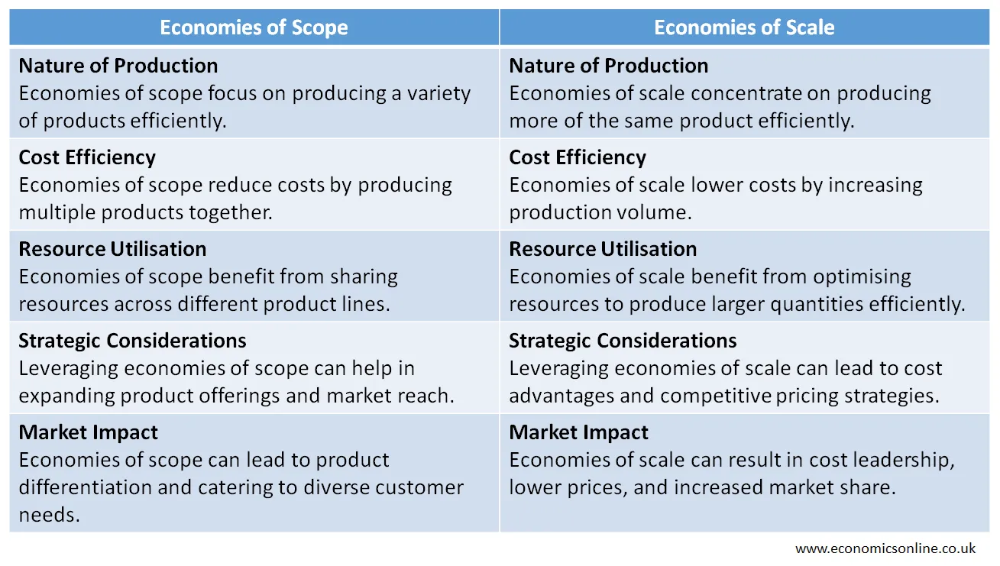

## Table of Contents

## What are economies of scope?

Economies of scope happen when a company can make more than one product or service at a lower cost than if they made each one separately. For example, if a company makes both cars and bikes, they can use the same factory and workers for both, which saves money. This is different from economies of scale, which is about making more of the same product to lower costs.

This idea is important because it helps companies grow and offer more things to customers without spending a lot more money. By sharing resources like factories, technology, and knowledge, companies can be more efficient. For instance, a food company might use the same ingredients to make different types of snacks, which helps them save on buying and storing those ingredients.

## What are economies of scale?

Economies of scale happen when a company makes more of the same thing and it costs less per item. Imagine you're baking cookies. If you bake one cookie, it might cost you a lot because you need to buy a small amount of ingredients and use your oven for a short time. But if you bake a hundred cookies, you can buy ingredients in bulk, which is cheaper, and use your oven for a longer time, which is more efficient. So, the cost per cookie goes down.

This idea is important for businesses because it helps them grow and make more profit. When companies get bigger, they can buy things in larger amounts, which often costs less. They can also use their machines and workers more efficiently. For example, a car factory can make cars faster and cheaper if it makes a lot of them instead of just a few. This way, the company can lower the price of their products or keep more money as profit.

## How do economies of scope differ from economies of scale?

Economies of scope and economies of scale are two ways companies can save money, but they work differently. Economies of scope happen when a company makes different products or services and can save money by sharing resources. For example, a company that makes both cars and bikes can use the same factory and workers for both, which saves money. It's about doing different things more efficiently by using the same resources.

On the other hand, economies of scale are about making more of the same thing to lower costs. If a company makes a lot of the same product, like cookies, it can buy ingredients in bulk, which is cheaper, and use machines and workers more efficiently. The more they make, the less it costs per item. It's about doing the same thing over and over again to save money.

So, economies of scope are about variety and sharing resources across different products, while economies of scale are about quantity and making more of the same product to reduce costs. Both help companies save money, but they focus on different ways to do it.

## Can you provide examples of economies of scope?

A big company that makes different types of food, like snacks and drinks, can use the same ingredients for both. For example, they might use the same corn to make corn chips and corn syrup for drinks. By using the same ingredients, they save money on buying and storing them. They also use the same machines and workers to make different products, which helps them be more efficient and save even more money.

Another example is a company that makes both cars and bikes. They can use the same factory to build both, which means they don't need to build a separate factory for bikes. The same workers can work on both cars and bikes, and the company can use the same tools and machines for both. This way, they save a lot of money because they don't have to spend extra on different factories, workers, and equipment.

## Can you provide examples of economies of scale?

A big cookie company can save money by making a lot of cookies at once. When they buy flour and sugar, they can buy big bags instead of small ones, which is cheaper. They can also use their big ovens to bake many cookies at the same time, which is more efficient than baking just a few. This way, the cost to make each cookie goes down because they are making so many.

A car factory can also use economies of scale. If they make a lot of cars, they can buy steel and other parts in big amounts, which costs less per piece. They can set up their assembly lines to work faster and better when making many cars. This means the cost to make each car goes down, and they can sell cars for less money or make more profit.

## What are the benefits of achieving economies of scope?

Achieving economies of scope helps companies save money by making different products using the same resources. For example, a company that makes snacks and drinks can use the same factory and workers for both. This means they don't need to spend extra money on separate factories or hiring more workers. By sharing resources, the company can lower the cost of making each product, which can lead to bigger profits or lower prices for customers.

Another benefit is that economies of scope allow companies to offer a wider range of products without a big increase in costs. This can make customers happier because they can buy more things from the same company. It also helps the company grow and stay competitive in the market. By using the same resources to make different products, the company can be more flexible and respond to what customers want more easily.

## What are the benefits of achieving economies of scale?

When a company achieves economies of scale, it can make more of the same product at a lower cost. This happens because the company can buy things like materials in big amounts, which is cheaper than buying small amounts. They can also use their machines and workers more efficiently when making a lot of the same thing. For example, a cookie company can buy big bags of flour and sugar, and use big ovens to bake many cookies at once. This way, the cost to make each cookie goes down, and the company can make more money or sell cookies for less.

Another benefit of economies of scale is that it helps companies grow and become more competitive. When a company can make things cheaper, it can offer lower prices to customers, which can attract more buyers. This can also help the company make more profit, which they can use to improve their products or expand their business. For example, a car factory that makes a lot of cars can sell them for less money than a smaller factory, which can help them sell more cars and grow their business.

## How can a business measure its economies of scope?

A business can measure its economies of scope by comparing the total cost of making different products together to the cost of making each product separately. For example, if a company makes both cars and bikes, they can look at how much it costs to use the same factory and workers for both compared to having separate factories and teams. If the total cost is lower when making both together, that shows they have economies of scope.

Another way to measure economies of scope is by looking at the savings in shared resources like ingredients, technology, and knowledge. A food company might use the same corn to make snacks and drinks. By calculating how much they save on buying and storing corn, they can see if making different products together is more cost-effective. If the savings are significant, it means the company is benefiting from economies of scope.

## How can a business measure its economies of scale?

A business can measure its economies of scale by looking at how the cost per unit of a product changes when they make more of it. For example, if a company makes cookies, they can compare the cost of making 100 cookies to the cost of making 1,000 cookies. If the cost per cookie goes down as they make more, that shows they have economies of scale. They can do this by dividing the total cost of production by the number of units made to find the average cost per unit.

Another way to measure economies of scale is by looking at how efficiently the company uses its resources when making more of the same product. If a car factory can use its machines and workers better when making a lot of cars, it means they are saving money per car. The company can track how much they spend on materials, labor, and other costs, and see if these costs go down as they increase production. If they do, it's a sign that the company is benefiting from economies of scale.

## What are the challenges in achieving economies of scope?

One big challenge in achieving economies of scope is managing different products at the same time. When a company makes different things, like cars and bikes, they need to make sure that making one doesn't slow down the other. They need good planning and organization to use the same factory and workers for both without causing problems. If they don't do this well, it can actually cost more money instead of saving it.

Another challenge is keeping the quality of all products high. When a company uses the same resources for different products, they need to make sure that the quality doesn't go down. For example, if a food company uses the same ingredients for snacks and drinks, they need to make sure that both taste good and are safe to eat. If the quality suffers, customers might not want to buy the products, and the company won't save money or make more profit.

## What are the challenges in achieving economies of scale?

One challenge in achieving economies of scale is the need for a lot of money upfront. When a company wants to make more of the same product to save money, they often need to buy more machines or bigger factories. This costs a lot of money at first, and if the company doesn't have enough, they might not be able to grow and save money in the long run.

Another challenge is managing a bigger operation. When a company makes a lot more of the same thing, they need to keep everything running smoothly. This can be hard because there are more workers, more machines, and more things to keep track of. If something goes wrong, like a machine breaking down or workers not doing their jobs well, it can cost a lot of money and stop the company from saving money through economies of scale.

## How do economies of scope and scale impact strategic business decisions?

Economies of scope and scale both help businesses make smart choices about what to make and how to grow. When a company sees it can save money by making different products together, like snacks and drinks, they might decide to add more products to their lineup. This way, they can use the same factory and workers for everything, which saves money and makes customers happy because they can buy more things from the same place. But, they need to be careful to manage everything well so the quality doesn't go down and they don't mix up their products.

On the other hand, if a company sees it can save money by making a lot more of the same thing, like cookies, they might choose to grow their factory or buy more machines. This can help them buy things in bulk, like flour and sugar, which costs less, and use their ovens more efficiently. But, they need a lot of money to start and must manage a bigger operation well. If they can do this, they can sell their cookies for less or make more profit, which helps them grow even bigger. Both economies of scope and scale are important for making big decisions about how to run and grow a business.

## What are the benefits and strategies involved in exploring economies of scope?

Economies of scope occur when a business can efficiently serve multiple markets with shared resources, thus reducing total production costs. Instead of focusing on large-scale production of a single product, a company leverages diversified offerings to optimize the use of its resources, cutting down the overall expenses associated with production and distribution.

A classic example of economies of scope can be observed in the operations of Procter & Gamble (P&G). This multinational consumer goods corporation produces a wide array of products such as cleaning [agents](/wiki/agents), personal care items, and health care goods. P&G exploits shared resources like distribution networks, marketing teams, and research and development departments to produce diverse products at lower incremental costs. By doing so, P&G spreads its fixed costs over various product lines, reducing the average cost per product.

Similarly, Amazon exemplifies the concept of economies of scope in the technology sector. Initially known as an online bookseller, Amazon expanded its offerings to include everything from electronics and apparel to cloud computing services through Amazon Web Services (AWS). The infrastructure and technology developed for its retail operations were adapted and expanded upon to provide cloud services, an entirely different product line. This strategic diversification allowed Amazon to utilize its extensive logistics and IT infrastructure across multiple segments, enhancing profitability without proportionate increases in costs.

Economies of scope can be formalized using the concept of cost functions. If $C(q_1, q_2)$ represents the total cost of producing quantities $q_1$ and $q_2$ of two different products, economies of scope exist if:

$$
C(q_1, 0) + C(0, q_2) > C(q_1, q_2)
$$

This inequality demonstrates that producing both products together is less costly than producing them separately.

For businesses, adopting economies of scope can involve strategic initiatives such as mergers, acquisitions, and joint ventures. Such strategies enable companies to share resources and capabilities, thus optimizing production processes across diverse offerings.

In conclusion, economies of scope present firms with a valuable strategic option to lower production costs and expand market reach. By using shared resources and capabilities efficiently, firms can enhance their competitiveness across multiple product lines without proportional increases in costs.

## How do Algorithmic Trading and Economies interact?

Algorithmic trading leverages economies of scale and scope to enhance operational efficiency and profitability. By utilizing shared technological platforms and extensive data analytics, trading firms can optimize their strategies across diverse market conditions. This optimization is primarily achieved through substantial investments in technology infrastructure that enables the processing of vast amounts of data and rapid execution of trades.

Economies of scale in [algorithmic trading](/wiki/algorithmic-trading) are evident when firms increase their volume of trades, which leads to a decrease in average costs per trade. This reduction is largely due to the fixed costs associated with infrastructure and software development being spread across a larger number of transactions. For instance, high-frequency trading firms often incur significant initial expenses for developing algorithms and securing high-speed connectivity. However, as the volume of transactions grows, these fixed costs become less burdensome on a per-trade basis. The following formula illustrates this concept:

$$
\text{Average Cost per Trade} = \frac{\text{Total Fixed Costs} + \text{Total Variable Costs}}{\text{Number of Trades}}
$$

As the number of trades increases, the impact of fixed costs diminishes, thereby lowering the average cost per trade.

Economies of scope arise in algorithmic trading when firms expand their trading activities across various asset classes using the same technological and analytical resources. By applying the same algorithms and data analytics to equities, [forex](/wiki/forex-system), commodities, and other financial instruments, firms can save on the costs associated with developing and maintaining separate systems for each market. This strategic diversification allows for cost-sharing and improved competitive positioning without a proportional increase in expenses.

A notable example is seen in the case of large investment banks and hedge funds, which have developed proprietary trading platforms capable of executing trades across multiple markets. These platforms utilize advanced [machine learning](/wiki/machine-learning) algorithms to analyze market trends and predict price movements, enabling them to execute effective trading strategies across different securities. As a result, these institutions can capitalize on market opportunities more efficiently than smaller firms with limited capabilities.

Moreover, leading firms in the algorithmic trading industry, such as Renaissance Technologies and Citadel, demonstrate the successful application of these economic principles. Renaissance Technologies, for instance, extensively uses quantitative models to analyze and execute trades, benefiting from its massive trade volumes and diversified market participation. Similarly, Citadel applies its technological prowess to trade a wide range of financial instruments, leveraging economies of scope to maintain competitive advantage while minimizing costs.

In summary, the application of economies of scale and scope in algorithmic trading not only enhances profitability but also fortifies the competitive position of trading firms in the global financial markets. Through strategic investments in technology and diversified market engagement, these firms can maximize efficiencies and achieve superior trade execution.

## References & Further Reading

[1]: Schumpeter, J. A. (1934). ["The Theory of Economic Development: An Inquiry into Profits, Capital, Credit, Interest, and the Business Cycle."](https://www.researchgate.net/publication/272398717_Schumpeter_JA_1934_2008_The_Theory_of_Economic_Development_An_Inquiry_into_Profits_Capital_Credit_Interest_and_the_Business_Cycle_New_Brunswick_USA_and_London_UK_Transaction_Publishers) Transaction Publishers.

[2]: Bain, J. S. (1956). ["Barriers to New Competition: Their Character and Consequences in Manufacturing Industries."](https://www.jstor.org/stable/1811245) Harvard University Press.

[3]: Lopez de Prado, M. (2018). ["Advances in Financial Machine Learning."](https://www.amazon.com/Advances-Financial-Machine-Learning-Marcos/dp/1119482089) Wiley.

[4]: Chandler, A. D. (1990). ["Scale and Scope: The Dynamics of Industrial Capitalism."](https://www.jstor.org/stable/j.ctvjz80xq) Harvard University Press.

[5]: Aronson, D. (2006). ["Evidence-Based Technical Analysis: Applying the Scientific Method and Statistical Inference to Trading Signals."](https://www.amazon.com/Evidence-Based-Technical-Analysis-Scientific-Statistical/dp/0470008741) Wiley.

[6]: Chan, E. P. (2008). ["Quantitative Trading: How to Build Your Own Algorithmic Trading Business."](https://github.com/ftvision/quant_trading_echan_book) Wiley.

[7]: Jansen, S. (2018). ["Machine Learning for Algorithmic Trading."](https://github.com/stefan-jansen/machine-learning-for-trading) Packt Publishing.